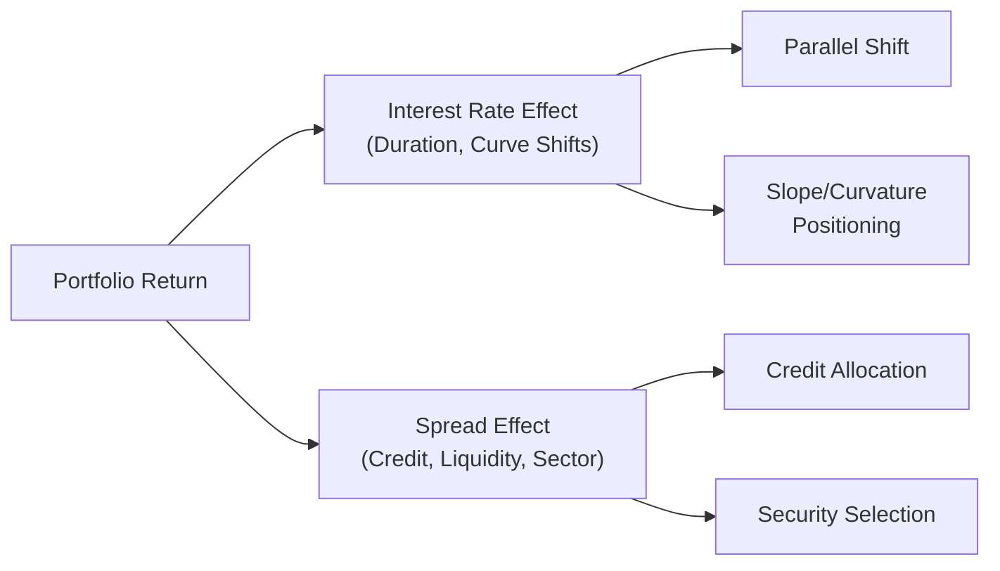

## Introduction
When we talk about performance attribution in fixed-income portfolios, we’re basically trying to untangle the various factors that drive bond returns. You might be thinking, “Isn’t that just changes in interest rates?” But honestly, it’s a bit more complicated than that—credit spreads, yield curve twists, sector allocations, callable features, and other complexities can all play a subtle (and sometimes not-so-subtle) role. Let’s explore how to interpret the contribution of each of these factors so that we can see why the portfolio performed the way it did, and figure out what that means for the future.

I remember when I first tried to parse a fixed-income attribution report—my eyes glazed over from all the columns: duration effects, yield curve flattening, credit selection, sector allocation, you name it. After a while, I realized that each piece of the puzzle can be understood if we isolate it carefully. The big idea behind fixed-income attribution is to decompose total return (or active return relative to a benchmark) into components that directly reflect the manager’s decisions. Let’s break it down.

## Unique Considerations for Fixed-Income

### Interest Rate (Duration) Management
One of the biggest factors in fixed-income performance is interest rate risk, often measured by portfolio duration. Duration is the sensitivity of a bond (or bond portfolio) to changes in interest rates. If you’re slightly new to this, here’s a quick recap: a portfolio with a duration of, say, 5 means that if interest rates rise by 1%, the value of the portfolio will drop by approximately 5%. Obviously, that’s a simplified rule of thumb, because actual results can vary due to convexity and other influences, but it’s a good starting point.

In an attribution analysis, we want to figure out how changes in interest rates impacted returns. Did the manager overweight shorter-duration bonds because rates were expected to rise? Or did the manager go longer in duration to capture extra yield? We basically compare the manager’s duration positioning to a benchmark’s duration. If the manager’s portfolio had a duration of 6 while the benchmark was at 5, and interest rates unexpectedly dropped, that positive active duration stance will (hopefully) boost performance.

### Spread Management
Bond yields often incorporate multiple layers of return components, and one of them is the credit spread, or the extra yield investors demand for holding a bond that may have default risk. Spread management basically means: how well did the manager time or position the portfolio in various bonds subject to changes in the credit or liquidity environment? If the manager anticipated a tightening in high-yield spreads and overweighted them, that positive spread move can add to returns (even if interest rates themselves stayed the same).

Common spread categories include:
• Credit spreads (the difference between corporate and government bond yields).  
• Sector spreads (e.g., difference between agency mortgage-backed securities and Treasuries).  
• Liquidity spreads (some bonds trade in less liquid markets, so a premium might be required).  

In performance reports, you’ll often see breakdowns like “Sector Allocation Effect” and “Spread Effect.” Don’t be afraid to dig deeper: sometimes a sector effect might have been overshadowed by an overall flattening or steepening yield curve, so you need to keep the big picture in mind.

### Sector Allocation
Fixed-income portfolios are pretty broad. You might think “bonds are bonds,” but in practice, you can have government bonds, investment-grade corporates, high-yield (a.k.a. junk), securitized debt (like mortgage-backed securities or asset-backed securities), municipal bonds, bank loans, emerging market debt—the list goes on and on. Each sector experiences different yield movements and risk premia.

So a manager’s allocation among sectors can significantly alter performance. If they overweighted corporate bonds relative to government bonds during a period of stable or improving credit conditions, we might see a nice bump to total return. Conversely, if they were underweight emerging market debt when it rallied, that can lead to negative active performance. In a standard fixed-income attribution model, sector allocation is explicitly tracked to show how these decisions contributed to active return.

### Security Selection
Finally, each issuer has its own fundamentals. Even if you choose “corporate bonds,” that’s a massive category that spans top-rated large-cap companies all the way down to highly leveraged or specialized issuers. Security selection at the individual bond level can also include analysis of bond structure—callable or putable features, whether it’s floating rate, or if it’s part of a complicated securitized deal. In attribution terms, selection effect zeroes in on how well the manager chose among specific bonds. If they identified an undervalued BBB-rated bond that outperformed its peers, that selection effect shows up positively in attribution results.

## Yield Curve Attribution
Yield curve shifts are a big deal for bond investors. We’re not just dealing with a single measure of interest rates—there’s a whole spectrum of maturities, each with its own yield. Sometimes the entire curve shifts parallel (short and long rates moving more or less in lockstep). Other times, the curve steepens or flattens. Some corners might move more than others, leading to curve “twists” or “butterfly” movements. A multi-factor yield curve model tries to attribute performance to these changes by decomposing the curve into factors like:
• Level (parallel shifts)  
• Slope (steepening or flattening)  
• Curvature (shifts in the middle relative to short and long ends)  

Managers often use “key rate durations” to measure exposure to changes at specific maturities (e.g., the 2-year key rate, 5-year key rate, 10-year key rate, etc.). If a manager anticipated a steepening of the curve and weighted more heavily in long maturities, that’s all captured in a yield curve attribution.

### A Simple Visualization
Below is a quick Mermaid diagram that shows how we might break down total fixed-income portfolio returns into yield curve and spread effects:

In practice, these branches can be more detailed, with each factor decomposed further. But hopefully, this illustration captures the idea that bond returns are driven by multiple levers.

## Credit Attribution
When we talk about credit attribution, we usually want to compare how the portfolio’s credit exposures (in terms of rating or sector) performed relative to a benchmark. If the benchmark has an average credit quality of A, but the manager invests in BBB on average, that difference in quality can cause outperformance or underperformance depending on changes in spreads. You might see a breakdown such as:

• Credit Beta or Market Spread: The portion of performance from broad-based spread moves.  
• Rating or Tier Effect: The incremental effect of selecting different credit ratings compared to the benchmark.  
• Issuer or Security Selection Effect: The final micro-level effect based on choosing specific issuers.  

It’s important to note that credit spreads can move independently of interest rates. Sometimes rates can go up while credit spreads tighten (if the economy is strong). Other times, rates can stay flat but credit spreads widen because of a flight to quality or a market scare. In your attribution results, you’ll see these credit spread movements singled out.

## Inflation-Linked Bonds and Other Complex Structures
Some managers invest in inflation-linked securities like TIPS (in the U.S.) or index-linked gilts (in the U.K.). These bonds have a real yield component (what you earn above inflation) plus an inflation accrual (how much the principal increases with inflation). In your attribution, you may want to separate:  
• Real Rate Effect: How changes in real yield impacted returns.  
• Inflation Accrual Effect: If actual inflation was higher/lower than expected, it can influence total return.  

Other complex structures, like callable bonds or mortgage-backed securities, require a special look at optionality. Prepayment risk in MBS, for example, can amplify or dampen returns relative to a plain-vanilla bond. The optionality can cause negative convexity or uncertain durations, thereby complicating the attribution process. In these cases, you might see an “option-adjusted” approach that tries to isolate the effect of embedded options.

## Key Terms in Fixed-Income Attribution
It’s helpful to keep a short glossary of core concepts. Here’s a quick recap:

• Duration: A measure of bond price sensitivity to interest rates.  
• Key Rate Duration: Sensitivity to changes in yield at specific points along the yield curve.  
• Credit Spread: Extra yield over a risk-free benchmark required by investors to hold a bond with credit risk.  
• Convexity: The rate of change of duration, showing how a bond’s sensitivity evolves as rates move.  

These terms will show up repeatedly in fixed-income attribution reports, so it’s good to keep them straight. I once found myself mixing up “credit spread duration” with “interest rate duration” in a conversation, which caused no end of confusion. Let’s just say clarifying that difference saved me from an embarrassing misunderstanding with a client.

## Common Pitfalls in Interpreting Results
• Confusing Duration Effects with Credit Effects: Sometimes a portion of total return is attributed to interest rate moves, but in truth, it might be the combined effect of offsetting spread moves. In other words, you should always confirm the net effect.  
• Overlooking Convexity: Especially for bonds with embedded options, convexity can skew returns. If your attribution approach doesn’t capture option-adjusted metrics, you might miss some subtlety.  
• Not Accounting for Transaction Costs or Slippage: Particularly with less-liquid bonds, the actual trade price can differ from model assumptions, leading to attribution discrepancies.  
• Focusing Too Much on Short-Term Moves: Fixed-income performance can see a lot of day-to-day volatility due to interest rates. It’s easy to get lost in the noise. Instead, try to identify repeated patterns of skill in yield curve positioning or credit calls over multiple periods—and keep your eyes on any potential manager style drift (which we discuss more in other sections of this volume).  
• Misalignment with Benchmark: If your benchmark has a very different credit profile or maturity distribution than your portfolio, an attribution that doesn’t adjust for this might mislead you on the actual drivers of excess return.

## Putting It All Together: A Practical Example
Let’s do a simplified numeric example. Imagine you have a bond portfolio with a market value of $100 million and you’re comparing it to a benchmark of similar market value:

• Manager’s average duration: 6.2  
• Benchmark’s average duration: 5.5  

During the evaluation period, interest rates declined by about 0.5% across the curve (a near-parallel shift), benefiting both the portfolio and the benchmark. However:

• Credit spreads for BBB securities tightened by 30 basis points.  
• The manager had an overweight in BBB-rated corporates by around 10% more than the benchmark.  

Let’s assume that the manager’s active interest rate positioning contributed +20 bps of active return because of the higher duration. Meanwhile, the overweight in BBB-rated corporates contributed +30 bps of active return, fueled by the spread tightening. In total, the portfolio might have outperformed the benchmark by 50 bps (0.50%) during this period.

But if you dive deeper, you might notice that within the BBB bucket, the manager specifically selected a weaker issuer that underperformed its peers, imposing a small negative security selection effect, say –5 bps. So, the net effect for that sector might be +25 bps, reflecting the difference between the broad overweight effect and the negative selection effect. Properly attributing each portion of return helps you identify whether a manager’s skill is in macro decisions (duration, sector shifts) or micro decisions (security selection).

## Best Practices and Final Thoughts
• Use a Comprehensive Model: Account for interest rate movement, spread changes, convexity, and any unique product structures.  
• Match Horizons Appropriately: If your strategy is long-term, try to ensure your attribution analysis looks at periods long enough to draw meaningful conclusions.  
• Evaluate Consistency: Look at how a manager’s bets change over time. Are they consistently good at calling yield curve shifts? Or do they get spreads right more often than interest rates?  
• Incorporate Risk Attribution: As explored in other parts of this text, return attribution is just one side of the coin. You want to see how much risk you took for that return.  

## Exam Tips
• Understand Key Rate Durations: The CFA exam often tests whether you can parse how yield curve twists affect bond portfolios. Make sure you’re comfortable with the mechanics.  
• Distinguish Spread vs. Rate Effects: You’ll likely see scenario-based questions where spreads and rates move in opposite directions. Be prepared to attribute the effect correctly.  
• Show Your Work on Multi-Step Calculations: On essay (constructed response) questions, it’s crucial to systematically demonstrate each step of your logic—especially when decomposing bond returns.  
• Practice With Real-World-Like Scenarios: The exam tends to present real-life styled vignettes, so ensure you can handle partial revocations of calls or small changes in rating picks.  
• Watch Out for Optionality: If the bond has embedded features, you might need an option-adjusted approach. Don’t forget to mention convexity if it’s relevant!  

If you keep these tips in mind—and do plenty of practice questions—you’ll find that fixed-income attribution isn’t quite as scary as it first appears. It’s mainly about understanding precisely how bond values shift when rates, spreads, and issuer fundamentals move. All you’ve got to do is be methodical.

## References
• Fabozzi, Frank J. “Bond Markets, Analysis and Strategies.”  
• CFA Program Curriculum, Fixed-Income Analysis and Performance Attribution Readings.  

## Practice Questions on Fixed-Income Attribution



### Question 1
Which portion of a fixed-income attribution model isolates performance due to interest rate changes?

- [ ] Spread effect
- [ ] Sector allocation
- [ ] Security selection
- [x] Duration (interest rate) effect

> **Explanation:** Duration-based attribution identifies how changes in benchmark interest rates affect bond prices. Spread effect and sector allocation focus on credit or sector influences instead of pure rates.

### Question 2
A manager’s portfolio is structured with a higher duration than the benchmark. If interest rates increase more than expected, which of the following results is most likely?

- [ ] The portfolio outperforms due to inflation protection.
- [ ] The portfolio’s yield curve positioning is irrelevant.
- [ ] The portfolio outperforms because of convexity adjustments.
- [x] The portfolio underperforms because it is more sensitive to rate increases.

> **Explanation:** Higher duration implies greater sensitivity to rates. If rates rise unexpectedly, the portfolio will generally suffer more than a shorter-duration benchmark.

### Question 3
Which of the following scenarios would best illustrate a positive credit allocation effect?

- [ ] Overweighting U.S. Treasuries during a recession.
- [ ] Selecting government-guaranteed bonds exclusively.
- [x] Overweighting BBB-rated corporates when spreads tighten.
- [ ] Maintaining a neutral weight in corporate bonds.

> **Explanation:** Credit allocation refers to positioning in riskier credit compared to the benchmark. If BBB spreads tighten, that allocation leads to outperformance.

### Question 4
In a yield curve attribution, “slope” typically measures which of the following?

- [x] The difference in yield movement between short-term and long-term maturities.
- [ ] Overall changes in credit spreads across rating categories.
- [ ] Convexity adjustments due to optionality in callable bonds.
- [ ] The difference in bond coupon payments.

> **Explanation:** Slope capturing the relative steepening or flattening of the yield curve is a key factor in isolating how short vs. long maturities change.

### Question 5
A manager invests in TIPS as part of a fixed-income portfolio. In an attribution analysis, separating real yields from inflation components is primarily important to:

- [x] Accurately identify each driver of return, especially when inflation differs from expectations.
- [ ] Determine the coupon reinvestment rate for the portfolio.
- [ ] Calculate default risk on government bonds.
- [ ] Evaluate manager skill in picking emerging market corporates.

> **Explanation:** Inflation-linked bonds have two distinct drivers: real yields and inflation accrual. Evaluating them separately is crucial for accurate attribution.

### Question 6
Which of the following best describes key rate duration?

- [ ] The average maturity of the bonds held in the portfolio.
- [x] A measure of a bond’s sensitivity to changes in yields at specific maturities along the curve.
- [ ] The annual coupon payment divided by the bond’s current price.
- [ ] An indicator of credit risk based on yield spreads.

> **Explanation:** Key rate duration quantifies how bond or portfolio price reacts to changes in yield at specific points (key maturities) on the yield curve.

### Question 7
A portfolio’s performance is negatively impacted by an unexpected widening of liquidity spreads in an emerging market bond position. In attribution terms, this effect is most directly attributed to:

- [x] Spread management decisions.
- [ ] Interest rate duration mismatch.
- [ ] Security selection relative to rating peers.
- [ ] Sector rotation across credit tiers.

> **Explanation:** Liquidity spread moves are a type of spread management effect, separate from pure credit rating or sector selection decisions.

### Question 8
When a fixed-income manager’s selection effect is positive but the sector allocation effect is negative, it suggests that:

- [ ] The manager’s bond picks were poor, but overall sector weighting was accurate.
- [x] The manager chose good individual bonds but allocated to sectors that underperformed.
- [ ] The manager’s performance was driven by broad-based yield moves rather than skill.
- [ ] The manager had no skill in either duration positioning or credit selection.

> **Explanation:** Positive selection indicates good bond picking within a sector; negative allocation indicates that the chosen sector weights underperformed in aggregate.

### Question 9
What is a common pitfall to avoid when interpreting fixed-income attribution results?

- [ ] Ignoring inflation-linked securities entirely.
- [x] Mixing up interest rate effects with credit spread effects.
- [ ] Paying too much attention to the role of convexity.
- [ ] Combining benchmarks across different regulatory zones.

> **Explanation:** Many newcomers to fixed-income attribution confuse rate-driven performance with credit-spread-driven performance. Distinguishing these is crucial for proper analysis.

### Question 10
A fixed-income portfolio has an average duration of 7.0, while the benchmark has an average duration of 5.0. True or False: The portfolio will outperform if rates rise more than anticipated.

- [ ] True
- [x] False

> **Explanation:** A longer-duration portfolio suffers more price decline when interest rates rise, thereby likely underperforming a shorter-duration benchmark in a rising-rate environment.


