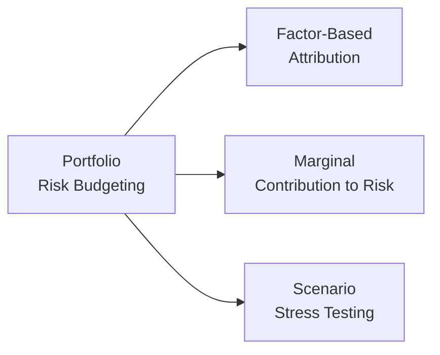

Introduction  
I remember the first time I got overly excited about a “hot” stock tip many years ago. I loaded up on that position thinking I’d found my big win, only to realize—um, not so great in hindsight—that my portfolio had become overly skewed toward the same industry risk. That experience hammered home just how essential risk attribution really is. After all, we’re not just measuring or attributing returns (like we discussed in other sections of this volume); we also need to understand the sources of volatility or downside exposure. This is precisely where selecting the right risk attribution approach comes into play.

Below, we’ll explore different risk attribution frameworks that can help you dissect your portfolio’s sources of risk and measure how each position or factor contributes to the overall volatility. The aim is to illuminate how each approach works, when it might be used, and how to fit it into your investment process. We’ll wrap up with practical tips for implementation, references for those who want to really deep dive, and a short quiz to test your knowledge.

Approach Overview  
When we talk about risk attribution, we’re referring to methods that help identify, measure, and allocate total portfolio risk to its underlying sources. This is akin to the risk parallel of return attribution, which you might remember from earlier sections like 1.3 (Comparing Return Attribution vs. Risk Attribution). But here, the focus is on volatility, downside exposure, factor exposures, or catastrophic loss potential. Let’s look at some of the main approaches:

• Factor-Based Risk Attribution  
• Marginal Contribution to Risk  
• Scenario or Stress Testing  

Each method digs into risk from a different angle, so the choice depends on aspects like your investment style, data availability, market conditions, and the complexity of your portfolio.

Factor-Based Risk Attribution  
Overview and Key Concepts  
Factor-based risk attribution breaks down the total portfolio risk as a function of the sensitivity (or “loading”) to a set of stylized factors—like value, size, momentum, credit risk, interest rates, or sector exposures. Typically, we estimate these factors using large cross-sections of asset behavior, or by referencing well-accepted factor models (e.g., the Fama-French models for equities or the Kamakura risk models for credit).

Factors are often grouped into categories:  
• Fundamental Factors: Such as earnings yield, book-to-market (value), or size exposure.  
• Style Factors: Like momentum, growth, or volatility tilt.  
• Macro Factors: They could include interest rates, inflation, or GDP growth rates.  

When you run factor-based risk attribution, you’re basically telling the model: “Please figure out how much of the portfolio’s volatility can be explained by each big-picture driver.” This is immensely helpful for multi-asset portfolios, or for managers who consciously tilt toward certain style or fundamental factors.

Mathematical Representation  
Under a simple factor model, we assume:  
(1)  rᵢ = αᵢ + βᵢ,₁ f₁ + βᵢ,₂ f₂ + … + βᵢ,k fₖ + εᵢ  
where:  
• rᵢ = Return of asset i  
• βᵢ,j = Factor loading of asset i on factor j  
• fⱼ = Return of factor j  
• εᵢ = Residual (idiosyncratic) component  

Risk attribution typically focuses on the variances and covariances, so we examine:  
(2)  σᵢ² = βᵢᵀ Σᵣ βᵢ + residual risk  
where Σᵣ is the factor covariance matrix. Summing (or combining) individual contributions according to portfolio weights yields the total portfolio risk, partitioned by factors.

Advantages and Challenges  
Advantages:  
• Clarity regarding fundamental or style exposures.  
• Useful for multi-asset or diversified equity portfolios.  
• Allows for alignment with an investment thesis: “I’m focusing on value and small-cap factors, so let’s see how they drive risk.”  

Challenges:  
• Factor models rely on accurate estimation of factor loadings and covariances.  
• Some factors might not be easily captured by standard models (think intangible or emergent factors).  
• Model mis-specification can lead to incomplete or misleading results (see 1.9 Tests of Benchmark Quality and Effects of Misspecification for some parallels).  

Marginal Contribution to Risk  
Overview  
Marginal Contribution to Risk (MCTR) is all about answering the question: “If I tweak the weight of a single asset or segment, how does that change my total portfolio’s risk?” If you find that one position’s incremental addition to risk is sky-high, that might ring alarm bells—or, more politely, call for a rebalancing conversation.

Mathematical Representation  
Let’s say the total portfolio volatility is denoted by σₚ (often measured as the standard deviation of the portfolio’s returns). A typical formula to compute marginal contribution to risk for the i-th asset is:

$$
\text{MCTR}_i = w_i \cdot \frac{\partial \sigma_p}{\partial w_i}
$$

where:  
• wᵢ = weight of the i-th asset in the portfolio  
• ∂σₚ / ∂wᵢ = partial derivative of the portfolio’s standard deviation with respect to wᵢ  

From MCTR, we can derive the Component Contribution to Risk (CCR) by summing up the contributions of each position:

$$
\text{CCR}_i = \text{MCTR}_i
$$

and the portfolio’s total risk is basically the sum of all CCRᵢ across i=1 to n:

$$
\sigma_p = \sum_{i=1}^{n} \text{CCR}_i
$$

Implementation and Use Cases  
If you run a portfolio optimization or you fancy yourself a “risk-budgeting” fan, MCTR can help you see which positions are hogging the risk budget. For instance, if your asset “Tech Stock A” has an MCTR that dwarfs everything else, you might be overexposed to technology and need to scale back.

Practically speaking, you would:  
• Estimate your portfolio’s covariance matrix of returns.  
• Compute partial derivatives of your portfolio volatility.  
• Multiply that derivative by the position weight.  

Many portfolio analytics software packages can do this automatically once you input the covariance data.

Scenario or Stress Testing  
Overview  
Scenario or stress testing is a bit different from factor-based or marginal approaches, in that it’s less about how risk is distributed in “average” daily conditions and more about how the portfolio might behave in extreme or tail-risk events. Depending on your vantage point, a scenario could be something like “What if interest rates spike by 2% overnight?” or “What if there’s a 25% equity market drawdown triggered by a global pandemic?” The method forces you to see pockets of vulnerability that typical day-to-day risk measures might miss.

Approaches  
• Historical Scenarios: Recreate conditions from famous financial crises (2008 Global Financial Crisis, 2020 COVID Crash, etc.) and see how your portfolio would have performed.  
• Hypothetical Scenarios: You define the shocks or correlations (e.g., a sudden 10% drop in the S&P 500 plus a 150 basis point jump in credit spreads).  

Output  
Like other risk attribution methods, scenario testing provides a sense of how each position or factor might behave under duress. For instance, you may discover that your fixed-income holdings are heavily correlated to credit spreads, or that your equity portion is sensitive to margin calls in a crisis scenario.

Advantages and Challenges  
Advantages:  
• Helps identify hidden tail risks that normal volatility-based methods might not capture.  
• Complements factor-based or marginal approaches well, especially for risk committees or boards who want to see “worst-case” style data.  

Challenges:  
• Highly dependent on scenario selection—if your scenario is unrealistic or incomplete, the output might be misleading.  
• Doesn’t help much with day-to-day risk budgeting or optimization unless you combine it with more continuous metrics.

Implementation Tips  
Align with Your Process  
A fundamental equity manager focusing on style tilts might adopt factor-based risk attribution to highlight exposures to size, value, momentum, etc. Meanwhile, a liability-driven investor might care deeply about interest rate risk and credit spread factors—especially if managing a defined benefit pension plan. In that scenario, scenario testing (looking at yield curve shifts) and marginal analysis of long-term bonds might be crucial.

Ensure Robust Data  
Factor-based models require good factor returns data and accurate covariance estimates. Marginal contribution requires a decent covariance matrix for all the portfolio’s holdings, which can be complicated if you have lightly traded or alternative investments. Stress testing calls for relevant historical or hypothetical data that realistically captures market shock relationships.

Combine and Layer Approaches  
You don’t need to pick one approach and completely ignore the rest. Often, you’ll start with a factor-based analysis to get a big-picture breakdown, then zero in with MCTR to see which positions are dominating. Finally, you might do a scenario analysis to spot how the portfolio might behave in an extreme meltdown—or a meltdown plus a credit freeze plus a commodity price spike (you know, all sorts of doomsday combos).

Glossary  
• Marginal Contribution to Risk (MCTR): Incremental addition of a component to the total portfolio risk.  
• Component Contribution to Risk (CCR): Summation of MCTR allocated to each position or factor in a portfolio.  
• Stress Testing: Assessing how a portfolio might perform under hypothetical, significant market movements.  
• Factor Loading: The portfolio’s sensitivity or exposure level to a given risk factor.

Diagram: Types of Risk Attribution  
Below is a simple visual to showcase how these different methods can overlap:

In the above diagram, each approach flows out of the broader portfolio risk budgeting process, highlighting that these methods are often complementary rather than mutually exclusive.

Practical Example  
Imagine you run a multi-asset portfolio with these major positions:  
• 40% in broad equity (global large-cap)  
• 40% in sovereign bonds (mixed maturities)  
• 10% in high-yield corporate bonds  
• 10% in an alternative “market-neutral” hedge fund  

Step 1: Factor-Based Output  
You might discover from your factor-based approach that 60% of your total risk is explained by equity market factors, 25% by interest rate risk, and 10% by credit spreads. The remaining 5% is residual or idiosyncratic. Straight away, you see that while your notional is diversified, your factor exposure is heavily equity-driven.

Step 2: MCTR  
Next, you compute MCTR for each segment:  
• Global equities: 50% of the portfolio’s volatility  
• Sovereign bonds: 15%  
• High-yield corporate bonds: 25%  
• Hedge fund: 10%  

This difference from the factor-based approach might be due to dynamic correlations or overlapping factor exposures. Notably, the high-yield portion might have a more pronounced effect on volatility than its 10% weighting suggests, because of correlated credit risk.

Step 3: Scenario Testing  
Finally, you run a crisis scenario where credit spreads widen significantly, interest rates drop, but equities sell off by 20%. The result? You see that your high-yield bonds and equities are hammered in tandem. Surprisingly, your global large-cap segment might hold up poorly under the liquidity crunch (depending on the scenario). Sovereign bonds might do well, offsetting some of the losses. Now you have a more holistic view of the portfolio’s vulnerability.

Best Practices, Challenges, and Potential Pitfalls  
Best Practices  
• Use multiple approaches. Each one gives complementary insights.  
• Document your assumptions. For instance, be clear about which factors you’ve chosen and how you derived them.  
• Update data regularly. Factor loadings, correlations, and volatilities aren’t static.  
• Revisit assumptions. Market conditions evolve, and so do the relationships among assets.  
• Integrate results into decision-making. Risk attribution is only helpful if it informs how you rebalance, select assets, or hedge exposures.

Common Pitfalls  
• Overreliance on a single model or factor. Remember, markets can always amuse us with new correlations.  
• Data limitations. Garbage data can produce garbage risk decomposition.  
• Not performing tail analysis. Focusing purely on daily standard deviations can mask black swan events.  
• Failing to incorporate cost or transaction constraints. Even if a position has a monstrous MCTR, you must consider the trading cost (see 1.17 The Role of Transaction Costs in Performance Measurement).  

Exam Tips for CFA Level III  
• Understand each method’s definition and formula, especially how MCTR is computed. Be comfortable writing out or interpreting partial derivative expressions for portfolio volatility in the context of an essay question.  
• Recognize trade-offs. Factor-based vs. MCTR vs. scenario testing. The exam might present a scenario and ask which method best captures a certain risk dimension.  
• Factor-based questions often involve how an equity portfolio’s risk is split among style factors. Be ready to interpret factor loadings and the resulting decomposition of variance.  
• Stress testing questions may center on how a portfolio might respond to an extreme event. The exam might give you hypothetical market conditions and ask you to evaluate the portfolio’s risk.  
• Time management: If you see a multi-part item set with multiple risk attribution approaches, systematically handle each sub-question, referencing formulas if asked, and interpret results succinctly.

References for Further Study  
• Litterman, Bob (et al.). “Modern Investment Management: An Equilibrium Approach.” This text is foundational in factor modeling and risk budgeting.  
• CFA Institute Research Foundation. Publications on portfolio risk decomposition and factor investing provide deeper insights with real-world examples.  
• Look back at Volume 3, especially sections 1.9 (Tests of Benchmark Quality and Effects of Misspecification) and 1.7 (Distinguishing Asset Owner vs. Investment Manager Contributions).  
• Online courses from the CFA Institute on advanced risk management techniques.

Now that you’ve walked through the main approaches, let’s check your understanding with a short quiz.

## Test Your Knowledge: Risk Attribution Approaches Quiz



### Which approach specifically breaks portfolio risk into style or fundamental drivers (e.g., size, value, credit risk)?

- [x] Factor-based attribution
- [ ] Marginal contribution to risk
- [ ] Component contribution to risk
- [ ] Stress testing

> **Explanation:** Factor-based approaches identify exposures to well-defined style or fundamental factors, such as value, size, or credit spreads.  

### When computing Marginal Contribution to Risk (MCTR), which of the following is most directly involved?

- [x] Partial derivative of portfolio volatility with respect to the asset’s weight
- [ ] Average correlation of the portfolio’s assets
- [ ] Sum of factor loadings above 1
- [ ] Residual (idiosyncratic) variance

> **Explanation:** MCTR is calculated by multiplying the asset weight by the partial derivative of the portfolio’s standard deviation with respect to that asset’s weight.  

### What is one principal advantage of scenario or stress testing compared to other risk attribution methods?

- [ ] It never requires historical data
- [x] It can highlight tail risk exposures under extreme market conditions
- [ ] It replaces the need for factor-based or marginal approaches
- [ ] It is always simpler to compute numerically

> **Explanation:** Stress testing is particularly helpful for identifying tail or extreme event risks that might not show up in “normal” volatility-based analysis.  

### A portfolio manager observes that one small position has a consistently high contribution to volatility. Which risk measure might best help confirm this finding?

- [ ] Regression-based factor analysis
- [x] Marginal contribution to risk
- [ ] Equal-weighted volatility allocation
- [ ] Historical scenario testing

> **Explanation:** Marginal contribution to risk (MCTR) directly measures how changing the weight of one position affects overall volatility, helping confirm if the position truly has a large risk impact.  

### Which statement about factor-based risk attribution is correct?

- [x] It relies on the assumption that a set of systematic factors can explain much of portfolio risk
- [ ] It measures the incremental risk added by each single holding in isolation
- [x] It is commonly used for event-driven hedge funds
- [ ] It cannot be combined with scenario or stress testing

> **Explanation:** Factor-based attribution typically assumes that specific, systematic factors (like value, size, momentum) explain the bulk of a portfolio’s risk exposure.  

### In a rising interest rate environment, a liability-driven investor may be most likely to focus on:

- [x] Scenario analyses that shift the yield curve
- [ ] Detailed style factor loadings of each equity position
- [ ] MCTR for large-cap stocks
- [ ] Price impact from currency fluctuations only

> **Explanation:** For liability-driven strategies (often pension funds), interest rate scenarios and yield curve shifts are critical to evaluating the portfolio’s risk.  

### Which of these is a potential downside to purely factor-based risk attribution?

- [x] It may not capture black swan events well
- [ ] It uses partial derivatives to measure portfolio impact
- [x] It is solely backward-looking and not forward-looking
- [ ] It cannot be used for an equity portfolio

> **Explanation:** Factor-based models often assume normal or slightly “smoothed” market environments, so they can miss black swan or extreme events that stress testing might reveal.  

### Which of the following statements is true regarding a combination of risk approaches?

- [x] Combining factor-based, marginal, and scenario methods can yield a more comprehensive risk view
- [ ] Factor-based and marginal contribution methods are fundamentally incompatible
- [ ] Scenario testing is mainly used for intraday trading strategies
- [ ] Using multiple approaches always increases portfolio risk

> **Explanation:** Different methods address different dimensions of risk, so combining them often results in a more robust understanding.  

### How can a manager utilize the results of a factor-based risk decomposition?

- [x] By rebalancing to adjust exposure to high-risk factors
- [ ] By estimating realized tracking error only
- [ ] By measuring the partial derivative of factor returns
- [ ] By ignoring factor exposures when selecting new securities

> **Explanation:** If a factor-based breakdown shows unexpected or over-concentrated exposures, the manager can rebalance to bring the portfolio back in line with investment objectives.  

### Stress testing requires historical or hypothetical inputs and is primarily intended to reveal tail risk in normal markets.

- [x] True
- [ ] False

> **Explanation:** Stress testing is specifically designed to reveal vulnerabilities in the portfolio when markets deviate from the norm, focusing on tail risk or extreme conditions.  



References and Further Reading  
1. Litterman, Bob, et al. “Modern Investment Management: An Equilibrium Approach.” Wiley.  
2. CFA Institute Research Foundation publications on portfolio risk decomposition and factor modeling.  
3. Relevant sections of the CFA Level III Curriculum on Portfolio Management, especially topics related to performance measurement and risk.  

Use these approaches thoughtfully. They’re not just theoretical frameworks; they’re tangible tools that can help you avoid surprise losses and guide more strategic portfolio decisions. After all, it’s much better to discover that hidden exposure in your risk models than—ah—finding out the hard way in your performance numbers. Good luck, and happy risk-managing!
