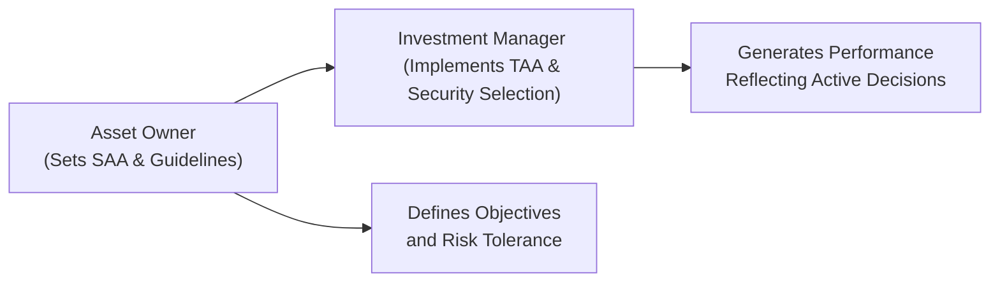

## Introduction

I’ve got a funny story—well, “funny” if you find asset allocation exciting like I do. Several years ago, I was chatting with a friend who worked at a large university endowment. She was super frustrated because every time her endowment’s performance went above the benchmark, the investment managers would claim victory, but whenever the performance lagged, folks at the university insisted that it was just “bad markets.” This little anecdote gets to one of the trickiest issues in portfolio performance evaluation: figuring out who’s really responsible for what. Is it the asset owner making top-level decisions, or is it the investment manager making decisions within a particular strategy or mandate? And how can we split performance into those “big picture” strategic factors versus those “on the ground” tactical factors?

That’s exactly what we’ll tackle here—distinguishing the contributions of the asset owner from those of the investment manager in portfolio performance. We’ll look at how decisions such as setting the strategic asset allocation (SAA) or picking a manager can affect outcomes, and how managers add value (or lose it) through tactical asset allocation (TAA), security selection, and market timing. We’ll also discuss a framework for evaluating performance, known as macro attribution, which tries to parse out each party’s impact. Let’s start by clarifying the distinct roles of asset owners and investment managers.

## Distinguishing the Roles of Asset Owners and Investment Managers

These two players are on the same team in the sense that they represent one investment ecosystem. However, the scope and nature of their decisions are quite different.

Asset owners (like pension funds, endowments, sovereign wealth funds, foundations, and high-net-worth families) generally set high-level strategy. They have fiduciary obligations to fulfill specific goals—perhaps paying out retiree benefits, supporting a university’s budget, or funding philanthropic projects. As part of these duties, they examine their liabilities, projected cash flows, and the overall risk tolerance to craft a suitable SAA. This SAA—the mix of equity, fixed income, real estate, private equity, alternative investments, or anything else—reflects their long-term view of how to reach their targets while respecting constraints and risk capacity. They then decide who to hire (or fire) as managers to run a portion of the portfolio within the guidelines they specify.

Investment managers have a different vantage point. They are hired to implement the constraints and guidelines set by the asset owner. Within that structure, managers make day-to-day decisions about which stocks or bonds to buy and sell, how to adjust exposures tactically, and when to deviate from the benchmark in search of alpha. They typically focus on security selection, TAA when permitted, trade execution, and risk monitoring at the level of individual holdings.

It might help to visualize these interactions:

This diagram is simplistic, but it shows the flow: the owner sets the big-picture direction, and the manager implements tactical or active strategies within it.

## The Asset Owner’s Decision Sphere

Let’s dive a bit deeper into the major decisions typically made by asset owners:

• Strategic Asset Allocation (SAA): The asset owner decides, for example, that the portfolio should target 60% equities, 30% fixed income, 10% alternatives. This SAA is the backbone. As a matter of fact, the Brinson, Hood, and Beebower studies found that much of a portfolio’s long-term return variability can be explained by its overall asset allocation policy—though keep in mind that real-life complexities can differ from the original research frameworks.

• Risk Tolerance and Liquidity: An asset owner has to pin down how much volatility they can handle. If it’s a pension plan with near-term liabilities, that changes how much risk is acceptable. If it’s a foundation with indefinite longevity, that might allow for a longer time horizon and more illiquid assets.

• Selecting or Terminating Managers: Asset owners do an extensive manager due diligence process. This includes screening potential candidates, reading pitch books, analyzing track records, interviewing portfolio managers, and verifying intangible qualities like culture fit and integrity. If a manager chronically underperforms or changes its investment style drastically (“style drift”), the asset owner might terminate that relationship and hire a new manager.

• Portfolio Guidelines and Constraints: The asset owner can specify constraints such as no more than 10% in emerging market equity, or instructions related to environmental, social, and governance (ESG) factors. They also define the manager’s benchmark, sometimes referencing a custom liability-based benchmark if we’re dealing with pension obligations.

Some might say the asset owner has “the toughest job” because everything that follows depends on their success in properly defining the strategy and constraints. Others will say the manager’s job is just as tough because they must live up to the performance expectations that come with these constraints. Regardless, these two roles must complement each other.

## The Investment Manager’s Decision Sphere

Once the asset owner has set the overall policy, the investment manager steps in. Here’s the manager’s world:

• Implementing SAA Within Constraints: If the asset owner says 60% equities, the manager might have to stick near that allocation. But the manager could have some discretion—say, an allowance to go 5% overweight or underweight relative to the SAA. This is where guidelines matter. Some managers are “core,” meaning they follow the strategic benchmark closely, while “satellite” managers might be allowed to take bigger bets in specialized areas.

• Tactical Asset Allocation (TAA): If permitted, the manager can shift weights among sub-asset classes to capitalize on near-term (often 3–12 months) market opportunities. For instance, expecting a rise in interest rates, a fixed-income manager might shorten duration or tilt into floating rate instruments. TAA can add alpha if done skillfully, but also can detract from performance if the calls are wrong.

• Security Selection: This is the classic “pick the winners, avoid the losers” part of active management. Managers will evaluate companies, sectors, or regions, aiming to outperform the benchmark by selecting securities with favorable prospects or undervalued fundamentals.

• Market Timing: Sometimes considered part of TAA or security selection, market timing is about adjusting invested levels up or down depending on short-term forecasts. Some managers try to time markets aggressively, whereas others keep it minimal.

Managers are also specialists in specific areas—equities, fixed income, real estate, private equity, hedge funds, or multi-asset portfolios. In each domain, they face a unique set of challenges.

## Contribution Analysis: Macro Attribution to the Rescue

So how can we figure out, with actual numbers, whether the asset owner’s decisions created or destroyed value, and whether the manager’s decisions contributed positively or negatively? In Chapter 1.3, we introduced the broad strokes of return attribution vs. risk attribution. Here, we want to highlight macro attribution. Macro attribution lumps together all the decisions made (like SAA, TAA, security selection, etc.) and attempts to quantify how much each one contributed to the overall result.

Imagine a simplified example: 

• Asset Owner sets an SAA of 60% equities and 40% bonds.  
• Over the past year, that policy alone—assuming passive indexing—would have returned +6%.  
• The manager had leeway to shift equities from 60% to 65%, and to select securities in both markets. 

At year’s end, you see the actual portfolio returned +7%. By building a macro attribution framework, you might find something like:

• +6.0% from the policy SAA.  
• +0.5% from TAA (the overweight in equities actually helped).  
• +0.6% from security selection alpha in equities.  
• –0.1% from a subpar bond selection.  
• +7.0% net total return.  

In that scenario, we can see that the asset owner’s “big call” (the SAA) explained most of the return, but the active decisions in TAA and security selection contributed an extra +0.5% and +0.5% net, after offsetting –0.1% in fixed income. If the manager had stuck strictly to the policy weights, you’d only get +6%. Or if the asset owner had chosen a drastically different asset mix, the entire story (and outcome) would change.

## Accountability and the Question of Ownership

It’s fair to ask: Why do we even care so much about splitting these contributions? In my experience, accountability is key. Asset owners want to know if the return shortfall is because of poor manager skill or because the entire equity market faced a downturn. Likewise, managers want to be recognized (and rewarded) when they truly add alpha, instead of being overshadowed by a bull market or handcuffed by an overly complex mandate.

A well-structured contribution analysis helps foster open communication:

• If the SAA is systematically too conservative, then underperformance might reflect the asset owner’s risk aversion more than the manager’s skill.  
• If the manager drifts away from the specified benchmark or invests in off-mandate assets, that might lead to style drift (discussed more in Section 2.14).  
• If the portfolio is performing well overall, but only in line with the benchmark, you might question whether the manager added value or whether it was just a rising tide lifting all boats.

When you have macro attribution front and center, it’s easier to isolate each party’s contributions. That fosters clearer dialogue and strategic adjustments if need be.

## Practical Example: Step-by-Step Macro Attribution

Let’s look at a more data-driven example, though we’ll keep it quite simple for illustration.

Suppose the asset owner sets a policy with:
• 50% in a global equity index  
• 50% in a broad bond index  

In the last 12 months:
• Global equities returned 8%  
• Broad bonds returned 2%  

Assume these are total returns net of fees. If the portfolio were 100% passively invested at those policy weights, the policy return would be:


\text{Policy Return} = 0.50 \times 8\% + 0.50 \times 2\% = 4\% + 1\% = 5\%


Now, the manager was allowed to vary equity from 40% to 60% and chose 60% for the entire period (a persistent overweight). Also, the manager had some skill in selecting securities differently from the broad index. Let’s say actual realized returns were:

• Actual equity portion returned 9%  
• Actual bond portion returned 1.5%  
• Weighted average for the total portfolio with the actual allocation of 60% equity and 40% bonds was 6.6%  

We can break it down as follows:

1) Base Policy Effect (5%)  
2) TAA Effect from over/underweight  
   - The manager moved to 60% equity. If they had used the passive index returns, that would have contributed:  
     
     60\% \times 8\% + 40\% \times 2\% = 4.8\% + 0.8\% = 5.6\%
       
   - So the difference between 5.6% and the base 5% is +0.6% from TAA.  
3) Security Selection Effect  
   - The actual equity selection returned 9% instead of 8%, adding an extra 1% on the equity portion. Meanwhile, the actual bond selection returned 1.5% instead of 2%, which is a –0.5% difference on that portion.  
   - Calculating the net effect:  
     • For equities (60% weight): (9% – 8%) * 60% = +0.6%  
     • For bonds (40% weight): (1.5% – 2%) * 40% = –0.2%  
     • Net selection effect is +0.4%.  

If we sum it together:  
• 5.0% from policy  
• +0.6% from TAA  
• +0.4% from security selection  
-------------------------  
• 6.0% net from those steps  

However, we might notice a slight difference from the actual 6.6%. That can come from second-order interactions, rounding, fee differentials, or other factors. In practice, the attribution model might handle them differently. But the essence is that you can see the different “buckets” of performance and figure out exactly how much each bucket contributed.

## Common Pitfalls and Best Practices

One of the biggest pitfalls is mixing up who is responsible for each return source. I’ve seen threads of commentary in investment committees go like: “Our manager’s alpha is negative!” Then it turns out the manager’s alpha is actually positive, but the asset mix chosen by the asset owner was out of sync with the benchmark. That mismatch can lead to unjust blame or credit.

Another pitfall is ignoring timescale. If an asset owner invests in private equity or real estate, the performance might be lumpy over short periods. Similarly, managers who run multi-asset strategies need time before their TAA calls can decisively show results. 

Best practices include:  
• Develop a clear macro attribution model that is transparent and easy to communicate.  
• Incorporate risk attribution too (as discussed in Section 1.3). Knowing how risk is allocated and used is just as important as return alone.  
• Regularly review the manager’s continued alignment with the asset owner’s needs (e.g., is the manager still investing in compliance with the guidelines?).  
• Document the SAA rationale and manager selection process.  

## Real-World Anecdote: A Foundation’s Surprise

A charitable foundation I consulted for followed a well-thought-out SAA approach—at least on paper. But every six months, the board “tweaked” the allocations based on the news cycle, effectively turning themselves into amateur market timers. Meanwhile, the equity manager they hired was performing well for the portion they managed, but the foundation’s total performance looked inconsistent.  

After applying a macro attribution analysis, we discovered that the foundation itself (the asset owner) was responsible for half of the volatility through its frequent and unstructured changes to the asset mix. The manager’s equity picks were quite strong, but were overshadowed by the mismatch in the overall structure. Once this was spelled out in a clear attribution report (and trust me, we had a 20-page presentation on it), the board realized they needed to rein in their own impulses. That small shift in governance improved results over time, and quite a bit of frustration and confusion melted away once everyone understood who was contributing what to performance.

## Glossary of Key Terms

Strategic Asset Allocation (SAA): A long-term, baseline allocation to each asset class based on factors like liability duration, risk preferences, and return goals.  
Tactical Asset Allocation (TAA): Shorter-term shifts in asset class weights, usually to exploit perceived market anomalies or trends.  
Mandate: The formal set of guidelines, including constraints and objectives, that the asset owner provides to the manager.  
Fiduciary Duty: The obligation to act in the best financial interests of the beneficiaries or clients, ensuring transparency, prudence, and loyalty.

## Bringing It All Together

Distinguishing asset owner contributions from investment manager contributions clarifies accountability, fosters better communication, and improves the decision-making process overall. By leveraging macro attribution (along with micro approaches for deeper dives), you can see how each party’s choices collectively shape the final performance. As you move forward, look for ways to establish a robust reporting framework that suits your portfolio’s complexity. If the lines get fuzzy between SAA and TAA, or between top-level decision makers and managers, the entire process becomes less effective.

Above all, remember that a portfolio’s success isn’t about one single piece. It’s about synergy: the asset owner’s thoughtful strategy combined with the manager’s skill in execution. When all parties understand their respective roles and measure them diligently, you get better governance and more consistent outcomes.

## Exam Tips

• Know how to dissect portfolio returns into policy (SAA), TAA, and security selection components.  
• Familiarize yourself with macro attribution frameworks—you might be asked to attribute performance or parse out the manager’s alpha in a constructed-response question.  
• Watch out for style drift. The exam could present a scenario where a manager invests off-mandate and measure your ability to identify the root cause of performance (Sections 2.14 and 1.7 synergy).  
• Practice with examples. Being swift and accurate in your calculations is critical in the Level III exam. Have a systematic approach for partial credit: outline your steps clearly.  
• Remember to be comfortable with the distinction between an asset owner’s high-level responsibilities (like SAA) and a manager’s day-to-day tactical decisions. A question might explicitly ask you to allocate returns to these two different sets of decisions.  

## References

• Brinson, Gary, Hood, L. Randolph, and Beebower, Gilbert. “Determinants of Portfolio Performance,” Financial Analysts Journal.  
• CFA Program Curriculum, Level III. Sections on Responsible Investment, Manager Selection, and Portfolio Construction.  
• Various articles and texts on macro vs. micro attribution techniques.  

## Test Your Knowledge: Asset Owner vs. Investment Manager Performance Quiz



### Asset owners primarily add value to a portfolio by:
- [x] Determining strategic asset allocation.
- [ ] Selecting individual securities within a pooled fund.
- [ ] Timing short-term market movements quarterly.
- [ ] Executing tactical trades in high-yield bonds.
> **Explanation:** Asset owners focus on policy-level decisions such as establishing the long-term strategic asset allocation, which heavily influences overall performance.

### Which of the following best describes the role of an investment manager regarding TAA?
- [ ] Setting policy guidelines for an institution’s funding status.
- [ ] Hiring and firing sub-managers to align with a broad plan’s objectives.
- [x] Adjusting asset class weights over shorter horizons to capitalize on perceived market opportunities.
- [ ] Determining the duration of pension plan liabilities.
> **Explanation:** TAA involves short-term, tactical shifts by the investment manager, while policy guidelines and liability considerations fall under the asset owner’s purview.

### Suppose the policy portfolio return is 5%. The actual portfolio, because of TAA, earned 5.8%. How much return can be attributed to TAA alone, assuming no other effects?
- [ ] 5.8%
- [x] 0.8%
- [ ] 0.58%
- [ ] 5.0%
> **Explanation:** The difference between the policy return (5%) and the actual portfolio return (5.8%) is 0.8%, which stems from tactical decisions.

### In a macro attribution analysis, an overperforming equity sleeve compared to its equity benchmark is likely attributed to:
- [ ] The asset owner’s strategic asset allocation.
- [x] The manager’s security selection or active equity management skill.
- [ ] The credit rating of the sovereign entity.
- [ ] The overall risk tolerance set by the board of directors.
> **Explanation:** When an equity sleeve outperforms the equity benchmark, that extra alpha typically reflects the manager’s ability in security selection (or possibly sector rotation within equities).

### Which of the following is a major drawback of not clearly distinguishing asset owner vs. manager contributions?
- [x] Unclear accountability for underperformance.
- [ ] Easier to communicate returns to stakeholders.
- [ ] More efficient manager compensation structures.
- [ ] Enhanced consistency in the investment policy statement.
> **Explanation:** Without clearly attributing performance, it’s hard to assign responsibility and correct underperformance, leading to confusion.

### If an asset owner determines an SAA of 70% equities and 30% bonds, but the manager consistently holds a 75% equity position, which area of performance attribution is most relevant?
- [ ] Policy discussions on risk tolerance.
- [ ] The GIPS Valuation Hierarchy.
- [x] Tactical asset allocation attribution.
- [ ] Fiduciary oversight of board members.
> **Explanation:** The manager’s deviation from 70% to 75% in equities is a TAA decision, so TAA attribution is needed to gauge that impact.

### A portfolio experiences a negative alpha in equities but outperforms the overall benchmark because of a higher equity weight than policy. The additional return is attributable to:
- [ ] Security selection alpha in the equity sleeve.
- [x] Tactical asset allocation that overweighted equities.
- [ ] Policy-level risk tolerance set by the asset owner.
- [ ] Macro factors completely unrelated to timing decisions.
> **Explanation:** Even with negative alpha in equities, if the manager overweighted equities in a bull market, the TAA decision can lead to outperformance.

### A manager invests in off-mandate private equity opportunities against the owner’s instructions. Any extra return from these investments:
- [ ] Should be fully credited to the asset owner.
- [ ] Is recognized in strategic asset allocation returns.
- [x] May violate guidelines and could prompt reconsideration of the manager relationship.
- [ ] Is always considered alpha and rewarded immediately.
> **Explanation:** Off-mandate investments can be a breach of contract, guidelines, or fiduciary duty. Even if they create positive returns, they are not necessarily recognized in the normal attribution process and may raise red flags.

### Why is macro attribution especially important for multi-asset portfolios?
- [x] It captures the sum of policy, TAA, and selection effects across all asset classes.
- [ ] It treats all portfolios as if they are a single asset class.
- [ ] It only applies when the manager uses a purely passive strategy.
- [ ] It reduces the need for fiduciary oversight.
> **Explanation:** Multi-asset portfolios have multiple layers of decisions—SAA, TAA, and selection—and macro attribution aggregates all these effects into one coherent framework.

### True or False: One advantage of macro attribution is that it provides a clearer separation between the asset owner’s decision to set SAA and the manager’s decisions on TAA and security selection.
- [x] True
- [ ] False
> **Explanation:** Macro attribution is specifically designed to isolate the performance contributions of different decision levels (policy, TAA, selection), making it much clearer who is responsible for what.


