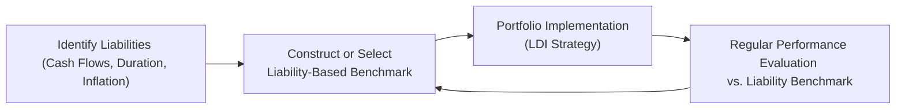

## Introduction and Context

Let’s be real: when I was first starting out as a junior analyst at a pension fund, I remember scratching my head about all these different types of benchmarks—market indexes, custom composites, peer comparisons, you name it. My manager back then would say, “Listen, a benchmark is just your yardstick.” But, boy, that yardstick sure comes in a variety of shapes and sizes! Understanding which benchmark fits a particular portfolio or an investment strategy is almost an art form. In some contexts, especially for liability-driven portfolios, we need a specialized yardstick—one that measures success not just in terms of returns, but in how well it helps meet future liabilities.

Below, we’ll explore the main categories of benchmarks, from broad traditional indexes all the way to liability-based benchmarks. We’ll talk about why they matter, how to construct them, and how they align with different portfolio objectives. By the end of this discussion, you should feel comfortable distinguishing among the major benchmark types and be ready to roll up your sleeves for more advanced performance measurement challenges.

## Major Benchmark Categories

### Market Index Benchmarks

Market index benchmarks are a classic—and for many funds, they’re enough. Think of the S&P 500 for U.S. equities or the Bloomberg U.S. Aggregate Bond Index for fixed income. These indexes represent broad segments of the market, and they’re typically compiled by well-known index providers. They reflect the performance of a “market” (broadly defined) against which you can gauge how well an investment is doing.

• Advantages:  
  – Widely recognized and easy to access.  
  – Low cost and regularly disseminated.  
  – Provide a straightforward comparison of portfolio performance versus the average returns of a market segment.

• Drawbacks:  
  – May not reflect the unique characteristics or constraints of your strategy.  
  – Can be too broad, leading to mismatch in risk exposures (e.g., if you invest differently from broad-market weighting).  
  – Sometimes excludes niche areas of the market that matter to your portfolio.

In a lot of cases, you might end up measuring your specialized equity strategy that invests in small-cap growth stocks against the S&P 500. Then you wonder, “Why does it look like I’m lagging the index?” Possibly because you’re not comparing apples to apples in terms of risk exposures, size, or style.  

### Custom (Strategy‑Specific) Benchmarks

A custom benchmark aims to address that very “apples to apples” problem. If you’re implementing a distinct strategy—say, half your allocation in large-cap equities, the other half in a specialized convertible bond sector—you might build a custom blend of indexes reflecting those weights. Alternatively, you could have a more sophisticated approach that incorporates factor exposures (value, growth, momentum, etc.) or even detailed constraints, like a heavier weighting in a particular region.

• Advantages:  
  – Gains precision by directly reflecting your portfolio’s investment universe or style.  
  – Can be reweighted over time if the strategic allocation shifts.  
  – Offers a more transparent measure of manager skill within a truly comparable context.

• Drawbacks:  
  – Requires in-depth knowledge and resources to construct and maintain.  
  – Potential for subjectivity or “benchmark shopping,” where you make the benchmark easy to beat.  
  – Less recognition or acceptance than mainstream indexes.

One time, I tried constructing a custom benchmark for a small-cap value manager who insisted on including a slice of micro-caps. We basically built an index from a well-known small-cap index plus a specialized micro-cap portion for that extra tilt. It worked well but definitely required ongoing management to keep the holdings updated and aligned with the manager’s evolving style.

### Peer Group Benchmarks

Ever had that moment in the office where someone says, “We’re performing in the second quartile among our peers—hooray!”? That’s exactly what a peer group benchmark is about: comparing your results to a set of similar managers or funds, often in the same category or style. For instance, in the mutual fund world, Morningstar or Lipper categories often serve as reference points. In private wealth or institutional circles, you might rely on external consulting databases of managers with a similar style, risk budget, or asset class focus.

• Advantages:  
  – Understand how you stack up against real-world managers, not an abstract index.  
  – Reflects actual net-of-fees performance (in many peer group databases).  
  – May capture unique strategy constraints better than broad indexes.

• Drawbacks:  
  – Peer groups can shift membership over time; managers enter or drop out.  
  – Survivorship bias: poorly performing managers may disappear, boosting average returns artificially.  
  – Peer universe definitions aren’t always consistent (style drifts and classification disputes).

### Absolute Return Targets

An absolute return benchmark is basically saying, “We want 8% a year, come rain or shine.” If your investment objective is about achieving a specific target return—maybe 6% or 10%—this type of benchmark holds you to that. Often used by endowments or foundations seeking, for example, a “CPI + 5%” target to maintain purchasing power over the long run.

• Advantages:  
  – Straightforward measure of whether you’ve achieved your stated return needs.  
  – Useful in stable or inflation-sensitive contexts—like “CPI + 4%” for philanthropic foundations.

• Drawbacks:  
  – Doesn’t consider market conditions or risk exposures that might hamper returns.  
  – May be extremely punishing in bear markets, where no one is generating positive returns.  
  – Doesn’t necessarily reflect investable or replicable opportunities in the market.

## Introducing Liability‑Driven Benchmarks

For institutions like pension funds, insurance companies, or even some defined-benefit plans, simply beating a market index or meeting an absolute return target might not be enough. Their mission goes beyond “earn a healthy return.” They have actual future cash outflows (liabilities) that must be covered—like retirees expecting monthly checks or insurance obligations that might come due at uncertain times. Enter the liability-based benchmark.

A liability-based benchmark is designed to directly reflect the cost of meeting future liabilities. If your liabilities behave like a long-duration corporate bond with certain credit, interest rate, and longevity characteristics, your benchmark morphs into something that measures how well you’re matching or outperforming that liability profile.

### Key Components of Liability‑Driven Benchmarks

• Liability Profile Analysis:  
  – You start by examining key characteristics of your liabilities—like interest-rate sensitivity (duration), inflation sensitivity, currency exposure, and timing. For example, a pension plan might have a 20-year average duration with partial inflation indexing.  
  – If your liabilities are denominated in multiple currencies or are inflation-linked (like some pension plans), that structure must be reflected in the benchmark.

• Construction Approach:  
  – A common approach is to replicate or “immunize” the liabilities using a collection of bonds or derivatives. Then, your “liability benchmark” could effectively be the custom bond (or bond + derivative) portfolio that best matches the liability stream’s risk factors.  
  – Another approach is to use a more dynamic liability-based composite index—some managers use yield-curve-based building blocks or inflation swaps to replicate the liability profile.

• Ongoing Adjustments:  
  – As interest rates shift and liabilities mature (or new liabilities come onto the books), the composition of the liability-based benchmark might change.  
  – Actuarial assumptions (like mortality rates or the discount rate used for pension liabilities) can also shift, requiring an updated liability-based benchmark approach.

### Why Liability‑Based Benchmarks Sometimes Feel More Complex

You might be thinking, “Why not just throw the pension assets into the S&P 500, shoot for a high return, and call it a day?” The short answer is that you want alignment of risk. If your liabilities effectively act like a bond, and you have your assets in high-volatility equities, sure, you might do great if markets go up—but you’ll have a mismatch if interest rates fall or if the equity market collapses at a moment you need liquidity for payouts.

Because a liability-based benchmark is basically a yardstick that tries to measure how well you’re laser-focused on covering your known and projected cash obligations, it can be highly nuanced. For instance:

• You might need partial inflation hedges.  
• You might aim for certain credit exposures that mirror your liabilities or your sponsor’s financial health.  
• Currency exposures emerge if your liabilities are denominated in multiple geographies.  

If that sounds complicated, well, that’s because it is. But it’s also crucial for many large institutional investors.  

### Linking LDI (Liability‑Driven Investing) to Benchmarks

Liability-Driven Investing, or LDI, is the broader strategy of shaping a portfolio around the characteristics of the liabilities. Equities or alternative assets might still play a supporting role—perhaps to generate returns above the liability growth rate—but the core is about matching or hedging liability risks. The performance measure goes beyond “we earned 7%.” Instead, it becomes “we earned at least as much as the cost of future payments, if not more, without taking undue risk relative to those liabilities.”

If we think about the concept of immunization: that’s basically a bond strategy that tries to lock in a certain return to fully fund known liabilities. The impetus there is to set your portfolio’s duration equal to the liabilities’ duration so that changes in interest rates don’t create a mismatch. Your liability-based benchmark might literally be “the portfolio that perfectly immunizes these liabilities.” If your real portfolio outperforms that immunizing portfolio, you can claim added value.

Below is a simplified flow diagram illustrating how liability-based benchmarks fit into the performance evaluation:

## Importance of the Right Benchmark

### Alignment with Portfolio Objectives

Choosing the right benchmark ensures that managers and stakeholders understand what success looks like. For institutional investors driven by liabilities, success means covering those liabilities at an acceptable level of risk. If your benchmark is misaligned—like using a broad equity index for a liability-based strategy—you might get misleading performance results that do not reflect how effectively you’re covering your obligations.

### Risk Management and Behavioral Factors

Benchmarks influence behavior. If you measure yourself solely against the S&P 500, you might be tempted to load up on more equity risk to beat that index—even though your real goal is to pay out defined liabilities in 10 years. A liability-based benchmark encourages managers to pay attention to interest-rate risk, inflation risk, re-investment risk, and other liability-specific exposures. That can help keep the entire operation grounded in the ultimate objective: paying the bills.

### Potential Challenges

• Complexity: A robust liability-based benchmark can be complicated to design, requiring specialized actuarial input and frequent recalibration.  
• Potential for Over-Precision: Sometimes managers get lost in the weeds of tiny liability sub-components, losing the big picture.  
• Communication Issues: Explaining to stakeholders why your liability-based benchmark is more appropriate than a well-known index can be an uphill battle, especially when outside parties are used to seeing standard indexes on the news every day.

## Best Practices and Common Pitfalls

• Best Practice #1: Match Key Risk Factors. At a minimum, ensure your liability-based benchmark captures duration, inflation, and currency exposures.  
• Best Practice #2: Keep it Simple (Where Possible). You don’t have to replicate every granular detail of your liabilities if doing so adds only marginal precision but major complexity.  
• Best Practice #3: Recalibrate Periodically. Liabilities evolve. Your benchmark should too.  
• Pitfall #1: Benchmark Shopping. Some managers tailor a “custom benchmark” to look easy to beat. Ensure fair construction and transparency.  
• Pitfall #2: Ignoring Shifts in Liability Assumptions. If mortality assumptions or discount rates for pension liabilities change, your benchmark must keep pace.  
• Pitfall #3: Overlooking Liquidity. Sometimes liability-based investing is about meeting large liquidity needs at certain times—your benchmark should reflect that timing risk.

## Short Real-World Case Study

Imagine a mid-sized corporate pension plan managing $1 billion in assets for retirees. The plan is partially indexed to inflation, and the sponsor’s credit rating sits around A. The plan’s actuary calculates an effective duration of 15 years for the liabilities, which also have partial inflation sensitivity.

A typical broad-market bond benchmark, such as the Bloomberg U.S. Aggregate, might only have a duration of around 6 years. If the plan invests according to that standard index, it leaves a big mismatch compared to the liabilities’ 15-year duration. A more appropriate liability-based benchmark might be constructed from long-duration corporate and Treasury bonds, plus TIPs (Treasury Inflation-Protected Securities) for the inflation component. The plan’s performance is compared to that custom liability-based index. When interest rates or inflation changes, the plan rebalances the benchmark accordingly. This not only clarifies success metrics but also shapes how the portfolio invests in practice.

## Summary of Key Terms

• Liability‑Driven Investing (LDI): An approach focusing on aligning the portfolio’s interest-rate, inflation, and other risk exposures with the characteristics of underlying liabilities.  
• Immunization: A bond strategy that aims to match asset duration and cash flows with liability obligations to safeguard against interest rate movements.  
• Custom Benchmark: A tailored index or blended reference that mirrors a portfolio’s investment universe or strategy more precisely than broad market indexes.

## Exam Tips and Final Thoughts

For the CFA Level III exam, keep in mind that you might be asked to evaluate the appropriateness of a benchmark for a given institutional scenario. One typical essay question could describe a pension fund with certain liability attributes, then present a couple of candidate benchmarks—like a standard corporate bond index, a custom liability-based index, or even a peer-group reference. You’d be expected to articulate why a liability-based benchmark is more suitable. Also, watch out for calculations involving risk parallelism: for instance, comparing a portfolio’s actual performance net of the cost to hedge liabilities.

In item-set style questions, you might see hypothetical manager performance data against multiple benchmarks, and you’ll need to figure out which benchmark best aligns with the manager’s stated objectives. Another angle is that they’ll test your knowledge around how to properly construct a custom or liability-based benchmark.  

• Watch your time management: an essay question might prompt you to quickly outline how you’d design a liability-based benchmark. Go step by step—break down duration, inflation, currency, rebalancing instructions, etc.  
• Don’t forget the pitfalls: if the exam scenario shows that a sponsor’s liabilities changed (like they closed the plan to new entrants), the liability-based benchmark probably needs adjusting.  
• Practice short, concise writing. The exam graders value clarity over fluff.

Choosing the right benchmark is more than picking a random index; it’s about ensuring that every performance measure is aligned with actual goals. If those goals entail meeting measurable liabilities, a liability-based benchmark provides the clearest window into how effectively you’re advancing that mission.

## References for Further Study

• Maginn, J., Tuttle, D., McLeavey, D., & Pinto, J. (CFA Institute). Managing Investment Portfolios.  
• CFA Institute. “Guidance Statements on Benchmarks.”  
• CFA Institute white papers on Liability‑Driven Investing (LDI) and immunization strategies.  
• Any specialized literature on constructing custom benchmarks, especially for fixed-income strategies and multi-asset liability matching.

--------------------------------------------------------------------------------

## Test Your Knowledge: Benchmark Types and Liability-Based Benchmarks



### Which of the following best describes a market index benchmark?

- [ ] A benchmark used exclusively for liability-based portfolios.
- [ ] A customized benchmark reflecting the exact exposures of the portfolio.
- [x] A broad index representing a segment of the investment universe (e.g., S&P 500).
- [ ] A blend of inflation-linked instruments matching future liabilities.

> **Explanation:** Market indexes (like the S&P 500) represent broad market segments and are often used as a common reference for investment performance.  

### Why might a custom (strategy‑specific) benchmark be preferable to a standard market index?

- [ ] It is accessible to all investors without any modification.
- [x] It more accurately reflects the specific strategy or asset allocation of the portfolio.
- [ ] It is typically easier to construct than using a standard index.
- [ ] It provides higher returns than standard benchmarks.

> **Explanation:** Custom benchmarks closely mirror the exposures and objectives of the actual portfolio, reducing misalignment and providing a more meaningful performance comparison.

### What is the primary advantage of using a peer group benchmark?

- [ ] It simplifies liability matching in pension plans.
- [ ] It ensures exposure to a broad array of asset classes.
- [ ] It eliminates survivorship bias.
- [x] It assesses performance relative to other real-world managers.

> **Explanation:** Peer group benchmarks compare a fund’s performance to an actual group of similarly mandated managers, which can provide a realistic gauge of competitive standing.

### Which statement best distinguishes an absolute return target from a market index benchmark?

- [ ] Absolute return targets include reinvestment of dividends, while market index benchmarks do not.
- [x] An absolute return target specifies an expected rate of return regardless of market fluctuations.
- [ ] Absolute return targets are usually lower than returns from a market index.
- [ ] Market index benchmarks are used only when liabilities exist.

> **Explanation:** Absolute return targets are self-referential goals (e.g., 8% annually or CPI + 5%), whereas market index benchmarks measure performance against a reference market.

### Which of the following is the most critical factor when constructing a liability-based benchmark?

- [ ] Comparing manager performance to peers in the same style.
- [ ] Incorporating volatility levels from the equity market.
- [x] Matching the duration and timing of the projected liability cash flows.
- [ ] Minimizing the cost of index licensing fees.

> **Explanation:** For liability-based benchmarks, matching liability characteristics—particularly duration and timing of cash flows—is key to ensuring alignment with future obligations.

### Why might a liability-based benchmark change over time?

- [x] Because liability characteristics (e.g., interest rates, actuarial assumptions) can shift.
- [ ] Because market fluctuations in equity indexes transfer directly to liability obligations.
- [ ] Because managers frequently switch from one asset class to another without reason.
- [ ] Because it is mandated by regulatory authorities in all markets.

> **Explanation:** Pensions and insurance liabilities evolve due to interest rates, new entrants, mortality changes, or inflation. Thus, the liability-based benchmark is not static.

### Which term describes a strategy that aims to match assets’ duration to that of the liabilities?

- [ ] Yield curve targeting.
- [ ] Performance-based hedging.
- [x] Immunization.
- [ ] Passive equity management.

> **Explanation:** Immunization entails aligning the portfolio’s duration and cash flows with those of the liabilities to safeguard against interest rate changes.

### What is a potential pitfall of using a liability-based benchmark for performance evaluation?

- [ ] It guarantees outperformance during all market conditions.
- [x] It may become overly complex and require frequent recalibration.
- [ ] It aligns perfectly with peer group performance metrics.
- [ ] It has zero correlation with interest rate movements.

> **Explanation:** Liability-based benchmarks can become complicated because liabilities themselves evolve due to changing rates and actuarial assumptions.

### How might an LDI (Liability-Driven Investing) strategy integrate equity or alternative assets?

- [x] By using them alongside a liability-matching core structure to achieve returns above liability costs.
- [ ] By excluding them altogether, since liabilities are exclusively fixed income in nature.
- [ ] By using only equity derivatives to hedge nominal exposure.
- [ ] By focusing solely on short-term liquidity pools.

> **Explanation:** LDI strategies often include equities or alternative assets to generate returns in excess of the growth rate of liabilities, but the primary focus remains matching or hedging the core liability risk.

### Liability-based benchmarks are best suited for investors who:

- [x] Have clearly identifiable and measurable future obligations.
- [ ] Seek absolute returns that exceed the S&P 500 by a wide margin.
- [ ] Wish to mirror a broad market index with minimal tracking error.
- [ ] Are unconcerned about currency or inflation risk.

> **Explanation:** Liability-based benchmarks—common among pension funds, insurance firms, and other institutions—are designed for entities with known future obligations to be funded.


