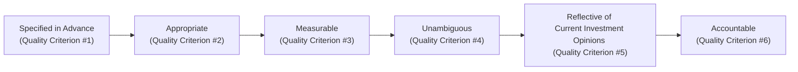

## Introduction

Most investment professionals would probably agree that choosing the “right” benchmark is one of those things that sounds straightforward... until you actually try to do it. I remember working with a pension fund manager who spent months researching and comparing various indices, only to discover that her chosen benchmark excluded a few critical industries that were central to her portfolio’s strategy. That mismatch led to all sorts of confusion when it came to attribution analysis and performance measurement, and it was a real headache to sort out.

Anyway, in this section we’ll explore the commonly accepted quality criteria for benchmarks, often summarized as “Specified in Advance,” “Appropriate,” “Measurable,” “Unambiguous,” “Reflective of Current Investment Opinions,” and “Accountable.” We’ll see how each criterion is a crucial puzzle piece. Then, we’ll examine what happens when we get it wrong—what we typically call “benchmark misspecification.” This article has a lot to unpack, but once you grasp it, you’ll be able to identify a strong benchmark with confidence and spot pitfalls before they harm performance measurement.

## Significance of Benchmark Quality

Benchmarking sets the tone for how we measure success in portfolio performance. When it comes to performance attribution, the only way to reliably separate “luck” from “skill” is to evaluate returns against an appropriate benchmark. The moment your benchmark is off—say, it’s missing key exposures or the constituents are misaligned—every step of the attribution process might yield nonsense results.

This misalignment has real-world consequences:  
• It can distort your risk and return attribution.  
• It can lead to misguided compensation structures.  
• It can undermine accountability and trust in the investment process.  

Cross-reference note: For more on how attribution results are used in broader performance evaluation frameworks, see Section 1.1: “Overview of the Evaluation Process” in this same chapter.

## The Six Benchmark Quality Criteria

A benchmark usually needs to pass six well-known tests to ensure that it is robust and reliable. Let’s dive into each one.

### Specified in Advance

Call me old-fashioned, but I like to know my target before taking a shot. “Specified in Advance” basically means the benchmark is documented upfront—preferably before any performance measurement period begins—so there’s no confusion later about what index we’re using.

• Detailed Documentation: This might involve listing every company (or bond) in the index along with its weighting methodology, or enumerating each factor exposure if you’re using a factor-based approach.  
• Publication/Communication: Make sure all relevant parties understand the chosen benchmark. This includes the investment manager, the board, and any oversight committees.

A frequent pitfall: sometimes managers change the benchmark mid-stream because performance is lagging or the original seemed “too easy.” Next thing you know, you’re cherry-picking benchmarks. That’s a big “nope.” Sticking to the benchmark that was set at the start is crucial if we’re to maintain consistency and credibility.

### Appropriate

Ever try on shoes that were completely the wrong size? They might look good in the box, but if they don’t fit your feet, they’re useless. A chosen benchmark must represent the style, strategy, or sector exposures of the portfolio. If a manager is focusing on emerging market small-cap equities, then a broad developed-market large-cap benchmark clearly won’t serve as a decent measure of performance.

• Style Fit: For an equity fund that focuses on value stocks, a growth index or broad S&P 500 might not capture the manager’s performance nuances.  
• Sector and Geographic Fit: If the manager invests globally, it doesn’t help to measure them against a purely domestic index.  
• Factor Dimensions: With multi-factor strategies, you might want a reference that includes the relevant factors.  

Cross-reference note: For more on how an “appropriate” benchmark relates to the manager’s skill, check Section 1.12: “Evaluating Manager Skill and Limitations of Appraisal Measures.”

### Measurable

Measurability basically says that the performance of the benchmark should be quantifiable on a consistent basis. If you can’t measure returns accurately, how will you compare them with your manager’s returns?

• Minimum Data Frequency: Monthly data is common, but some advanced strategies might use daily data.  
• Historical Backfill: Check if there’s enough historical data for multi-period performance analysis.  
• Verifiability: The data used for the index should be from an objective source to avoid any bias or partial data.

### Unambiguous

Imagine you get a final exam grade, but the teacher can’t tell you how many questions were on the exam or how they were weighted. That’s ambiguous. For a benchmark to be unambiguous, it must clearly identify all underlying securities or factor exposures.

• Composition Clarity: If it’s a bond index, you should see the exact weighting scheme and credit-quality breakdown.  
• Rebalancing Methodology: Keep track of how and when the index rebalances. Is it quarterly? Float-adjusted? You need full transparency.

### Reflective of Current Investment Opinions

This is a bit more subjective, but the idea is that a reliable benchmark should align with the manager’s opportunity set and reflect the actual investable universe the manager can tap into. If the manager invests primarily in large-cap technology stocks, a fixed-income benchmark might meet the other tests—specified in advance, measurable, etc.—but it’s definitely not “reflective” of what the manager truly does.

Some interpret this criterion to mean that the manager also has some conviction or at least awareness of the constituents. The manager might say, “Yes, I can choose to own those exposures if I want,” or “I follow these securities in my daily research.”

### Accountable

The final test is accountability. In other words, the manager should accept the benchmark as the yardstick against which their decisions are compared. If the manager doesn’t buy into it—maybe they say something like, “I can’t possibly be expected to outperform that index”—then you have a misalignment right from the get-go. Accountability fosters responsibility for results and influences how the manager balances risk and return to meet or beat the chosen benchmark.

Below is a simple flow diagram illustrating the six criteria:

Every legitimate benchmark used in the investment industry ought to pass each rung in this chain.

## Effects of Benchmark Misspecification

When a benchmark doesn’t conform to these qualities, we call it “misspecified.” Typically, misspecification arises when the benchmark isn’t a good representation of the portfolio’s investable universe—maybe it’s missing key segments, or it’s simply from the wrong asset class. In practice, I’ve seen managers forced to track an index that includes constraints or exposures they’d never dream of allocating to. That, my friend, is a sure path to confusion.

### Distortion in Allocation and Selection Effects

A big chunk of your performance attribution hinges on whether your outperformance is coming from allocation (“I was overweight in tech stocks that soared”) or from security selection (“I picked the right name in the sector”). Suppose that your benchmark is heavily weighted in a sector you never invest in—maybe you’ve got a climate-friendly fund that excludes fossil fuels. If your benchmark includes fossil fuel companies, your sector allocation decisions look drastically different from the baseline. That can lead to misleading attributions. Perhaps you knocked it out of the park, but the analytics might tell a jeff-lost-in-the-woods story because the baseline is so far off.

### Inappropriate Risk-Taking

Human nature being what it is, portfolio managers often anchor their risk decisions to how much they deviate from a benchmark. If the benchmark is incorrectly specified (and maybe has less risk than the portfolio’s actual orientation), managers might either dial up or dial down risk in ways that go against the investor’s best interests. It’s like trying to drive with a map that’s missing half the major roads—you might take a winding, less efficient route and end up incurring more risk than intended.

### Misaligned Compensation and Incentives

Sometimes manager compensation is tied to outperformance relative to a benchmark. If the benchmark is easier or harder to beat than the actual opportunity set, that can cause issues. If it’s an easy benchmark, the manager might earn performance fees for basically doing what a relevant, more-challenging benchmark would consider just average. Conversely, with an overly difficult benchmark, a high-skill manager might be misrepresented as underperforming. Both scenarios create friction: the manager’s motivation and investor expectations won’t align properly.

### Loss of Credibility and Accountability

Huh, I thought we were measuring you against bond returns, but you’re investing half your capital in exotic credit derivatives? That’s always an awkward conversation. Remember, accountability is one of the six tests for a reason. If a manager doesn’t consider a benchmark reflective and can’t be fairly measured by it, then the entire performance measurement exercise loses credibility.

## Case Study: Growth Equity Portfolio vs. Broad Market Index

Let’s walk through a practical (but fictional) example to see these effects in action:

• Manager’s Strategy: Focus on high-growth, disruptive tech companies globally, with the freedom to invest in private placements when appropriate.  
• Investor’s Chosen Benchmark: A standard Global Market Index (let’s call it GMI) that’s mostly large- and mid-cap stable companies and excludes private equity.  

At first glance, an ex-GMI might seem “fine,” because it covers global equities. But it doesn’t reflect the manager’s willingness to hold illiquid or small-cap names—nor does it track private placements. This mismatch means the manager’s attribution may show huge idiosyncratic performance effects and (sometimes) big tracking error, all because the benchmark’s underlying composition is quite different from the manager’s actual strategy.

If the portfolio outperforms the GMI by leaps and bounds in strong markets, observers might incorrectly attribute the manager’s skill to “selection” or “risk-taking.” Meanwhile, in a downturn, the manager might lag severely because smaller, high-growth names often get hit hardest in market downturns—and the manager’s performance might look drastically worse than the overall GMI.

In such a scenario, you’d probably want a customized blend: 70% in a global growth index, 20% in an extended market small-cap index, and 10% in a private equity proxy. That would better reflect the actual opportunity set.

## Diagnostics: How to Identify Benchmark Misspecification

Below is a short checklist (or call it a “sanity check”) you can run to see if your benchmark is a good fit:

1. Compare the Benchmark’s Sector Weights and Regional Exposures to the Portfolio.  
2. Evaluate Factor Exposures (e.g., value, growth, momentum).  
3. Look at Historical Tracking Error. If it’s unusually high (and not due to normal manager style choices), you might have mismatch issues.  
4. Analyze Active Share. High Active Share can indicate that the portfolio invests very differently from the benchmark. That’s not always bad, but if it’s consistently high for reasons beyond an intended style difference, maybe check if the benchmark is correct.  
5. Ask the Manager. Are they comfortable with the index as a fair yardstick?

A table might help illustrate a mismatch. Below is an example comparing a portfolio’s exposures to a hypothetical benchmark:

| Sector                     | Portfolio Exposure | Benchmark Exposure | Commentary                                 |
|----------------------------|--------------------|--------------------|--------------------------------------------|
| Technology                 | 50%               | 20%               | Possible mismatch if manager is tech-heavy |
| Consumer Discretionary     | 20%               | 15%               | Slight overweight, could be consistent     |
| Industrials & Energy       | 5%                | 30%               | Significant underweight vs. the benchmark  |
| Other (Cash, Privates)     | 25%               | 0%                | The benchmark excludes private holdings    |

In a real scenario, these exposures might be broken down further by region, factor, or credit quality. If you’re seeing big percentage differences in categories that matter to the portfolio’s mission, that’s a clue.

## Addressing Misspecification: Best Practices

1. Revisit Investment Policy Statements (IPS): Often, the IPS or the manager’s official strategy guidelines will indicate where the manager invests. That typically narrows the field of relevant benchmarks.  
2. Use Custom Benchmarks: For more complex, multi-asset or multi-factor strategies, consider building a custom blend (like 40% equity index, 30% fixed-income index, 30% alternative proxy).  
3. Regular Benchmark Reviews: As the portfolio strategy evolves, it’s not necessarily wrong to adapt the benchmark in a formal, documented review. The key is to do it systematically and not mid-stream just because the manager is underperforming.  
4. Maintain Transparency with Stakeholders: Keep the lines of communication open with fiduciaries, boards, or investment committees. They should understand how the benchmark matches (or doesn’t match) the investment strategy.

## Importance for Multi-Asset Portfolios

Cross-reference note: In Section 1.13, “Factor‑Based Performance Attribution for Multi‑Asset Portfolios,” we explore how multi-asset managers often incorporate a variety of distinct benchmarks for each segment of the portfolio. If any single section is measured against an ill-fitting benchmark, the entire portfolio evaluation can be thrown off. Thorough “benchmark due diligence” is especially critical for multi-asset or alternative strategies—hedge funds, private equity, real estate, etc.—each with unique index suitability challenges.

## Exam Relevance

For the CFA Level III exam, you’re often required to evaluate whether a benchmark is valid for a given investor’s strategy. Tools such as the Manager Benchmark Evaluation Table or a set of scenario-based questions will likely appear. You might see short-case vignettes where the exam calls on you to diagnose a mismatch or identify the correct approach among multiple benchmarks offered. Also, the essay format might ask you to defend a chosen benchmark based on these six quality criteria.

Key tip: If you see a reference to a manager who invests “globally in small- and mid-cap equities” but is measured against a “domestic large-cap benchmark,” it’s an instant red flag. The question might revolve around how that mismatch affects performance attribution or risk measurement.

## Final Thoughts on Benchmark Integrity

Benchmarks might feel like the most mundane part of portfolio evaluation, but from experience, it’s when you get them wrong that the real problems begin. People spend time perfecting fancy risk models and sophisticated factor decompositions or performance-based fees, yet sometimes they skip the fundamental step of verifying that the benchmark truly lines up with the strategy. Don’t let that happen to you.

By ensuring your benchmark meets the six core requirements—Specified in Advance, Appropriate, Measurable, Unambiguous, Reflective of Current Investment Opinions, and Accountable—you lay a foundation of integrity for your entire performance measurement process. Sure, it takes discipline to do it right, but it’s well worth the effort. After all, you want to make sure the yardstick by which you’re measuring is truly capturing the essence of what you’re doing.

## References for Further Study

• CFA Institute, Global Investment Performance Standards (GIPS), especially discussions on benchmark selection criteria and composite construction.  
• RS Investments/CFA white papers on measuring the quality of benchmarks and aligning performance measurement with portfolio strategies.  
• Section 1.12 in this volume, “Evaluating Manager Skill and Limitations of Appraisal Measures,” for deeper insights into how benchmark misspecification can distort skill measures.  
• Section 3.1 in Chapter 3, “Objectives, Scope, and Benefits of the GIPS Standards,” for additional context on industry best practices in benchmark construction.

---

## Test Your Knowledge: Benchmark Quality & Misspecification Quiz



### Which characteristic ensures that the securities or factor exposures constituting a benchmark are clearly identified?

- [ ] Appropriate
- [ ] Specified in Advance
- [x] Unambiguous
- [ ] Measurable

> **Explanation:** Unambiguous means you can identify every security or factor exposure in the benchmark without confusion. Appropriate, Specified in Advance, and Measurable address different aspects of quality.

### A portfolio manager is measured against a benchmark that excludes emerging markets, yet the manager invests heavily in emerging markets. Which test of benchmark quality is most clearly violated?

- [ ] Specified in Advance
- [x] Appropriate
- [ ] Measurable
- [ ] Unambiguous

> **Explanation:** The benchmark must reflect similar sector, regional, or style exposures to the portfolio. If the portfolio invests heavily in emerging markets but the benchmark excludes them, it fails the “Appropriate” test.

### If a benchmark is poorly selected, which of the following performance attribution effects is most likely to be distorted?

- [ ] External flows
- [x] Allocation and selection effects
- [ ] Fee-based performance
- [ ] Total portfolio turnover

> **Explanation:** A mismatch in the benchmark primarily skews allocation and selection effects, since the sector or factor weights in the benchmark don’t represent the portfolio’s investable universe accurately.

### How does benchmark misspecification typically affect manager compensation structures?

- [ ] It has no effect on manager compensation because compensation does not consider benchmarks.
- [x] It can lead to misaligned incentives if the compensation relies on outperforming an unsuitable benchmark.
- [ ] It forces managers to underweight high-risk investments.
- [ ] It guarantees alpha calculations become simpler.

> **Explanation:** If a compensation scheme is tied to benchmark outperformance, an unsuitable benchmark will misrepresent actual performance and motivate potentially perverse decision-making.

### Which of the following statements best captures the “Reflective of Current Investment Opinions” criterion?

- [x] The manager can invest in the benchmark’s constituents and is aware of their market value.
- [ ] The benchmark must be fully rebalanced daily to maintain validity.
- [ ] The benchmark must exclude any illiquid securities that do not trade daily.
- [ ] The manager must actively hold every security in the benchmark.

> **Explanation:** For a benchmark to be reflective of current investment opinions, the manager should know or be able to invest in the constituents, not necessarily hold them all.

### What is a recommended practice if a portfolio’s strategy changes significantly over time?

- [ ] Stick to the original benchmark indefinitely to maintain consistency of measurement.
- [x] Conduct a formal review and adapt the benchmark systematically, documenting changes.
- [ ] Avoid having any benchmark until the final strategy is finalized.
- [ ] Immediately change the benchmark at the manager’s discretion to reflect performance aspirations.

> **Explanation:** Formal, transparent reviews ensure that any benchmark adjustments are systematic and justified, rather than used opportunistically.

### Which of the following is a key indicator that might signal a mismatch between a portfolio and its benchmark?

- [x] A consistently high tracking error not explained by the manager’s stated style.
- [ ] A solid 1.0 correlation between portfolio returns and benchmark returns.
- [ ] Perfect alignment in sector exposures.
- [ ] The presence of additional factor decompositions.

> **Explanation:** A high tracking error that cannot be explained by the portfolio’s intended style or strategy often indicates that the benchmark may not be aligned with the portfolio.

### In multi-asset portfolios, why is getting the benchmark right so critical?

- [x] Even a small mismatch in one segment can skew overall performance measures.
- [ ] Multi-asset benchmarks are never used in performance measurement.
- [ ] Multi-asset managers rarely need to demonstrate attribution.
- [ ] The GIPS standards do not permit multi-asset benchmarks.

> **Explanation:** In a multi-asset setting, each asset class might need a specific benchmark. If one part of the portfolio is poorly benchmarked, then overall performance evaluations can be significantly distorted.

### What is one practical way to avoid benchmark misspecification?

- [ ] Avoid written documentation of how a benchmark is constructed.
- [ ] Rely on the manager’s personal judgment without quantitative checks.
- [ ] Use a broad global benchmark for any strategy, regardless of focus.
- [x] Compare the portfolio’s sector and factor exposures against the benchmark to see if they align.

> **Explanation:** Checking exposures helps verify that the benchmark truly mirrors the portfolio’s investable universe, a key step in preventing misspecification.

### A benchmark that is "Accountable" requires which of the following?

- [x] The manager accepts the benchmark and aims to be measured against it.
- [ ] The manager has the authority to alter the benchmark monthly.
- [ ] The benchmark is derived from daily market demands only.
- [ ] The benchmark is sponsored by a government agency.

> **Explanation:** Accountability implies the manager is willing to be held responsible for performance against that benchmark, meaning they treat it as a fair yardstick.


