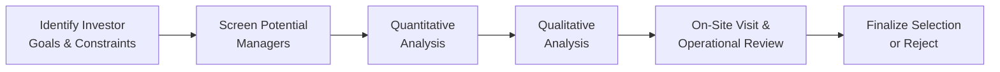

## Introduction
Selecting the right investment manager can make or break your portfolio’s performance over the long term. Yet, you’d be surprised how often folks jump into partnerships with managers because of a few headline-making returns or a dazzling presentation. Confession time: I once caught myself getting carried away by a manager’s slick marketing deck—only to discover that their operational processes were all over the place! 

Anyway, let’s be systematic. In this section, we explore a classic but ever-relevant approach to manager selection and due diligence. We’ll walk through the steps from clarifying investor goals and constraints all the way to on-site visits and ongoing monitoring. We’ll chat about balancing quantitative metrics (like Sharpe ratios and max drawdowns) with qualitative considerations (like organizational culture, teamwork, and risk oversight). By the end, you should have a strong grasp of the typical “manager selection funnel” and the best practices that keep it all on track.

## Aligning with Investor Goals and Constraints
Manager selection begins with a thorough understanding of the investor—whether that’s you, your organization, or a client. There’s no point hiring a manager whose specialty is high-octane emerging-market equities if the investor’s tolerance for volatility is extremely low. So, we always start by outlining:

• Return Requirements: Desired average returns, capital growth vs. income focus, total return targets.  
• Risk Tolerance and Constraints: Willingness to endure drawdowns, typical volatility thresholds, liquidity needs, or legal restrictions.  
• Time Horizon: Short-term or near-term liabilities (like pension payouts) vs. long-term capital appreciation.  
• Regulatory and Tax Considerations: Constraints that might limit certain asset classes or specialized strategies.  

Once these investor-specific constraints are crystal clear, you have a good sense of what type of manager you’re looking for. This is where a broad manager universe screening happens: maybe you’re focusing on large-cap managers, or alternative managers with a certain track record in distressed debt. Narrowing the scope upfront helps avoid the scattered approach of calling every manager in the phone book.

## The Two Pillars: Quantitative and Qualitative Analysis
Due diligence is typically divided into two big buckets: quantitative (number crunching, performance analysis) and qualitative (philosophy, people, processes). You really need both to gain a full picture.

### Quantitative Assessment
This part is all about the data. The manager’s track record is put under a microscope.

• Performance Statistics: Evaluate time-weighted returns, annualized returns, risk-adjusted measures (Sharpe, Sortino, and maybe appraisal ratios). Consider capturing both upside and downside capabilities (capture ratios) and looking at maximum drawdown severity and length.  
• Volatility and Drawdowns: Check how the manager’s strategy behaves in adverse market conditions. Some managers look great in bull markets but unravel at the first hint of stress.  
• Benchmark Analysis: Compare the manager’s performance to an appropriate benchmark. If a manager invests in small-cap growth stocks, are we using a widely accepted small-cap growth index as a yardstick? If the benchmark is inappropriate, you risk misjudging skill.  
• Risk Metrics: Sharpe ratio is a start, but you might also track standard deviation, beta, tracking error, value at risk (VaR), or other measures depending on the strategy.  
• Style and Consistency: Returns-based or holdings-based style analysis can reveal drift. If a manager claims to be a strictly value-oriented stock picker but ends up with half their portfolio in high-growth tech stocks, that’s a red flag.  

### Qualitative Assessment
Numbers don’t tell the entire story. All managers go through hot and cold streaks, so you want to know whether any recent underperformance is because of fundamental flaws or just cyclical factors.

• Investment Philosophy: Does the manager concentrate on fundamental analysis? Are they top-down or bottom-up oriented? How do they generate new ideas, and do they stick to a stated style?  
• Team Composition: Who are the key decision-makers? What’s the experience level and turnover scenario? A stable team with seasoned analysts and portfolio managers can be a huge plus.  
• Organizational Structure and Culture: Is there a supportive environment that fosters rigorous investment debate? Or is it a “star manager” culture, with a single big personality calling all the shots?  
• Risk Management: What controls are in place? How does the manager monitor trades, position limits, and liquidity? Do they have robust compliance frameworks, or is risk management an afterthought?  
• Operational Stability: Evaluate back- and middle-office processes, examine technology infrastructure, confirm the existence of a business continuity plan. Some of the worst blowups happen not from bad trades but from poor operational procedures.  
• Alignment of Interests: Look for “skin in the game.” Does the manager invest personal or firm capital into the strategy? Do performance fees reward true outperformance, or might they incentivize excessive risk-taking?  

## A Common Due Diligence Framework
A systematic approach ensures nothing major slips through the cracks. You can imagine a funnel (or pipeline) that moves from broad screening to deeper investigation:

1. Identify investor goals & constraints: As discussed, define exactly what’s needed.  
2. Screen potential managers: Narrow the universe using broad performance, style, or track record filters.  
3. Quantitative analysis: Deep dive into performance.  
4. Qualitative analysis: Evaluate the people, processes, and culture.  
5. On-site visit & operational review: Meet the team. Assess if the real environment matches the marketing story.  
6. Finalize selection or reject: Weigh all factors, confirm the manager is consistent with your needs, and proceed (or move on).  

## Conducting On-Site Visits
Meeting face-to-face, when practical, can clarify so many intangibles. It’s not always possible—especially with global teams—but it’s incredibly valuable if you can swing it.

• Culture Check: Observe how analysts and portfolio managers interact. Is it collaborative or hierarchical?  
• Process Verification: See how their research is documented, how trades are reviewed, how risk limits are monitored in real time.  
• Technology and Infrastructure: Are the systems robust for the strategy’s complexity? Is compliance integrated into daily processes or handled in an ad-hoc manner?  
• Interviews with Various Team Members: Don’t just talk to the lead portfolio manager. Speak with compliance officers, junior analysts, or even back-office staff. Their insights can reveal if actual processes differ from official narratives.  

I once visited a manager whose offices looked like a ghost town—only a handful of staff seemed present. They had boasted about a “20-person research team.” Turned out they were mostly remote consultants, rarely on site. That’s not necessarily a deal-breaker, but the mismatch raised bigger questions about day-to-day oversight and accountability.

## Capacity Constraints
There’s a reason legendary hedge fund managers close their funds to new investors once they reach certain asset levels. A strategy that thrives with $500 million in AUM might stumble under the weight of $5 billion. Think of smaller-cap equity strategies: once your share of certain illiquid stocks becomes large, you can move markets or struggle to exit positions gracefully.

So check whether the manager has a stated capacity threshold. The critical question is: if we invest fresh capital, might we dilute the manager’s alpha? Or risk them stretching beyond their sweet spot?

## Documenting the Process
A robust, repeatable checklist is your friend. Not only does it keep you from forgetting something important—like verifying the manager’s regulatory registrations—but it also provides consistency across multiple searches. Over time, you can refine and update this checklist, capturing lessons learned. 

Some items often found on a due diligence checklist:
• Performance reviews over various time horizons and market conditions.  
• Verification of investment style consistency with GIPS-compliant performance.  
• Background checks on key personnel (including any disciplinary actions).  
• Documentation of research, trading, and risk management processes.  
• Operational due diligence: system backups, cybersecurity, compliance protocols.  

Having everything on record also helps minimize biases (like over-focusing on a single exceptional year) and ensures accountability if multiple stakeholders are involved in the selection.

## Style Drift and Monitoring
A manager who starts as a deep-value investor might pivot to momentum-driven picks when the style goes out of favor. That’s style drift—and it can be particularly worrisome if it’s not disclosed. So keep an eye on periodic reports, portfolio holdings, and style regressions (e.g., returns-based style analysis from Chapter 2.3) to verify that the manager remains true to their advertised approach. 

If the drift is intentional (and well-communicated) because the market environment changes, at least you can factor that into your risk/return expectations. If it’s unacknowledged, you might lose faith in the manager’s reliability and discipline.

## Real-World Illustration: The Starlight Endowment
Picture the Starlight Endowment, a university fund seeking an annual 7% real return. Starlight invests with multiple managers across asset classes. Recently, it realized its equities manager, “AlphaQ Investments,” had ballooned in AUM, which corresponded to declining risk-adjusted returns. Starlight’s CFO did a check-in call to understand the situation—and discovered increased turnover in AlphaQ’s analyst team plus limited back-office staff to handle new client accounts.

Armed with this new knowledge, the CFO arranged an on-site visit. The CFO found out that risk monitoring was under the portfolio manager’s oversight alone, with minimal checks from compliance. Some of AlphaQ’s lead analysts had left, which might’ve contributed to the performance drop. The CFO also learned that they weren’t particularly rigorous about stress testing portfolio positions. After thorough re-evaluation, the endowment decided to gradually reduce its exposure, awarding it to another manager with more robust processes. 

This is exactly why consistent due diligence, including periodic re-checks, matters. Even a previously stellar manager can stumble in the face of organizational upheaval or asset bloat.

## Best Practices and Potential Pitfalls
• Best Practice #1: Align manager style with your investment mandate. If you want defensive equity exposure, avoid managers known for high-volatility growth bets.  
• Best Practice #2: Diversify your manager lineup. Relying on a single “star manager” can be risky.  
• Best Practice #3: Keep your eyes on operational stability. Solid back-office support can be as crucial as front-office skill.  
• Pitfall #1: Over-reliance on short-term performance. Even the greatest managers have rough quarters. Conversely, a manager with a lucky streak might not have the skill to sustain.  
• Pitfall #2: Failing to spot style drift. Another way to put it: “He said he was a large-cap value manager—why’s he piling into unprofitable growth plays?”  
• Pitfall #3: Ignoring capacity constraints. Excess AUM can cripple an otherwise alpha-generating strategy.  
• Pitfall #4: Neglecting the intangible factors (team chemistry, ethics). Red flags can slip by if you never talk to the folks who actually run day-to-day processes.

## Final Exam Tips
For the CFA Level III exam, manager selection and due diligence are frequently tested in item set or constructed-response questions. Here are some tips:

• Show Understanding of Both Quantitative and Qualitative Factors: In your essay responses, mention the synergy between performance stats and the intangible process/cultural elements.  
• Provide Real-World Examples: If an exam question references a manager’s newly doubled AUM, talk about capacity constraints—examiners love to see those connections.  
• Practice Time Management: For item set questions, carefully read each mini-vignette, focusing on subtle details like style drift, high staff turnover, or suspicious outperformance.  
• Emphasize Why Each Step Matters: If asked “Why do an on-site visit?” highlight intangible verification, cultural checks, and operational alignment.

## References
• CFA Institute Investment Foundations® Program  
• “Investment Manager Due Diligence: A Comprehensive Guide” by W. Jeffrey Swiggart  
• CFA Program Curriculum Level III (2025), Performance Measurement, Chapter 2  

## Test Your Knowledge: Manager Selection and Due Diligence Essentials



### Which of the following is the first step in a well-structured manager selection process?

- [ ] Conducting a thorough on-site visit of the manager
- [x] Identifying the investor's goals and constraints
- [ ] Reviewing the manager's performance presentation for GIPS compliance
- [ ] Investigating the manager's team stability

> **Explanation:** Before anything else, you need to clarify the investor’s objectives, risk tolerance, and constraints. This ensures you only shortlist managers that align with the underlying goals.

### When analyzing a manager’s performance, which metric primarily evaluates downside volatility?

- [ ] Sharpe ratio
- [x] Sortino ratio
- [ ] Appraisal ratio
- [ ] Capture ratio

> **Explanation:** The Sortino ratio focuses on downside risk by using downside deviation instead of total standard deviation, making it a better measure for investors worried about negative returns.

### Which of the following is a common sign of style drift?

- [ ] Consistent performance over multiple market cycles
- [x] A large-cap value manager shifting significant holdings into high-growth tech stocks
- [ ] Carrying a higher cash balance before major market downturns
- [ ] Reporting performance in compliance with GIPS standards

> **Explanation:** Style drift often occurs when a manager changes their portfolio holdings significantly from their stated style. For instance, investing in high-growth tech names is inconsistent with a pure large-cap value mandate.

### During a due diligence on-site visit, an important reason to interview back-office staff is to:

- [ ] Ensure they are meeting their personal career objectives
- [ ] Evaluate the portfolio manager’s likeability
- [x] Verify that operational processes, compliance procedures, and risk controls match the firm’s stated policies
- [ ] Make sure they have a casual dress code

> **Explanation:** Staff beyond the portfolio manager can reveal vital operational details, risk management practices, or red flags not evident in marketing materials.

### Why might capacity constraints pose a problem for a successful manager?

- [x] Too much money under management may dilute alpha, especially in less liquid strategies
- [ ] It automatically increases the standard deviation of returns
- [x] Larger positions can affect market prices, making it harder to enter or exit trades
- [ ] It reduces the manager’s management fee to zero

> **Explanation:** Strategies that rely on nimble trading or less liquid securities can become unwieldy with rising AUM, potentially hampering performance and making it harder to maintain alpha.

### An example of “alignment of interests” in investment management includes:

- [x] A manager investing a portion of personal capital in the same strategy as clients
- [ ] A manager refusing to accept performance fees
- [ ] A manager only working on a fixed salary with no bonus potential
- [ ] A manager outsourcing all risk controls to a third party

> **Explanation:** “Skin in the game” means the manager invests in the same product and shares similar risks/rewards with clients, aligning incentives more closely.

### Which item is typically included on a due diligence checklist for manager selection?

- [x] Verification of compliance and regulatory records
- [ ] Ensuring the manager’s office décor meets specific color requirements
- [x] Analysis of investment style consistency and historical performance
- [ ] Requesting daily phone calls with the investment team

> **Explanation:** A thorough checklist ensures you scrutinize compliance records, performance track record, style consistency, and other critical items while skipping irrelevant details.

### When evaluating a manager’s risk management framework, you should focus on:

- [x] The existence of defined position limits, stop-loss protocols, and stress-testing procedures
- [ ] Only the manager’s ability to generate outsized alpha
- [ ] Quarterly marketing letters praising the manager’s top holdings
- [ ] The manager’s upcoming holiday schedule

> **Explanation:** Risk management is about identifying and mitigating potential losses or exposures. Specific protocols, limits, and regular stress-testing are critical to ensuring the strategy remains within acceptable risk boundaries.

### If a manager’s performance appears abnormally high relative to its benchmark and peers, the next step is typically to:

- [x] Investigate the sources of alpha, confirm if it’s due to skill or an inappropriate benchmark
- [ ] Immediately terminate the manager for suspicious performance
- [ ] Increase the firm’s allocation without further questions
- [ ] Assume the manager has discovered a sustainable market inefficiency

> **Explanation:** Investigating how the returns exceed normal expectations (benchmark misalignment, style mismatch, or genuine skill) is key. Sometimes outperformance results from excessive risk-taking or using a benchmark that’s too easy to beat.

### True or False: A manager who disclosed a past regulatory infraction should automatically be excluded from consideration.

- [x] True
- [ ] False

> **Explanation:** Many factors influence whether a past infraction is disqualifying. The severity, timing, and context of the infraction matter. While an infraction is a red flag that requires careful scrutiny, it doesn’t necessarily lead to an automatic exclusion; it depends on the nature of the violation and any corrective measures taken.


