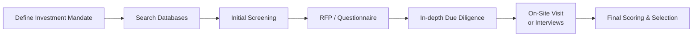

## Introduction
Selecting the right investment manager can be, well, pretty tricky, if you ask me. And trust me, I’ve had my fair share of “Hmm, is this the right fit?” moments. Whether you’re a pension fund trustee looking for a stable pair of hands or a high-net-worth individual wanting that extra edge, having a structured approach to the search and selection process can save you plenty of time and frustration. In this section, we explore the core tools out there—from handy databases and consultant platforms to advanced analytics—so that you can systematically narrow the manager universe and, hopefully, find your perfect match.

## Manager Databases and Consultant Platforms
Investment manager databases are a godsend when it comes to bridging that knowledge gap between you (the potential client) and the thousands of managers vying for your attention. Platforms like eVestment, Morningstar Direct, and Mercer provide everything from performance histories and peer group rankings to strategy descriptions and even intangible factors like manager tenure or firm culture.

• Aggregated Data: These platforms typically aggregate historical returns, risk metrics, portfolio holdings, turnover stats, and more. That means you can do a quick side-by-side comparison without rummaging through a hundred separate fact sheets.  
• Consultant Recommendations: Consultants often maintain watch lists based on thorough due diligence, which can be a real time-saver. If a consultant has flagged a manager as “best-in-class,” you can focus your efforts on verifying that claim.

By the way, if you’re interested in how these data points can feed into performance analysis, you might want to refer to other sections like 2.3 (Returns-Based vs. Holdings-Based Style Analysis). It’s mind-blowing how different the results can look when you base your judgments on aggregated returns alone versus actual holdings data.  

## Screening Tools
So, let’s say you have this massive data set from eVestment or a similarly robust platform. What next? Screening tools come to the rescue by applying quantitative filters to narrow down your prospective managers. These filters might include:  

• Track Record Length: You might set a minimum three- or five-year history.  
• Performance Thresholds: Maybe you only want managers who’ve beaten their benchmark by a certain margin.  
• Volatility Parameters: You might want to exclude managers with wild swings in monthly or annual returns.  

In practice, you might specify: “Global Equity managers with a five-year track record, top quartile Sharpe ratio in the last rolling three-year period, and an annual drawdown not exceeding 15%.” This screens out the, shall we say, more volatile or untested folks. I’ve personally found that building these filters can feel a little bit like a puzzle—you tweak one parameter, then recast.  

But watch out for pitfalls:  
• Survivorship Bias: Make sure the database includes “dead” or closed funds. Failure to account for them inflates the average performance.  
• Look-Ahead Bias: Only rely on data that would’ve been available when the manager was chosen.  

For deeper guidance on error management in manager hiring, see 2.2 (Type I and Type II Errors in Manager Hiring and Continuation).

## Consultant Services
Consultants can provide an extra layer of analysis, especially if you’re in a large institution that values external expertise or simply has limited internal resources. A consultant can:  

• Bring Pre-Qualified Lists: They often have recommended or watch lists that reflect extensive diligence on performance, stability, style consistency, and operational capabilities.  
• Conduct On-Site Reviews: They’ll perform manager visits (sometimes even unannounced) to see how the portfolio management teams operate.  
• Offer Benchmarking Insights: They can tailor benchmarks specific to your mandate or incorporate liability-based benchmarks (see 1.8 Benchmark Types and Liability‑Based Benchmarks for more background).  

A good consultant ensures you’re not missing intangible red flags, like a high turnover culture or an exodus of key portfolio managers. Just be aware of potential conflicts of interest. Some consultants might have alliances or revenue-sharing agreements with certain managers—knowing this can help you weigh recommendations more objectively.

## Requests for Proposal (RFP)
The RFP process, in my humble opinion, is where the rubber meets the road. You issue a formal document requesting a manager to detail:  

• Investment Approach: Are they fundamental, quantitative, or a blend?  
• Fee Structure: Do they charge performance-based fees, and if so, how are they calculated (see 2.9 Performance‑Based Fees: Forms, Provisions, and Interpretation)?  
• Risk Management: How do they handle tail risk, liquidity, and stress scenarios?  
• Operational Procedures: This might address compliance policies, code of ethics, and internal oversight.  

I remember once reading an RFP response where a manager had a truly bizarre approach to risk oversight—essentially a “Don’t worry, we’ve got it” vibe with no real details. That was a hard pass for our client. RFPs help formalize the evaluation process, making it easier to compare apples to apples. If you’re short on time, you might distribute a standardized questionnaire first. But for big mandates, trust me, it’s worth the effort to get a thorough RFP response.

## Manager Surveys and Questionnaires
In a way, RFPs can overlap with manager surveys, but surveys or questionnaires tend to be shorter and more standardized. They often revolve around:  

• Team Composition: Who’s on the investment committee? How many years of experience do they each have?  
• Portfolio Turnover: How frequently do they trade?  
• Historical Holdings Patterns: Do they drift from their stated style?  
• Governance: What’s the compliance framework, and how do they respond to regulatory changes?  

Using a template that’s consistent across all the managers you’re evaluating can make your life so much easier when you sit down to compare them. Also, these surveys might include disclaimers or certifications confirming that the manager adheres to relevant regulations or to GIPS standards (see Chapter 3: Overview of the Global Investment Performance Standards).

## Peer Group Comparisons
Next up: peer group comparisons. This is a biggie for a lot of folks because it’s so intuitive: “Let’s line up a manager against 50 other large-cap growth managers and see who stands out.” However, the tricky thing is making sure your peer group is truly comparable.  

• Style Consistency: A manager calling themselves “large-cap growth” might occasionally hold mid-cap or value positions. That can distort the comparison.  
• Survivorship and Backfill Bias: Some peer groups only reflect managers who are still alive and well.  
• Benchmark Adjustments: If you’re comparing managers across different regions or time zones, you’ll need to standardize your data.  

In other words, a peer group analysis is only as good as your definitions. For a deep dive on performance attribution, see 1.4 (Performance Attribution Approaches) and 1.13 (Factor‑Based Performance Attribution for Multi‑Asset Portfolios). Using factor-based metrics can help tease out style drift and isolate how managers truly compare.

## Advanced Analytics (Machine Learning)
It seems like everyone these days is talking about machine learning and big data, right? Well, advanced analytics can also be part of your manager search. Large institutional investors, such as sovereign wealth funds, might analyze troves of historical data to identify anomalies or hidden patterns in manager performance.  

• Natural Language Processing: Some tools parse managers’ commentaries or letters to detect shifts in tone or strategy.  
• Hidden Factor Discovery: Machine learning can unearth previously unrecognized macro or style factors.  
• Early Warning Flags: If machine learning algorithms detect a manager’s strategy is diverging from what’s historically worked, you might catch a meltdown before it’s too late.  

However, don’t jump blindly into the ML hype. It’s only as good as the data you feed it. Plus, the more sophisticated the technique, the easier it might be to “overfit” and see patterns that aren’t actually real.

## Documentation and Scoring Systems
If you think about it, a manager search often has multiple steps. You define your universe, you screen, you run RFPs and on-site visits, and so on. In each step, information is gathered and opinions (sometimes subjective) are formed. Documenting the entire process is crucial, not just for compliance, but for accountability.  

Scoring systems can help bring structure. For example:

• Performance (Weight 30%): Evaluate historical returns, drawdowns, risk-adjusted ratios (e.g., Sharpe or Sortino).  
• Team Stability (Weight 25%): Consider turnover in key positions, experience, cultural fit.  
• Risk Management (Weight 15%): Look for VaR analysis, scenario testing, governance.  
• Operations and Compliance (Weight 15%): Check for robust internal controls and GIPS compliance.  
• Subjective/Qualitative Factors (Weight 15%): Brand reputation, alignment with your values, intangible “feel” from interviews.  

You might translate those categories into raw numeric scores that you can sum up for a final ranking. But remember: spreadsheets and scoring systems can’t capture everything. There’s always a bit of nuance that you need to verify with conversations and references.

## Combining Quantitative and Qualitative Methods
I’ve definitely seen people swing too far in one direction—either they’re 100% “data-driven” or they rely fully on gut feel. In reality, you need both. Numbers can give you a sense of performance reliability and style consistency, but intangible qualities—like team chemistry, client communication, or ability to adapt to changing markets—matter too.

In some cases, a quantitative approach might skip over the manager who’s had slightly lower returns but has proven extremely resilient in volatile markets. In other words, you might be missing out on the “steady Eddie” who’s perfect for your risk tolerance. On the other hand, an entirely “gut-based” approach can lead to ignoring worrisome signals in the performance data.  

## Best Practices and Common Pitfalls
• Best Practices:
  – Cross-Reference Data: Don’t rely on a single provider.  
  – Confirm Intangibles: Conduct on-site visits if possible.  
  – Document Everything: So you can justify decisions and learn from mistakes.  
  – Use Consistent Benchmarks: Ensure your peer group analysis is truly representative.  

• Common Pitfalls:
  – Overemphasizing Past Performance: It’s only one component among many, and not always predictive of future success.  
  – Style Drift Neglect: Managers might stray from stated mandates when they chase hot sectors.  
  – Incomplete Due Diligence: Don’t forget operational and compliance reviews.  

Sometimes, it helps to visualize the entire multi-step process in a single snapshot. Below is a quick diagram of a typical manager selection workflow:

## Putting It All Together
Ultimately, manager search and selection is an iterative endeavor. You identify your goals, gather data, filter out the less-suitable candidates, then do deeper dives on the potential winners. If your short list only has two or three managers, that’s often perfect, because it means you’ve done the legwork upfront. This approach aligns well with the broader theme in Chapter 2, which emphasizes a structured, methodical process to manager hiring and continuation.  

From the perspective of the CFA® 2025 Level III exam, you’ll likely see scenario-based questions that test your ability to apply these tools in a real-life setting. Expect to parse manager data, RFP responses, or hypothetical consultant reports to identify which manager best fits a given mandate. Keep in mind the lessons from other parts of the curriculum—particularly around performance measurement techniques (Chapter 1) and the GIPS standards (Chapter 3)—because they frequently show up in manager selection contexts.

## Final Exam Tips
• Scenario-Based Focus: In the exam, you might get a question about an institutional client wanting to select a manager for a fixed-income portfolio. Make sure you can articulate not just what tools you’d use, but why they matter.  
• Time Management: Don’t get bogged down in the details of each hypothetical manager. Look for big red flags first.  
• Integrate Knowledge: Tie in performance attribution, risk measures, and the due diligence process. The exam loves to see that you can connect multiple areas of the curriculum.  
• Practice RFP Evaluation: If you see a sample RFP in the exam, be ready to extract the key data points, assess them critically, and spot potential weaknesses.  

## References
• “Evaluating, Selecting, and Monitoring External Managers,” CFA Institute publication.  
• “Manager Search and Selection Under MiFID II,” PricewaterhouseCoopers.

## Glossary
• RFP (Request for Proposal): A document used by investors to solicit detailed capabilities and proposals from asset managers.  
• Manager Database: A platform aggregating returns, holdings data, and fund characteristics from various managers for comparison.  
• Peer Group Comparison: Evaluating managers against a set of similarly mandated funds/strategies to benchmark performance and style consistency.

## Test Your Knowledge: Manager Search and Selection Tools Quiz



### Which of the following is the primary benefit of using a specialized consultant during the manager search process?

- [ ] Eliminates all biases in manager selection
- [x] Provides pre-qualified manager lists and in-depth due diligence
- [ ] Guarantees outperformance relative to benchmarks
- [ ] Ensures minimal regulatory requirements

> **Explanation:** Specialized consultants often provide a pre-qualified list of managers based on deeper due diligence. However, consultants cannot guarantee outperformance or eliminate all bias.

### When screening for investment managers, which of the following is a potential drawback if survivorship bias is not addressed?

- [ ] Enhances the reliability of peer group comparisons
- [ ] Undermines the importance of RFP procedures
- [x] Overstates the historical performance of surviving managers
- [ ] Automatically increases sample size

> **Explanation:** Survivorship bias excludes data from managers or funds that have dropped out of the database, thereby inflating average past returns of the remaining managers.

### What is one key reason to differentiate between returns-based and holdings-based style analysis when selecting managers?

- [x] Holdings-based analysis sheds light on actual portfolio compositions rather than simple returns
- [ ] Returns-based analysis requires no data sets
- [ ] Holdings-based analysis relies on simulated performance only
- [ ] Returns-based analysis matches all regulatory standards

> **Explanation:** Returns-based style analysis can miss subtler aspects of how a manager is constructing the portfolio. Holdings-based analysis provides more granular insight by tracking the actual positions.

### Which of the following items is typically found in a formal RFP?

- [ ] Proprietary taxes paid by fund employees
- [ ] The manager’s marketing materials only
- [x] Detailed information about fees, investment processes, and track records
- [ ] Confidential client data from other mandates

> **Explanation:** RFPs (Requests for Proposal) typically ask for investment philosophy, organizational structure, performance history, and fee arrangements, among other operational details.

### Which statement about using peer group comparisons is most accurate?

- [x] Peer group definitions can be subjective, potentially distorting true performance comparisons
- [ ] Peer groups cannot be used for multi-asset portfolios
- [x] Survivorship bias can affect the validity of peer group comparisons
- [ ] Peer groups always use identical benchmarks

> **Explanation:** Peer groups are only as reliable as the definitions and data included. Subjective classifications and survivorship bias can distort performance metrics.

### In a multi-step manager selection process, why is documentation so critical?

- [x] It increases transparency, supports auditability, and enables later review of decisions
- [ ] It guarantees outperformance
- [ ] It only serves marketing purposes
- [ ] It ensures GIPS compliance by default

> **Explanation:** Proper documentation allows stakeholders to understand and validate each stage of the manager evaluation. It’s key for compliance and accountability.

### What advantage might machine learning techniques provide in analyzing a manager's historical performance?

- [x] They can detect hidden factors and patterns that simple comparisons may overlook
- [ ] They remove the need for fundamental analysis
- [x] They automatically eliminate operational risk
- [ ] They ensure manager outperformance in the future

> **Explanation:** Advanced analytics can unearth subtle performance drivers otherwise missed by traditional methods. There is no guarantee of future outperformance or an elimination of operational risk.

### Why is it beneficial to combine quantitative data with on-site visits or in-depth calls?

- [x] Some intangible aspects, like team dynamics, are not captured in the data
- [ ] Quantitative data is legally unusable in final selections
- [ ] On-site visits are an optional luxury, rarely influencing manager choice
- [ ] Intangible factors are always reflected perfectly in performance figures

> **Explanation:** While quantitative metrics are crucial, they don’t fully capture a manager’s culture, team dynamics, or qualitative strengths, which can be observed more concretely in person.

### Which of the following is a best practice for employing a scoring system in manager selection?

- [x] Assign explicit weights to key factors (e.g., performance, team stability, risk management)
- [ ] Use it only to evaluate historical expenses
- [ ] Hide how scores are generated to limit manager influence
- [ ] Rely solely on the final numeric result

> **Explanation:** Spelling out each category and assigning weights promotes transparency and helps standardize evaluation. The purely numeric result is a guide, not the only determinant.

### True or False: Overemphasizing past performance often ignores the manager’s ability to adapt to market changes.

- [x] True
- [ ] False

> **Explanation:** Past performance does not necessarily predict future success. Managers who demonstrate adaptability and consistent processes may be better long-term fits despite short-term performance dips.


