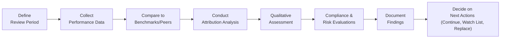

## Introduction and Key Objectives

Monitoring and reviewing an investment manager’s performance over time is a critical—and sometimes tricky—component of portfolio management. You know, I once visited a manager’s office expecting a quiet, subdued atmosphere. Instead, I stepped into a bustling open-plan space with market news blaring, phone calls flying, and analysts scurrying between desks. It felt hectic, but as it turned out, that fast-paced environment fit perfectly with the manager’s short-term, high-frequency trading strategy. Through that experience, I learned that on-site visits can reveal a lot more about a manager’s style and culture than just reading a quarterly report.

In this section, we bring together the quantitative and qualitative tools you need to assess a manager’s ongoing performance, risk management, and operational integrity. By the end, you should be able to conduct periodic reviews, spot early warning signs, and make informed decisions about whether to keep, watch-list, or terminate a manager relationship.

## Defining the Review Framework

Effective monitoring starts with a clear framework—sort of like a blueprint for evaluating performance. The framework typically includes these components:

• Scope and Frequency of Reviews  
• Benchmark Comparisons and Peer Groups  
• Attribution Analysis  
• Qualitative Monitoring (Team, Organization, and Strategy)  
• Compliance Checks and Operational Integrity  
• Risk Controls  
• Reporting Standards (e.g., GIPS compliance)  
• Predefined Trigger Events (e.g., style drift, manager turnover)

You might set the schedule as quarterly or semiannual for shorter-term visibility and then do a more comprehensive annual review, perhaps with an on-site visit and a thorough deep dive into both performance metrics and operational elements.

## Regular Performance Reviews

Some organizations conduct formal performance reviews every quarter; others every six months. Honestly, deciding on a review frequency is a balancing act: you want enough data to smooth out random blips, but you don’t want to discover major underperformance too late. 

During these reviews, you’ll examine several metrics:

• Total Returns: Evaluate absolute and relative performance versus a baseline (benchmark or peer group).  
• Risk-Adjusted Returns: Metrics such as the Sharpe ratio, Sortino ratio, or appraisal ratio (see also Section 1.11 on advanced risk-adjusted measures) can paint a more complete picture of how a manager performed given the risks they took.  
• Style Consistency: If the manager is supposed to be a growth equity manager, are they actually overweighting growth stocks or are they sneaking into other styles? Deviations may be unintentional or strategic, but they require explanation.  
• Compliance with Guidelines: This includes following agreed-upon sector and asset class constraints, leverage and derivatives usage, and diversification parameters.

One small tip from personal experience: if something looks off—like a sudden style tilt or a suspiciously large deviation from the benchmark—take a deeper look right away. Sometimes a manager will adjust positions to capture an opportunity, which might be justified, but it can indicate style drift if done habitually.

## Comparing Against Benchmarks and Peer Groups

Benchmarks are the yardstick for performance. Suppose a manager says they aim to outperform the S&P 500 with a preference for large-cap growth stocks. Did they beat that index over the review period? How about over the past three years? Benchmark comparisons should also incorporate risk metrics, not just raw returns. And don’t forget about factor exposures—maybe the manager outperformed by taking on extra market risk or by concentrating in a “hot” sector.

Meanwhile, peer group comparisons can help you see if underperformance is a general result of a tough market environment (everyone else is struggling, too) or whether the manager is lagging behind similar strategies.

## Performance Attribution Analysis

Performance attribution (also touched upon in Chapter 1) is crucial for understanding where outperformance or underperformance comes from:

• Asset Allocation vs. Security Selection. Maybe the manager did a brilliant job picking stocks, but the asset allocation call (overweight or underweight a particular region) dragged down performance.  
• Sector, Factor, or Style Exposures. Growth, value, momentum, or sector preferences might help or hurt returns in different market conditions.  
• Market Timing. At times, managers tilt their portfolios toward or away from certain sectors or markets, hoping to catch the wave. Did it work?

You might run returns-based attribution or transactions-based attribution (see Section 1.4 for more details). Anyway, if the manager consistently adds alpha through skillful stock selection, that’s generally a good sign. But if the manager’s success is heavily reliant on a single factor that’s currently in favor (like small-cap momentum), you might question the sustainability of that strategy once the cycle changes.

## Watch Lists and Trigger Events

If a manager is significantly underperforming or if you suspect deeper organizational issues, it often makes sense to place them on a watch list. You define specific improvement criteria (could be beating the benchmark by a certain margin or reestablishing style consistency), along with a timeframe for reevaluation. If they fail to meet goals, the next step might be termination. A manager watch list is effectively your version of a “yellow card”—they’re on notice but not yet ejected from the game.

“Trigger events” are circumstances that prompt immediate or more frequent reviews—even if you’re not scheduled for one. Examples include:

• Loss of Key Portfolio Manager or Chief Investment Officer  
• Style Drift (in conflict with guidelines)  
• Prolonged Underperformance (three to four consecutive quarters)  
• Major Compliance Breach or Regulatory Issue  
• Significant Changes in Ownership or Corporate Structure

It might help to define these events in your investment policy statement so there’s no ambiguity when decisions must be made quickly.

## Qualitative Monitoring

Numbers are only part of the equation. Qualitative monitoring looks at the human and organizational side:

• Changes in Investment Team: Has the lead portfolio manager joined a competitor? Did a bunch of analysts leave? That might hamper performance.  
• Strategy Shifts: Maybe the firm historically focused on deep value; suddenly, they pivot to a more growth-oriented approach.  
• Cultural Factors: A stable workplace with strong collaboration and incentive alignment often correlates with consistent performance. A high turnover or tense environment might spell trouble.  
• Ownership and Leadership: If the firm sells a big stake to a parent company with different objectives, you might see shifts in risk tolerance or other strategic changes.

Personally, I like to see how the team interacts in real life. You can read all the glossy marketing materials you want, but a face-to-face conversation reveals more about who really drives investment decisions and how cohesive or fractious the culture is.

## Operational and Compliance Checks

An operational meltdown can ruin a manager’s track record, even if their investment insights are top-notch. Regular checks include:

• Compliance with Regulations: The manager should remain in good standing with relevant bodies like the SEC (in the United States) or other regulators globally.  
• Contractual Adherence: Are they staying within the various mandates spelled out in your investment management agreement?  
• Counterparty Risks: Understand how they manage relationships with brokers, custodians, and other third parties.  
• Internal Controls: Evaluate whether they have robust internal audit systems, separation of duties, and adequate risk management frameworks.

If you’re following Global Investment Performance Standards (GIPS; see Chapter 3) for reporting, you’ll want to ensure your manager’s processes align with or exceed those requirements. That helps keep everyone operating under best-practice guidelines.

## Periodic On-Site Visits

Sometimes, there’s no substitute for physically seeing a manager’s operations. On-site visits let you:

• Chat with Analysts, Traders, and Risk Personnel: Verify that the investment process you see in marketing materials actually happens day-to-day.  
• Examine IT Infrastructure: Confirm that cybersecurity measures are adequate and that data backups are done rigorously.  
• Observe Team Dynamics: Are employees empowered to raise concerns? Is there a strong compliance culture?

I remember visiting a manager who proudly showed me a robust compliance process, only for the compliance officer to quietly mention in private that real-time checks were rarely enforced. That tidbit, which never would have come through in a phone conversation, helped me realize the firm’s process was more “theoretical” than practical.

## Reporting Standards: GIPS Compliance

As a reminder from Chapter 3, the Global Investment Performance Standards set forth principles for calculating and presenting investment performance. When you’re reviewing a manager, confirming that they adhere to GIPS (or an equivalent framework) can add confidence in their performance numbers. GIPS compliance ensures consistency, transparency, and comparability. But it’s also essential to confirm the scope of their compliance (e.g., which composites are included, how track records are linked, etc.). Sometimes a manager might claim partial compliance or highlight only certain composites, which might not reflect their entire history or product lineup.

## Evaluating Risk Controls

No discussion of manager monitoring would be complete without addressing risk. Typically, you’ll want evidence that the manager is applying rigorous and transparent risk management tools:

• VaR, Stress Testing, or Scenario Analysis  
• Position Limits, Concentration Limits, Sector Constraints  
• Monitoring of Derivatives Usage

Even if the manager is delivering strong returns, it’s wise to ask if they’re taking on more risk than your guidelines allow. If the manager claims to have a certain risk budget or limit, check that it’s actually enforced. Are they measuring downside risk adequately? Are they prepared for liquidity crunches?

## Documenting Findings and Actions

Here’s a simplified flowchart to help visualize the review and documentation process:

Nobody likes negative surprises, so having a record of all your findings helps you or your investment committee make consistent, well-informed decisions. This record also becomes your trail of evidence if questions arise later about why you kept a struggling manager or fired a manager who turned out to rebound shortly thereafter.

## Best Practices and Exam Tips

• Consistency Is Key: Don’t shift your performance review standards just because a manager has a streak of bad or good results.  
• Look for Organizational Red Flags: Team departures, compliance issues, or changes in ownership structure often signal deeper problems.  
• Document Everything: You never want to rely on memory for major decisions.  
• GIPS Compliance: Make sure to confirm which parts of the manager’s performance claims actually follow GIPS.  
• Factor in Market Context: Underperformance during certain market cycles doesn’t automatically translate to manager failure.  
• Trigger Events: Keep an eye on custom triggers you define—design them so they allow quick action when necessary.  
• Style Consistency: Confirm that the manager’s style is aligned with your portfolio’s broader strategy (see Section 2.14 on style drift for deeper insights).

On the CFA Level III exam, these themes often appear in scenario-based questions. An item set might give you a quarterly performance report, mention team changes, or highlight style drift to see if you can identify the right course of action. The constructed-response portion might ask how you’d write a policy statement or propose a watch-list process for underperforming managers. Be sure to connect quantitative measures (like risk-adjusted returns, attribution findings) with qualitative assessment (culture, compliance) when providing solutions.

## References for Further Study

• Global Investment Performance Standards (GIPS) Handbook, CFA Institute  
• “Mastering Attribution in Asset Management,” Risk.net forum discussion  

These publications offer in-depth guidance on auditing performance calculations and dissecting returns. They’re great resources to refine your due diligence and monitoring approach, especially if you’re planning to incorporate GIPS principles into your in-house policies or are seeking more advanced attribution methods.

--------------------------------------------------------------------------------

## Manager Performance Monitoring Quiz



### In a regular performance review, which of the following would typically be analyzed to gauge a manager’s effectiveness?

- [ ] The manager’s personal expense ratio
- [x] Risk-adjusted returns such as the Sharpe ratio or Sortino ratio
- [ ] Only the absolute returns in a good market
- [ ] The correlation of the manager’s returns with an unrelated benchmark

> **Explanation:** When reviewing manager performance, risk-adjusted metrics like the Sharpe or Sortino ratio provide insight into how effectively the manager generates returns relative to the risk taken.

### If a manager diverges from an agreed-upon growth strategy and invests heavily in value stocks, this change is referred to as:

- [ ] Style confirmation
- [x] Style drift
- [ ] Factor alignment
- [ ] Active management

> **Explanation:** Style drift occurs when a manager deviates from their stated investment style or mandate.

### Which of the following is considered a “trigger event” that may prompt immediate reassessment of a manager?

- [ ] Consistent outperformance of the benchmark
- [x] Departure of the fund's key portfolio manager
- [ ] Strong track record in peer-group comparisons
- [ ] Properly documented compliance policies

> **Explanation:** Trigger events include scenarios such as the sudden departure of key personnel, style drift, major compliance breaches, or significant underperformance.

### A watch list for underperforming managers is used primarily to:

- [x] Signal the need for closer monitoring and improvement
- [ ] Provide direct daily oversight of manager trade decisions
- [ ] Automatically replace the manager if the underperformance continues
- [ ] Publicize the manager’s shortcomings

> **Explanation:** The watch list is a formal indication that the manager’s performance or other issues warrant heightened scrutiny and a specified timeframe for improvement.

### In performance attribution, determining whether returns were driven by stock picking or sector allocation is known as:

- [x] Distinguishing between security selection and asset allocation effects
- [ ] A purely qualitative assessment
- [ ] Calculating net versus gross returns
- [ ] Covariance analysis

> **Explanation:** Performance attribution breaks down returns into components attributable to asset allocation, sector or factor biases, and individual security selection.

### When assessing manager compliance with best practices in performance reporting, which standard is typically referenced?

- [x] GIPS (Global Investment Performance Standards)
- [ ] FDIC Insurance requirements
- [ ] Basel III framework
- [ ] Bank Secrecy Act

> **Explanation:** GIPS is the global standard for calculating and presenting investment performance. Compliance indicates adherence to rigorous transparency and consistency requirements.

### Qualitative monitoring includes evaluating all of the following except:

- [x] Last quarter’s alpha calculation in isolation
- [ ] Changes in the manager’s investment team
- [ ] The firm’s organizational structure
- [ ] The manager’s research process

> **Explanation:** Qualitative monitoring focuses on factors like team composition, ownership structure, compliance culture, and strategic direction. Purely quantitative data (like alpha in isolation) is part of quantitative monitoring.

### During an on-site visit, an important objective would be to:

- [x] Observe the actual workflow and team interactions
- [ ] Ensure immediate rebalancing of the manager’s portfolio
- [ ] Prepare the manager for regulatory interviews
- [ ] Micro-manage the trading documentation

> **Explanation:** On-site visits reveal how processes actually function day-to-day and help you assess the investment team’s dynamics, risk culture, and adherence to stated procedures.

### Which best describes the importance of documenting findings from manager reviews?

- [x] They provide a record to support decisions (retain, watch list, replace)
- [ ] They are only good for marketing to prospective clients
- [ ] They are mainly for passing audits without real investment relevance
- [ ] They ensure the manager always trades at the best execution price

> **Explanation:** Documenting your review findings creates a clear audit trail. It helps justify decisions in the future and fosters a more disciplined governance process.

### True or False?  
If a manager adheres to GIPS, you no longer need to review their operations and compliance processes.

- [x] True
- [ ] False

> **Explanation:** This is a trick question. The best answer is “False.” GIPS compliance is helpful, but operational or compliance checks go beyond performance reporting. You still need to ensure the manager adheres to all regulatory, contractual, and ethical standards.


