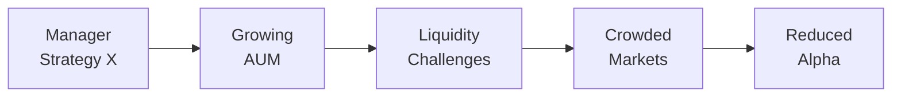

## Introduction

Let’s be honest, there’s something both exciting and a little unsettling about watching your favorite investment fund grow from a scrappy underdog to a massive asset-gathering juggernaut. On one hand, you’re thinking, “Fantastic—everyone is recognizing the talent of this manager!” But on the other hand, you might notice that the manager’s previously nimble trading style starts slowing down. In some cases, performance gets, well, a bit less stellar. If you’ve ever found yourself in this situation, you’re not alone. This subtle performance shift often arises from what we call “capacity constraints.”

Capacity constraints occur when an investment strategy can no longer be scaled effectively without negatively impacting returns. A manager might close the fund to new investors or even alter the strategy to accommodate more AUM (assets under management). This section explores the various ways capacity constraints affect investment managers, providing insights into best practices for both managers and investors.

## Defining Capacity Constraints

Put simply, capacity constraints represent the maximum assets that a particular strategy can handle before performance starts to decline. These constraints are more pronounced with niche strategies—like small-cap equity or frontier markets—where liquidity is thin and trade sizes can move prices quickly. But even large-cap managers can face issues if trading volumes become substantial enough to trigger market impact costs.

When capacity constraints are reached, managers often feel pressure to loosen their stock-selection criteria or expand into new market segments. All it takes is one or two misaligned trades at scale to squeeze liquidity and hamper alpha generation. This risk is heightened if the manager’s style is ill-suited for large asset footprints—think of a high-turnover strategy that relies on quickly entering and exiting positions.

## Why Capacity Constraints Matter

1. Manager Skill vs. Diminishing Returns  
   Skilled managers typically identify market inefficiencies or have unique insights. However, as assets grow, these inefficiencies can be arbitraged away more quickly, or the number of truly compelling opportunities declines. Eventually, the manager might be forced to take on mediocre trades just to deploy excess cash—a surefire way to dilute returns.

2. Liquidity Challenges  
   Larger trades can create slippage and market impact costs. Liquidity constraints may also affect the manager’s ability to exit losing positions swiftly. In small or niche markets, a single large block order can significantly move the price, turning a once-profitable trade into a break-even or worse.

3. Overcrowding and Trade Overlap  
   If multiple managers chase the same hot idea—say, a small corner of the biotech sector—crowding can push up prices well before all players establish desired positions. And with large AUM, you’re more likely to crowd yourself. Eventually, performance can suffer as trades get priced above their fair value.

4. Style Drift  
   To combat capacity limits, some managers pivot to broader strategies with more liquid opportunities—maybe shifting from a small-cap focus to mid- or even large-cap. Though this might keep them “in the game,” it also introduces style drift. Investors who signed up for a high-octane small-cap approach may discover a slower, more mainstream equity profile over time.

## The Impacts of Growing AUM

Growing assets pose a fundamental question: Does bigger automatically mean better in asset management? Not always. Sure, the manager might reap economies of scale in back-office functions or research coverage. But diseconomies of scale arise when that extra size works against performance:

• Market impact: Large orders can move security prices significantly.  
• Execution delays: Filling large orders might take multiple trading sessions, losing the advantage of timely insights.  
• Opportunity set constraints: Overburdened by capital, the manager might need more opportunities than the market can offer feasibly.  

Below is a quick conceptual flow of how inflows can lead to capacity constraints and degraded returns:

In each arrow, you can imagine the friction building: from increased assets to liquidity pressure to trade crowding, eventually crippling performance.

## Common “Cap-Constrained” Strategies

While any strategy can succumb to capacity constraints, some are more vulnerable than others:

• Small-Cap or Micro-Cap Equity: These markets have limited trading volume, so large positions face higher market impact costs.  
• Niche Alternative Funds: Strategies like distressed debt, private credit, or certain hedge-fund approaches rely on specialized knowledge in less-liquid markets. A sudden surge in AUM can dry up opportunities.  
• Long/Short Equity with High Turnover: Momentum-based trades or short positions require quick, stealthy execution. Large positions might be front-run by others, or might simply move the market.  
• Event-Driven Funds: These funds often hinge on mergers, spin-offs, or other special corporate events—finite opportunities that can be crowded out if the fund size balloons.

## Mechanics of Market Impact Costs

Let’s get slightly technical for a moment. One reason capacity constraints pinch performance is market impact cost: the extra cost incurred because the act of executing a big trade changes the price. A simplified model could look like:


\text{Total Trade Cost} = \alpha + \beta \cdot \sqrt{V}


where:  
• \\( \alpha \\) = Fixed cost component (e.g., baseline commission).  
• \\( \beta \\) = Sensitivity factor capturing how the markets respond to order size.  
• \\( V \\) = Trade volume in shares (or dollars, depending on context).

As an investment manager’s order size grows, the variable component \\( \beta \cdot \sqrt{V} \\) can swell quickly, making trades far more expensive to execute and eroding alpha. While this formula is a simplistic representation, it illustrates the fact that trade costs rise disproportionately as volume increases.

## Evaluating a Manager’s Historical Capacity Management

When you’re selecting or reviewing a manager, it’s wise to ask: “How did you handle capacity constraints in the past?” You might look at:

• Track Record Under Increasing AUM: Has the manager navigated periods of inflows successfully without a dip in alpha?  
• Flexibility in Strategy: Did they broaden their mandate—e.g., from small-cap to mid-cap—to handle bigger asset bases?  
• Risk Overextension: Did they chase suboptimal trades or hold larger cash balances?  
• Communication: Did the manager keep investors informed about capacity estimates and set expectations about potential fund closures?

A manager who proactively closes a fund to new investors might actually be doing you a favor by preserving the strategy’s integrity. Indeed, many small-cap specialists implement “soft closes” once they reach a certain size, letting existing investors continue but prohibiting or limiting new flows.

## High-Turnover Strategies and Capacity Constraints

Some strategies lose their edge faster under capacity risk. High-turnover or momentum approaches require nimble trading. If an approach thrives on quickly flipping positions, the ability to move in and out without disclosing (intentionally or unintentionally) your trades to the market is vital. Once AUM grows, such managers might find it impossible to pivot quickly. Anyone who’s tried to drown a small glass of water with a massive firehose knows how it feels: too much flow for a tiny object.

## Transitioning Strategies During Growth

Occasionally, managers pivot from their original sweet spot to avoid losing alpha. For instance, a successful small-cap manager might find it tough to keep that small-cap focus when new inflows pile up. Maybe the manager transitions to mid-cap or invests in multiple international markets. This move can protect the manager’s short-term performance but changes the portfolio’s risk and return profile. Investors might complain about “style drift” if they notice the manager is no longer sticking to the original investment objective.

Below is a simplified illustration of how a manager might adjust as their AUM rises:

| Initial Focus  | Growth Phase                     | Potential New Directions                      |
|----------------|----------------------------------|----------------------------------------------|
| Small-Cap Core | AUM expands; execution gets tight| Increase mid-cap allocation, add new sectors  |
| Value Strategy | Inflows limit deep-value plays   | Broaden to broader market or growth segments |
| Sector-Focused | More money poured into a single niche | Expand coverage to adjacent sectors or geographies |
| Niche Alternative | Overcrowding in specialized assets | Launch separate vehicles or close existing fund |

While these expansions can be logical from the manager’s standpoint, it’s essential for investors to closely monitor any shift in risk profile and ensure it still aligns with their original allocation objectives.

## Investor Considerations

From an investor’s perspective, capacity risk is a big deal. Even a rock-star manager can see performance fade when the strategy is sized beyond its capacity sweet spot. Here are a few tips:

• Conduct In-Depth Due Diligence: During manager interviews, ask specific questions about capacity. Does the manager mention a target AUM limit? Have they refused capital in the past to avoid hurting returns?  
• Examine Manager Strategy and Turnover: High-turnover or momentum-based strategies degrade faster if the manager grows too large.  
• Check Historical Fund Flows: If the fund’s asset growth soared after a period of strong performance, be alert to the possibility that the strategy might already be approaching or even exceeding capacity.  
• Look for Soft Closes: A willingness to stop taking new money can be a sign of strong stewardship—managers are prioritizing client results over fee revenues.  
• Assess Potential Style Drift: If a manager is known for small-cap investing, verify that they haven’t crept into mid- or large-cap territory.  
• Revisit Allocations Periodically: After big inflows, double-check that overall capacity remains intact. You may need to resize or rebalance your investment if it’s pushing total AUM past the strategy’s limit.

In many investor-management relationships, transparency is king. If your manager is vague about capacity or reluctant to discuss it, that can be a red flag. Many top-tier managers include capacity commentary in their quarterly letters or pitchbooks and are more than willing to talk about their approach to risk sizing.

## Case Study: A Hypothetical Niche Fund

Imagine you discover a small-cap equity fund—let’s call it “SmallCap Advantage.” When its assets are under USD 500 million, performance is stellar. The manager invests in under-researched small-cap names, quickly adjusting positions when fundamentals shift. Thanks to nimble trading and deep industry knowledge, the manager outperforms the Russell 2000 by several percentage points over a few years.

Then, the fund gets recognized by prominent analysts. Suddenly, inflows flood in, pushing AUM to USD 2 billion. The manager struggles to maintain the same small-cap approach—just buying a 3% position in a single small-cap stock can now represent a multi-million-dollar trade, leading to meaningful market impact:

1. Their orders move prices immediately.  
2. Competition piles in, replicating trades.  
3. The manager extends holding periods to avoid repeated transaction costs.  
4. In time, the portfolio begins to resemble a mid-cap strategy and performance starts converging to a more benchmark-like return.

Investors who joined with the expectation of small-cap alpha might see diminishing outperformance—an example of how capacity constraints spoil the original magic. Given the performance erosion, some longtime investors might actually exit or reduce their stake, ironically easing capacity constraints for others.

## Best Practices and Risk Mitigation

• Limit the Allocation: If you believe in the manager but fear capacity constraints, you can limit your own exposure.  
• Diversify Across Managers: Employ multiple strategies, so no single strategy’s capacity constraints hamper the entire portfolio.  
• Set a Watch List: Continuously monitor a fund’s AUM levels, and pay attention to signals from the manager.  
• Encourage Transparency: Request direct communication about capacity. Good managers can estimate where they see diminishing returns set in.  
• Align Investment Horizon: If you can handle less liquidity or longer holding periods, a manager might adjust their approach to reduce turnover and mitigate some capacity-related friction.

## Exam Tips and Pitfalls

As you prepare for CFA Level III, keep capacity constraints in mind when evaluating hypothetical manager performance scenarios. Common exam pitfalls include:

• Overlooking Liquidity: In diagnosing underperformance, candidates often cite “bad manager skill” or “poor strategy.” Don’t forget the simpler explanation: the fund grew too big.  
• Ignoring Market Impact Costs: When analyzing performance attribution, be prepared to factor in higher transaction costs if the fund’s AUM spikes.  
• Missing Style Drift: A manager’s pivot to a broader universe can muddy performance attribution, so watch for style changes.  
• Misjudging Manager Skill: A manager might have skill, but that skill alone won’t prevent capacity constraints from hitting them eventually.  
• Not Updating Allocations: The exam might present a scenario where an investor should reconsider allocations based on capacity constraints after strong performance.  

When encountering essay or item-set questions, keep your eyes open for details about fund inflows, liquidity, or concentration in niche markets. You might be asked to evaluate whether the manager’s strategy is scalable. Or the prompt might hint that the manager is surpassing capacity when you see ballooning AUM coupled with rising transaction costs and narrower alpha. Show your mastery by linking these data points to capacity considerations and by suggesting how you, as the portfolio overseer, would address them.

## References

• “When Funds Get Too Big,” Morningstar Research Commentary.  
• “Economies of Scale or Diseconomies of Scale in Active Management?” Journal of Financial Economics.  

### Additional Resources
• CFA Institute Level III Curriculum, particularly sections on performance attribution and manager selection best practices.  
• Online advanced courses on manager due diligence, such as the Manager Selection modules offered by specialized training programs.  

--------------------------------------------------------------------------------

## Capacity Constraints and Manager Performance: Quiz



### When do capacity constraints typically begin to manifest in a small-cap equity strategy?

- [ ] Immediately upon receiving first investor inflow  
- [ ] After the fund meets its 5-year track record  
- [x] As the fund’s AUM grows to a point where trade sizes materially impact prices  
- [ ] Only when daily trading volume exceeds $1 million  

> **Explanation:** Capacity constraints often emerge once the strategy’s AUM causes individual trades to become so large that they move security prices. In small-cap strategies, this can happen relatively quickly compared to large-cap strategies.

### Which of the following is a common strategy managers use to preserve performance under capacity constraints?

- [ ] Taking on leverage in the strategy  
- [x] Closing the fund to new investors (soft close)  
- [ ] Eliminating all high-turnover positions  
- [ ] Shifting entirely from equities to bonds  

> **Explanation:** A “soft close” is a well-known way for managers to limit asset growth and maintain their investment approach without sacrificing quality or alpha.

### How does overcrowding in favored trades generally affect alpha?

- [ ] It usually boosts alpha due to higher liquidity.  
- [ ] It has no significant impact on alpha.  
- [x] It can erode alpha as more market participants chase the same opportunities.  
- [ ] It forces managers to increase turnover, boosting alpha in the short term.  

> **Explanation:** Overcrowding can drive up the price for the same securities, making them less attractive and reducing the excess return available.

### Which factor is most likely to cause a manager to drift from a small-cap focus to mid- or large-cap securities?

- [ ] Improved liquidity in large-cap stocks  
- [ ] Temporary compliance requirements  
- [ ] A desire to lower risk  
- [x] A surge in AUM that makes investing solely in small-caps impractical  

> **Explanation:** With more money to invest, the manager may struggle to buy smaller-cap stocks without driving up prices or affecting liquidity, prompting a shift to higher-cap stocks.

### Which cost generally rises disproportionately as the size of a single trade order grows?

- [x] Market impact cost  
- [ ] Management fee  
- [x] Bid–ask spread cost  
- [ ] Custodial fee  

> **Explanation:** Large orders can significantly move the market, increasing both market impact costs and, at times, the effective bid–ask spread.

### A manager receives substantial inflows after a period of strong performance. Which question should an investor ask to gauge capacity risk?

- [x] “How will you deploy new assets without diluting performance?”  
- [ ] “What is your favorite color?”  
- [ ] “Will you trade commodities to diversify away from equities?”  
- [ ] “Should we contract a new custodian?”  

> **Explanation:** When a manager experiences rapid AUM growth, it’s vital to assess how the manager intends to maintain performance standards given their increased capital.

### What might be a warning sign that a manager is approaching capacity limits too quickly?

- [ ] They maintain their portfolio composition each quarter  
- [x] Transaction costs and slippage are rising sharply  
- [x] Performance outperforms every quarter consistently  
- [ ] The fund invests only in highly liquid, large-cap stocks  

> **Explanation:** Rising transaction costs and slippage can be a clear indicator that the fund’s trades move the market significantly—common evidence of capacity constraints.

### Individuals investing in multiple alternative strategies to avoid capacity constraints are most likely utilizing:

- [x] Diversification across managers and strategies  
- [ ] Leverage within a single manager’s fund  
- [ ] Exchange-traded funds covering the same strategy  
- [ ] A single manager with numerous sub-advisors  

> **Explanation:** Spreading assets among different managers and strategies helps mitigate the negative effects of capacity issues that might occur in any single strategy.

### How might style drift manifest when a high-turnover, small-cap manager faces large inflows?

- [ ] They continue business as usual and maintain all positions unchanged  
- [ ] They focus more on micro-cap stocks  
- [x] They expand their investment universe to include larger-cap equities  
- [ ] They raise fees to deter further inflows  

> **Explanation:** One common adaptation to capacity constraints is shifting away from the original small-cap focus toward mid- or large-cap stocks, which is effectively style drift.

### True or False: A manager who closes a fund to new inflows is likely doing so primarily to grow fee revenues.

- [x] True  
- [ ] False  

> **Explanation:** Actually, this is a trick question. Soft closes or entire fund closures are often undertaken to protect performance, not to grow fee revenues. Confusion arises because many think managers always chase more assets for fees, but a reputable one might halt inflows to maintain strategy integrity.


