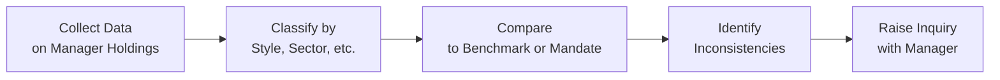
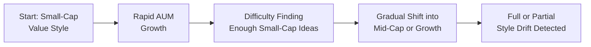

## Introduction

Style drift happens when an investment manager starts to deviate from their originally stated style or mandate—like, say, that large-cap growth manager who begins making meaningful allocations to small-cap value, or the opposite scenario of a small-cap manager shifting into mid-caps. Sometimes this drift occurs gradually over months or years; other times, it can happen in just a couple of quarters due to rapid market swings (or, in some cases, plain old chasing performance).

Whatever the cause, style drift can be a serious problem if you’re sitting on the asset owner side of the table trying to maintain a carefully established asset allocation policy. A drift away from the manager’s stated style can mean you’re no longer getting what you paid for—and that can wreak havoc on your portfolio’s overall risk-and-return profile. In this section, we’ll discuss the subtle (and sometimes not so subtle) ways style drift can arise, how to detect it, what questions to ask when it rears its head, and how to keep your portfolio aligned with the manager’s current style—or figure out when it’s time to say goodbye.

## What Is Manager Style Drift?

Manager style drift refers to the unplanned or unauthorized shift in investment style. If a manager markets themselves as a “high-conviction, small-cap value investor” and the portfolio begins to hold a growing share of large-cap technology stocks, well, that’s style drift. Of course, sometimes managers do communicate a broadening of their focus—but if they’re simply pivoting on the sly because they find more “exciting” trades somewhere else, that can pose a red flag.

Managers might argue that they’re simply “opportunistic” or “flexible.” In some investment mandates—think absolute return or global macro—being style-agnostic is part of the strategy. They’re not anchored to a single style or benchmark. But the difference between “flexible” and “inadvertent drift” is usually all about communication and prior approval from the client or relevant investment committee.

## Potential Causes of Style Drift

• Market Dynamics: A good chunk of style drift can emerge simply because the market environment changes. Let’s say you have a small-cap manager who invests in companies that grow so much they graduate into mid-cap territory (kind of a good problem to have, right?). Their style might appear to drift simply because the portfolio’s positions have appreciated.  
• Chasing Performance: Occasionally, managers can be tempted to stray from their core style if they see another asset class or style performing better. If technology mega-caps are roaring ahead, a traditionally value-focused manager might quietly buy into them.  
• Large Inflows: Some managers get so big and so popular that they effectively run out of opportunities in their original niche. An influx of capital might push them into categories they normally wouldn’t touch—plus, smaller companies can’t absorb massive investments without liquidity concerns.  
• Evolving Philosophy: Sometimes, a manager’s style shift is genuine and intentional. Maybe they’ve studied the market and concluded that a factor-driven approach is the new frontier for alpha generation. If they’ve communicated this shift properly and updated their mandate documents, it may be a strategic pivot rather than unwelcome drift.  
• Capacity Constraints: A manager with a capacity of, say, $500 million for a micro-cap strategy might find themselves struggling to deploy capital in their usual style after receiving $2 billion in new inflows. So they start looking elsewhere, thereby deviating from the initial thesis.

## Why Style Drift Matters for Portfolio Alignment

From the investor’s standpoint—especially if you’re an asset owner or are overseeing a multi-manager structure—style drift can create big issues for portfolio construction. If you try to maintain a certain asset allocation or risk exposure, but your small-cap manager is suddenly heavy in mid-caps, you might be overweighting certain sectors or stock categories. This could leave your portfolio inadvertently taking on more risk than expected or reduce the diversification benefit you bargained for.

Over time, style drift can also alter correlations among managers. For instance, if multiple managers begin shifting toward large growth tech stocks, you could see your carefully constructed “style diversification” vanish in a wave of overlapping bets.

### Impact on Risk Budgeting

Those of you studying risk budgeting methods (see “Risk Budgeting” in Chapter 1.1 Overview of the Evaluation Process) know that style drift complicates the process. Every manager is typically allocated a piece of your overall risk budget: maybe 10% of total active risk goes to a small-cap specialist, 15% to a global equity manager, etc. If the small-cap manager is no longer small-cap, your risk exposures have effectively drifted out of the original budget. That can throw off everything from your VaR calculations to your macro factor exposures.

### Performance Attribution Messiness

Style drift also shows up in performance attribution. If your manager pivoted out of their original style, comparing them to the original benchmark might start to look unflattering or downright misleading. For instance, if a manager is drifting from small-cap value into mid-cap growth, their performance may differ drastically from what a pure small-cap value benchmark would suggest. Over time, seeing the heat map of factor exposures (or sector exposures) can be like reading a confusing story with plot twists you never anticipated.  

## Distinguishing Style Flexibility from True Drift

Some strategies are absolutely designed to be style-blind or to pivot based on market conditions. In absolute return or some hedge fund strategies, for example, managers have wide freedom to shift across style boundaries. That’s not considered “drift” in the negative sense; it’s more “flexibility by design.” The real question is whether the manager is staying within the promised style constraints as laid out in the investment guidelines.

• If the mandate states: “We can invest across all market caps in pursuit of absolute returns,” then pivoting to a new cap size or sector might not be drift—it might just be business as usual.  
• However, if the manager claims to track the Russell 2000 Value index as a benchmark and invests more than half of their assets in large-cap growth over the course of a year, that’s an entirely different story.  

So if you spot something unusual, get in touch with the manager and ask: “Is this a strategic decision reflecting a flexible approach, or have you changed your style altogether?” That discussion can clarify whether the shift is within the spirit of the original mandate.

## Methods to Detect and Analyze Style Drift

### Returns-Based Style Analysis

Returns-based style analysis involves examining the historical returns of the manager and deducing the style exposures from a set of style indices (for example, small-cap, large-cap, value, growth). If you’re noticing that the manager’s returns correlate more with large growth stocks than with the small value index they used to follow, that can indicate style drift. It’s a bit of a top-down approach, analyzing returns to back into style exposures.

This approach is straightforward since all you need are return series for the manager and for a set of style benchmarks. However, it can lag real-time shifts because you’re dealing with realized returns. You might detect a drift only after it’s been happening for a while.

### Holdings-Based Style Analysis

Holdings-based style analysis is more granular. You literally look at the portfolio holdings—maybe once a quarter, or in some cases, monthly—and classify each position by style, market cap, sector, or factor exposures. Then you compare the aggregated exposures to the manager’s stated style. If a value manager is showing a greater proportion of high price-to-earnings (P/E) stocks that historically reflect “growth,” you have reason to suspect style drift.

This approach can be more real-time, as you can see changes in the portfolio as they happen. The downside is it can be data-intensive and sometimes partial if the manager keeps some holdings private or if you have incomplete transparency in a commingled structure. But it’s typically the more accurate approach if you want a direct handle on drift.

Below is a simple flowchart that illustrates a common process for detecting style drift:

Whether you use returns-based or holdings-based analysis (or both), the key is to keep track of the manager’s exposures across time. A consistent creeping shift over several quarters might be a bigger red flag than a small, tactical move in one quarter.

## Unplanned vs. Intentional Style Drift

### Short-Term Opportunism

Picture a manager who sees a “can’t miss” opportunity in a particular sector or style outside of their mandate—maybe a battered growth sector that suddenly looks primed for a rebound. They might temporarily tilt the portfolio in that direction. If they communicate this clearly and you’ve signed off on a degree of tactical freedom, it might be fine.

### Systemic Shift in Philosophy

In some cases, the manager’s entire investment philosophy evolves. I remember a conversation years ago with a manager who started out as a “deep value, small-cap” guru. Over time, he found great success in small technology growth companies that thrived on new software-as-a-service business models. Suddenly, over half the portfolio wasn’t “deep value” but rather “tech-themed growth.” The manager admitted that the old deep-value approach “just wasn’t working” in the evolving economy. While that might be acceptable if properly communicated, you can see how harmful it could be if the shift happened silently.

### Response to Capacity Constraints

When a manager hits capacity constraints in their originally targeted niche, they may be forced to expand into related areas. For instance, a manager specialized in small-cap financials might pivot to mid-cap or large-cap financials once the small-cap universe is fully tapped. This can be logical from a business perspective, but a big headache if you as the investor are specifically looking for small-cap exposures.

The next diagram captures a simplified timeline of how style drift may evolve:

## Implications for Portfolio Construction

### Overlapping Risk Exposures

If multiple managers in your roster drift toward the same style—say, large-cap growth—it can inadvertently spike the overall correlation and reduce the portfolio’s expected diversification. That might lead to bigger drawdowns if that segment of the market corrects severely.

### Performance Surprises

For those relying on manager style consistency to fill certain “slots” in the overall allocation, style drift might produce unexpected under- or outperformance. An investor who believed they had a “balanced” approach might face a portfolio that’s effectively overweight in one style, especially if the drift goes undetected for too long.

### Benchmark Inaccuracies

You might measure the manager’s performance against an irrelevant benchmark once they have drifted. That can lead to flawed conclusions about manager skill. Maybe they look like they’re outperforming the small-cap benchmark but are really just riding the large-cap wave.  

## Communication and Oversight

Regular communication is vital. You should speak with the manager at least quarterly—sometimes more often if you suspect or detect style drift. You don’t want to be left asking, “Why on earth is this portfolio suddenly full of mega-cap AI names?” It’s often best practice to have ongoing checks and procedures:

• Quarterly or monthly holdings reports  
• Updates on sector or style exposures  
• Performance commentary that explains any big style shifts  
• Clear plan for how capacity or inflows will be handled  

If you have a formal Investment Policy Statement (IPS) or manager agreement, it should detail allowable style ranges and conditions under which the manager may deviate.

## When to Keep, Replace, or Put the Manager on Watch

If style drift is discovered, the next step is to figure out if it’s beneficial, neutral, or detrimental to your portfolio. Sometimes short-term drift leads to strong returns with minimal extra risk. Other times, it’s the first sign of bigger issues.

• Evaluate New Style Alignment: If the manager’s new style suddenly overlaps with another manager, maybe you’re paying two managers for the same exposure. That’s not necessarily a wise use of fees.  
• Determine Mandate Breach: If the manager’s drift is a clear violation of the mandated constraints, that might be grounds for terminating the relationship.  
• Check Communication Quality: Was the manager upfront with it, or did they try to hide it? An undisclosed shift can undermine trust.  
• Consider the Bigger Picture: Will the manager deliver new diversification benefits or actually hamper your risk/return profile?

If you can live with the drifted style and even see an advantage, you might place them on watch and clarify the changed constraints. If it’s not aligned with your strategic aims, though, it might be time for replacement. For more on transitioning managers, see “Transition Management and Manager Replacement” (Section 2.13).

## Practical Examples and Case Study

Let’s consider an example:

• A small university endowment invests in a large-cap value fund manager (Manager A), along with a separate micro-cap manager (Manager B). Over time, Manager B’s best micro-cap picks grow into the mid-cap realm, and the manager decides to keep these positions, shifting the portfolio’s weighted average market cap upward.  
• The endowment staff notices, through quarterly holdings-based style analysis, that Manager B’s exposure to micro-cap now stands at only 20%, down from 60% two years ago. A conversation ensues, revealing that Manager B has built these positions for strategic reasons and can’t cycle out because of liquidity constraints.  
• The endowment staff also notices that Manager B’s correlation with Manager A has been creeping up because the largest holdings are now mid-cap, some of which can overlap with the bigger stocks in Manager A’s large-cap portfolio.  
• With that knowledge, the staff realizes they’re no longer getting the micro-cap exposure they sought, so the question becomes: do they let Manager B continue managing these grown-out micro-cap names (which might still have upside), or do they ask the manager to exit them in favor of new micro-cap opportunities? Or do they rotate to a new micro-cap specialist entirely?

That’s the sort of real-world scenario that style drift can stimulate. Often, the decision comes down to the endowment’s long-term objectives, the manager’s successful track record, and whether there’s a fundamental investment reason for the shift.

## Style Drift vs. Style Evolution: A Gray Area

I once heard an investment manager say, “Style is like personal taste in food—you can adapt it as times change, but you can’t claim to be vegan if you’re going to eat steak every Friday night.” It’s only half-joking, but it clarifies the point: if you’re proclaiming a certain style yet regularly deviate, are you truly following that style?

Managers might argue they’re “evolving” to suit new markets. That’s fine, as long as that evolution is transparent and authorized. Unannounced or contradictory portfolio changes, though, can break the manager-investor trust.

## Best Practices for Avoiding Unwanted Style Drift

• Clarify the Manager Mandate: Make sure the manager agreement or IPS outlines permissible ranges for style exposures, sector weights, or factor tilts.  
• Request Periodic Holdings Disclosure: Even if it’s not full transparency, some form of holdings-based or at least exposure-based report is crucial.  
• Conduct Regular Performance Attribution: Look at the factors behind returns to see if they align with the stated style.  
• Engage in Ongoing Dialogue: Style drift can often be nipped in the bud with prompt conversation.  
• Set a Watchlist Policy: If you suspect a style drift that you’re uncomfortable with, put the manager on a watchlist and define what changes must be made to maintain the relationship.  
• Rebalance or Reallocate: If a drift is unintentional or undesired (and possibly detrimental), don’t hesitate to cut or terminate.

## Exam Tips: What to Expect

• Scenario-Based Questions: You’ll likely see exam scenarios describing a manager who was hired to fill a certain style box but drifts. The question might be whether to keep them, put them on watch, or replace them.  
• Attribution Analysis: You might see a question about analyzing the manager’s performance relative to a style benchmark that’s no longer appropriate. Understanding how to check style drift using returns-based vs. holdings-based analysis is critical.  
• Risk Implications: Expect to address how style drift affects the portfolio’s overall risk—especially if the drift causes style concentration.  
• Communication Standards: GIPS (mentioned in Chapter 3) addresses performance presentation and disclosure. While style drift isn’t the main GIPS topic, there’s a strong emphasis on consistent, accurate presentations. Style drift can raise issues about composites, for instance, if the manager no longer fits the composite definition.

## References and Further Reading

• “Monitoring for Style Consistency,” GARP (Global Association of Risk Professionals).  
• “Style Drift: Causes and Consequences,” Journal of Financial Planning.  
• CFA Institute, Official Curriculum for CFA Level III on Manager Selection and Performance Evaluation.  

Now, let’s wrap up with a brief Q&A to test your grasp of style drift and its ramifications.

## Test Your Knowledge: Manager Style Drift and Portfolio Alignment



### Which of the following best describes manager style drift?

- [ ] A manager intentionally broadening their investment universe after client approval.
- [x] A manager’s shifting exposures away from their stated style without explicit client knowledge or mandate changes.
- [ ] A manager sticking strictly to their original style guidelines.
- [ ] A manager adjusting benchmarks regularly to match market conditions.

> **Explanation:** Style drift specifically refers to changes to the manager’s styled approach that occur without clear communication or alignment with the mandate.

### Which factor is most likely to cause style drift?

- [ ] Adoption of updated GIPS standards.
- [ ] A manager meeting liquidity requirements.
- [x] Large asset inflows that push the manager to invest in off-style securities.
- [ ] Exiting a few underperforming positions within the mandate.

> **Explanation:** Large inflows can force a manager to look outside their typical niche, thus causing them to deviate from the original style.

### What is the main disadvantage of returns-based style analysis for detecting style drift?

- [x] It can lag behind real-time portfolio changes because it uses historical returns. 
- [ ] It is overly reliant on current holdings data.
- [ ] It cannot detect style drift at all.
- [ ] It only works in fixed-income markets.

> **Explanation:** Returns-based style analysis is backward-looking, so style shifts may only become evident after they have already occurred.

### A manager was hired to manage a small-cap value product but has quietly shifted over 30% of the portfolio into mid-cap growth. Which best practice would be most helpful to detect this early?

- [ ] Immediately switching to a new manager.
- [ ] Evaluating alpha relative to the small-cap value benchmark alone.
- [ ] Doing nothing, as it might be a short-term move.
- [x] Reviewing holdings data periodically to confirm alignment with the stated mandate.

> **Explanation:** Holdings-based analysis is an effective way to spot a sizeable shift in portfolio exposures, especially if you need to identify drifting areas quickly.

### How does style drift typically affect overall portfolio risk management?

- [x] It can cause unintended overlaps or factor exposures, throwing off original risk budgeting.
- [ ] It always reduces portfolio volatility through diversification.
- [x] It guarantees outperformance for the manager.
- [ ] It has no effect on portfolio construction when multiple managers are involved.

> **Explanation:** Style drift can cause unintended exposures and reduce diversification. It certainly doesn’t guarantee better performance.

### If a manager’s style drift is caused by evolving market conditions and is fully communicated and approved by the investor, which statement is most accurate?

- [x] The drift may be better characterized as “style flexibility” if it’s within the updated guidelines.
- [ ] It’s still unlawful style drift, leading to forced termination.
- [ ] It automatically requires the manager to revert to the original investment style.
- [ ] The GIPS standards consider this a violation of composite definition.

> **Explanation:** If the manager communicates the shift and the investor approves, it might not be “drift” in the negative sense. Instead, it’s an adaptation or flexible approach.

### What is a typical first step if you find that a manager’s style drift is unintentional and affects your portfolio negatively?

- [ ] Issuing a lawsuit.
- [x] Holding a meeting with the manager to discuss the cause and potential solution.
- [x] Increasing the manager’s allocation in hopes of short-term gains.
- [ ] Immediately terminating the manager without notice.

> **Explanation:** A proper approach is to open dialogue first, clarify what caused the drift, and decide if you can rectify or accommodate the new style.

### Manager style drift can reduce the effectiveness of diversification because:

- [x] Multiple managers might end up holding similar style exposures.
- [ ] It makes it easier to hedge style exposures at the aggregate portfolio level.
- [ ] It creates random correlations that improve alpha.
- [ ] It always leads managers to become more conservative.

> **Explanation:** When managers drift into the same style or sector, you lose the differentiation that was planned in your multi-manager setup.

### In capacity-constrained strategies, style drift may emerge because:

- [x] The manager cannot find enough opportunities in the original style with large new inflows.
- [ ] The manager is compelled by regulation to shift into different assets.
- [ ] Strategies with capacity constraints never experience style drift.
- [ ] GIPS verification dictates a flexible style approach.

> **Explanation:** Large inflows can exceed the capacity of a niche strategy, prompting the manager to expand into areas that might contradict the original mandate.

### True or False: Style drift is never acceptable if it leads to improved returns.

- [x] True
- [ ] False

> **Explanation:** Even if returns improve, an uncommunicated deviation altering the investment style is still style drift, calling into question mandate alignment and potential mismatch with the investor’s objectives.


