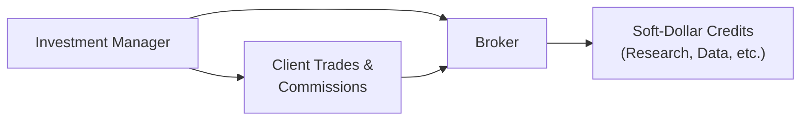

## Introduction and Basic Concepts

Soft-dollar arrangements have been around for quite a while in the investment world, and I can’t help but recall the first time I encountered them early in my career. I was reviewing a manager’s operations and suddenly found all these references to “research credits” and “brokerage services.” My eyes went a little wide. “Wait,” I thought, “these are services the manager isn’t paying for with direct cash?” Indeed, a soft-dollar arrangement allows the investment manager to pay for certain services—commonly research or data subscriptions—via brokerage commissions generated by the client’s trading rather than through the manager’s own hard cash. While this might seem like a neat perk for managers, it can create complex considerations about conflicts of interest, best execution, and cost transparency.

In this section, we’ll explore how managers use soft dollars, why they do it, and, most importantly, how it affects the entire manager selection process. We’ll delve into the regulatory environment and bring in a few real-world scenarios to help you see why soft dollars truly matter for performance measurement, especially for advanced portfolio strategies. If you remember from 2.1 (Manager Selection Process and Due Diligence), we emphasized that a thorough review of a manager’s trading practices is essential for ensuring transparency and alignment with client objectives. Soft-dollar arrangements fall directly into this category.

## Soft-Dollars in a Nutshell

Soft-dollar arrangements occur when an investment manager directs client trades to a brokerage firm that, in exchange, provides the manager with research or other bundled services. This is different from paying with cold, hard cash—hence the term “soft.” Because these arrangements involve client brokerage commissions—which are effectively client assets—regulations often require that any products or services purchased with soft dollars must primarily serve the client’s investment interests, such as specialized stock research, fixed-income analytics, or additional portfolio analytics.

### Key Features
• The manager directs client trading activity to certain brokers.  
• The broker provides research or services the manager would otherwise pay for directly.  
• There is potential for conflicts of interest, often around trading frequency or broker selection.  

To visualize the process:

Let’s be honest here: “soft” doesn’t mean fake or intangible, it simply means the manager is effectively paying for services using the client’s trading costs. This practice is legal in many jurisdictions, including the United States under SEC guidelines, but it must be carefully disclosed and monitored.

## Regulatory and Ethical Considerations

Soft-dollar arrangements must meet certain standards to be permissible under regulatory regimes. In the United States, for instance, the SEC requires that any research acquired via soft dollars must provide “lawful and appropriate assistance” in the manager’s investment decision process. The fundamental principle is that managers must uphold their fiduciary duty: put the client’s interests first and ensure best execution.

From an ethical standpoint, it’s easy to see how managers might be tempted to place trades with a broker that offers lavish research packages—even if that broker charges slightly higher execution costs—because the manager gets the benefit while the client foots the overall bill via higher trading commissions. This risk of conflict is precisely why the CFA Institute Standard of Practice Handbook (particularly Standard III(A) on loyalty, prudence, and care) reminds us that managers must always prioritize the client’s well-being over their own.

### Common Regulatory Requirements
• Full disclosure of the nature of soft-dollar services received.  
• Demonstration of how these services benefit the client’s portfolio (e.g., improved research leads to better investment decisions).  
• Emphasis on best execution, not just best research perks.  
• Regular compliance audits to ensure managers are following the guidelines.  

Investors, especially large institutional ones, often include explicit clauses in investment management agreements (IMAs) or request managers to limit or forego soft-dollar arrangements entirely. This helps mitigate potential conflicts and ensures fees remain transparent.

## Potential Conflicts of Interest

One of the biggest issues with soft-dollar arrangements is the potential for managers to over-trade or direct trades to specific brokers to maximize these research benefits. Maybe you’ve heard war stories—like the portfolio manager (PM) who lined up a big block trade with a particular broker just weeks after that broker upgraded the manager’s pricey research subscription. Whether that was pure coincidence or not, you want to be sure managers execute trades solely for the client’s benefit, not for their own freebies.  

### Over-Trading and Higher Costs  
A manager might rationalize an increase in trade frequency or the use of a higher-commission broker if it offsets research costs that the manager would otherwise have to fund. As a result, overall trading costs for the client could climb, reducing net performance.

### Broker Conflicts  
When a brokerage firm also provides research products, there’s a risk the manager might lean towards that broker for the sake of convenience or familiarity, not necessarily best execution. This can create a conflict with the principle of best execution, as the manager might miss out on better pricing or faster execution elsewhere.

### Fiduciary Duty  
Under many regulatory frameworks, including those referred to in the CFA Institute Code and Standards, managers have a fiduciary duty to act in the best interests of their clients. If a manager profits from soft dollars but fails to show how the client benefits, it can represent a breach of that duty.

## Evaluating Soft-Dollar Practices in Manager Selection

Okay, so you might be thinking: “I get the potential hazards, but how do I really evaluate a manager’s soft-dollar practices?” This is a question that frequently surfaces in due diligence calls or manager presentations. Here are a few key considerations:

### 1. Transparency and Disclosure  
Does the manager provide detailed disclosures on soft-dollar usage? If a manager’s marketing material is vague or glosses over this area, ask for more info. You’d want to see a breakdown of the types of services purchased and how they directly support investment decision-making.  

### 2. Impact on Fee Negotiations  
In some cases, managers argue that soft-dollar arrangements help them keep advisory fees lower, because part of their overhead is effectively subsidized by the client’s trading commissions. In practice, though, you’ll want to see if that’s actually happening or if the manager’s fees remain equivalent to peers who don’t use soft dollars.  

### 3. Broker Selection and Best Execution  
A manager’s brokerage allocation policy must explicitly align with best-execution standards. Typically, you’d like to see robust policies and metrics around execution quality. Also, see if the manager regularly reviews brokers and re-evaluates relationships, rather than sticking with the same provider purely out of habit or convenience.

### 4. Reasonableness of Research Expenditures  
Sure, specialized data or exclusive broker research might yield alpha. But is the soft-dollar arrangement paying for only as much research as the manager truly needs, or is the manager overindulging in pricey data sets that don’t really translate to better performance?

### 5. Regulatory Compliance  
Given the guidelines summarized by the SEC and other global regulators, check how rigorously the manager’s compliance team monitors and documents these arrangements. If the manager can’t demonstrate robust internal oversight, that’s a red flag.

## Examples and Case Studies

Let’s consider two hypothetical scenarios to illustrate the importance of thorough evaluation:

1. “Research-Focused Boutique Manager”: A boutique equity manager invests heavily in fundamental research, analyzing each company in minute detail. They claim that using a soft-dollar arrangement for specialized industry reports is crucial for generating alpha. When you dig deeper, you see that they’ve systematically tracked improvements in performance linked to these reports. Plus, they maintain a rotating panel of brokers, each chosen for best execution metrics. Here, the use of soft dollars appears justifiable: it’s carefully monitored, well-documented, and arguably beneficial to the client.

2. “High-Frequency Switcher”: A global macro manager invests in currencies, futures, and derivatives. The manager claims it’s essential to have advanced analytics tools—funded via soft dollars. However, in a performance evaluation, you find that they trade excessively, generating substantial commissions. They also rely exclusively on a single broker despite that broker’s relatively high commissions. Sometimes you notice no direct correlation between that research and improved performance. In this scenario, there’s a stronger case that soft-dollar usage may primarily subsidize the manager’s overhead rather than enhancing client returns.

## Best Practices for Investors

• Demand Transparency: Request itemized disclosures of all soft-dollar arrangements, including the services provided and how they benefit the portfolio.  
• Align Fees and Value: If the manager benefits from soft dollars, see if advisory fees reflect those savings or if the arrangement simply pads the manager’s bottom line.  
• Monitor Execution Quality: Ensure the manager has robust processes for evaluating broker performance, including regular reviews of transaction cost analysis (TCA).  
• Evaluate Compliance: Confirm the manager adheres to relevant regulations (e.g., the SEC’s Section 28(e) in the U.S.) to ensure research is indeed “lawful and appropriate.”  
• Consider Alternatives: If you’re uncomfortable with soft-dollar use, you can negotiate that the manager either forego or limit these arrangements, or else invest through managers who avoid them altogether.

## Impact on Manager Selection

When deciding between multiple managers, their approach to soft dollars should be an integral part of your selection matrix. In 2.1 (Manager Selection Process and Due Diligence), we covered the importance of thoroughly investigating a manager’s operational practices. A high degree of reliance on soft dollars can signify:

• Increased Trading Costs: Potential drag on gross performance from high commissions.  
• Fee Ambiguities: Difficulty in discerning whether the manager’s stated fees are artificially “low” or “high” once you factor in trading costs.  
• Governance Strength: A manager’s willingness and ability to justify their soft-dollar usage reveals much about their ethical framework and transparency.  

Moreover, in evaluating managers for alternative investments or complex mandates (see 2.10 Manager Search and Selection Tools), you’ll want to check if the strategies are likely to generate frequent transactions, because that’s where you’ll see the biggest potential for these conflicts.

## Additional Considerations Across Jurisdictions

Some regions or specific types of mandates (e.g., UCITS funds in Europe) may prohibit or severely restrict soft-dollar usage. If your investment horizon spans multiple countries or if your fund is subject to stringent regulations, confirm that all local rules are being followed and that no cross-border regulatory conflict is lurking. Also, certain asset owners (like pension funds) might have explicit best-execution and soft-dollar policies that managers must adhere to.

## For the CFA Exam: Key Takeaways and Pitfalls

From a CFA® Level III exam perspective, be prepared to evaluate scenarios where you must discuss how soft-dollar arrangements can affect performance metrics, manager due diligence, and overall risk management. A common pitfall is to overlook the indirect costs to the client or the potential conflict with best-execution duties. In an exam question, you might be asked to:  
• Identify conflicts of interest in a manager’s approach.  
• Recommend ways to improve transparency.  
• Assess how a specific soft-dollar arrangement might undermine the manager’s fiduciary duty.  

Likewise, you might encounter item set or constructed-response questions that delve into the regulatory guidelines (like the SEC’s Section 28(e) safe harbor) or require you to interpret disclaimers about research uses.

### Time-Management Tip  
When facing a multi-part question on manager selection, break down each part systematically. If asked about soft-dollar usage, focus on the manager’s disclosure practices, the link to performance improvements, and the regulatory framework. Stay on topic: the exam is big on clarity and conciseness.

## References and Further Reading

• CFA Institute Standard of Practice Handbook, Standard III(A)—Loyalty, Prudence, and Care.  
• SEC (U.S.) “Guidance Regarding Client Commission Practices Under Section 28(e) of the Securities Exchange Act of 1934.”  
• “Soft Dollars in Asset Management: Regulatory Framework and Best Practices,” various global regulatory agencies.  
• For broader context on selecting managers (including those who do or don’t use soft dollars), see Chapter 2.1 (Manager Selection Process and Due Diligence) in this volume.  

---

## Potential Pitfalls with Soft-Dollar Arrangements: Test Your Knowledge



### Which statement best describes soft-dollar arrangements?

- [ ] Managers pay for research using their own cash.  
- [x] Managers obtain research or services from brokers in exchange for client transaction commissions.  
- [ ] Managers use only discretionary accounts to purchase third-party research.  
- [ ] Managers rely on credit lines to finance external researchers.  

> **Explanation:** Soft-dollar arrangements involve an investment manager directing client brokerage transactions to brokers who in turn provide research or other services.  

### Under SEC guidelines, what is the core requirement for a manager using soft dollars?

- [ ] Must negotiate the lowest possible commissions for each trade.  
- [x] Must ensure the research obtained provides lawful and appropriate assistance in investment decisions.  
- [ ] Must disclose each trade executed and the commission paid.  
- [ ] Must guarantee the client satisfies regulatory reporting requirements.  

> **Explanation:** The U.S. SEC’s Section 28(e) safe harbor specifically requires that the research or services received provide “lawful and appropriate assistance” in the manager’s investment decision-making process.

### In the context of best execution, what concern often arises with soft dollars?

- [ ] The manager might avoid using brokers with favorable commission rates.  
- [x] The manager might select brokers based on research perks rather than trade execution quality.  
- [ ] The manager might be unaware of any regulatory guidelines.  
- [ ] The manager might under-trade to minimize commissions.  

> **Explanation:** Conflicts of interest can occur if a manager prioritizes receiving research or other benefits over achieving best execution on trades.

### Which of the following is a recommended best practice for investors evaluating soft-dollar arrangements?

- [ ] Negotiate strict performance-based fees.  
- [x] Request detailed disclosure of soft-dollar services and how they benefit the portfolio’s performance.  
- [ ] Require the manager to split trades equally among all brokers.  
- [ ] Demand that the manager refrain from all third-party research.  

> **Explanation:** Detailed disclosures help investors determine whether soft-dollar practices align with the client’s best interests.

### How might soft-dollar usage potentially inflate a client’s costs?

- [ ] By funding the manager’s back-office salaries which are billed separately.  
- [ ] By increasing account networking fees at the custodian.  
- [ ] By hiding risk exposures in off-balance-sheet accounts.  
- [x] By encouraging higher trading frequency or use of more expensive brokers.  

> **Explanation:** A manager might be motivated to trade more frequently or use a higher-commission broker to acquire additional research, thus increasing the overall costs borne by the client’s portfolio.  

### Which element most directly addresses conflicts of interest in soft-dollar arrangements?

- [ ] Increasing the asset-based management fee.  
- [x] Providing comprehensive disclosure to clients regarding soft-dollar practices.  
- [ ] Reassigning trading authority to an external firm.  
- [ ] Relying on only one broker for all services.  

> **Explanation:** Conflicts of interest are best mitigated through transparency—making sure clients know what services are being paid for and how they support investment decisions.

### When managers rely heavily on soft-dollar credits for research, which risk factor is of greatest concern to clients?

- [ ] The manager’s potential to exceed the targeted return.  
- [x] The possibility that the manager might prioritize soft-dollar benefits over client trade execution quality.  
- [ ] The inability of the manager to identify well-capitalized brokers.  
- [ ] The manager’s restricted access to specialized analytics.  

> **Explanation:** Heavy reliance on soft dollars can motivate managers to use certain brokers that provide benefits (research) but may not always deliver the best execution.

### What does the term “soft‑dollar” primarily refer to?

- [x] Non-cash compensation an investment manager receives from a broker in exchange for directing trades.  
- [ ] Derivative structures that replace cash investments in a portfolio.  
- [ ] A regulatory mechanism for limiting foreign exchange losses.  
- [ ] An asset class involving intangible rights and patents.  

> **Explanation:** Soft dollars are a form of non-monetary compensation in which the manager pays with client commissions instead of direct cash.

### Which of the following best describes an example of a soft-dollar conflict of interest?

- [x] Executing trades through a broker who provides costly but non-essential research the manager personally values.  
- [ ] Reducing overall commissions by seeking volume discounts from multiple brokers.  
- [ ] Bundling trades to achieve lower per-share commission costs.  
- [ ] Allocating research costs directly to the client via a separate invoice.  

> **Explanation:** Conflicts arise when managers choose brokers based on research perks that may not necessarily benefit the portfolio but help the manager personally.

### True or False: All soft-dollar arrangements are strictly prohibited under the CFA Institute Code and Standards.

- [ ] True  
- [x] False  

> **Explanation:** Soft-dollar arrangements are not strictly prohibited. However, the CFA Institute Code and Standards require that these arrangements serve the client’s best interests and be fully disclosed.


