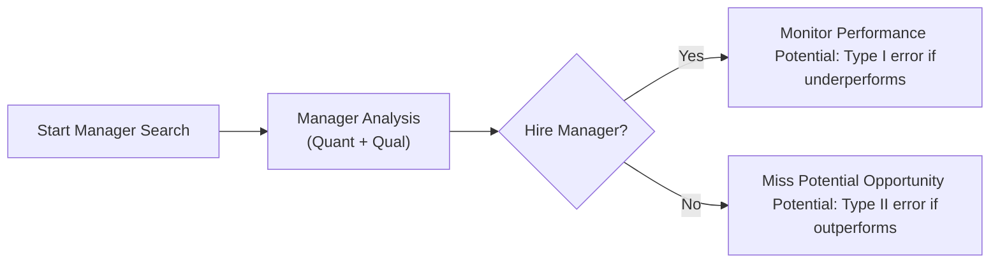

Introduction  
Hiring a portfolio manager often feels a bit like searching for a needle in a haystack. We might be thrilled to find a manager who promises above-average returns or a sophisticated alpha-generating process. In practice, though, the decision to bring a manager on board can backfire if we hire someone who never actually delivers (that dreaded “false positive”). Equally frustrating is regretting we fired a “diamond in the rough” manager right before their strategy turned around (the “false negative”). These mistakes in statistical terms are called Type I and Type II errors, and they can have not only performance consequences but also intangible impacts on team morale or confidence in the selection process.  

Understanding Type I vs. Type II Errors  
In statistics, a Type I error (false positive) arises when you incorrectly conclude that something is true when, in fact, it is not. If you apply that logic to manager selection, a Type I error is hiring or retaining a manager who, unfortunately, fails to add any alpha and might actually underperform. Conversely, a Type II error (false negative) is the mistake of rejecting or firing a manager who ultimately would have delivered outperformance.  

• Type I Error (False Positive): Any time you “approve” a manager who turns out to be a bad match.  
• Type II Error (False Negative): The times you “reject” a manager (or dismiss one) who would have been an excellent performer.  

From a purely statistical standpoint, minimizing Type I errors often involves being more stringent with your thresholds. That means you require more robust evidence before saying “yes” to a manager. But ironically, if your acceptance bar is too high, you risk rejecting some extraordinary prospects. Likewise, if you reduce your constraints to let more managers in, you might pick up some hidden stars at the expense of also onboarding a fair share of underperformers.  

Let’s do a quick formulaic look at these error rates:

- P(Type I error) = α, where α typically represents the level of significance you use to decide that a manager’s “hypothesis” of adding alpha is valid. In plain language: if you set α = 1%, that means you only want to accept a manager if you’re highly confident they’ll outperform.  
- P(Type II error) = β, which is the probability of missing out on a truly beneficial manager. A high β means your selection process is rejecting many potential winners.  

In practice, establishing an “optimal” α or β depends a lot on your risk tolerance, your portfolio’s objectives, and, of course, the cost of each type of mistake.

Why These Errors Matter in Manager Selection  
Both Type I and Type II errors translate into real life as performance drag, turnover costs, and, let’s be honest, second-guessing ourselves.  

• Costs of a Type I Error:  
  - Underperforming manager’s fees.  
  - Possibly lower returns if the manager picks poor investments or drifts from the strategy.  
  - High opportunity cost of missing out on other, more successful managers.  
  - Indirect costs: a subpar manager can damage an organization’s reputation or hamper client confidence.  

• Costs of a Type II Error:  
  - Lost alpha: You might bypass a manager whose style is temporarily out of favor but could come roaring back.  
  - Increased turnover: Firing a manager prematurely often leads to frequent manager changes, which can reduce stability.  
  - Opportunity cost of not benefiting from a strong performer.  

Implications for Portfolio Strategy and Monitoring  
Achieving an effective balance between screening out subpar managers (avoiding Type I errors) and not missing out on hidden gems (avoiding Type II errors) is an art. Sure, robust quantitative criteria, thorough due diligence, and manager performance analytics all play a vital role. Still, the real trick lies in calibrating your acceptance threshold so that your chosen managers are more likely to deliver alpha while acknowledging room for style comebacks or cyclical underperformance.  

Costs and Turnover Concerns  
Some institutional investors will say, “Better safe than sorry,” especially if they can’t afford to look bad with subpar manager performance. They might adopt super-stringent thresholds, demanding a multi-year track record of alpha generation, well-defined risk metrics, and credible references from prior institutional clients. But guess what? This high standard might also filter out new and innovative strategies that won’t have the glossy multi-year results. That scenario can breed Type II errors in the system.  

On the other hand, some large plan sponsors or endowments have an eclectic approach, believing that broad diversification among different manager styles might increase the odds of capturing alpha. This approach helps minimize Type II errors (since you’re “missing out” on fewer managers), but it can create more Type I errors by including managers who eventually disappoint.  

A Balanced Approach to Managing Errors  
Balancing your manager selection process is somewhat akin to calibrating an investment strategy’s risk-reward profile. Here are some best practices:  

• Use Strict but Reasonable Screening Criteria:  
  - Incorporate multiple performance metrics (e.g., risk-adjusted returns, capture ratios, attribution analysis) as you learned in other sections of this text.  
  - Include a robust qualitative assessment (e.g., stability of the manager’s team, alignment of investment philosophy with organizational values, cultural fit).  

• Implement a Watch List Step:  
  - Instead of firing managers as soon as they stumble, place them on a watch list.  
  - This approach reduces knee-jerk firings (and thus Type II errors), while still enforcing accountability.  
  - Track performance, risk exposures, and manager behavior more frequently and require regular updates or strategy clarifications.  

• Expand the Evaluation Period:  
  - Shortening the manager evaluation horizon can backfire, because you might fire a manager right before a major style revival. Equally, a longer horizon might worsen your losses if the manager truly is subpar.  
  - Consider compromise: a moderately long horizon—enough time to see if the manager’s style, which is out-of-favor, eventually proves itself.  

• Scenario Analyses and Stress Testing:  
  - Test how your overall portfolio might respond if a manager fires on all cylinders, or if they continue to languish.  
  - Ask: “How would we feel if we fired this manager today, and next year their strategy produced 20% outperformance?” or, “How long can we endure subpar returns before the damage is irreparable?”  

• Document the Decision Rationale:  
  - Write down the reasons for hiring or firing a manager: performance data, risk metrics, team turnover, style attributions, and intangible considerations.  
  - This record can refine future selection frameworks and limit the influence of recency bias or emotion-based decisions.  

Real-World Example: Firing Right Before a Style Comeback  
I once worked with a colleague who’d had enough of a specific small-cap growth manager after a few quarters in the red. The manager kept insisting that they were, in fact, a “high momentum” strategy and that the market conditions just didn’t favor them at that time. My colleague eventually pulled the plug—just when the economy showed signs of entering a growth spurt that favored small-cap momentum stocks. The manager subsequently posted double-digit alpha, leaving my colleague feeling the pains of a Type II error in full.  

Yes, it hurt. And it was one of those experiences that taught us the value of scenario testing and the importance of a watch list or grace period, especially if the manager’s drift or mistakes aren’t so egregious as to be irredeemable.  

In a contrasting scenario (a cautionary tale!), an investor in a major pension fund stuck with an underperforming manager out of loyalty and the fear of making a Type II error. The manager fell further behind peers for several years, racking up higher fees and negative net-of-fee returns—ultimately compounding losses. That’s textbook Type I error.  

Flowchart of the Manager Selection Pathway  

In this simplified diagram, you can see how a “Yes” might lead to a Type I error if the chosen manager disappoints or a “No” can cause a Type II error if you end up missing a top performer.  

Strategies to Reduce Errors  
No approach can guarantee zero errors. However, below are strategies to mitigate the frequency and severity of both error types:  

• Multi-Factor Evaluation:  
  - Look beyond standard performance measures and emphasize risk consistency, style fit, and the presence of robust risk management protocols.  

• Thorough Due Diligence:  
  - On-site visits, direct interviews with the portfolio managers, background checks, and thorough references.  
  - Understand the manager’s team culture and how they make investment decisions.  

• Regular Performance Attribution:  
  - Compare returns to an appropriate benchmark.  
  - Evaluate factor exposures. If a manager is out-of-favor only because of a value vs. growth cycle, it might bounce back when market conditions shift.  

• Manager Benchmarks and Customization:  
  - If your manager invests in high-yield bonds, don’t anchor them to an investment-grade corporate index.  
  - If the benchmark is mismatched, you might commit a Type I error by believing their strategy is underperforming.  

• Evaluate Risk Appetite and Investment Horizon:  
  - An investor with a shorter horizon might want to be more aggressive in discarding managers who are behind schedule.  
  - A longer-horizon investor may afford to be more patient, preventing Type II errors if a misaligned market environment is short-lived.  

Key Takeaways (and a Few More Anecdotes)  
• Manager selection is never purely quantitative; the intangible or qualitative factors can influence both manager performance and organizational culture.  
• Minimizing one error type often heightens exposure to the other. That’s just the nature of balancing false positives against false negatives.  
• Overconfidence or panic are equally risky behaviors. A well-documented, structured, and consistent selection-and-retention policy typically leads to better outcomes.  

Final Exam Tips  
• Expect exam questions that describe a scenario where a manager is underperforming relative to a benchmark over a short horizon. You may be asked whether continuing with the manager invites a Type I error or whether firing them might be a Type II error. Practice writing concise responses that mention the cost implications, the monitoring framework, and the strategic tolerance for each type of mistake.  
• When you see a question about selection thresholds (like requiring a certain track record or minimum information ratio), remember how changes to the threshold can shift the likelihood of incurring a Type I or Type II error.  
• Highlight scenario analysis, watch lists, or manager probation periods as ways to mitigate errors.  

References  
• “Manager Selection and the Hidden Dangers of Type I and Type II Errors,” Journal of Portfolio Management.  
• “Policy Portfolios and Manager Monitoring” from the CFA Institute’s continuing education library.  

## Test Your Knowledge of Type I and Type II Errors in Manager Hiring



### Which of the following best describes a Type I error in manager hiring?

- [ ] Firing a manager who would have performed well  
- [ ] Selecting a manager with a solid track record  
- [x] Hiring or retaining an underperforming manager (false positive)  
- [ ] Expanding the pool of potential managers  

> **Explanation:** A Type I error is a false positive, meaning you accept (hire or keep) a manager who ultimately underperforms.  

### Which of the following situations exemplifies a Type II error?

- [ ] Hiring a manager who outperforms  
- [ ] Retaining a manager who continues to underperform  
- [x] Firing a manager who later posts strong outperformance  
- [ ] Refusing to evaluate an alternative benchmark  

> **Explanation:** A Type II error is a false negative, such as rejecting a manager who would have gone on to deliver superior performance.  

### What is most likely to happen if you significantly tighten your manager selection criteria to reduce Type I errors?

- [x] Potential increase in Type II errors  
- [ ] Elimination of all performance errors  
- [ ] Improved short-term manager performance with no downsides  
- [ ] Increased probability of selecting underperforming managers  

> **Explanation:** By increasing the strictness of hiring or retention requirements, you may inadvertently reject managers who could do well, thus raising Type II errors.  

### How can an extended manager evaluation horizon influence potential errors?

- [ ] It eliminates all errors due to longer observation periods  
- [x] It might decrease the likelihood of Type II errors but prolong the impact of Type I errors  
- [ ] It has no impact on either Type I or Type II errors  
- [ ] It only reduces the risk of Type I errors  

> **Explanation:** Extending the horizon might help you avoid firing a temporarily underperforming but otherwise strong manager (reducing Type II errors). However, if the manager truly is subpar, you’ll experience the suboptimal performance for a longer time (Type I error).  

### Which method is most effective for minimizing both Type I and Type II errors simultaneously?

- [ ] Hiring every possible manager  
- [x] Combining robust quantitative metrics with qualitative evaluations and ongoing monitoring  
- [ ] Eliminating any tolerance for underperformance  
- [ ] Using a short evaluation period and immediate dismissal after one poor quarter  

> **Explanation:** A comprehensive evaluation strategy that integrates both quantitative and qualitative analyses, coupled with continuous monitoring, provides the best balance against both types of errors.  

### Placing an underperforming manager on a "watch list" rather than firing them immediately is an example of:

- [x] Reducing the probability of making a Type II error  
- [ ] Increasing the probability of a Type I error  
- [ ] Eliminating any chance of a Type I error  
- [ ] Avoiding all future mistakes in the selection process  

> **Explanation:** Watch lists are an interim solution that can provide more evidence before firing, thus lowering the chance of a Type II error (firing a manager prematurely).  

### When designing a manager selection framework, which factor is typically the biggest driver of how much you fear a Type I over a Type II error?

- [ ] The size of the management fee  
- [ ] The choice of absolute versus relative performance measure  
- [x] The organization’s risk tolerance and investment horizon  
- [ ] The manager’s marketing materials  

> **Explanation:** Risk tolerance and horizon determine how patient you can be with underperformance and how big a loss you are willing to accept from a potentially poor manager decision.  

### Which of the following is a consequence of incurring a Type I error repeatedly?

- [x] Consistent underperformance may drag on overall portfolio returns  
- [ ] Missing out on managers with strong potential  
- [ ] Increased manager turnover due to prematurely firing them  
- [ ] Not having sufficient manager diversification  

> **Explanation:** A Type I error involves hiring or retaining underperforming managers. Doing this repeatedly is likely to degrade overall portfolio returns and keep underperformers on board.  

### Scenario: A manager’s style has been out of favor, but your long-term thesis suggests the style could rebound. What is the main risk of firing them too quickly?

- [x] Committing a Type II error if the style rebounds soon after you terminate the manager  
- [ ] Accidentally committing a Type I error by hiring a poor manager  
- [ ] Eliminating organizational bias  
- [ ] Freed-up capital that ensures immediate outperformance  

> **Explanation:** By firing the manager prematurely, you risk missing out on their potential outperformance if and when their investment style rebounds.  

### True or False: No matter how stringent your manager selection criteria, you can completely avoid both Type I and Type II errors.

- [x] True  
- [ ] False  

> **Explanation:** It is actually false that you can avoid both errors altogether. You can only strike a balance. Some risk of mistake is inevitable in any decision-making environment.  


