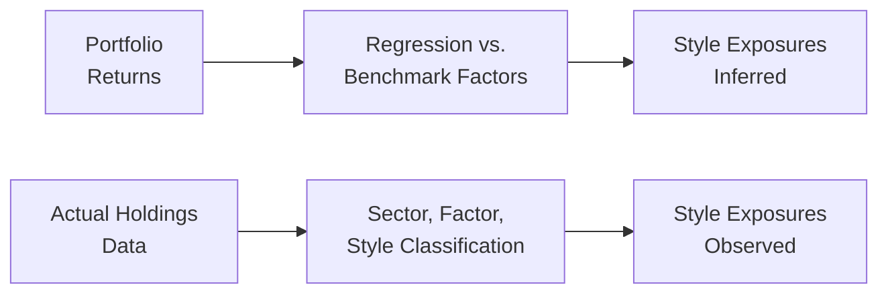

Style analysis is a fundamental element of investment manager selection and monitoring. It helps us identify how a manager’s decisions—whether growth-oriented, value-oriented, or anything in between—might influence a portfolio’s risk/return dynamics. In this section, we take a look at two prevalent techniques: Returns-Based Style Analysis (RBSA) and Holdings-Based Style Analysis (HBSA). Each approach has its own strengths, weaknesses, and best-use scenarios. Understanding both is immensely beneficial for any investor, asset owner, or consultant seeking to pinpoint a manager’s style exposures and detect style drift before it becomes a serious problem.

Throughout this discussion, we’ll see the importance of transparency, data timeliness, and practical context. In some cases, you might rely entirely on RBSA (especially if you only have a track record of returns and minimal information about the actual holdings). In other cases, you might prefer the more granular insights of HBSA. But quite often, a hybrid approach combining both techniques can be the most revealing. Let’s dive in.

## Returns-Based Style Analysis

Returns-Based Style Analysis (RBSA) is commonly employed when you have manageable access to historical net returns of a portfolio but little to no availability of actual holdings. In a nutshell, RBSA attempts to fit the manager’s observed returns to a combination of style or factor indices. By looking at how well the returns track certain style benchmarks, RBSA guesses the manager’s exposures to different factors such as large-cap growth, mid-cap value, small-cap momentum, and so forth.

Unlike Holdings-Based Style Analysis (which we’ll come to soon), RBSA typically requires no more than a reliable record of performance. So if a manager is reluctant to disclose their full holdings (or is only willing to share them infrequently), RBSA can fill in the gap.

### Core Concepts of RBSA

RBSA relies on statistical methods, particularly regression techniques. You can imagine building a model that tries to explain a portfolio’s returns by a weighted combination of benchmark returns—each benchmark representing a particular style or factor. For instance, say you suspect a manager invests mostly in large-cap growth stocks, but occasionally dips into small-cap value. You would pick benchmarks that capture those styles and regress the manager’s returns against these benchmarks:


R_p = \sum_{i=1}^{n} w_i\,R_i + e


where:
• \\(R_p\\) is the portfolio’s return over the measurement period,  
• \\(R_i\\) are the returns of each style or factor index,  
• \\(w_i\\) are the weights (exposures) to each factor, and  
• \\(e\\) is the error term.

If \\(w_{\rm large\_growth} = 0.7\\) (70%) and \\(w_{\rm small\_value} = 0.3\\) (30%), that might suggest the manager has orientation to large-cap growth and small-cap value factors. The power of RBSA is that you can do this for multiple style factors simultaneously—and you can run it on rolling windows to see how style exposures change over time.

### Advantages of RBSA

• Simplicity and Accessibility: RBSA is the go-to tool if you have only the manager’s return series. You don’t need the actual holdings or daily transaction data.  
• Historical Perspective: You can easily track how the manager’s style exposures have changed—say, monthly or quarterly—by updating your regression window.  
• Comparisons Across Managers: You can apply the same group of style indices across multiple managers to see who looks more growth-oriented or more value-oriented. This standardization can be helpful for manager peer group comparisons.  
• Limited Disclosure Requirements: If a manager doesn’t share full holdings, RBSA is an effective proxy, especially if your only other lever is manager communications or partial disclosures.

### Disadvantages of RBSA

• Susceptibility to Overfitting: By tweaking which indices or factors you choose—or by using too many factors—you can end up with a model that fits short-term noise rather than capturing real style traits.  
• Less Accuracy for Rapidly Shifting Portfolios: If a manager changes style frequently, RBSA might not capture that shift until enough return data is available. This means style drift might show up on a lagging basis.  
• Short-Term Anomalies: Periods of extreme market behavior or random performance spikes might wrongly influence the regression outputs, misrepresenting actual style exposures.  
• Data Requirements for Reliable Results: You usually need a long enough return series to run a meaningful regression. If your manager has only a couple of quarters of performance, your RBSA could be misleading.

I remember once working with an equity manager whose reported style was “large-cap growth,” but about nine months in, the returns started to seemingly track high-yield bond indices more than the equity benchmarks. We used an RBSA tool and discovered the manager had begun adding convertible bonds in significant amounts—something not disclosed in detail. That short period of performance was enough to highlight anomalies, but we needed a few more data points to be confident in the analysis. That’s a real-life illustration of how RBSA can be a powerful flashlight in a dark cave of partial transparency, even though it took some time to confirm the manager’s shift.

### Practical Example of RBSA

Suppose you notice a manager (Fund X) claiming to be a 100% large-cap growth fund. You run a regression of its monthly returns on two style indices:

• Index 1: S&P 500 Growth,  
• Index 2: Russell 2000 Value.

After running a rolling 36-month regression, the best fit reveals that 70% of the returns come from the S&P 500 Growth index and 30% from the Russell 2000 Value index. This implies that the fund is not purely large-cap growth but has a notable tilt toward small-cap value. If you notice that this tilt is intensifying over time, that’s an indication of style drift—even though the manager may not have been forthcoming about it. Armed with this knowledge, you might better adjust your overall portfolio exposures or question the manager on their approach.

## Holdings-Based Style Analysis

Holdings-Based Style Analysis (HBSA) is almost the opposite approach. Instead of looking purely at performance data, you analyze the actual holdings in the portfolio. This means identifying each stock’s or bond’s style classification—say, large-cap growth or small-cap value—and then aggregating them to see the portfolio’s big picture style identity.

### Core Concepts of HBSA

With HBSA, you want a comprehensive snapshot of what’s in the portfolio at a given point in time. Typically, you classify each security across relevant metrics—like market capitalization, price-to-book ratio, sector classification, or whichever factors matter. Then you weight each security’s style exposure according to its portfolio weight. Summing them up reveals how much the manager is invested in, for example, large-growth, small-value, momentum, sector concentrations, or any number of factor exposures that you define. If you do this on a regular schedule—monthly, quarterly, or as frequently as data is available—you can track style changes quite precisely.

### Advantages of HBSA

• Direct Look Under the Hood: Instead of backwards-inferred style exposures, you see the actual built-up exposures from the portfolio’s constituents.  
• Detecting Style Drift in Real Time: Whenever the manager buys new securities or increases positions in certain segments, you can see style changes quickly (assuming timely disclosures).  
• More Nuanced Insights: You can easily detect a manager’s largest positions or see any hidden concentrations—like a heavy tilt toward technology or cyclical stocks—that might not be obvious from a pure returns-based perspective.  
• Integration with Risk Analytics: Combining holdings data with advanced risk models can let you see factor exposures across the portfolio. This is especially relevant in multi-asset or factor-based strategies, as discussed in Chapter 1.13 (Factor‑Based Performance Attribution for Multi‑Asset Portfolios).

### Disadvantages of HBSA

• Disclosure Requirements: The biggest stumbling block? You need the manager to give you accurate, timely, and detailed holdings data. Some managers only disclose holdings quarterly—or with considerable delay—and some may not disclose them at all.  
• Data Management Complexity: Even if holdings data is available, you’ll need specialized tools to categorize, classify, and store all those securities, especially in multi-asset or complex strategies.  
• Stale Information: In the worst-case scenario, a manager might only release holdings data 45 days after quarter-end, so what you see may no longer reflect the manager’s current positions.  
• Potential Overemphasis on Single Snapshots: If you rely too heavily on a single point-in-time portfolio snapshot, you might miss daily or weekly variations in strategy, especially for more tactical managers.

I once consulted for a pension fund that demanded daily holdings from its external managers, which was a huge logistical burden for both sides. Yet, it allowed them to run frequent HBSA updates and track style exposures with razor-sharp precision. That’s obviously not always necessary. For smaller funds or less frequent reporting cycles, monthly or quarterly might suffice so long as you understand it provides only a partial picture if the strategy is dynamic.

### Practical Example of HBSA

Imagine you have a manager who invests in 50 growth-oriented stocks and 20 value-oriented names. You load these 70 securities into your analytics system. Then, for each security, you determine its “growth” or “value” classification using a recognizable index’s methodology (e.g., Russell Growth vs. Russell Value). You might discover that only 60% of the portfolio is truly “growth,” with 40% actually “value.” So even though the manager is marketing themselves as a pure “growth” shop, the holdings data suggests a meaningful tilt toward value names. With monthly snapshots, you can quickly notice if the manager is drifting into new territory—like a sudden rush into small-cap or international stocks. Because you have direct holdings data, the picture is more immediate—provided you’re receiving that data promptly.

## Contrasting RBSA vs. HBSA

One of the best ways to visualize the difference is through a simple diagram:

• The top path (“Portfolio Returns”) uses regression to guess the style exposures, which can be extremely useful when holdings aren’t disclosed, but can lag behind style changes.  
• The bottom path (“Actual Holdings Data”) calculates style exposures directly, which can be precise but requires timely, comprehensive portfolio disclosures.

## Hybrid or Complementary Approaches

Many institutional investors use both RBSA and HBSA to gain the best of both worlds. For example, you might run a monthly RBSA to see how performance is evolving in relation to standard style indices and simultaneously request your manager’s holdings—perhaps quarterly—to see whether the exposures gleaned from RBSA match up with the actual portfolio constituents.

A partial-holdings approach can also be taken if the manager is willing to share, say, top 10 positions or sector breakdowns. That partial insight can improve an RBSA model’s factor selection, reducing the potential for overfitting or omitted factor bias. Meanwhile, you don’t have the overhead of collecting and analyzing every single security in the portfolio.

If the manager invests heavily in private placements, derivatives, or short positions, you might need specialized tools to capture these exposures properly. A straightforward equity-only approach is simpler, but in complex portfolios, you often rely on a combination of risk analytics, factor-based analysis, and partial holdings disclosures. For more advanced multi-factor strategies, referencing Chapter 1.13 (Factor‑Based Performance Attribution for Multi‑Asset Portfolios) can help you integrate style analysis into a robust factor framework.

## Monitoring Style Drift

Whichever style analysis technique you use, keeping a close eye on style drift is crucial. The manager might claim to be a “core equity” fund, but over time, you notice the portfolio creeping toward growthy, high P/E stocks. While that might be beneficial if the market strongly favors growth, it can also reshape the risk profile of your overall asset allocation. From an exam standpoint—and from a real-world standpoint—you should watch for:

• Changes in Regression Outputs (RBSA): If weights to certain factors jump from 10% to 40% in a quarter, that’s huge and calls for further investigation.  
• Changes in Holdings (HBSA): If you see an uptick in uncharacteristic positions—like microcap biotech in what’s labeled a large cap portfolio—that’s a red flag.  
• Manager Explanation: Sometimes the manager might justify drift as an opportunistic or transitional move. If so, they need to show how it’s consistent with the mandate or your investment policy statement. If you want further details on style drift, check out Section 2.14 (Manager Style Drift and Its Impact on Portfolio Alignment), where we dive deeper into real-world examples and solutions.

## Selecting the Appropriate Style Analysis Method

In practice, the choice between RBSA and HBSA often depends on:

• Data Availability: Do you routinely get holdings data? Or are you forced to rely mainly on return series?  
• Complexity of the Strategy: Simple equity managers might be easy to track with RBSA, but if the manager uses options, convertible bonds, or multi-asset overlays, you might need direct insight from HBSA.  
• Timeliness Needs: If you want real-time or near-real-time detection of style changes, holdings data is often more direct. However, a well-designed RBSA with shorter windows might still be a workable compromise.  
• Level of Disclosure: Some managers simply do not share full or frequent holdings. In that scenario, an RBSA is your main tool.  
• Overarching Portfolio Integration: Especially for large asset owners, you should consider how the multiple managers you hire complement or overlap each other. RBSA might help you quickly see if you’re overexposed to certain factors across managers, but verifying with holdings is prudent if you can get it.

## Exam Relevance and Best Practices

For the CFA Level III exam, you’ll likely see scenario-based questions asking you to identify whether RBSA or HBSA is more suitable given certain manager disclosures or strategy types. You may have to:

• Evaluate a manager’s actual or expected style exposures given partial data,  
• Spot the pros and cons of each method in a short case,  
• Link style analysis findings to the overarching portfolio objectives or constraints,  
• Recognize when style drift might breach an investment policy statement.

Here are some best practices to keep in mind:

• Perform Rolling Window Analyses: For RBSA, ensure you update your analysis regularly (monthly, quarterly, or annually, depending on your data resolution).  
• Align with the Investment Policy: If the policy states “maintain at least 80% in large-cap growth,” confirm that style analysis results are consistent, or question the manager when they are not.  
• Beware of Blind Spots: Even the most thorough style analysis can miss ephemeral positions or exposures if data is lagged or incomplete.  
• Cross-Verify with Qualitative Information: Manager communications, documentation of research processes, and investment committee reports can augment or confirm the style analysis.  
• Keep an Eye on Transaction Costs and Turnover: High turnover managers may exhibit more style drift, whether intentional or incidental. If you rely heavily on stale holdings data, you might be behind the curve.

## Conclusion

Both Returns-Based and Holdings-Based Style Analysis are indispensable tools, offering different vantage points into a manager’s true style profile. Where RBSA provides a neat, regression-driven approach relying on performance history, HBSA goes straight to the source: the portfolio holdings themselves. Each technique has its own set of caveats regarding data requirements and timeliness. In the end, a complementary or hybrid approach often yields the most accurate and actionable insight.

For advanced multi-asset portfolios, factor-based attribution (see Section 1.13) can dovetail with these methods to create a holistic view of risk and style exposures. Ultimately, your choice of RBSA, HBSA, or both should align with how often you can get data, how transparent your manager is, and how actively they shift exposures. Style analysis might seem like a simple add-on, but as anyone who has faced a style-management fiasco can tell you, being aware of deviations (planned or otherwise) is often the difference between stable, expected outcomes and unwelcome surprises.

Stay curious, keep refining your approach, and remember that while past returns might be a clue, they’re not always the entire story.

## References and Further Reading

• Brinson, G., Singer, B., & Beebower, G. “Determinants of Portfolio Performance II: An Update.”  
• Coggin, T. D., & Fabozzi, F. J. “Evaluating and Implementing Performance and Style Analysis.”  
• CFA Institute, Official Curriculum Readings on Performance Evaluation and Manager Selection.  
• Chapter 1.13 in this volume, “Factor‑Based Performance Attribution for Multi‑Asset Portfolios.”

--------------------------------------------------------------------------------

## Test Your Knowledge: Returns‑Based vs. Holdings‑Based Style Analysis



### In which situation would you primarily use Returns-Based Style Analysis (RBSA)?

- [ ] When you have complete and up-to-date information on portfolio holdings.
- [x] When a manager provides only periodic performance returns and no holdings.
- [ ] When monitoring a manager’s turnover rate each month.
- [ ] When you want to measure a portfolio’s compliance with a specific factor tilt.

> **Explanation:** RBSA is often used when the manager either does not disclose all of its holdings or only discloses them irregularly, but you still have access to the portfolio’s performance returns.

### Which of the following is a primary disadvantage associated with RBSA?

- [ ] It directly reflects the manager’s actual holdings.
- [ ] It never detects style drift.
- [x] It can be less accurate for managers who shift style frequently.
- [ ] It eliminates the risk of short-term anomalies in the data.

> **Explanation:** RBSA interprets style exposures from historical returns, so if a manager rapidly changes exposures, RBSA may not capture this until new return data is available, potentially lagging the real-time drift.

### Holdings-Based Style Analysis (HBSA) helps identify…

- [x] The true underlying style exposures by assessing real portfolio positions.
- [ ] Exposures solely derived from index returns.
- [ ] Factor weights solely based on historical regressions.
- [ ] A manager’s alpha purely by analyzing its performance track record.

> **Explanation:** HBSA looks directly at the manager’s actual securities and classifies them by style or factor, thus revealing the real exposures at a given point in time.

### What is one major drawback of relying on HBSA?

- [x] The data may already be stale by the time you receive the holdings.
- [ ] It can’t categorize security types beyond small-cap equities.
- [ ] It avoids data management complexity by focusing on performance only.
- [ ] It completely eliminates the chance of style drift.

> **Explanation:** One of the biggest drawbacks of HBSA is that many managers provide holdings data only periodically, such as quarterly or monthly, potentially creating a gap between real-time exposures and what you see.

### Which scenario might justify using a hybrid style analysis approach?

- [x] You receive monthly returns data and partial, lagged holdings data.
- [ ] You have no limitation on disclosures from the manager.
- [x] You want to cross-check RBSA with some knowledge of the largest positions.
- [ ] You fully trust the manager’s self-reported style labeling.

> **Explanation:** A hybrid approach is sensible if you have partial holdings (for top positions or sector breakdowns) to refine your RBSA’s factor choices, while continuing to monitor returns for changes.  

### Which of the following statements about style drift is correct?

- [x] Style drift can alter a portfolio’s risk/return profile in unintended ways.
- [ ] Style drift is always beneficial for an investment manager.
- [ ] Style drift is impossible to detect with RBSA.
- [ ] Style drift only occurs when managers switch from equities to bonds.

> **Explanation:** Style drift can happen anytime a manager deviates from their stated style or risk exposures, potentially influencing portfolio characteristics in ways that might or might not be aligned with the original mandate.

### In an exam context, a question on which method to use (RBSA vs. HBSA) might emphasize…

- [x] Data availability, manager transparency, and frequency of holdings disclosures.
- [ ] The manager’s personality traits and long phone calls with analysts.
- [x] The complexity of the portfolio’s strategy and how often it changes exposures.
- [ ] Which method requires more advanced mathematics.

> **Explanation:** Typically, exam scenarios will prompt you to consider how frequently you can get holdings data, how transparent the manager is, how dynamic the strategy is, or other relevant factors.

### A manager who invests in derivative instruments alongside equities might be harder to categorize using RBSA because…

- [x] RBSA may not capture the non-linear payoffs or short positions from derivatives just by looking at historical returns data.
- [ ] RBSA requires official daily disclosures of all derivative positions.
- [ ] Factor-based style analysis doesn’t exist on the CFA curriculum for derivatives.
- [ ] Market returns of derivatives are always negative.

> **Explanation:** Derivatives can create exposures that are not fully reflected by a linear returns-based approach. While possible, it can be more complicated to incorporate derivative payoffs into a standard RBSA model.

### Which factor most commonly leads to overfitting in RBSA?

- [x] Using too many style indices and adjusting the sample period repeatedly.
- [ ] Relying on a single, stable benchmark for the entire analysis.
- [ ] Investing in only one security at a time.
- [ ] Excluding the manager’s historical returns from the analysis.

> **Explanation:** Overfitting typically arises when analysts include too many factors and heavily manipulate the sample data. This can produce misleading regression results that fit noise rather than meaningful stylized exposures.

### True or False: HBSA completely avoids any time lag issues inherent in RBSA.

- [ ] True
- [x] False

> **Explanation:** HBSA can have its own time lag issues if the manager only provides stale or infrequent holdings data, so it does not inherently solve all timing problems.


