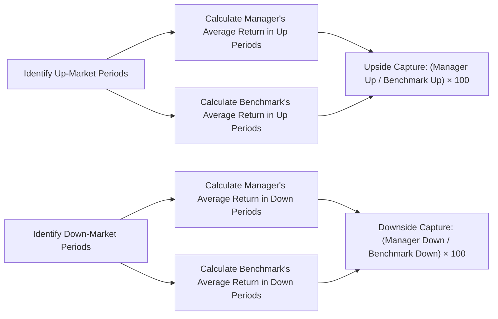
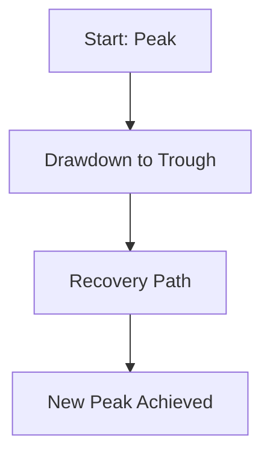

## Introduction

Selecting the right investment manager is a huge piece of the puzzle when building or refining an investment program. If you’ve read the earlier sections in this chapter on the manager selection process and the importance of clear due diligence, you already know how crucial it is to measure both quantitative and qualitative dimensions of a manager’s track record. You also might recall how we discussed (in Chapter 1) the broad toolkit of performance and risk metrics, along with the do’s and don’ts of relying on them.

But how do you zero in on a manager’s ability to capture market returns when times are good—and protect the downside when times are bad? In this section, we’ll focus on three powerful yet surprisingly easy-to-use metrics:

• Capture Ratios (Upside Capture and Downside Capture)  
• Maximum Drawdown  
• Drawdown Duration  

These measures can help you quickly spot a manager’s risk tendencies, gauge their resilience to downturns, and help foresee how they might behave in particularly volatile environments. We’ll break down the math, walk through examples, share a few personal anecdotes to illustrate real-world scenarios, and provide insight into how each measure can fit into your broader evaluation process.

## Understanding Capture Ratios

Capture ratios are commonly split into two complementary measures: Upside Capture and Downside Capture. If you’re reading this for the first time, you might be wondering, "Why do I need two different numbers, not just one?" That’s a fair question—each ratio indicates very different aspects of manager performance.

### Upside Capture Ratio

Upside Capture Ratio measures how much of the market’s positive returns the manager has captured. Generally, managers who exhibit an Upside Capture Ratio greater than 100% are said to have outperformed the benchmark during up-market periods, while managers below 100% lag the benchmark in rising markets. Let’s frame it a bit more conversationally:

• If the market is up 10% over some interval where we consider it an “up market” and your manager’s strategy is up 11% on average, then your manager’s Upside Capture is 110%.  
• Conversely, if that manager only went up 8%, they captured only 80% of the upside.

You might hear managers boast they have “120% upside capture,” meaning they tend to do better than the benchmark in bull markets. That’s great if maximizing gains in an up cycle is your primary goal, but it’s only one side of the story.

### Downside Capture Ratio

Downside Capture Ratio is the counterpart. It indicates how well the manager performs in down markets compared to the benchmark. For instance:

• If the market is down 10% (a negative return period) and your manager is down only 7%, your manager’s Downside Capture Ratio is 70%. A value less than 100% here suggests the manager loses less than the benchmark in falling markets—this is exactly what many risk-conscious investors crave.  
• If the manager is down 12% while the market is down 10%, that’s a 120% capture on the downside (i.e., they did even worse than the benchmark in a down market).

An ideal manager is one with (1) Upside Capture well north of 100%, and (2) Downside Capture well under 100%. Of course, reality never quite matches dreams, but it’s a helpful yardstick. Typically, a manager generating big outperformance in bull markets might also carry higher risk and end up with bigger drawdowns in bear markets. On the flip side, defensive managers might excel at protecting downside but underperform in roaring bull markets. Understanding your own risk tolerance and return objectives is vital to calibrating how you weigh these two metrics.

### How to Calculate Capture Ratios

Although precise definitions vary, a popular formula for these ratios goes as follows:

Let Mᵤ = Average manager return in “up-market” months (or quarters, or years),  
     Bᵤ = Average benchmark return in those same up-market intervals.  

Upside Capture Ratio = ( Mᵤ / Bᵤ ) × 100  

Similarly, for down markets:

Let M_d = Average manager return in “down-market” months,  
     B_d = Average benchmark return in those same down-market intervals (a negative number on average).  

Downside Capture Ratio = ( M_d / B_d ) × 100  

Color-coding this with a quick example might help. Suppose, over the last 10 quarters, 6 of those quarters were “up” for the benchmark and 4 were “down.” We first identify which quarters are up vs. down for the benchmark. Then, for the up quarters only, we aggregate (or average) the manager’s returns and the benchmark’s returns, and do the ratio. Repeat for the down quarters.

Try it with some sample data:

• Benchmark up quarters average: +5%  
• Manager up quarters average: +5.5%  
• Upside Capture Ratio = (5.5 ÷ 5.0) × 100 = 110%

In the down quarters:

• Benchmark down quarters average: –4%  
• Manager down quarters average: –3.6%  
• Downside Capture Ratio = (–3.6 ÷ –4.0) × 100 = 90%

This manager is capturing more upside than the benchmark during bull runs (110%) while losing less (90%) during downturns. On paper, that’s exactly the type of manager many folks look for.

If you want a quick visual that shows how these calculations flow:

By referencing a process flow diagram like this, you can walk through each step carefully, especially if you’re coding or building an internal analytics tool to generate these capture metrics automatically.

### Interpreting Capture Ratios in Manager Selection

• A manager with Upside Capture significantly above 100% might be more aggressive or have a portfolio concentrated in high-beta stocks.  
• A manager with Downside Capture significantly below 100% often demonstrates strong risk management or a more defensive style—perhaps employing a “quality tilt” or significant cash allocation.  
• If a manager’s Upside and Downside Capture are both around 100%, it’s possible they behave much like the benchmark. That could be fine if you simply want replication. But you might wonder: Are you paying active fees for close-to-benchmark performance?  
• Some managers intentionally design strategies such as a "130/30" equity approach that might target a high upside capture and similarly high downside capture. Others, like low-volatility equity managers, might have an intentionally moderate upside capture but a very tight downside capture. Always match the manager's style to your objectives.

## Maximum Drawdown

If you’ve ever taken a steep roller-coaster ride at an amusement park, you know the anxiety of that drop. Maximum Drawdown (MDD) is essentially the scariest drop in your portfolio’s journey—the greatest peak-to-trough decline over a specified period.

### Definition and Formula

Mathematically, maximum drawdown is computed by scanning the historical performance chart, identifying each local peak and subsequent trough, and noting the largest percent drop among them.

If Pₜ is the portfolio value (or index level) at time t, then MDD can be formally expressed as:

MDD = max (for t in [1..T]) [ (Pₚₑₐₖ – Pₜᵣₒᵤgₕ) / Pₚₑₐₖ ]

…where Pₚₑₐₖ is a local maximum in the series. Usually, the result is expressed as a percentage. For example, "the portfolio had a maximum drawdown of 22%."

### Significance of Maximum Drawdown

• MDD reveals the worst-case scenario an investor might have endured during the measurement period.  
• It helps you understand "tail risk" or stress scenarios. If a manager historically had a 45% max drawdown over a five-year period, you might wonder: "Could I psychologically and financially stomach such a decline?"  
• Some managers, especially those focusing on stable returns (like absolute-return funds), frequently emphasize their smaller drawdowns in marketing materials. There’s reason for that: Many investors experience “loss aversion” more strongly than they experience “joy of gains.” So, a historically smaller MDD is a plus for many risk-averse clients.

### A Brief Personal Anecdote

I remember working with a client who was extremely focused on “sleeping at night” with minimal anxiety during bear markets. She was so enamored with a particular manager’s marketing pitch about only a small maximum drawdown in previous years. Then, 2020 came along (which, as we know, had a harrowing market crash in March—albeit a brief one). The manager’s actual drawdown wasn’t as severe as the broad equity market, but it was still much bigger than the client expected, because the prior environment had been relatively benign. This experience drove home for me how important it is to contextualize historical drawdown data. Was the manager tested in truly volatile environments? Because if not, that smaller historical MDD might only reflect favorable market conditions.

### Examining Maximum Drawdown Over Different Periods

• Standard periods range from 3 or 5 years to "since inception."  
• A manager might tout a small MDD in the last 3 years, but if those 3 years were gentle bull markets, that doesn’t tell you how they might behave in a protracted bear market.  
• Observing how a manager’s MDD changed (or improved) over multiple time frames can illuminate whether the manager adapted or if that performance was just luck.  

## Drawdown Duration

Now that you know about maximum drawdown, consider how long it takes to get back to where you started. That time from the portfolio’s peak to reclaiming that peak is the Drawdown Duration. 

• If the portfolio peaked in January and bottomed out in March, then fully recovered its January level of assets by September, that drawdown duration is 8 months in total.  
• Some managers are quick to rebound, indicating either skill or a style that thrives post-downturn. Others remain below their prior peak for an extended period, possibly because of structural biases (e.g., being overweight certain industries that take longer to recover).

### Why Time Matters

Imagine two managers, both with a 20% maximum drawdown at some point:

• Manager A recovers in 6 months.  
• Manager B takes 2 full years.  

As a result, your portfolio’s growth path can look drastically different. A shorter drawdown duration is often viewed favorably, particularly by investors with liquidity concerns or shorter investment horizons.

### Visualizing Drawdown and Recovery

A drawdown chart that captures the "peak to trough to recovery" can be a fantastic way to illustrate performance for an investment committee. Picture a line graph of cumulative returns:

• Segment A→B is your drawdown.  
• Segment B→D is your recovery period.  
• The time from A→D is the drawdown duration.

## Putting It All Together

### Combining Capture Ratios with Drawdowns

Capture Ratios, Maximum Drawdown, and Drawdown Duration each highlight important risk/return dimensions:

1. Capture Ratios: Show how a manager behaves in upward vs. downward market conditions relative to a benchmark.  
2. Maximum Drawdown: Tells you the largest overall decline in absolute terms (not necessarily relative to a benchmark).  
3. Drawdown Duration: Reveals how quickly (or slowly) the manager’s portfolio recovered after the deepest slump.

In practice, an investor might say:

• "I want a manager with a Downside Capture under 90%, or at least significantly less than 100."  
• "I want that manager’s MDD to be no worse than –25% over a 5-year horizon."  
• "I want to see a historically swift bounce-back from the worst periods, say under 1 year on average."

Of course, you’ll rarely find a manager who meets all the dream metrics if you also require them to have consistent alpha in all market conditions. But these metrics help clarify which trade-offs you’re making.

### Contextualizing Market Environments

A big caution: A period with strong equity markets (and low volatility) could skew these stats. For example, a manager with a great downside capture in a relatively calm environment hasn’t truly proven their resilience in a crisis. The same goes for maximum drawdown and drawdown duration—having good stats in stable times does not guarantee success in a future meltdown. It’s wise to pay attention to how a manager fared during major events. 

As an illustration, if you see a manager with a small maximum drawdown from 2019 to the start of 2022, but they also comanaged a strategy in 2008 that did poorly, you might want to carefully examine their strategy changes since that time. They might have learned from 2008 or changed their approach. Or maybe it’s the same approach, and the benign environment from 2019 to 2022 just never tested them in a similarly severe way. Don’t assume the past few years of calm waters indicate a "storm-proof" manager.

## Integrating with Other Performance Measures

Capture Ratios and Drawdown Metrics fit snugly alongside other tools such as:

• Sharpe Ratio and Sortino Ratio (discussed in Chapter 1.11)  
• Manager’s investment style analysis (Chapter 2.3)  
• Alpha, beta, and factor analysis (Chapter 1.13)  

You can’t get a complete picture by looking at any one number; a manager might have a super low Downside Capture but produce sub-par returns overall, or they might have a salutary max drawdown but also have very modest upside. Summaries like the Information Ratio or Sortino Ratio can fill in those performance gaps.

## Applications in Manager Selection

If you’re on an investment committee or advising a client, you’ll likely pair these metrics with the manager’s strategy statements. For instance:

• A hedge fund manager might say, “We aim for consistent returns with minimal downside.” Then, you see an enormous 40% max drawdown in their historical data. That’s a red flag or at least a conversation starter.  
• A high-octane growth equity manager might say, “We focus on innovation-driven names, so expect bigger swings.” Here, you might see an Upside Capture of 130% and a Downside Capture of 110%. That might still be acceptable for some investors who have a high appetite for volatility and a long time horizon.

## Best Practices and Common Pitfalls

• Over-Reliance on Past Data: Even if the manager’s max drawdown was small in the past, it doesn’t guarantee future resilience. Use scenario analysis, stress testing, and talk to the manager about how they handle market turmoil.  
• Benchmark Selection: The capture ratios lose meaning if your benchmark choice is inappropriate or misaligned with the manager’s style. (In Chapter 1.9, we discuss the dangers of benchmark misspecification.)  
• Time Horizon: Evaluate how these metrics fluctuate over different measurement windows. A manager might have a short but spectacular record that doesn’t cover multiple market cycles.  
• Survivorship Bias: If you’re screening managers based on these metrics, be mindful of bias in the database (managers that performed poorly might have disappeared).

## A Quick Real-World Example

Let’s imagine you’re selecting an equity manager for a global equity allocation. You have two finalists with the following metrics (simplified for illustration):

-------------------------------------------
             | Manager A | Manager B
-------------------------------------------
Upside Capture Ratio    | 105%      | 120%
Downside Capture Ratio  | 95%       | 105%
Maximum Drawdown        | –28%      | –35%
Drawdown Duration       | 12 months | 20 months
-------------------------------------------

• Manager A is less aggressive but has a slightly smaller max drawdown and recovers more quickly. Their capture ratios sit near 100% on the downside and above 100% on the upside, indicating they do slightly better in up markets and slightly better at preserving capital in down markets.  
• Manager B cranks out bigger gains in bull markets but also loses more in a crash, and it takes them longer to get back to a new peak.  

Your choice depends heavily on your risk tolerance and time horizon. If your top priority is robust upside growth, maybe you gravitate to Manager B. If you want something more balanced, you might pick Manager A. Or you might say neither meets your preferences, and keep searching. The key is to interpret these metrics in the context of your or your client’s objectives.

## Final Exam Tips

• Understand the mechanics: Be prepared to calculate upside/downside capture ratios from sample data. Practice identifying up vs. down markets.  
• Interpretation questions: On the exam, you may see a question that gives you partial metric sets (e.g., a high upside capture and a high downside capture) and asks you to select the best explanation or manager style.  
• Cross-referencing: The exam might combine these measures with risk-adjusted measures like the Sharpe ratio, or incorporate style analysis challenges from Chapter 2.3.  
• Contextualization: Look for clues about the market environment in the question prompt. If the question highlights a stable environment with no major drawdowns, watch out for potential manager overconfidence.  

Use these metrics to shape a truly comprehensive view, in tandem with a manager’s philosophy, performance patterns, factor exposures, and ongoing due diligence. That’s how you’ll reach a well-rounded, knowledge-backed decision in the real world—and be well-prepared for the CFA Level III exam’s scenario questions.

## References

• “Capture Ratios: A Practical Approach” on Investopedia  
• CFA Institute’s “Measuring Risk in Equity Portfolios”: https://www.cfainstitute.org/  
• “Drawdown Measures in Portfolio Management,” Journal of Investing  

## Test Your Knowledge: Capture Ratios and Drawdown Quiz



### Which statement best describes the Upside Capture Ratio?

- [x] It measures a manager’s performance relative to a benchmark only during up-market periods.
- [ ] It identifies the annualized return relative to standard deviation.
- [ ] It focuses on the manager’s worst drawdown over a specific time.
- [ ] It measures both up- and down-market performance simultaneously.

> **Explanation:** The Upside Capture Ratio specifically evaluates the manager’s returns when the benchmark is rising, comparing how effectively the manager participates in positive market movements.

### Which of the following situations indicates a manager likely underperforms the market in rising conditions?

- [ ] An Upside Capture Ratio of 120%
- [ ] An Upside Capture Ratio of 105%
- [x] An Upside Capture Ratio of 80%
- [ ] A Downside Capture Ratio of 90%

> **Explanation:** An Upside Capture Ratio below 100% (here, 80%) shows the manager captures only 80% of the benchmark’s upside in up-market phases, indicating underperformance when markets rise.

### If a manager’s Downside Capture Ratio is 120%, what does this suggest about the manager’s performance?

- [x] The manager tends to lose more than the benchmark during down-market conditions.
- [ ] The manager outperforms the benchmark during rising markets.
- [ ] The manager’s returns are always greater than the benchmark’s.
- [ ] The manager outperforms the benchmark during falling markets.

> **Explanation:** A Downside Capture Ratio above 100% means the manager loses proportionally more than the benchmark when the market is declining.

### Which measure specifically identifies the longest and deepest peak-to-trough decline over a period?

- [ ] Downside Capture Ratio
- [x] Maximum Drawdown
- [ ] Benchmark Deviation
- [ ] Appraisal Ratio

> **Explanation:** Maximum Drawdown reveals the largest peak-to-trough percentage loss within a specified time frame.

### True or False: A manager with a low maximum drawdown and a long drawdown duration is generally considered more appealing to investors than one with a higher maximum drawdown but a short drawdown duration.

- [ ] True
- [x] False
- [ ] Both can be appealing in different contexts
- [ ] Neither scenario typically exists

> **Explanation:** It depends on the investor’s preference. A low maximum drawdown is good, but a long drawdown duration may be a drawback since it indicates a slower recovery. Some investors might prefer a faster rebound, even if the drawdown is a bit deeper.

### When using Capture Ratios for manager evaluation, an important consideration is:

- [ ] Focusing only on upside capture to ensure the manager outperforms in bull markets
- [ ] Ignoring style or structural biases
- [x] Ensuring the benchmark is an appropriate match for the manager’s style
- [ ] Using only down-market data to assess alpha

> **Explanation:** The accuracy and relevance of Capture Ratios rely on a benchmark that aligns with the manager’s strategy. A mismatched benchmark can distort these ratios.

### Which best describes the Drawdown Duration metric?

- [ ] The time from the portfolio’s inception to its highest peak
- [x] The time it takes for the portfolio to go from a peak, decline to a trough, and recover back to that peak
- [ ] The time between consecutive market downswings
- [ ] The length of time from the portfolio’s worst drawdown until the next one

> **Explanation:** Drawdown Duration measures how long it takes to return to the original peak after suffering a decline.

### An investor comparing two managers sees Manager A has a maximum drawdown of –30% but recovered in 6 months, while Manager B had a maximum drawdown of –25% but took 18 months to recover. Which of these statements is most accurate?

- [x] Manager A rebounded more quickly, so some investors might consider that more favorable despite the deeper drawdown.
- [ ] Manager B is always preferable because their drawdown is smaller.
- [ ] Both managers must have the same downside capture ratio.
- [ ] Manager B’s shorter time frame to recover was overshadowed by the deeper drop.

> **Explanation:** Although Manager B’s maximum drawdown is smaller (–25%), it took longer to recover from the trough. Manager A’s quicker rebound may make them more appealing to certain investors.

### A manager’s Up and Down Capture Ratios are each around 100%. Which statement best describes this manager?

- [ ] This manager always outperforms the market.
- [x] Their performance tends to mirror the benchmark in both rising and falling markets.
- [ ] They are likely an extremely aggressive manager.
- [ ] They are better at downside protection than upside participation.

> **Explanation:** If both ratios hover near 100%, the manager tracks the benchmark closely in up and down markets, performing similarly to the index overall.

### The maximum drawdown metric is often criticized because:

- [x] It provides no information about how long it took to recover from that drawdown.
- [ ] It only measures risk-adjusted returns and ignores absolute values.
- [ ] It fails to incorporate any measure of market beta or alpha.
- [ ] It always overstates a manager’s performance.

> **Explanation:** Maximum Drawdown identifies the largest drop but doesn’t say anything about how quickly (or slowly) the portfolio bounced back. That’s why Drawdown Duration (time to recovery) is also relevant.


