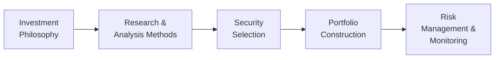

## Introduction and Context

Before we dive into analyzing a manager’s investment philosophy and process, let’s kick things off with a quick personal story. A few years ago, I chatted with a portfolio manager who claimed to be a die-hard “value investor.” He championed the virtues of patience, the importance of balance-sheet strength, and the discipline of a long-term horizon. But—guess what?—his portfolio turnover was off the charts, with positions coming and going faster than I could open my monthly statement. On top of that, many of his picks had lofty price-to-earnings ratios that didn’t jibe with typical “value” metrics. Now, I’m not necessarily saying the manager was wrong. However, the disconnect between his stated belief system and his actual portfolio holdings made me wonder. Successful due diligence on an investment manager begins with understanding whether they truly practice what they preach.

Evaluating a manager’s investment philosophy is basically figuring out how they (and their team) see the markets—and by extension, where they think inefficiencies arise. Are they skilled at uncovering mispriced growth opportunities, or is their edge in applying data-driven, quantitative methods to systematically capture momentum? Then, of course, we want to see how that philosophy actually plays out in their day-to-day processes: from identifying investable assets, to analyzing them, to building a portfolio, and to managing risk. In this section, we’ll go deep into the different philosophies and processes out there, the alignment we should expect between them, the role of judgement, and the potential red flags that might pop up if a philosophy/process mismatch occurs.

## Key Elements of an Investment Philosophy

Investment philosophies are pretty broad in nature. You might run into managers who believe in:

• Value-based approaches: They look for underpriced assets relative to intrinsic worth.  
• Growth-based approaches: They target companies with above-average expansion potential and earnings growth.  
• Factor-based approaches (sometimes labeled “smart beta”): They systematically tilt toward factors like size, value, momentum, quality, or low volatility.  
• Quantitative or systematic models: These managers rely on data-driven algorithms, back-tested signals, and model-based trading.  
• Momentum-based approaches: They chase stocks or assets that have recently performed well, betting on the likelihood of continued high returns in the short to medium term.

Now, each philosophy has its champions. Even so, it’s crucial to determine how the manager has differentiated themselves within that chosen space. For instance, a value manager might have a unique framework for determining fairness in pricing intangible assets (like brand value or intellectual property). A quantitative manager might have specialized data sets that enhance a momentum model. This is also your opportunity to see if the manager’s track record lines up with that stated philosophy. If it doesn’t, you’ll definitely want to dig deeper.

## From Philosophy to Process

An investment philosophy should naturally guide the “how,” or process. If a manager claims to be a value investor, we’d expect them to have a well-defined approach to fundamental analysis—things like financial statement analysis, discounting expected cash flows, or scouring for catalysts that might result in price corrections. Conversely, if they’re a top-down macro-driven allocator, we’d expect them to weigh current and expected economic conditions, central bank policies, or macroeconomic indicators in deciding which sectors to favor or avoid.

Most processes have the following elements:

• Sourcing information and research: Where do the ideas come from? How do they screen potential investments?  
• Analysis of opportunities: Is it purely fundamental, purely quantitative, or some hybrid?  
• Portfolio construction: How do they size positions? How concentrated are they? How do they manage correlations or factor exposures?  
• Ongoing risk management and monitoring: Do they impose strict guidelines for sector or factor tilts? Is there a volatility limit or tracking error target?  
• Exit strategies: Under what conditions do they sell?

Let’s visualize the typical progression from philosophy to process in a flowchart:

In practice, a manager might iterate among these steps, especially if the markets throw in some surprises. Ultimately, the key is consistency: if the philosophy is “long-term value,” you’d expect the trades to reflect that perspective and not morph into short-term speculation.

## The Judgment vs. Systematic Spectrum

Managers can be purely discretionary, purely systematic, or somewhere in between. A purely discretionary manager is the type who might say, “I’ve got decades of experience in this sector, and my intuition tells me this stock is oversold.” Meanwhile, a purely systematic manager points to robust data analysis, back-tested signals, and minimal emotional involvement in decisions.

• Discretionary approach:  
  – Strengths: Can adapt quickly to regime changes, incorporate nuanced information, rely on experience and intuition.  
  – Weaknesses: Susceptible to behavioral biases, overconfidence, emotional mistakes, or “key-person risk.”  

• Systematic/model-driven approach:  
  – Strengths: Data-driven, consistent, can handle large amounts of info quickly, less prone to “gut feeling” errors.  
  – Weaknesses: Model risk (if the model is poorly designed or the environment changes), potential overfitting, reliance on historical patterns that might not hold in the future.

It’s handy to ask how a manager modifies or rebalances their models, especially during a market drawdown. Do they keep faith in their systematic approach, or do they “switch off” the model at the first sign of trouble? A consistent manager typically formalizes thresholds for overriding the model—or might say they never override. In an exam scenario, watch out for a scenario where the manager claims “no discretionary overrides” but then is found to have turned off the system mid-crash. That’s a potential mismatch between philosophy and reality.

## Macro, Sector Rotation, and Security Selection

Different managers weigh macro signals differently. You’ll see top-down managers focusing on broad economic data (e.g., GDP growth, inflation, central bank policy, consumer sentiment) to tilt exposures among regions, countries, or sectors. Meanwhile, bottom-up managers concentrate on individual company fundamentals. Some combine both—perhaps starting with a broad macro view but layering on fundamental analysis to pick the best stocks within favored sectors.

A typical question to ask: “Where in your process do macroeconomic data and forecasts come into play?” If the manager claims to be purely bottom-up, you wouldn’t expect a lot of sector rotation or market-timing calls. If they are top-down, you’ll want to see structured processes for forming macroeconomic opinions and translating them into asset-class or sector tilts.

## Investable Universe and Screening Criteria

Another big piece of the puzzle: what does the manager’s investable domain look like? For instance, a global equity manager might limit themselves to developed markets and exclude emerging markets. Or they might set screening criteria like “market cap greater than $1 billion” or “minimum daily trading volume of 100,000 shares.” Meanwhile, a fixed-income manager might focus on investment-grade bonds in G7 countries only, or they might stray into high-yield or emerging-market debt.

In performing due diligence, we want to see if the manager’s screens and constraints align with their stated philosophy. For example, a manager claiming a “deep-value” approach typically screens for low price-to-book or price-to-earnings ratios. If their actual screen excludes all companies with declining earnings, that might conflict conceptually with “deep-value,” which sometimes involves businesses in transitional or cyclical downturns. The manager should be able to articulate exactly why their filters are set the way they are.

## Consistency During Market Stress

It’s easy to talk about discipline and long-term views when markets are frothy or everything is hunky-dory. But the real test comes when volatility spikes, liquidity dries up, or the economy tanks. Do they deviate from their models or processes? Under what conditions? Sometimes, a manager who claimed to be buy-and-hold suddenly rotates in and out of positions in a panic, which might create a mismatch with their stated approach.

Evaluating consistency doesn’t mean that managers can’t adapt or refine their views—of course they can. But we do need to see that changes are reasoned, documented, and fit into a well-defined framework. A manager with a strong sense of discipline typically does better during tough markets, precisely because they have a grounded approach to how they handle risk and opportunities.

## Research Approach and Platform Support

A manager’s philosophy should be underpinned by robust research. For instance, a fundamental manager’s research approach might involve reading financial statements, meeting with company management, or building discounted cash flow (DCF) models. Do they have enough analysts? Do they have access to the tools (e.g., data terminals, software) they need to implement these models? Organizational support is also key. A manager might have a great philosophy, but if they lack the resources or staff to carry out the necessary research, the philosophy might translate into incomplete or inconsistent execution.

For systematic managers, we want to examine the thoroughness of their back-testing, their data cleansing methods, and the “out-of-sample” testing approach. We also want to know if they’ve accounted for transaction costs, market impact, and possible slippage in their models. Fancy algorithms alone can’t deliver alpha if the real-world friction is ignored.

## Risk Controls and Overlays

No matter the philosophy, controlling risk is obviously huge. Managers typically set exposure limits to ensure they don’t inadvertently take on too much concentration risk—for instance, if a manager’s “value” picks all come from the same sector, that might be a red flag. Sometimes, they’ll use derivative overlays to manage interest rate risk, currency risk, or factor tilts. The presence (or absence) of these overlays can speak volumes about how integrated the risk management is with the manager’s core strategy.

In a typical scenario, you’ll see statements like “We limit unhedged foreign-currency risk to 10% of the overall portfolio” or “We require that no single sector exceed 20% of the portfolio’s net exposure.” The question is whether these guidelines are enforced systematically or at the discretion of the portfolio manager. If it’s purely discretionary, that’s not always a deal-breaker, but it does mean you need to confirm how it lines up with their stated approach. If they’re purely systematic, you’d expect them to have coded rules that automatically trigger when certain risk thresholds are reached.

## Best Practices in Evaluating Manager Philosophy and Process

• Ask for specific, recent examples of the process flow: how did the manager handle the last rate hike or credit blowout?  
• Review documentation: look at the manager’s internal investment policy statements or process manuals to see if they match the marketing pitch.  
• Check holdings for consistency: a portfolio’s composition can reveal if the manager is actually implementing their stated beliefs (e.g., a “value” manager holding extremely high price-to-book stocks).  
• Evaluate the research and staffing: does the team have enough bandwidth and resources to deliver on the strategy? This is especially relevant for sophisticated or global strategies that require broad coverage.  
• Study performance attribution: a thorough performance attribution analysis (see also Section 1.4 in Chapter 1) can help isolate the sources of alpha—did it come from factor bets, market timing, security selection, or something else?

## Common Pitfalls and What to Watch Out For

• Mismatched talk vs. action: Many managers talk a good game, but the portfolio reveals a different style.  
• Overly heroic back-tests: If a manager is systematic, watch out for back-tests with suspiciously stellar metrics—particularly if there’s no robust out-of-sample testing or realistic transaction cost assumptions.  
• Personality-driven risk: If the strategy is heavily dependent on a single star manager, find out what happens if that person departs. Are there processes in place or a deep bench of talent?  
• Style drift: Over time, a value manager might turn into a “growth at a reasonable price” manager. That’s not necessarily bad, but it’s essential to understand how or why it happened—did the philosophy evolve, or is it simply chasing performance?  
• Lack of risk management: A manager might have a stellar research process but no robust risk controls, which can lead to big drawdowns.

## A Brief Case Study

Imagine a medium-sized equity manager, “GreenEdge Capital,” that markets itself as an environmental, social, and governance (ESG)-focused value strategy. They claim to buy companies trading below internal fair-value estimates, with strong ESG scores, intending to hold them for the long term. However, you review their portfolio and notice:

• Average holding period is three months.  
• Several holdings with questionable ESG controversies.  
• The price multiples of their core positions exceed the market average.

So what’s going on? Perhaps the manager is actually practicing a short-term momentum strategy or ignoring their stated ESG guidelines to chase returns. This highlights the importance of verifying alignment among stated philosophy, holdings, performance patterns, and documented processes.

## Exam Tips and Practical Insights

When you see a question on the CFA Level III exam about manager selection, especially an item-set question, look for clues in the narrative that show alignment (or misalignment) between philosophy and process. Watch for red flags such as:

• Inconsistent statements on turnovers vs. holding period.  
• Portfolio characteristics not fitting the style the manager claims.  
• References to the manager ignoring their own risk guidelines.  
• Overreliance on short-term performance metrics or ignoring the bigger picture.  

Remember, the exam can test how well you connect these dots. If the question is about evaluating how well a manager is executing on their stated approach, you might reference performance attribution (Chapter 1, Section 1.4), manager due diligence techniques, or risk management frameworks. Make sure to incorporate the manager’s context—like capacity constraints (see Section 2.12), or the manager’s fee structure (discussed in Section 2.9)—to provide a holistic perspective.

## Conclusion

Evaluating a manager’s investment philosophy and process is about more than just checking a box. You really want to see that the process is a natural extension of the philosophy, and that the manager has the tools, personnel, and discipline to stay consistent—especially when market waters get choppy. By scrutinizing the research methodologies, the portfolio composition, and the risk protocols, you can filter out the managers who say one thing but do another. After all, we want to ensure that the manager’s beliefs about the markets aren’t just a marketing pitch but rather a genuine, sustainable approach to generating returns in line with your own investment objectives.

Always keep one eye on potential mismatches or inconsistencies. A manager’s brilliance can be overshadowed if they systematically deviate from the approach they claim to follow. As you study further for the CFA Level III exam, you’ll find that these subtle alignments between philosophy and process often underlie the difference between consistent, long-term outperformance and erratic performance that leaves clients scratching their heads.

## References for Further Study

• Ellis, C.D. (2013). Winning the Loser’s Game: Timeless Strategies for Successful Investing.  
• CFA Institute Research Foundation (n.d.). Investment Philosophies and Their Impact on Portfolio Performance.  
• Chapter 1 of this Volume, especially Section 1.4 on Performance Attribution Approaches.  
• Chapter 2 of this Volume, especially Section 2.12 regarding capacity constraints.  
• The CFA Institute Code of Ethics and Standards of Professional Conduct.  

## Test Your Knowledge: Evaluating Manager Philosophies Quiz



### 1. A manager who claims to be a “long-term, buy-and-hold investor,” but whose portfolio turnover is extremely high, is likely illustrating:  
- [ ] Aligned execution of stated philosophy  
- [x] Mismatch between stated philosophy and actual practice  
- [ ] Superior performance due to frequent trading  
- [ ] Sound risk management preventing drawdowns  

> **Explanation:** A high portfolio turnover conflicts with a “buy-and-hold” claim, indicating a discrepancy between words and actions.

### 2. Which of the following is an advantage of a purely systematic (model-driven) approach?  
- [ ] It cannot be affected by changes in market conditions  
- [x] It removes certain human biases like overconfidence or panic-selling  
- [ ] It requires minimal data or technology infrastructure  
- [ ] It is always superior to a discretionary approach  

> **Explanation:** Systematic approaches rely on data and established rules, which help remove some emotional biases. However, they can still wander off-track if the model is poorly designed or market conditions shift in ways not captured by historical data.

### 3. If a manager emphasizes macroeconomic trends, interest rate forecasts, and sector-level positioning before selecting individual securities, they would be described as using:  
- [x] A top-down approach  
- [ ] A bottom-up approach  
- [ ] A purely fundamental approach  
- [ ] A momentum-only style  

> **Explanation:** Top-down managers begin their selection process by analyzing macroeconomic and sector trends, later narrowing down to individual securities.

### 4. Which aspect is most indicative of thorough organizational support for a given investment philosophy?  
- [ ] A single, star portfolio manager who makes every decision  
- [x] Sufficient budget and staff dedicated to research and data analysis  
- [ ] Frequent changes in guidelines to match current market hype  
- [ ] Minimal documentation on research workflows  

> **Explanation:** If the manager’s philosophy relies on deep research, there must be adequate resources, technology, and personnel to execute it well.

### 5. How might one best detect a manager’s style drift over time?  
- [x] Compare current portfolio exposures and performance drivers to those from previous periods  
- [ ] Read the manager’s marketing materials for investor relations  
- [x] Conduct factor-based performance attribution to see if exposures changed  
- [ ] Observe whether the manager’s name or branding changed  

> **Explanation:** Style drift can be observed by changes in factor exposures and the shift in portfolio characteristics vs. the original stated philosophy. Factor attribution and historical holdings are excellent tools to detect it.

### 6. A manager who states they hedge all foreign currency exposures but whose portfolio shows significant unhedged positions in emerging market currencies is displaying:  
- [x] Inconsistency between process and implementation  
- [ ] A factor tilt strategy  
- [ ] A momentum-based currency overlay  
- [ ] Superior currency forecasting capability  

> **Explanation:** If the manager claims “we always hedge” but the actual portfolio data shows unhedged exposures, that suggests inconsistency or inadequate governance around their process.

### 7. When evaluating a quantitative strategy’s performance claims, the most critical aspect to examine is:  
- [ ] Marketing materials highlighting the best back-test  
- [ ] Proprietary model details not shared publicly  
- [x] The presence of robust out-of-sample testing and realistic transaction cost assumptions  
- [ ] The manager’s confidence in the model  

> **Explanation:** Fancy back-tests can be overfitted. Out-of-sample testing, realistic cost assumptions, and stable performance across different periods are important signs of a robust model.

### 8. A manager’s consistent response to market stress periods (following the same disciplined approach) suggests:  
- [x] That the manager’s philosophy and process are genuinely aligned  
- [ ] Poor adaptation to changing conditions  
- [ ] A reliance on marketing materials  
- [ ] No understanding of risk management  

> **Explanation:** Consistency in approach (and well-documented rationale for changes) under market stress is strong evidence that the manager adheres to their stated philosophy.

### 9. Which of the following statements is most relevant when evaluating a bond manager’s investment philosophy and process?  
- [ ] “We only invest in emerging market equities that show momentum.”  
- [ ] “Our entire portfolio is equities traded on margin.”  
- [x] “We carefully assess duration, credit risk, and interest rate forecasts before investing.”  
- [ ] “We hold no constraints on maturity or credit rating.”  

> **Explanation:** A bond manager typically looks at duration, credit spreads, and the yield curve dynamics. This statement aligns with a thoughtful approach consistent with a bond-specific philosophy.

### 10. True or False: A manager’s stated investment philosophy should dictate all facets of its research approach, portfolio design, and risk management practices in a fully consistent manner.  
- [x] True  
- [ ] False  

> **Explanation:** The philosophy sets the overarching framework. Processes (research, trading, risk controls) must align with this framework to ensure coherence and effectiveness.


