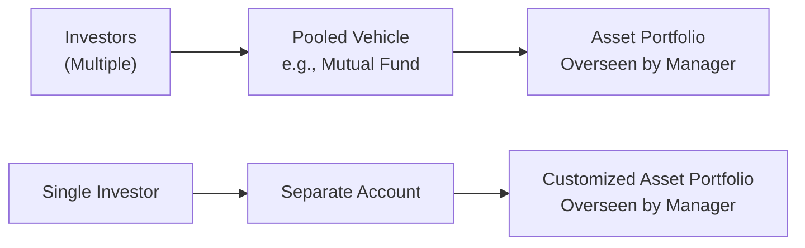
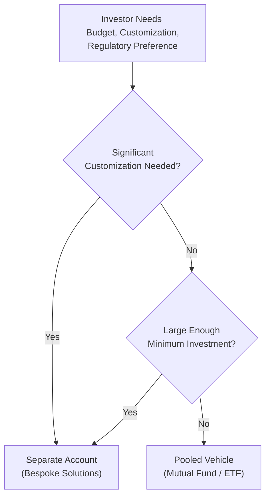

## Overview and Context

So, maybe you’ve been chatting with a colleague or reading financial news, and you keep hearing about “pooled vehicles” versus “separate accounts.” This is definitely not just insider jargon. If you’re working through the CFA® curriculum, you know that the difference between these two approaches can make a world of difference for institutional and even individual investors. I remember years ago—way before the industry gave me a few grey hairs—a friend asked me why on earth a large pension plan would choose a custom separate account instead of a big mutual fund. I was honestly a bit stumped then, so I dove deeper. What I found was that each structure has its own merits, complexities, and cost implications. 

Below, we’ll unravel some of these differences, focusing on how pooling and separate accounts affect investment manager selection, performance measurement, and the strategic alignment with an investor’s unique needs.

## Foundations of Pooled Investment Vehicles

Pooled investment vehicles bring together capital from multiple investors under a shared mandate or strategy. Examples include mutual funds, exchange-traded funds (ETFs), commingled funds, and certain hedge funds or private equity funds. By design, pooled vehicles spread operating costs across many participants, providing economical access to professional management and diversification.

### Key Characteristics

• Shared ownership: Multiple investors each hold proportional units (or shares) of the fund. An investor’s ownership is typically expressed as a percentage of total assets under management (AUM).  
• Standardized strategy: The fund manager outlines a unified investment strategy, often documented in the fund’s prospectus or offering memorandum. There is minimal to no customization available for a single investor’s preferences (e.g., ESG themes or specific sector exclusions).  
• Potential for lower minimums: Because the fund aggregates many investors, individual entry minimums can be quite modest. This makes pooled vehicles attractive to smaller investors, retail participants, or institutions with limited capital earmarked for a strategy.  
• Economies of scale: Operating costs—like custody, regulatory filings, or auditing—are spread across potentially thousands of investors. This can shrink the per-investor expense ratio. Mutual funds and ETFs, for instance, typically report expense ratios that reflect these operational efficiencies.  
• Liquidity considerations: Many mutual funds offer daily liquidity; ETFs even trade continuously during market hours. However, some pooled vehicles (especially hedge funds and private equity) impose lockup periods, gating provisions, or redemption schedules.  
• Regulation: Depending on the fund domicile, pooled vehicles must meet standardized regulatory requirements (for instance, the Investment Company Act of 1940 in the United States for mutual funds or UCITS in Europe for certain cross-border funds). These frameworks often require transparency in fees, strategies, reporting frequency, and marketing practices.  

### Practical Illustration

Let’s say you and a few hundred other investors each have a small pool of capital to invest. Instead of hiring your own manager (which can be costly), you all invest in a mutual fund. The fund’s manager invests in a diversified basket of equities, and everyone pays management fees proportionally. It’s straightforward and cost-effective. However, if you’re a large endowment or a foundation needing a specialized approach—like tilts toward private assets or certain ESG screens—you may find a mutual fund’s standardized (and fairly rigid) approach somewhat limiting.

## Separate Accounts: Individualized Mandates

Separate accounts, on the other hand, are dedicated portfolios managed for a single investor—often an institution but sometimes ultra-high-net-worth individuals. In this scenario, the manager can tailor the investment strategy to match the specific client’s objectives and constraints. It might allow for customized environmental, social, and governance (ESG) screening, or unique tax strategies tailored to that investor’s jurisdiction. Basically, you’re the boss, and the manager builds something specially for you.

### Core Features 

• Customization: You can specify how to handle taxes, exclude certain assets for ethical reasons, or incorporate specialized derivative overlays.  
• Transparency: You see exactly what you hold in the account, and you usually see it in near real-time. This helps with real-time risk monitoring, as well as detailed performance attributions (for instance, see Chapter 1.3 and 1.4 on the intricacies of performing returns-based vs. holdings-based attribution).  
• Larger minimum size: Setting up a separate account means the manager will incur additional operational burdens, such as creating custom documentation, accounting databases, and risk analytics. Therefore, the manager imposes higher minimums to ensure it’s worth the overhead.  
• Fees: Management fees for separate accounts can be negotiated. If you’re a large institutional investor, you might push for a break on the standard fee schedule. Alternatively, separate accounts sometimes incorporate performance-based fees, subject to high-water marks or hurdle rates to align manager interests with the client’s objectives.  
• Operational complexity: With a separate account, the investor and manager must maintain robust communications. That includes ongoing instructions for rebalancing, mandated constraints, and so forth. Recordkeeping can be elaborate because the manager must reflect trades, fees, and tax implications for just one client instead of a shared pool.  
• Manager capacity: Some managers limit how many separate accounts they will take on. They must prioritize overall capacity for effective portfolio management. Large institutional investors may find themselves on waitlists if their desired manager’s capacity is already filled.  

### Personal Anecdote

I used to manage a separate account for a mid-size nonprofit that was extremely concerned about any exposure to tobacco stocks. They also wanted to exclude companies that used certain manufacturing processes. This “values-based” overlay was nearly impossible to implement using a standard mutual fund. So, the separate account approach was a lifesaver for them. Sure, it was slightly more expensive, but they could sleep at night knowing they held zero tobacco-related positions or other restricted holdings.

## Visualizing the Structures

Below is a quick Mermaid diagram to illustrate the difference between multiple investors feeding into a single pooled vehicle and a single investor holding a separate account:

In the pooled vehicle (left side), many investors share the exact same portfolio. On the right side, a single investor’s capital is placed into a custom-tailored portfolio.

## Key Comparisons: Operational and Managerial Aspects

### Minimums and Accessibility

• Pooled Vehicles: Minimum investments can be as low as a few hundred or a couple of thousand dollars (especially for certain mutual funds).  
• Separate Accounts: Minimums often stretch into the millions, making these vehicles largely the domain of institutions, endowments, family offices, or ultra-high-net-worth individuals.

### Customization and Constraints

• Pooled Vehicles: Mandates are standardized, and investor influence over holdings, sector weights, or risk budgets is minimal.  
• Separate Accounts: The client can set unique policy constraints. For instance, the investor has the say on whether to incorporate futures overlays or to factor in certain styles or ESG concerns.

### Fee Structures

• Pooled Vehicles: Typically a fixed management fee plus any other embedded fund costs; sometimes performance fees in hedge fund structures or private equity.  
• Separate Accounts: Negotiable; might include a base fee plus a performance fee. High-water marks, clawbacks, or hurdle rates can be negotiated depending on the client’s bargaining power.

### Liquidity and Redemption Features

• Pooled Vehicles: Mutual funds and ETFs offer daily liquidity; hedge funds often impose a quarterly or annual redemption schedule plus a lockup period.  
• Separate Accounts: Potentially more flexible. However, the underlying assets might not always be liquid (e.g., in a private credit or real estate separate account). But the investor typically has more direct input on liquidation strategies.

### Performance Measurement Nuances

• Pooled Vehicles: Performance measurement is standardized and reported on a net-of-fees basis. Investors typically see an NAV (net asset value) that updates daily, weekly, or monthly.  
• Separate Accounts: Measurement can be deeply customized. Investors might request performance attribution by sector, tax lot, or factor exposures. They can incorporate specific risk metrics aligned with the client’s objectives. (For a deeper look, see Chapter 1.14 on multi-period performance measurement considerations.)

Below is an example numeric table summarizing some of these attributes:

| Feature                      | Pooled Vehicles               | Separate Accounts                   |
|-----------------------------|-------------------------------|-------------------------------------|
| Ownership Structure         | Shared with many investors    | Dedicated to one investor           |
| Minimum Investment          | Low (often retail-friendly)   | High (institutional or HNW)         |
| Customization               | Limited                        | High (constraints, tax, ESG)        |
| Fees                        | Standardized expense ratios    | Negotiable, may include performance |
| Liquidity                   | Commonly daily or periodic     | Depends on mandate, typically more flexible |
| Regulatory Framework        | Standard regulations (e.g., 1940 Act) | Client-driven agreements + local regs |
| Transparency                | NAV, holdings disclosed periodically | Full holding-level transparency      |

## Capacity Considerations

One of the less obvious but very real constraints is the manager’s capacity. If you think about it, a manager can only handle so much capital before their strategy becomes unwieldy—especially in less liquid markets. Pooled funds can sometimes absorb large flows (think of massive global equity funds with tens of billions in AUM). However, specialized or niche managers (particularly in small-cap, certain credit markets, or alternative spaces) may put capacity limits in place.

• Separate Accounts: Because each separate account demands bespoke attention, managers will set a cap on the number of mandates or total assets. This ensures they can properly serve each client.  
• Pooled Vehicles: While they also have capacity constraints, many large pooled strategies can handle inflows more easily, using well-established trading pipelines and diversified portfolios.

## Regulatory and Legal Frameworks

### Standardized Regulations for Pooled Vehicles

Mutual funds, ETFs, and UCITS come under well-defined regulations for investor protection. For example, in the United States, the Investment Company Act of 1940 governs advertising, disclosure, and permissible investment activities in registered mutual funds. For many investors, that regulatory clarity sparks confidence. The manager’s obligations are spelled out, and the investor is assured a certain level of transparency (prospectus, semiannual or annual reports, etc.).

### Tailored Agreements for Separate Accounts

Separate accounts often operate under an Investment Management Agreement (IMA) negotiated directly between the manager and the client. Here, the regulations are less standardized, though overall fiduciary duties and local legal requirements still apply. The IMA can specify guidelines on permissible assets, risk budgets, performance objectives, constraints, and termination clauses. Because it’s customized, the investor must be diligent in ensuring it includes all relevant terms—like how performance fees are calculated or how disputes get resolved.

## Subscription and Redemption Policies

### Pooled Vehicles

• Open-End Funds (e.g., daily liquidity mutual funds): Investors can subscribe and redeem daily at NAV.  
• Closed-End Funds: Shares trade on an exchange, and liquidity depends on the market.  
• Hedge Funds: Typically offer subscription windows (e.g., monthly or quarterly) and specify gating provisions or lockup periods, limiting how quickly capital can be withdrawn.

### Separate Accounts

In principle, you can redeem whenever you want—after all, it’s your money in a dedicated account. But if the separate account holds illiquid securities (maybe an emerging market debt strategy or direct property), immediate redemption might be impractical or costly. Usually, the manager sets a notice period or invests in assets that match the investor’s expected liquidity needs.

## Performance Measurement and Reporting

Performance measurement is often simpler in pooled vehicles because, well, everyone sees the same returns, net asset value, and standardized statements. With separate accounts, though, you have the flexibility to define just about any performance dimension you care about—sector performance, geographic exposures, factor tilts, or a custom benchmark that closely mirrors your policy portfolio or liability structure. 

When evaluating manager skill for a pooled vehicle vs. a separate account, the underlying data can differ in granularity:

• Pooled Vehicle: Typically monthly or quarterly fund fact sheets, plus a standard benchmark.  
• Separate Account: Potentially daily or real-time transaction data and the ability to generate sophisticated, user-defined performance attributions.

(For more on performance attribution, see Chapter 1.1–1.5, which explore how these tools help investors parse out where returns come from—be it sector rotation, security selection, or factor exposures.)

## Practical Implementation Scenarios

### Institutional Pension Fund Example

Suppose a pension fund with $10 billion in assets invests $500 million in a global equity strategy. If the fund invests via a commingled mutual fund, it’ll share the manager’s approach with other institutions and retail investors. This yields cost efficiencies. However, if the pension’s investment policy demands a custom ESG screening that excludes certain carbon-intensive industries, the pension might insist on a separate account. This ensures the manager invests exactly according to their policy while also giving them more detailed reporting and integrated risk management.

### Individual High-Net-Worth Case

A wealthy individual with significant assets might find a mutual fund too broad or lacking certain estate-planning efficiencies. By establishing a separately managed account, the individual can tax-loss harvest in a more controlled manner. They see the exact cost basis of each holding, which helps them optimize capital gains and tax liabilities over time.

## Mermaid Diagram: Decision Path

Below is a second Mermaid diagram illustrating a simplified decision tree for organizations or individuals deciding whether to go with a pooled investment vehicle or a separate account:

• If you don’t need heavy customization and don’t meet high minimums, a pooled vehicle is typically the best bet.  
• If you do need heavy customization and can meet the manager’s separate account minimum (or have enough bargaining power), you likely end up with a separate account arrangement.

## Exam Tips, Best Practices, and Pitfalls

• Align with Investor Objectives: The biggest pitfall is misalignment. If you need a high degree of customization but opt for a basic pooled vehicle, you could end up with exposures that violate your constraints or fail to meet your objectives.  
• Consider Capacity and Fees: Another common pitfall is ignoring manager capacity. You don’t want to invest in a fund or separate account that’s about to close to new assets. Learn about those capacity constraints early. Also, watch out for layered fees in pooled vehicles (especially funds-of-funds).  
• Monitor Regulatory Impact: In a separate account, the manager’s performance can be more flexible, but the investor loses the standardized protections of mainstream fund vehicles. Make sure you nail down those responsibilities in the Investment Management Agreement.  
• Evaluate Tax Implications: If you’re in a high-tax jurisdiction, a separate account might allow for tax optimization strategies. That said, smaller investors typically can’t justify the added complexity.  
• For the Exam: You might encounter item sets describing an institutional client’s unique constraints—maybe an ESG overlay or certain tax sensitivities. The question might ask whether a pooled vehicle or separate account is more suitable—and why. Pay attention to the details: required minimums, customization demands, manager capacity, liquidity needs, and cost structure.

## Conclusion

Pooled investment vehicles and separate accounts are two ends of the spectrum: one offers standardized, cost-effective access to professional management; the other provides a fully customized solution for nuanced objectives. Neither is inherently better; it all depends on the investor’s size, sophistication, operational preferences, and the complexity of their investment policy. 

In the final analysis, the manager selection decision hinges on balancing these factors: scalability, cost efficiency, regulatory environment, customization demands, and the investor’s ability to handle the administrative burdens. 

Remember, if you do go with a separate account, read your Investment Management Agreement carefully—no shortcuts. And if you lean on a pooled vehicle, be sure you’re comfortable with the fund’s stated strategy and liquidity terms. After all, no one wants a gating provision surprise when they need to withdraw capital quickly.

## References

• Russell Investments, “Global Variations in Institutional Pooled Accounts” (industry white paper).  
• CFA Institute, “Managing Investment Portfolios,” for in-depth reviews of structural comparisons and portfolio construction implications.

--------------------------------------------------------------------------------

## Test Your Knowledge: Pooled Vehicles vs. Separate Accounts



### When compared to pooled investment vehicles, separate accounts typically offer which key advantage?

- [ ] Lower management fees due to economies of scale 
- [x] Greater flexibility to customize investment constraints 
- [ ] Reduced regulatory complexity for investors 
- [ ] Automatic daily liquidity with minimal restrictions 

> **Explanation:** Separate accounts allow investors to customize investment guidelines, tax strategies, and ESG overlays, which is not typically possible in a pooled vehicle that follows a uniform strategy.

### In the context of recommended minimum investments, which statement is most frequently accurate regarding separate accounts?

- [ ] They generally have no specific minimum. 
- [x] They often require substantially higher minimum investments compared to mutual funds. 
- [ ] They typically require no more than a few thousand dollars. 
- [ ] They prohibit institutional investors from participating. 

> **Explanation:** Separate accounts generally demand higher minimums to justify the individualized attention and administrative setup required.

### An investor concerned with a fund’s gating provisions is most likely evaluating which type of pooled vehicle?

- [x] Alternative vehicles such as hedge funds 
- [ ] Daily-trading open-end mutual funds 
- [ ] Money market funds 
- [ ] Regulated ETFs 

> **Explanation:** Gating provisions are frequently associated with hedge funds or certain private investment vehicles, where redemptions may be limited or subject to lock-up periods.

### Which of the following best encapsulates the regulatory environment for separate accounts?

- [ ] Subject to the same strict rules as mutual funds 
- [ ] No oversight from any legal or fiduciary standards 
- [x] Primarily governed by a customized Investment Management Agreement and fiduciary duties 
- [ ] Enforced daily NAV reporting 

> **Explanation:** Separate accounts revolve around a direct relationship between manager and investor, governed by a negotiated agreement and the manager’s fiduciary obligations, rather than uniform mutual fund regulations.

### Which is the principal reason large institutional investors might prefer a separate account over a commingled fund?

- [x] Enhanced control over portfolio holdings and mandates 
- [ ] Guaranteed lower fees 
- [x] Ability to incorporate specialized risk overlays 
- [ ] The manager is not subject to performance scrutiny 

> **Explanation:** Institutions might opt for separate accounts to gain both control (customization) and specialized overlays or risk constraints. However, they may or may not secure lower fees, depending on negotiation.

### A key operational difference between open-end mutual funds and separate accounts is:

- [x] Open-end mutual funds automatically provide daily liquidity, while separate accounts may not. 
- [ ] Separate accounts always have superior liquidity. 
- [ ] Investors in open-end mutual funds can impose individual ESG screens. 
- [ ] Separate accounts typically require no formal documentation of constraints. 

> **Explanation:** Mutual funds let investors redeem at the daily NAV. Separate accounts might hold large or illiquid positions, and redemptions would need to be managed more carefully.

### When considering capacity constraints, which situation might signal the manager’s preference for pooled vehicles over separate accounts?

- [x] The manager wants to reduce administrative burden from multiple customized mandates. 
- [ ] The manager needs to address each client’s ESG requests individually. 
- [x] The manager finds tracking each client’s real-time tax status beneficial. 
- [ ] The manager is uncertain about how to attract new clients with smaller balances. 

> **Explanation:** Pooled vehicles often streamline operational complexity by grouping investors under one strategy. Separate accounts require custom mandates and can be more labor-intensive.

### Why might a hedge fund structured as a pooled investment vehicle implement lockup periods for new investors?

- [x] To manage liquidity for potentially illiquid or longer-term strategies 
- [ ] To comply with daily redemption policies 
- [ ] To simplify regulatory reporting 
- [ ] To circumvent performance-based fee regulations 

> **Explanation:** Hedge funds commonly use lockups to ensure capital stability for strategies that involve less liquid assets or longer investment horizons.

### Which advantage do pooled vehicles typically have over separate accounts from an expense standpoint?

- [x] Economies of scale that may lower the overall expense ratio 
- [ ] No fees of any kind 
- [ ] Quarter-to-quarter performance-based expenses only 
- [ ] Unlimited ability to waive administrative costs 

> **Explanation:** Because management fees and administrative expenses are shared by multiple investors, pooled funds often provide cost efficiencies.

### A manager must apply an investor’s specific tax-loss harvesting strategy to manage capital gains effectively. Is this better addressed in a pooled vehicle or a separate account?

- [x] True: Separate accounts allow for individualized tax strategies. 
- [ ] False 

> **Explanation:** Separate accounts can accommodate personalized tax strategies (like tax-loss harvesting) because each investor’s holdings can be managed distinctly, which is not feasible in a pooled vehicle where assets are commingled.


