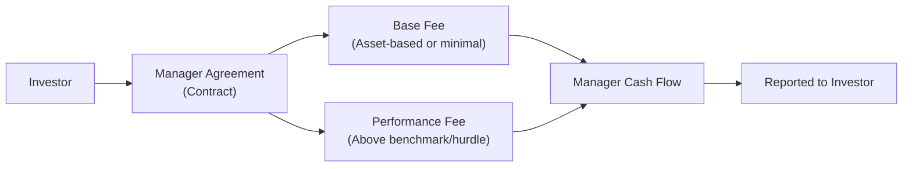

Introduction  
Hey, folks—ever wonder how your portfolio’s performance might be impacted not just by market moves but also by the way you pay your investment manager? I was chatting with a friend not too long ago who was frustrated with paying what she felt was a hefty annual fee no matter how her manager performed. And I’ve heard so many versions of that story from institutional and retail investors alike—well, guess what? The structure of your investment management contract can definitely tilt the scales for or against you.

Let’s take a friendly but thorough dive into the main types of investment manager contract structures. We’ll look at key incentives, potential conflicts of interest, best practices, and some real-world examples. By the end of this section, you’ll be able to decipher which arrangement might fit best for your scenario (or that of your client) and how these structures can shape behavior, fees, and performance outcomes.

Overview of Common Structures  
Managers typically enter into contracts with clients specifying compensation, performance objectives, and legal obligations. Contracts also govern how easy or difficult it is to end or reassign a relationship, allocate responsibilities, and handle contingencies like poor performance or regulatory changes. While the full list of contract structures is extensive, three main fee models appear time and again:

• Flat Fee (Asset-Based Fee)  
• Performance-Based Fee  
• Full Performance Arrangement

Before we discuss each structure’s pros and cons, it’s worth emphasizing that fee models aren’t merely about “paying for services.” They drive manager behavior, risk-taking, and alignment (or misalignment) with client objectives. In the wrong arrangement, managers might be motivated to chase returns in ways that don’t serve the client. Let’s check them out, one by one.

Flat Fee (Asset-Based)  
An asset-based fee model is probably the most straightforward. You, as the client, pay the manager a set percentage of assets under management (AUM). It might look like this:

• 1% annual fee on your portfolio’s average daily balance  
• 0.75% annual fee on month-end balances, payable quarterly  

Clients like that it is predictable. You know you’re paying 0.75% or 1% or whatever the arrangement might be, and it’s easy to budget. This is especially common if you have a stable relationship or plan to keep assets invested for a long time. However, let’s be honest: an asset-based fee might not perfectly align the manager’s incentive with performance. If the manager is guaranteed 1% of AUM, it doesn’t matter (from a fee standpoint!) if the returns are amazing or if they’re subpar. On top of that, as your assets grow—due to market gains, not necessarily skill—the manager’s compensation automatically increases.  

Example Scenario  
Let’s imagine you have a $10 million portfolio. The agreed-upon fee is 1%. That’s $100,000 a year. If the manager’s strategy is simply to mirror the market (and let’s say the market goes up due to broad bull trends), your portfolio might grow in value—but it’s not necessarily from any alpha generation. Meanwhile, your fee grows, even if outperformance is minimal. That can sometimes feel a bit demotivating, right?

Performance-Based Fee (Base Fee + Incentive)  
A more nuanced—some say “exciting”—structure is the performance-based fee. Here, the manager typically gets two forms of compensation:

• A base fee (often smaller than in a pure asset-based structure)  
• An incentive (or performance) fee contingent on returns exceeding some benchmark or hurdle  

This can be a more aligned approach if the benchmark is fairly set. The idea is to keep the manager motivated to beat the market (or another relevant benchmark). At the same time, you—the client—are theoretically okay sharing some of the upside, because you’re getting that outperformance.  

But there is a catch. Suppose the manager is only paid well if they achieve, let’s say, 6% above a designated hurdle. If they start the year behind, they might be incentivized to “swing for the fences” with bigger bets to catch up. This can at times encourage excessive risk-taking. Or if the manager is well ahead (earning strong returns early in the year), they might shift to a more conservative stance that locks in gains to secure their performance fee by year-end.  

High-Water Mark, Clawback, and Hurdle Rate  
Performance-based fees often have some bells and whistles:  

• A high-water mark ensures the manager only earns incentive fees on net new gains. If your fund is at $10 million, grows to $12 million, then drops down to $9.5 million, the manager won’t earn another performance fee until the assets exceed $12 million again.  
• A clawback provision allows you, the investor, to recoup some of the previously paid incentive fees if subsequent returns are poor.  
• A hurdle rate is a minimum rate of return the manager needs to surpass before earning incentive fees. For example, a 5% hurdle means that if the manager only delivers 4% returns, no performance fee is paid.  

All these provisions aim to keep the manager’s performance compensation fair, but also to protect the investor from paying large fees during short bursts of outperformance followed by prolonged losses.

Full Performance Arrangement  
This structure is definitely less common, but occasionally you’ll see it with certain hedge funds or specialized managers confident in their strategies. Here, the manager receives minimal or zero base fee—so the only real compensation is from outperformance.  

When a manager is essentially betting on their skill, it might appear to be the ultimate alignment with the client’s success. But as clients, you do need to be mindful that without a stable base fee, the manager might take big (and sometimes reckless) swings to generate the returns they need to keep the lights on. Or, on a bleaker note, if the manager has a rough sequence of returns, it can put them at risk of not covering even their day-to-day operating expenses, leading to potential business instability.

Mermaid Diagram Illustration  
Here’s a quick illustration of how fees flow in different structures:

In a purely flat-fee model, only the C branch exists. In a performance-based arrangement, you combine C and D. In a full performance arrangement, it’s effectively just D.

Contract Duration and Termination Clauses  
So, you’ve agreed on a fee structure. Good. But how long does this agreement last, and what happens if it all turns sour? Contract durations (e.g., one year, three years, indefinite) vary, as do termination clauses:

• Early termination fees: Some managers want the stability of a guaranteed contract term.  
• Notice requirements: You might need to give 30 or 60 days' notice to sever the agreement.  
• Force majeure or “for cause” provisions: If there’s a serious breach, the contract might be terminated immediately.  

It’s surprisingly easy to overlook these details when everything feels rosy at the start. Yet many institutional investors—I’ve seen it time and again—realize mid-contract that getting out is trickier than anticipated.

Indemnification Provisions  
Indemnification provisions define which party covers what types of losses if errors or omissions occur. If your manager commits a compliance breach or a major operational error, do you, the client, end up holding the bag? Some contracts place more liability on the manager, while others shift a fair bit of risk onto the client.  

Naturally, managers often try to limit their liability to instances of gross negligence or willful misconduct. From the client’s perspective, you want to ensure you’re protected if the manager’s mistakes cause real damage to the portfolio.

Regulatory and Compliance Obligations  
It’s not uncommon for investor–manager contracts to reference compliance with norms like GIPS or other relevant regional regulations. For instance:

• GIPS-Compliance Clause: Mandates the manager to adhere to GIPS return-calculation methodologies and performance reporting.  
• Reporting Standards: Some large institutional investors may require monthly or quarterly statements with specific data points.  

Reviewing how these obligations are outlined in the contract can tell you a lot about the manager’s operational maturity and transparency. If the manager balks at including standard compliance language, that might raise eyebrows or at least prompt you to investigate further.

Negotiation Points and Bargaining Power  
When large institutional investors or well-known family offices negotiate fees, they often have strong bargaining power. They might push for:

• Lower base fees (because of large AUM)  
• More favorable hurdle rates  
• Full or partial clawback provisions  
• Tiered fee structures (e.g., management fee declines as AUM grows)  

Smaller investors may have fewer negotiating levers, but they can still shop around. Performance-based fees come in many shapes, and the devil’s always in the details—like why one manager might ask for a 1% base plus 20% incentive over a 3% hurdle, versus another that says 0.8% base plus 10% incentive over some index. Understanding the rationale behind a manager’s preference can reveal how confident they are in their ability to deliver alpha.

Potential Conflicts of Interest and Risk  
Let’s not sugarcoat it: Some performance-based fees may lure managers into taking higher-than-appropriate levels of risk. The manager reaps a share of the upside but might not suffer equally on the downside. This is sometimes referred to as the “heads I win, tails you lose” phenomenon.  

For example, if the manager’s incentive fee is 20% of gains but zero for losses, they have an asymmetric payoff. This might tempt them to gear up the portfolio with derivatives or leverage to maximize the chance of a performance fee windfall. That said, carefully structured clawbacks, high-water marks, and the manager’s own reputation can mitigate some of these misalignments.

Documentation and Clarity  
Clarity is essential. Clients should insist on precise language detailing:

• How fees are calculated (daily, monthly, or quarterly)  
• Timing of performance fee crystallizations or resets  
• Benchmark definitions (if it’s an index, is it gross or net of dividends?)  
• Any currency hedging and how that impacts returns and fees  

I’ve personally seen a case where a client discovered mid-year that fees were adjusted based on leveraged exposure, not raw net equity, which effectively doubled the manager’s “bill.” That was a big “Uh oh, how did we miss this?” moment. Always triple-check definitions.

Real-World Example: Large Pension Plan Ousting a Manager  
Let’s say a large public pension plan hires a manager on a performance-based fee arrangement with a three-year lock-up on capital. The manager hits a home run in year one, collecting substantial incentive fees. However, year two sees a significant loss. Because of high-water mark considerations, the manager must recoup the previous loss before earning further incentive fees. Meanwhile, the pension plan can’t just terminate the manager without incurring hefty exit penalties. The manager’s risk appetite in year three might become extremely high, given the uphill battle to get back above the high-water mark.  

This is a real predicament. The client is effectively locked in, the manager is working vigorously to regain lost ground, and everyone is anxious. Knowing how these contract details play out is crucial in real-world performance management and manager oversight.

Implementation Best Practices  
• Align the manager’s compensation with your objectives. If your biggest priority is capital preservation, you might want a relatively modest incentive structure that discourages big swings.  
• Utilize high-water marks or clawbacks to ensure you’re paying only when real value is added.  
• Check the manager’s track record. If they consistently underperform, a performance-based fee might do more harm than good.  
• Carefully parse contract language around indemnification and potential conflicts.  
• If you’re a large institution, use your bargaining power to shape a more balanced fee arrangement.  

Additional Thoughts from the CFA Curriculum  
In Section 2.9 of this same chapter, “Performance-Based Fees: Forms, Provisions, and Interpretation,” you’ll find deeper coverage of how performance-based fees are structured and interpreted. Also, cross-reference Chapter 1 (Performance Measurement) for insights on how benchmarks and attribution can influence manager compensation structures. Understanding how returns are measured and attributed is key to ensuring that managers are paid fairly for true alpha, not simply for riding beta or style factors.

Exam Relevance  
For the CFA Level III exam, contract structures frequently appear in item sets or essay questions discussing manager selection. Common pitfalls include:

• Misidentifying how a high-water mark or clawback applies.  
• Confusing nominal fees with effective fees after adjusting for performance.  
• Failing to account for the possibility that a manager’s risk-taking might be influenced by how fees are assessed.  

You may be asked to propose a suitable fee structure for a client’s objectives, or to point out likely conflicts of interest in a hypothetical contract. Familiarize yourself with the nuances because exam graders expect a robust discussion of risk and alignment issues.

References  
• GIPS Standards’ “Provision on Fee Structures” for guidance on how fees impact performance calculations.  
• Alternative Investments: CAIA Level I, especially the chapters on performance fees in private equity and hedge fund contexts.  
• CFA Institute Standards of Practice Handbook for ethical considerations relating to client interests and manager compensation.  

## Test Your Knowledge: Investment Manager Contracts and Fee Structures



### Which fee structure is typically the most straightforward but may not align incentives if the manager underperforms?
- [x] Flat (asset-based) fee
- [ ] Performance-based fee with clawback
- [ ] Full performance arrangement
- [ ] Mixed fee with a high-water mark provision

> **Explanation:** Flat fees are simple, but they do not directly reward or penalize the manager for performance.  

### If an investor wants to ensure the manager is compensated only for generating returns above a specific threshold, which provision is most relevant?
- [x] Hurdle rate
- [ ] Clawback
- [ ] High-water mark
- [ ] Lock-up period

> **Explanation:** A hurdle rate sets a minimum return before incentive fees kick in.  

### What is the primary purpose of a clawback clause in a performance-based fee arrangement?
- [ ] Prevent the manager from exceeding the asset-based fee
- [ ] Encourage the manager to invest in riskier assets
- [x] Allow investors to recoup incentive fees paid if performance subsequently declines
- [ ] Compensate the manager for meeting a specific benchmark

> **Explanation:** Clawback clauses protect investors from paying fees on gains that are later reversed by poor performance.  

### Which fee structure provides the manager with minimal or zero base fee, relying heavily on outperformance to earn compensation?
- [ ] Flat fee
- [ ] Performance-based fee with a fixed base
- [x] Full performance arrangement
- [ ] Tiered fee structure with a sliding scale

> **Explanation:** Full performance arrangements pay the manager almost solely on their ability to generate returns above a certain standard.  

### In a performance-based fee model, which tool aligns the manager’s potential gains with real, net new growth in the portfolio?
- [ ] Hurdle rate threshold
- [x] High-water mark
- [ ] Gross-of-fees return target
- [ ] Monthly or quarterly redemption gates

> **Explanation:** A high-water mark ensures fees are only paid on net new gains above the highest previously achieved value.  

### Which of the following is a possible disadvantage for investors when using a performance-based fee structure?
- [x] Potential higher manager risk-taking
- [ ] Transparent billing practices
- [ ] Aligning incentives if performance is low
- [ ] Manager invests too conservatively

> **Explanation:** Performance-based fees can prompt managers to take bigger risks to boost returns and earn higher incentives.  

### Which term best describes the core advantage of a performance-based fee structure over a pure asset-based fee?
- [x] Better alignment of interests
- [ ] Lower management expenses for the investor
- [ ] Simpler fee calculation
- [ ] Elimination of long-term contracts

> **Explanation:** Performance fees align the manager’s and investor’s interests by rewarding actual outperformance rather than asset size alone.  

### If a manager wants to protect themselves from potential business disruption, which contract element is crucial?
- [ ] Clawback
- [x] Contract duration and termination clauses
- [ ] Over-performance threshold
- [ ] High-water mark

> **Explanation:** Contract duration and termination clauses ensure both parties understand the timeframe and obligations before the contract can be changed or canceled.  

### Indemnification provisions in an investment manager contract primarily address which of the following?
- [x] Allocation of liability between client and manager in case of an error or omission
- [ ] Requisite performance benchmark
- [ ] Short selling parameters for the portfolio
- [ ] Payment frequency for the manager’s fee

> **Explanation:** Indemnification provisions define who bears the liability if something goes wrong, such as a compliance breach or operational error.  

### True or False: A high-water mark only applies to flat fee structures. 
- [ ] True
- [x] False

> **Explanation:** High-water marks are almost exclusively used in performance-based fee structures to ensure the manager is paid only on net new gains.  


