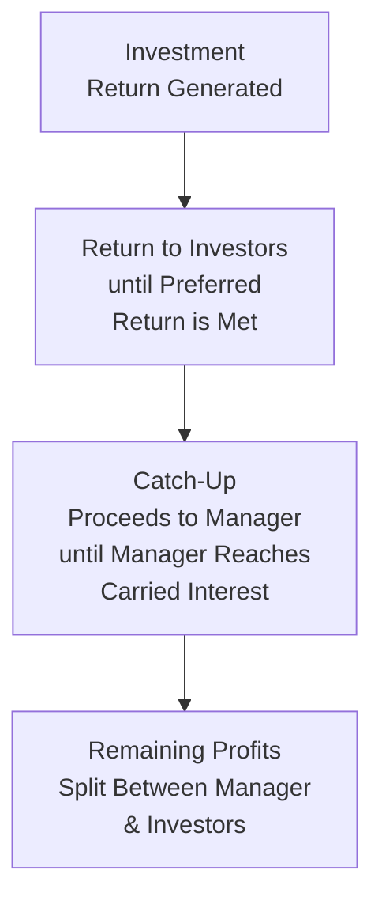
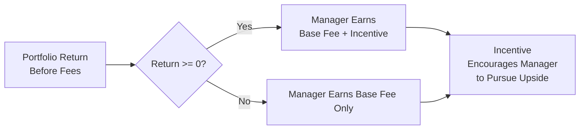

## Introduction
So, have you ever wondered why some investment managers seem so excited about beating benchmarks while others appear more relaxed? One of the reasons might be the structure of their compensation. When managers are paid based on raw performance (or performance relative to a benchmark), it might feel like a direct alignment with your interests—the client’s interests. But, as usual with finance, there’s more than meets the eye. 

Over the years, I’ve personally run into all sorts of performance-based fee setups, from straightforward “beat this index by X% and get a bonus” to elaborate multi-tiered waterfalls that made my head spin. If you’re not careful, performance-based fees can be like walking through a hall of mirrors—distorting risk and returns and sometimes encouraging managers to take gambles they otherwise wouldn’t. Or they might be a sensible way to align risk-taking with the client’s goals. Honestly, it’s both an art and a science to get these fee agreements right.

In this section, we’ll break down the common forms of performance-based fees, highlight their provisions, and see how they’re interpreted. We’ll also explore the subtle (and not-so-subtle) ways these fees can nudge manager behavior. Finally, we’ll discuss frameworks for analyzing these fees, so you can decide whether they truly serve your portfolio’s objectives or not. This ties in nicely with “Comparing Different Investment Manager Contract Structures” (see Section 2.8), and also helps inform best practices in “Evaluating Managers’ Investment Philosophies and Processes” (see Section 2.5).

## Performance-Based Fees: Why They Matter
At heart, performance-based fees align compensation with investment outcomes. Conventional wisdom says managers paid via performance-based structures are more motivated to outperform. But—and there’s always a but—performance-based fees can encourage risk-taking that might be above an investor’s tolerance, especially if part of the manager’s upside lacks a corresponding downside.

From a client’s perspective, a key question is: “Am I really paying for skill or just paying for good luck?” The answer depends on the details: symmetrical structures, high-water marks, and appropriate benchmarks can help ensure you’re paying primarily for outperformance. Conversely, poorly designed structures can prompt managers to “swing for the fences.” 

## Common Structures: Fulcrum Fees, Incentive Fees with a Hurdle, and Waterfalls

### Fulcrum Fees
A fulcrum fee looks a bit like a seesaw. The manager starts with a base fee rate, but that rate moves up or down depending on how well (or how poorly) the manager performs relative to a predetermined benchmark. 

• Symmetry: Fulcrum fees are typically symmetrical, meaning if the manager underperforms, the base fee goes down; if there’s outperformance, the fee goes up.  
• Example: Suppose a manager charges a 1.0% annual base fee. The fee can fluctuate between 0.50% and 1.50% depending on incremental out- or underperformance relative to a broad equity index.  
• Rationale: Fulcrum fees are designed to align the manager’s incentives with performance in both directions—up and down—making them more balanced than some other forms.

Still, be aware that not all fulcrum fees are created equal. The distance to the “fulcrum point” (where the fee is at its base rate) and the maximum fee caps matter. If the manager is penalized only slightly for underperformance but gets a big jump for outperformance, it’s not truly symmetrical.

### Incentive Fee with a Hurdle
When people say “performance-based fee,” many times they’re referring to an incentive fee with a hurdle rate. Hurdle rates exist so that the manager only participates in gains after attaining a certain minimum return. 

• Hard vs. Soft Hurdles:  
  – Hard hurdle means returns below the hurdle yield no fees whatsoever on the portion below the hurdle.  
  – Soft hurdle means once the hurdle is met, the manager earns fees on the entire performance, including the portion below the hurdle.  
• Example: A hedge fund with a 2% management fee plus a 20% incentive on profits above a 5% hurdle. If the fund returns 8%, the manager gains incentive fees on the 3% above the 5% hurdle (assuming a “hard hurdle”).  
• Considerations: If the hurdle is set too low, the manager may earn incentive fees for delivering results that are essentially market-like. If it’s too high, the manager may take big risks to try to jump over it.

One legitimate concern with incentive fees is that they may be asymmetric: managers often collect big bonuses for outperformance but may lose only their base fee if they fail to meet the hurdle. This can create an option-like payoff profile for the manager.

### Waterfall Structures
Waterfall structures frequently appear in private equity, real estate partnerships, and other “closed-end” funds. The logic here is that investors receive distributions in tiers (or “tranches”) based on specific return concepts, often called “catch-up rates” and “carried interest.”

Let’s look at a simplified example:  
• First, the “Preferred Return” (or “Hurdle”) distribution ensures that early cash flows and profits go to the investors until they have recouped their initial investment plus a certain annualized return (e.g., 8%).  
• Then, we enter a “Catch-Up” provision where the manager quickly gets a larger share of subsequent profits until they reach an agreed-upon percentage of total gains.  
• After that, any further profits are split according to a predefined ratio (often 80%/20% between investors and manager).

Here’s a simple Mermaid diagram illustrating a typical waterfall flow:

• Manager’s Incentive: The “preferred return” ensures that investors get their targeted return first. After that is met, the manager’s payouts sharply increase during the catch-up phase. Finally, profits above that are split (e.g., 80/20).  
• High-Water Mark: If the project experiences losses in early years, many waterfall agreements require that future profits first cover previous shortfalls to avoid paying multiple times for the same gains.

## Gross-of-Fees vs. Net-of-Fees Returns
Evaluating fund performance can be complicated by the presence of performance-based fees:
• Gross-of-Fees Return: Shows the portfolio’s performance before deducting any fees.  
• Net-of-Fees Return: Shows what the investor actually receives after management and performance-based fees.  

In “Performance Attribution Approaches” (see Section 1.4), you might look at how the manager generated alpha. But the net-of-fees performance can appear significantly lower than gross-of-fees performance when performance-based structures are involved. This difference becomes especially relevant in multi-asset contexts when combining funds with different fee schedules (see Section 1.13 on factor-based performance attribution for multi-asset portfolios).

## Asymmetry and Option-Like Behavior
The phrase “Heads I win, tails you lose” sometimes summarizes the problem of incentive fees that lack symmetry. If a manager only shares in the upside while the investor absorbs the downside, the manager might pursue aggressive strategies at the tail end of a performance period—for instance, “doubling down” on risky bets to salvage an underperforming year.

### Example of Option-Like Payoff
Imagine there’s a 2% base fee plus a 20% incentive on returns above zero, with no high-water mark or clawback. The manager essentially has a call option on the portfolio: if returns are positive, they get 20% of those returns; if returns are negative, they earn the 2% base fee, and that’s it. This can motivate managers to seek high-volatility strategies.

While symmetrical fee structures (like fulcrum fees) can mitigate some of this, it’s a persistent challenge in the investment management industry. As an investor, always check whether the manager has any “skin in the game.” That is, does the manager also invest personal capital? Are they subject to lockups or clawbacks if things go badly?

Below is a simple Mermaid flowchart representing how a highly asymmetric fee might influence manager behavior:

In this setup, the presence of a potential bonus for positive returns, and no penalty for negative returns beyond losing the bonus, can mean managers have an embedded call option on the portfolio.

## Crystallization Frequency
“Crystallization” is the schedule at which the manager’s performance fee is locked in (or recognized) and becomes payable. You might see:
• Annual Crystallization: The manager’s performance is measured once per year; that fee is then “realized” and paid promptly.  
• Quarterly or Monthly Crystallization: The manager might earn performance fees more frequently, which can lead to higher fees if returns are volatile and up in some periods (though typically also offset by negative performance in other quarters).  
• Multi-Year or End-of-Fund Crystallization: In closed-end vehicles like private equity or certain hedge funds, the manager might only crystallize fees upon liquidation or after a multi-year horizon. This longer window can reduce short-term risk-taking behaviors but also defers compensation significantly.

When you see more frequent crystallization periods, be mindful of “performance-slicing,” because if returns are measured in short intervals, the manager might collect multiple smaller incentive fees even if the full-year or full-fund return net is less impressive.

## Lookback Provisions and High-Water Marks
High-water marks prevent investors from paying incentive fees twice for the same gains. If a fund experiences a drawdown, the manager must first get the fund’s NAV (net asset value) above its highest historical level before collecting more incentive fees. 

• Example: Suppose a fund has a NAV of $100, which then goes down to $80. If the NAV rebounds to $95 in a subsequent period, the manager won’t get an incentive fee yet because the high-water mark is still $100.  
• Purpose: The goal is to ensure that investors only pay for net new gains above the previous peak.  
• Lookback vs. High-Water Mark: Sometimes these terms are used interchangeably. “Lookback” can also refer to arrangements where future fees take past performance into account, effectively netting out negative returns before additional fees get paid.

Managers who operate with high-water marks become more sensitive to short-term losses, as it may set them back significantly before they can earn new performance fees. This can reduce excessive risk-taking after a drawdown, though managers might also shut down or “reboot” a fund if the path to recouping past losses seems too long. The devil is in the details.

## Performance-Based Fees in Multi-Asset Portfolios
In a multi-asset context, especially applicable in large asset owner situations (see Section 1.7 about distinguishing asset owner vs. manager contributions), performance fees can be complicated:
• Different managers may have varying fee structures. Some managers may have higher risk appetites caused by strong incentive fees.  
• Blended Benchmarks: Each manager’s incentive might reference a different hurdle or index. When aggregated, you need to track if each portion truly outperforms its relevant benchmark or if correlations between managers obscure underperformance.  
• Cross-Manager Comparisons: Imagine one manager invests in private real estate with a waterfall structure, while another invests in equities with a fulcrum fee. Comparing net performance across these two can be challenging, because each fee arrangement affects the shape of returns differently.  

In these scenarios, building your own “master portfolio” level performance analysis is critical. If you don’t unify the data, you might inadvertently pay a manager for alpha that’s mostly explained by broad market movements, while also paying another manager for exactly the same alpha. 

## Lockups, Redemption Terms, and Fee Negotiations
Lockup periods—during which an investor cannot redeem shares—often appear alongside performance-based fees, particularly with hedge funds or private funds. Typically, the rationale is to give managers enough time to execute their strategy without the threat of sudden withdrawals. 

• Lockup can help managers take longer-term positions.  
• Redemption penalties can be used to deter short-term or reactive redemptions.  
• Investors may negotiate lower management fees in exchange for performance-based fees, or vice versa, to achieve a comfortable balance between manager motivation and cost efficiency.

Before you lock your money away, it’s worth simulating worst-case performance scenarios. You want to ensure you’re comfortable with the interplay between lockup terms and the fee structure, particularly during market downturns.

## Projecting Fees Under Different Return Scenarios
One practical approach is to create a fee simulation (or “fee pro forma”) that asks: “Given a certain distribution of possible returns, how much will I pay in fees and what will my net return look like?” This is especially important in performance-based structures, where the final cost can vary wildly.

• Base Case: Assume a stable market environment with moderate outperformance. Estimate the annual fees.  
• Stress Case: Assume a drawdown or low returns that might challenge the hurdle. How do any high-water marks or lookback features affect future fees?  
• Upside Case: If the manager significantly outperforms, the total fee bill could be quite high. Make sure you’re still comfortable paying that amount.

Running these simulations helps maintain clarity over how your net results might compare to more basic or passive strategies. After all, an active manager’s real value-add must exceed the costs, or else it might not be worth the complexity.

## Practical Tips and Common Pitfalls
• Read the Fine Print: Double-check if the structure is truly symmetrical or if the manager can “game” the system.  
• Compare Fee Structures: Sometimes a cheaper base fee plus a moderate incentive leads to better alignment than a higher base fee with no incentive.  
• Evaluate Benchmarks: Not all benchmarks are created equal. For multi-asset portfolios, confirm each sub-portfolio’s benchmark is relevant and fair (see Section 1.8 on benchmark types).  
• Consider the Manager’s Process: In Section 2.5, we discussed managers’ investment philosophies. Make sure the fee structure doesn’t contradict that philosophy. For example, a long-horizon value manager might not want monthly crystallization, as it can encourage short-term risk.  
• Monitor Over Time: Even if a fee agreement looks good now, it might not remain so as markets change or the manager’s strategy evolves.  

## Conclusion and Exam Tips
Performance-based fees can be a powerful tool for aligning managers and investors, but only if you look beyond the headline. Always check if the structure incentivizes the behaviors you want while penalizing missteps fairly. Weigh the benefits of symmetrical “fulcrum” arrangements against the attractions (and pitfalls) of incentive fees with hurdles. Examine distributions in waterfall fee structures, ensuring you understand each tier. 

From an exam perspective, you might see scenario-based questions requiring you to:  
• Calculate net returns after applying a performance fee with a given hurdle, crystallization period, and high-water mark.  
• Assess whether a given fee structure encourages undesirable risk-taking.  
• Compare various fee proposals qualitatively or quantitatively.  

Look for ways to highlight your knowledge of symmetrical versus asymmetrical structures, the effect of crystallization frequency, and how solutions like high-water marks can correct for some of these issues. Also, be ready to discuss how these fees can alter a manager’s risk profile throughout the investment cycle. 

Good luck, and you know—just keep it simple. If you feel the fee structure is incredibly complicated, it might be a red flag in practice. On the exam, though, show you can dissect that complexity.

## References
• CFA Institute Research Foundation. “Performance Fee Structures.”  
• ILPA (Institutional Limited Partners Association). “Private Equity Waterfall Models.”  
• CFA® 2025 Level III Curriculum, Volume 3: Performance Measurement.  
• Section 2.8: “Comparing Different Investment Manager Contract Structures.”  
• Section 1.8: “Benchmark Types and Liability-Based Benchmarks.”

--------------------------------------------------------------------------------

## Test Your Knowledge: Performance-Based Fees Structures Quiz



### Which of the following best describes the defining characteristic of a fulcrum fee structure?

- [x] The base fee is adjusted up or down based on performance relative to a benchmark.
- [ ] The manager receives incentive fees solely above a fixed hurdle rate.
- [ ] The manager’s fees are crystallized only at the end of a multi-year period.
- [ ] The manager receives a portion of distributions only after returning the original investment plus a preferred return.

> **Explanation:** A fulcrum fee has a base fee that moves either up or down in proportion to the manager’s out- or underperformance, making it a symmetrical arrangement.

### An incentive fee with a hard hurdle typically allows the manager to earn incentive fees on:

- [ ] All returns if the hurdle is met or exceeded.
- [x] Returns in excess of the hurdle only.
- [ ] Returns below the hurdle, but at a reduced rate.
- [ ] Returns if the manager’s performance is negative but less negative than the index.

> **Explanation:** A hard hurdle means the manager only earns fees on the portion of returns that exceed the hurdle rate.

### One potential drawback of an asymmetric performance-based fee structure is:

- [x] Managers may take on excessive risk since they benefit from upside but may not be penalized for downside.
- [ ] Managers are forced to reduce leverage during strong markets.
- [ ] Investors face symmetrical fees for both gains and losses.
- [ ] There is no lockup or redemption term.

> **Explanation:** An asymmetric payoff (no penalty for underperformance, big fee for outperformance) can encourage riskier strategies, since the manager has limited downside.

### High-water marks in a performance-based fee arrangement are meant to:

- [ ] Lower the overall fee burden for investors regardless of performance.
- [x] Ensure managers do not receive repeated incentive fees on the same gains.
- [ ] Increase the manager’s incentive for short-term gains.
- [ ] Oblige a manager to invest in only high-quality assets.

> **Explanation:** High-water marks mean a manager must recover previous losses before charging new incentive fees, preventing double-charging on repeated gains.

### A waterfall structure in a private equity fund is characterized by:

- [ ] A symmetrical fee that adjusts up or down with performance.
- [ ] A single-tier distribution of profits to all parties.
- [ ] No requirement to return investor capital before allocating profits.
- [x] Tiers that first return capital plus a preferred return to investors, then share further gains with the manager.

> **Explanation:** Waterfall structures often involve distribution tiers, ensuring investors recoup their initial contributions and preferred return before the manager begins receiving a portion of the profits.

### Which of the following is positively correlated with encouraging a manager’s short-term trading behavior?

- [ ] Annual or longer crystallization periods.
- [x] Frequent (e.g., monthly or quarterly) crystallization periods.
- [ ] Use of a high-water mark or lookback provision.
- [ ] A symmetrical fulcrum fee structure.

> **Explanation:** More frequent crystallizations can lead to a focus on short-term gains, as the manager can lock in performance fees more often.

### If a hedge fund has a 2% base fee plus a 20% incentive fee with no high-water mark, what is one key consideration for investors?

- [x] The manager may receive repeated fees if the fund cycles above and below previous net asset values.
- [ ] The hurdle rate effectively eliminates risk-taking incentives.
- [ ] The fund will only pay performance fees on crystallization every three years.
- [ ] The fee is entirely symmetrical since it includes a base and incentive portion.

> **Explanation:** When no high-water mark is present, the manager can earn incentive fees multiple times on the same ground, for example if the portfolio rises, falls below its old peak, and then rises past that level again.

### In multi-asset portfolios, an important challenge when using performance-based fees is:

- [x] Appropriately matching each manager’s incentive to a relevant and fair benchmark.
- [ ] Calculating monthly or quarterly fees is simpler.
- [ ] High-water marks and lookbacks are unnecessary.
- [ ] Ensuring each manager invests in exactly the same assets.

> **Explanation:** In multi-asset portfolios, each asset class often requires its own appropriate benchmark. Rich coordination is needed to ensure that the incentives accurately reflect skill rather than just broad market movement.

### Which approach might best mitigate excessive risk-taking by aligning losses and gains under a performance-based fee?

- [x] A fulcrum fee structure with both upside and downside adjustments.
- [ ] A no-hurdle performance fee with monthly crystallization.
- [ ] A waterfall distribution with no preferred return.
- [ ] A standard 2 and 20 structure with no lookback.

> **Explanation:** A fulcrum fee structure that raises or lowers fees based on underperformance or outperformance can reduce the “option-like” behavior that arises from purely upside-based fees.

### True or False: A lookback provision is another name for a high-water mark.

- [x] True
- [ ] False

> **Explanation:** In many contexts these terms are used synonymously, though technicalities can differ. Both ensure an investor doesn’t pay additional incentive fees on the same gains repeatedly.


