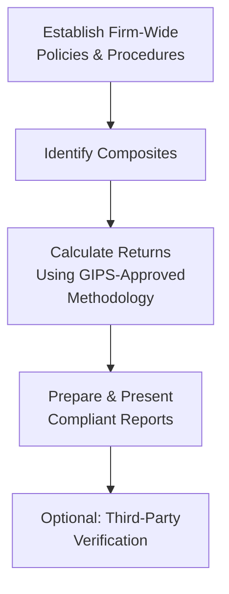

Foundations of the GIPS Standards  
I still remember the moment a friend asked me, “Why are people so particular about GIPS?” He had recently started a job researching investment managers and had stumbled upon these standards during his due diligence. In a nutshell, the Global Investment Performance Standards (GIPS) are all about making performance data comparable—like having the same measurement system whether you’re dealing with managers in Tokyo, London, or New York.  

At first, GIPS may look like an elaborate rulebook that’s hard to decipher. Yet, it all boils down to fairness and consistency. These standards, pioneered by the CFA Institute, set a global framework for how firms should measure and present their investment performance to both prospective and existing clients. Amid the complexities of different regulations, portfolio holdings, fee structures, and return methodologies, GIPS aims to streamline and standardize performance reporting.  

Core Objectives  
The heart of the GIPS Standards is straightforward: present investment performance in a consistent, transparent way so that investors can effectively compare track records. Let’s be real, though—there’s a reason this is so important. Investment management firms use historical returns to make their strategies look appealing. Some might choose a very “selective” lens on periods or portfolios that performed great, ignoring those that underperformed. GIPS tries to keep everyone honest by requiring:  
• Fair representation: Provide a complete picture of performance that is neither intentionally inflated nor cherry-picked.  
• Full disclosure: Lay out exactly how performance is calculated, including fees, composites, and any methodology used.  
• Global comparability: Firms across the world have to follow essentially the same rules, letting investors do a proper apples-to-apples comparison.  

Scope of the GIPS Standards  
Now, how broad are the GIPS Standards? In a word: very. While you can get deep in the weeds over the guidelines for real estate, private equity, or alternative strategies, the overarching scope is to ensure that any portfolio an investment manager runs follows uniform valuation and return calculation procedures.  

• Firm-wide Approach: GIPS compliance isn’t something you do with just one fund or product in isolation; it applies to the entire firm. That means if a firm claims to comply with GIPS, all of its strategies must adhere.  
• Mandatory Composites: Portfolios that share a similar strategy or mandate are grouped into what we call composites. Each composite then reports performance numbers that represent all actual fee-paying, discretionary portfolios under that strategy.  
• Full Discretion Requirement: “Discretionary” means the manager has the freedom to implement the strategy. If a client restricts the manager heavily, that portfolio might not fit the composite.  
• Worldwide Investors: The goal is global acceptance. Whether a client is in Singapore, Brazil, or South Africa, GIPS compliance promises them a consistent snapshot of how a manager has done.  

Why might a manager bother with GIPS if it’s so meticulous? Well, it can help them stand out in a crowded market. When a manager says, “We comply with GIPS,” it signals a certain credibility—basically, “We follow a recognized global standard that ensures our performance claims are legit.”  

Key Benefits for Firms  
Managers run the show, and ironically, they also have the most significant burden to comply. However, there are clear benefits for them:  
• Global Credibility: Let’s say you’re a newcomer in the asset management field, based in a smaller market, trying to attract institutional money from overseas. GIPS can be your stamp of authenticity, telling potential clients that your numbers match a globally recognized standard.  
• Consistency in Measurement: GIPS compliance requires managers—especially those with multiple product lines—to maintain consistent data-gathering and return-calculation methods. This uniformity can flush out internal errors or inefficiencies, making the firm’s operations stronger.  
• Enhanced Reputation: Many institutional investors won’t even give you a seat at the table unless you’re GIPS-compliant. Having that compliance status fosters trust.  
• Alignment with Ethical Standards: GIPS is firmly grounded in the notion of fair representation, which dovetails nicely with broader ethical commitments like the CFA Institute Code of Ethics and Standards of Professional Conduct.  

Key Benefits for Investors  
We all know that deciding where to invest can be tough—especially when confronted with reams of performance data that might use different calculation approaches, net-of-fee or gross-of-fee returns, and more. GIPS steps in to help:  
• Apples-to-Apples Comparisons: Investors see that every firm is measured consistently, letting them compare, say, a US-based manager’s global equity strategy to a Hong Kong-based manager’s global equity strategy with more confidence.  
• More Effective Due Diligence: GIPS implements strict rules around data and recordkeeping. Demonstrating compliance typically involves historical performance that’s been validated through robust internal-control processes—or even external verification.  
• Greater Confidence: When it’s time to assign money to a manager, the investor can rest a bit easier, knowing the manager’s track record isn’t just marketing fluff but is grounded in a standardized, globally acceptable approach.  

Illustrating a Real-World Scenario  
Imagine a large endowment fund that wants to hire several managers to build a diversified portfolio. They narrow down the potential managers to three. Two of those managers follow GIPS, while the third is either unfamiliar or non-compliant. During the due diligence process, those GIPS-compliant managers build trust more easily. The endowment finds it simpler to compare the track records of the first two managers side-by-side: both have a minimum history of five years’ data, both define composites in the same way, and both include all relevant portfolios.  

But with the third manager, the performance data might only highlight selected “star” portfolios or a shorter track record that excludes one big downturn a couple of years back. Or maybe their calculations combine multiple strategies in a not-so-transparent way. You can see how quickly that becomes less appealing.  

Mermaid Diagram: Conceptual Flow of GIPS Compliance

Below is a simple flowchart that shows an extremely high-level view of the process many firms go through to align with GIPS:

Each arrow basically points to a step in the GIPS compliance chain:  
1) First, you define your overall framework (the way you value assets, handle fair value, treat external cash flows, and so on).  
2) Then, you group the accounts that follow the same strategy into composites.  
3) Next, you measure performance under the GIPS-compliant methodology (e.g., time-weighted returns, daily valuation if feasible, net or gross fees disclosed).  
4) You deliver a performance report that meets all the required disclosures set by GIPS.  
5) Lastly, although not required, many firms opt for external verification to further bolster credibility.  

Common Pitfalls and Challenges  
• Composite Construction: If a firm lumps together portfolios with slight differences, it could cause reporting distortions. Or they could try to tailor composites to highlight only the best-performing portfolios. GIPS sets rules to prevent these manipulations.  
• Inconsistent Valuation Practices: Without consistent valuations, the entire performance track can be skewed. GIPS emphasizes the need for performance-based fair value.  
• Misapplication of Disclosures: Some firms either forget or fail to disclose specifics about fees, currency conversions, or derivative usage, accidentally (or intentionally) providing incomplete information.  
• Resource Demands: Especially during the onboarding phase, smaller firms might struggle with the cost or time required to build out robust systems.  

How GIPS Promotes Full Disclosure  
Full disclosure is basically about transparency in how managers arrive at their final performance numbers. If I told you, “I got a 20% return last year for my equity strategy,” you’d have a few questions, right? Was that net of fees or gross? Did you reinvest dividends? Which currency is that in? The GIPS Standards ensure that all these details (and more) are spelled out.  

Hurdles and Future Outlook  
At the risk of sounding dramatic, GIPS will likely keep evolving. We see expansions in guidance around private equity, real estate, and alternative assets. The risk area is also growing in importance—some managers are adopting risk-based performance metrics and robust performance attribution. In the future, we might see further integration with environmental, social, and governance (ESG) factors as well.  

Practical Implementation Tips  
• Document, Document, Document: Keep a thorough record of all processes. That helps internal compliance reviews and any external verifications.  
• Evaluate Current Tech Systems: Effective GIPS reporting can hinge on your portfolio management system’s ability to handle daily valuations and store data.  
• Train the Team: Everyone who has a role to play in performance measurement, from compliance to portfolio managers, must be on the same page.  
• Plan for Potential Verification: External verification isn’t strictly necessary under GIPS, but it’s a big signal of trust and reliability.  

Exam Tips and Final Thoughts  
From a CFA Level III exam perspective—especially in the Performance Measurement segment—GIPS is crucial. Expect scenario-based questions that test your understanding of how to handle composite definitions, external cash flows, or oversight for compliance. You might get essay prompts asking about best practices in performance presentation or item-set questions on how to address partial compliance claims. Watch out for:  
• Measurement periods (e.g., “Manager claims compliance over X years vs. full history”).  
• Applying standard calculation approaches (like money-weighted vs. time-weighted returns).  
• Differences between composite strategies and how you classify them.  
• Proper disclosure rules: ensuring that net or gross fees are appropriately labeled.  

The overarching theme: GIPS helps create a level playing field in performance reporting. If you get questions about “What is the advantage to an investor from GIPS?” or “Why bother with composite inclusion rules?”—the short answer is trust. It’s that simple: trust in the consistency of the numbers.  

References for Deeper Analysis  
• Global Investment Performance Standards (GIPS): https://www.cfainstitute.org/en/ethics-standards/gips-standards  
• The Journal of Performance Measurement—various articles on best practices and updates.  
• GIPS Handbook, CFA Institute—an in-depth resource on interpreting and applying the standards.  

Test Your Knowledge: GIPS Compliance Essentials



### Which key principle do the GIPS Standards emphasize most strongly for performance measurement and reporting?

- [ ] Confidentiality and privacy
- [ ] Profit maximization
- [x] Fair representation and full disclosure
- [ ] Benchmark-agnostic performance

> **Explanation:** The GIPS Standards mandate that historical performance data must be presented fairly and with full disclosure of calculation methodologies to ensure that results are transparent and not misleading.

### When a firm claims GIPS compliance, how must it apply these standards to its strategies?

- [ ] Only to its oldest strategies
- [ ] Only to asset class composites larger than a fixed threshold
- [ ] Only to those composites that underperformed
- [x] Firm-wide to all discretionary, fee-paying portfolios

> **Explanation:** GIPS compliance is a firm-wide commitment. If a firm claims compliance, all discretionary portfolios must follow the standards, ensuring consistency across the entire range of strategies.

### What is the primary benefit to investors when managers comply with GIPS Standards?

- [ ] Eliminates all investment risks
- [x] Enhances comparability and transparency of performance
- [ ] Guarantees active alpha in any strategy
- [ ] Allows managers to exclude losing portfolios from the track record

> **Explanation:** By standardizing the way returns are calculated and presented, GIPS improves transparency and enables clients and potential investors to compare different managers more easily and consistently.

### Which of the following best describes the role of “composites” in GIPS?

- [x] Grouping of similar portfolios to present a relevant performance track record
- [ ] A custom benchmark designed by a manager
- [ ] A single portfolio included in multiple reports
- [ ] A liability-based reporting framework for institutional investors

> **Explanation:** Under GIPS, composites combine all portfolios following the same strategy or mandate to ensure fair representation of performance, instead of cherry-picking only successful portfolios.

### One reason managers adopt GIPS is to improve credibility with prospective clients. Which of the following is another key motive?

- [x] It streamlines internal performance-measurement processes
- [ ] It guarantees no compliance breaches
- [x] It clarifies performance data for regulators  
- [ ] It allows them to operate without external audits

> **Explanation:** GIPS requires disciplined recordkeeping and standardized calculations, which can help firms fine-tune and strengthen internal controls. It also meets a widespread investor and regulatory expectation for robust and transparent reporting.

### How does an endowment benefit when selecting GIPS-compliant managers over noncompliant managers?

- [ ] The manager automatically reduces risk exposure
- [ ] The endowment gains tax exemptions
- [ ] The manager provides capital guarantees
- [x] The endowment can review consistent, standardized performance data

> **Explanation:** GIPS compliance requires managers to maintain and report performance in a uniform manner, letting endowments and other large investors conduct their manager due diligence with greater clarity.

### In practice, which external function is often performed by a third party when firms seek GIPS compliance?

- [ ] Portfolio rebalancing
- [ ] Regulatory oversight
- [x] Verification of performance records
- [ ] Executive hiring decisions

> **Explanation:** Firms commonly invite independent third-party verifiers to validate their GIPS compliance. Verification adds an extra layer of trust and helps confirm that the firm’s policies and procedures meet GIPS guidelines.

### According to GIPS, which methodology is typically preferred for calculating portfolio returns?

- [ ] Simple arithmetic returns
- [ ] Reinvestment returns only
- [ ] Only internal rate of return (IRR)
- [x] Time-weighted rate of return (TWRR)

> **Explanation:** GIPS often requires a time-weighted rate of return (TWRR) to measure a manager’s performance, removing distortions caused by external cash flows.

### Which of the following is an ongoing challenge for smaller firms aiming to comply with GIPS?

- [x] Allocating resources to maintain rigorous data management
- [ ] Overcoming investor distrust of the standards
- [ ] Avoiding top-quartile performance
- [ ] Bypassing the need to form composites

> **Explanation:** Smaller firms sometimes lack the infrastructure and resources to handle large data requirements and consistent calculations. The cost and expertise needed can be a hurdle, though GIPS compliance can be highly beneficial once established.

### GIPS compliance for a manager is best described as:

- [x] True
- [ ] False

> **Explanation:** If a firm complies with GIPS, it must do so according to the core principles: fair representation, full disclosure, and a comprehensive firm-wide commitment.  


