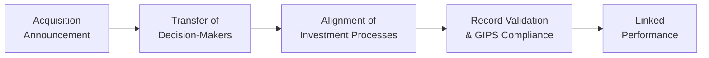

Introduction  
You know that feeling when someone joins a new company and wants to show their prior successes so folks appreciate their work? Well, in the investment management world, that's a real thing—managers often want to bring their track records with them to a new firm. And I’ve seen the tension firsthand. A few years ago, I was working at a small boutique asset manager. We got acquired by a larger firm with global reach. Everyone was excited about the possibilities, but also wondered, “Does our carefully built performance record just vanish into thin air?” 

The Global Investment Performance Standards (GIPS®) have detailed rules for this scenario. Linking past performance from prior firms or affiliations isn’t just about looking good to prospective clients, it’s about fulfilling the necessary compliance obligations to present an unbroken performance history. Stick around—let’s talk about the requirements, the pitfalls, and how to keep your performance data squeaky clean.

Why Link Past Performance?  
In portfolio management, prospective clients, boards, and consultants tend to look at historical returns when deciding whether or not to hire an asset manager. So if a team moves from Firm A to Firm B, or if Firm B acquires Firm A, there might be a desire to present one continuous track record. Doing so helps show continuity in investment style and how the strategy has performed over multiple market cycles. 

Under GIPS, a brand-new firm can link returns from a prior entity if certain conditions are satisfied. This bridging of past performance is sometimes called performance “portability.” But it’s not as straightforward as just slapping on an old spreadsheet. There are specific rules around who moved, what methodology was used, and how the records are maintained. 

Key GIPS Requirements for Linking Performance  
Perhaps you’re thinking, “Is it as easy as saying ‘we used to do this track record, so trust us?’” Not quite. Under the GIPS standards, the new or acquiring firm may claim the performance of a prior firm if:

• Substantially all the Decision-Makers Have Come Over  
  The GIPS guidance emphasizes that if the performance record is claimed, the strategy’s key brainpower—portfolio managers, analysts, risk managers—must be the same folks who produced that track record in the previous firm. In other words, you can’t just cherry-pick an attractive performance line item from an old firm if it was run by a completely different group of people.  

• The Prior Firm’s Processes, Methodologies, and Compliance Were Consistent with GIPS  
  This is where the rubber meets the road. The parent, predecessor, or acquired firm must have maintained the same investment philosophy, data-gathering methods, and—crucially—demonstrated GIPS compliance. If the prior firm was ignoring GIPS fundamentals, the new firm can’t magically fix that by simply linking to its performance.  

• Records Are Available to Validate the Historical Data  
  Another big one: GIPS requires you to have documents (e.g., account statements, trade records, internal records) that back up the prior performance. If those didn’t come along in the move or got lost in the chaos of a merger (it happens), the new firm won’t be able to link the data.  

Let’s illustrate how returns might be combined or “linked.” Suppose Firm A’s annual return in 2023 was 7% and the new Firm B’s 2024 annual return for the same strategy is 5%. If all GIPS conditions are met, the new firm could show a linked (portfolio-level) performance using geometric linking:


R_{\text{Linked}} = (1 + 0.07) \times (1 + 0.05) - 1 = 0.1235 \text{ or } 12.35\%.


Linking like that is straightforward mathematically, but it hinges on compliance with each GIPS criterion.

Implications for Mergers & Acquisitions  
Mergers and acquisitions can be exciting times, but they also open a whole can of worms for compliance. When two firms combine or one firm acquires another, the new entity typically wants to come out saying, “Hey, we’re still the same talented group you trusted before!” A few considerations:

• Combined or Successor Firm:  
  The newly formed entity inherits not only the staff but also the performance records. However, to be recognized as a “successor firm,” the new entity must demonstrate that it has substantially all of the assets under management (AUM) and that the portfolio management process remains intact.

• Maintaining Sufficient Records:  
  Sometimes, after an acquisition, there is confusion about who has custody of old performance data. All relevant data and calculation records (e.g., account valuation, transaction data) need to be retained for the entire historical period. If the acquiring firm fails to bring over these records—or can’t reproduce them—the performance link might not be possible.  

• Meeting Strict GIPS Criteria:  
  If some fundamental GIPS compliance requirement wasn’t met by the prior firm, the new or successor firm may need to disclaim that portion of the performance. Alternatively, it could leave that performance out entirely.  

Case Study: A Merger in Practice  
Let’s say Redwood Partners, a boutique manager of small-cap equity portfolios, is acquired by MGK Capital, a large global firm. Redwood’s key portfolio managers, analysts, and compliance team all move over to MGK. Redwood’s performance records are GIPS-compliant and Redwood’s small-cap equity strategy remains unchanged—just bigger budgets and more resources.  

MGK can then claim Redwood’s past small-cap equity performance as if MGK had managed that track record. But the new overarching compliance team must ensure Redwood’s old records are properly documented and still available. Additionally, MGK now needs to embed Redwood’s prior policies, methodologies, and portfolio guidelines for the small-cap equity strategy into MGK’s compliance program so that the “chain” is unbroken.  

When everything checks out, MGK can link Redwood’s returns to its own, enabling prospective clients to see a continuous, multi-year performance record with minimal disruptions.

Mermaid Diagram: Linking Past Performance Workflow  

This diagram gives a quick visual of the steps where linking prior performance is validated. Each step is crucial. Miss one, and you might break the GIPS chain.

Preserving Historical Continuity  
Historical continuity is a biggie. Prospective clients do not want random breaks in a track record, like a new entity that only shows 12 months of data with no explanation. They want to see how that strategy held up in both bull and bear markets. By adhering to GIPS portability guidelines, an acquiring or newly formed firm can maintain that performance lineage and effectively say, “This is the same strategy with the same team. No break here.”

In practical terms, historical continuity offers a sense of reliability, especially for institutional investors. It’s one thing to claim you’re a top small-cap manager; it’s another to demonstrate consistent outperformance over a decade, validated by a robust compliance framework. 

Best Practices and Potential Pitfalls  
If you’re involved in an M&A deal or a reorganization, here are a few pointers:

• Early Involvement of Compliance Teams  
  Don’t wait until the ink is dry on the merger contract. Integrate compliance and legal professionals from both sides early in the negotiations. They can ensure the GIPS track records are properly documented and can move seamlessly post-acquisition.  

• Conduct Thorough Due Diligence  
  Never assume the prior firm was fully GIPS-compliant. Ask for backups, spreadsheets, calculation methodologies, composites, and any verification or audit records. Otherwise, you might be claiming performance you can’t fully substantiate.  

• Make Disclosure Clear and Transparent  
  Even if everything is in order, GIPS requires explicit disclosures about linking performance from a prior firm. Don’t bury it in the footnotes. In your presentation materials, let prospective clients know the performance includes historical results linked in compliance with GIPS portability standards.  

• Watch for Partial Team Movements  
  If only a handful of key investment professionals move to the new firm, double-check that GIPS standards are satisfied. “Substantially all” means the core decision-makers. If the star portfolio manager left behind the rest of the research team, you might have trouble justifying continuity.  

• Confirm that the Strategy is “Truly the Same”  
  This might sound obvious, but the new entity must continue to run the same investment approach. If Redwood Partners specialized in small-cap growth, but MGK changes it to small-cap value, that’s effectively a new strategy. And that drastically affects performance “portability.”  

Preparing for the Exam  
CFA Level III candidates should remember that GIPS portability can appear in item-set or essay format questions. You might see a scenario:  
• Manager X has joined a new firm.  
• Manager X is trying to link a track record from their previous firm.  
• Is it permissible under GIPS? Under what conditions?  

The correct answer would likely reference the “substantially all decision-makers” criterion and the prior firm’s GIPS compliance. The test might also explore the ramifications of partial team migration or incomplete records. You should also remember that these are real-world controversies—acquisitions and reorganizations happen all the time—so the exam can test how well you understand actual implementation challenges.

References and Further Reading  
• “GIPS Guidance Statement on Performance Record Portability,” CFA Institute  
• M&A case studies in “Practical Portfolio Performance Measurement and Attribution” by Carl R. Bacon  
• See Chapter 3.1 for an overview of GIPS benefits and scope  
• Chapter 3.16 for additional case studies of GIPS implementation challenges  

Final Thoughts  
Performance portability is a critical concept in the GIPS framework—it can make or break how a firm presents itself to the world. I’ve been in the trenches, so trust me when I say: aligning new leadership, verifying old records, and ensuring GIPS compliance can be a whirlwind. But when done right, it yields a rock-solid performance record that fosters investor confidence. Perhaps you’re preparing for a big transition now—or maybe you’ll face one in the future. Either way, keep these guidelines in your back pocket. They just might save you a major headache.

## Test Your Knowledge: Linking Past Performance from Prior Firms



### Under GIPS, what must happen for a firm to claim the past performance of an acquired firm’s strategy?  
- [x] Substantially all decision-makers from the acquired firm continue to manage the strategy.  
- [ ] The acquiring firm changes valuation methodologies to match its own policy.  
- [ ] The acquiring firm can simply assume performance after 90 days of partial staff integration.  
- [ ] Only the transition manager is required to join the new firm.  

> **Explanation:** GIPS requires that substantially all investment decision-makers transfer to the new firm to preserve continuity.

### Which of the following is a key reason for linking prior performance under GIPS?  
- [x] To demonstrate historical continuity to prospective clients.  
- [ ] To reset the track record to start at zero at the new firm.  
- [ ] To obscure past performance deficits at the prior firm.  
- [ ] To allow partial management teams to inflate performance.  

> **Explanation:** Historical continuity reassures clients that the same strategy and team are still in place, providing a continuous performance history.

### If an acquiring firm cannot produce original data and supporting records of the acquired firm, which statement is most accurate?  
- [ ] They can still claim the track record without any disclosures.  
- [x] They cannot claim the prior performance due to a lack of evidence.  
- [ ] They can present the data as “unverified” and remain GIPS-compliant.  
- [ ] They can use third-party estimates instead of actual data.  

> **Explanation:** GIPS requires sufficient documentation for all periods of claimed performance. Without records, the new firm cannot link the prior performance.

### What happens if only a few junior analysts (but not the main portfolio manager) move from the old firm to the new firm?  
- [x] The new firm likely cannot claim the old firm’s performance record.  
- [ ] The track record is automatically portable once any staff moves over.  
- [ ] The track record is still valid as long as compliance officers moved.  
- [ ] The old track record can be claimed if the new firm changes the strategy.  

> **Explanation:** GIPS requires substantially all the key decision-makers to move, not just support staff.

### Which of the following best describes “substantially all decision-makers”?  
- [x] The majority of the portfolio managers and primary analysts who shaped investment decisions.  
- [ ] Only the chief financial officer and compliance officers.  
- [x] The core group that drove the old firm’s strategy and stock selection process.  
- [ ] Any set of individuals with minor responsibilities at the prior firm.  

> **Explanation:** Substantially all means the significant individuals governing the investment process. Note that each firm must justify this proportion, but it typically includes primary portfolio managers and analysts.

### When two GIPS-compliant firms merge, which condition is least likely to be a concern?  
- [x] Alignment of portfolio management processes.  
- [ ] Ensuring the star manager from the prior firm actually transitions.  
- [ ] Combining recordkeeping processes to verify old performance.  
- [ ] Storing original client statements and data for historical tracing.  

> **Explanation:** While process alignment is important, the actual GIPS challenge typically revolves around retaining the key managers and verifying full historical records. Process alignment might be easier if both firms were already GIPS-compliant.

### A new firm shows a 10-year performance record that includes five years from its predecessor firm. Which GIPS requirement applies?  
- [x] The predecessor firm’s records must be available and GIPS-compliant.  
- [ ] The performance data must use strictly time-weighted returns instead of money-weighted.  
- [x] The new firm must disclaim any changes in portfolio managers over the decade.  
- [ ] The new firm must only show returns from the last three years.  

> **Explanation:** Continuity hinges on the original records and GIPS compliance from the predecessor. Also, any relevant manager changes or disclaimers need to be shown.

### If a firm changes its strategy from small-cap growth to small-cap value after joining a new firm, can it link the old track record?  
- [x] Likely not, because the original strategy has changed.  
- [ ] Yes, if both strategies are in the same sector.  
- [ ] Yes, if half of the decision-makers remain from the prior strategy.  
- [ ] Yes, but only if the firm discloses the strategy modification.  

> **Explanation:** GIPS requires that the strategy remain the same to maintain continuity of performance. A shift from growth to value typically invalidates direct linkage.

### Which of these items is most critical for verifying that a prior firm’s performance was GIPS-compliant?  
- [x] Access to detailed transaction records and calculation methodologies.  
- [ ] The existence of a marketing brochure describing the strategy.  
- [ ] Publicly available quarterly earnings calls from the old firm.  
- [ ] A statement in the old firm’s code of ethics referencing GIPS.  

> **Explanation:** Actual source data (e.g., transaction-level records) and documented methodologies are essential to verify GIPS compliance.

### True or False: A firm that hires only a portion of the portfolio management team of the acquired firm can claim historical performance if the losing firm no longer exists.  
- [x] True  
- [ ] False  

> **Explanation:** This can be true, but only if “substantially all” those pivotal decision-makers have joined. If the acquired firm no longer exists, the new firm must still prove that it brought over the key staff and that the old firm was GIPS compliant.  


