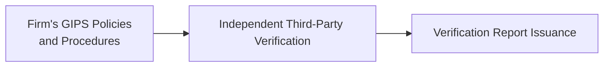

Introduction  
Sure, GIPS compliance is great and all, but sometimes I hear folks say, “Um…why bother verifying if it’s optional?” And I can’t help but smile, because I’ve actually heard this question in the cafeteria among my analyst peers. Truth is, while GIPS verification may be voluntary, it has enormous implications for how clients, regulators, and stakeholders perceive your firm’s trustworthiness. In this article, which aligns with the broader GIPS discussions in this volume, we’ll explore the purpose, scope, and process of GIPS Verification. We’ll walk through how it bolsters your reputation; we’ll see how a third-party verification typically unfolds; and we’ll identify common pitfalls, best practices, and advanced exam tips for those of you prepping for the CFA Level III exam.

Purpose of GIPS Verification  
At its core, GIPS verification is an independent review of a firm’s policies, procedures, and overall system for complying with the Global Investment Performance Standards (GIPS). It’s optional (and I know some folks say, “Well, it’s just extra cost for my firm!”), but the end goal is unquestionably beneficial: credibility. You want to reassure clients that your performance returns are not being peppered with questionable assumptions or calculation methods that might inflate your track record. A verification engagement, performed by an independent third party, effectively says, “Look, we tested these claims, and they hold up to the rigorous GIPS standards.”  

Honestly, I’ve seen it in practice. I once worked at a boutique asset manager that specialized in emerging markets. We found ourselves competing for a large institutional mandate. The institutional gatekeeper eventually admitted that our GIPS verification was a huge differentiator because it instilled confidence. We weren’t just claiming compliance on an island; we had an accredited external party confirm that we were doing what we said we were doing. Clients want that trust.  

Getting more technical, a verification examines a firm-wide approach to performance measurement—how you define composites, how you incorporate new accounts, how you treat external cash flows, etc. The end result is a statement called a Verification Report, which testifies to the completeness and reliability of your firm’s GIPS processes.  

Scope of GIPS Verification  
GIPS verification is generally firm-wide, which means it’s not just about verifying a single composite or portfolio. Instead, the verifier will look at every relevant piece of the puzzle:  

• Policies and Procedures: You first have to define how your company calculates performance, constructs composites, and ensures data integrity. If you already read about the GIPS Valuation Hierarchy in this volume, you’ll know how significant proper valuations can be. The verifier double-checks that you’ve got robust documentation and that these methods align with GIPS guidelines.  
• Composite Construction: Are you grouping portfolios in a manner consistent with their investment strategy and objectives? Are newly eligible accounts mandated to join the correct composite in a timely fashion? Do you have a reliable process for removing accounts from composites when discretion changes?  
• Performance Calculations: This is where the verifier tests sample portfolios to see if performance returns were correctly computed according to GIPS (e.g., time-weighted returns, asset-weighting, the handling of external cash flows). Also, they consider whether you’ve used correct formulas for risk measures, if relevant.  
• Recordkeeping: The GIPS standards require that your records be kept for specified periods, typically at least five years or since inception if the composite is less than five years old. The verifier wants to see that you maintain all the supporting documents for each composite.  
• Overall Consistency with GIPS: Finally, the verifier looks at whether your presentations meet the GIPS-required disclosures, ensuring consistent representation of composite performance.  

A smaller scope verification—say focusing on a single strategy—might be referred to as a performance examination. However, general GIPS Verification typically covers the entire firm. If it only covered one composite, it wouldn’t be recognized as “firm-wide verification” under the Standards.  

Process of GIPS Verification  
Let’s chat about how it actually goes down. In practice, verification is conducted in carefully orchestrated stages, sometimes referred to as a multi-stage audit. Typically, the process includes:

• Engagement and Planning: You hire an independent, third-party verifier—usually an accounting or consulting firm with deep expertise in performance measurement. They establish the scope, sign engagement letters, review your GIPS policies, and create a plan for the verification.  
• Documentation Review: The verifier reviews your firm’s written policies and procedures. They often interview staff from portfolio managers to compliance officers—ensuring the firm’s day-to-day practices align with what’s on paper.  
• Sample Testing and Calculation Checks: The verifier combs through selected transaction records, performance data, and composite memberships. They’ll replicate or review your calculations for performance returns and check the assignment of portfolios to composites. This part can feel like an “audit,” which is why we often refer to it as a multi-stage audit.  
• Summaries and Interviews: Additional interviews may be run to clarify any inconsistencies, gather evidence of controls, or verify staff’s knowledge of GIPS.  
• Issuance of Verification Report: After all checks are done, the verifier issues a verification report. Ideally, you receive a “clean” opinion stating that your firm-wide policies and procedures comply with GIPS standards and that you’ve fairly presented performance. If they discover major deficiencies, you’ll need to address them before claiming verification.  

Here’s a brief visual that highlights the verification flow:

The box on the left captures everything from your internal guidelines to your recordkeeping. The center step represents the multi-stage verification approach performed by the external party, which leads to issuance of the final verification report.  

Multi-Stage Audit in Detail  
For those who want a finer breakdown, let’s outline some specific tasks a verifier might undertake during each phase:

| Verification Stage       | Key Activities                                         |
|--------------------------|--------------------------------------------------------|
| Engagement & Planning    | Scope definitions, timeline planning, initial risk assessments. |
| Policies & Procedures    | Confirm written policies align with GIPS requirements, evaluate completeness of disclosures. |
| Data Sampling & Testing  | Sample portfolio calculations, check composite memberships, test systems for data reliability. |
| Staff Interviews         | Ensure staff exhibits knowledge of GIPS processes, confirm internal checks. |
| Reporting                | Draft preliminary findings, request management comments, finalize the Verification Report. |

In some cases, if the verifier discovers issues—like major miscalculations in a composite or incomplete records—an additional remediation step might be added to the process, giving the firm time to implement corrections.  

Common Pitfalls and Challenges  
You might be thinking, “That sounds straightforward enough,” but, well, real life has a way of complicating everything:  

• Missing or Incomplete Documentation: Firms might not have consistent records for older composites, especially if staff has turned over or new systems replaced old ones. Verifiers need robust documentation to confirm accuracy.  
• Ambiguous Composite Definitions: If a firm doesn’t clearly articulate how composites are structured, some portfolios may wind up missing or included incorrectly.  
• Inconsistent Treatment of External Cash Flows: GIPS is particular about how you handle inflows and outflows. If your documented approach and actual practice differ, that discrepancy raises red flags.  
• Using Inappropriate Benchmarks: While the official verification might not specifically audit your chosen reference index, a mismatch between a composite’s strategy and its benchmark can still generate concerns. (You can see more on benchmark testing and misspecification in earlier sections of this volume.)  
• Calculation Errors: Manual errors in performance calculations can lead to big headaches. If identified by the verifier, they must be corrected.  

A Personal Anecdote about Pitfalls (and why you should care):  
I once met an institutional consultant who told me how they discovered that a smaller asset manager “misapplied” their methodology to handle month-end cash flows on at least 10% of their accounts, inadvertently inflating returns. That manager had to restate results—and, well, you can guess how much that impacted client trust. Verification might have prevented that meltdown.  

Enhancing Reliability and Market Appeal  
Firms that complete verification often gain a competitive marketing advantage. Having an official verification report in your pitch deck or Request for Proposal (RFP) responses can position your firm as more transparent. From an investor’s perspective, verified firms tend to present less risk of performance “massaging.” Plus, if you manage complex multi-asset portfolios or alternative strategies, verifying your performance can reassure prospective clients that you’re consistently applying the same GIPS rules across all asset classes. That’s no small matter in a world exploding with alternative investments.  

The Role of the Verification Report  
The tangible outcome of verification, the Verification Report, is basically your “seal of approval” from the verifier. It states the period covered and affirms that your firm’s performance reporting is consistent with GIPS. The report can also highlight any modifications you made to bring your reporting into compliance. Some people wave it around at marketing meetings—like a gold star from the teacher—but official disclaimers in GIPS are quite strict about how you can represent your compliance and verification. You can’t say: “We got partial verification,” or “Our large-cap equity composite is verified.” Instead, it must be clear that your entire firm’s compliance was verified, though certain composite-specific examinations (if performed) can be mentioned as supplemental statements.  

Comparisons with Other GIPS-Related Processes  
You might recall from your earlier reading in this chapter that there are multiple ways to assure or validate your performance data, such as internal audits, third-party reviews, or composite-specific performance examinations. GIPS verification stands out because it is explicitly recognized and defined in the GIPS standards themselves, requires a fully independent verifier, and covers the entire firm.

By contrast, a composite-specific performance examination only looks at a single composite. That might be a useful exercise, but it doesn’t grant you the right to claim that your whole firm has gone through GIPS verification. The difference is crucial for marketing materials and statements of compliance.  

Case Study: Transition to Verification  
Let’s say you’re an asset manager who’s been claiming GIPS compliance for about three years without verification. You decide you want a full verification, so you hire a public accounting firm specializing in performance measurement. Here’s a simplified scenario:  

• Initial Phase: The verifier meets with your senior staff to outline the scope: they’ll review all composites for the past three years.  
• Documents & Interviews: You provide your performance calculation methodology, client statements, and system documentation to show how you track data. The verifier interviews your operations manager, CFO, and compliance officer.  
• Testing: They pick random months in your large-cap equity composite, mid-cap growth composite, and bond composite. They recast the returns using your raw position data to confirm accuracy.  
• Findings: The verifier points out a minor mismatch in composite membership for a single account that you inadvertently kept in a composite after it changed strategy. You fix it.  
• Final Report: The verifier issues a clean Verification Report for the three-year period, noting that your firm’s approach is consistent with GIPS requirements. Now you can state “XYZ Asset Management has been verified for the period January 1, 2022 to December 31, 2024.”  

Exam Practice and Key Takeaways  
For the CFA Level III exam, expect scenario-based questions testing your knowledge of verification benefits, the differences between verification and performance examination, and possible pitfalls (like misapplied composite definitions or inaccurate calculations). Be comfortable explaining how verification can boost a firm’s credibility—especially in the context of manager selection, which appears in Chapter 2 of this volume on manager due diligence.  

Additionally, remember the following for exam essays or item sets:  
• Verification is voluntary but widely viewed as best practice.  
• The scope is firm-wide, not composite-specific.  
• The process is multi-stage and ends with a verification report.  
• The presence of a verification report does not guarantee that each composite is correct down to the last decimal; it attests that the firm’s overall GIPS processes are in place and functioning consistently.  

References for Further Exploration  
• GIPS Standards Handbook, “GIPS Standards Verification” section. This is arguably your top resource for official definitions and processes.  
• “Independent Verification of Performance Results” by T. Daniel Coggin, which goes into the nuts and bolts of verification.  
• Chapter 3, earlier sections in this volume, to review GIPS fundamentals (like composite construction, valuation, and disclosures).  
• Chapter 1 in this text on Performance Measurement—helpful for understanding how performance calculations tie into GIPS compliance.  

Conclusion and Final Tips  
So, is verification worth the hassle? If you ask me, absolutely. The intangible trust it fosters can be a game-changer in manager selection or RFP processes. Moreover, it protects you from potential missteps that might later require restatements. For those studying for the CFA Level III exam, focus on the big picture: be prepared to articulate the purpose of verification, outline its key steps, and pinpoint potential vulnerabilities. Think “consultant’s mindset”: know how you’d advise a firm to structure and prepare for verification.  

Best of luck mastering these concepts for the exam. And remember: “Oh, it’s just optional” might be the official line, but in practice, verification often becomes a must-do for sustaining credibility in a fierce and crowded investment marketplace.

## Test Your Knowledge of GIPS Verification



### A firm claims GIPS compliance but has never undergone a third-party verification. Which of the following best describes the role of verification under GIPS Standards?

- [ ] Verification is mandatory for any firm claiming GIPS compliance.  
- [x] Verification is voluntary but can enhance the credibility of a firm’s claimed compliance.  
- [ ] Verification applies only to alternative investment composites.  
- [ ] Verification does not require third-party involvement.  

> **Explanation:** GIPS verification is voluntary. However, it must be performed by an independent third party, and it can boost the credibility of a firm’s compliance claims.

### Which of the following statements is most accurate regarding the scope of GIPS verification?

- [ ] Verification can be performed on a single composite to claim firm-wide compliance.  
- [x] Verification covers the entire firm and all composites included under the firm’s definition.  
- [ ] Verification is only applicable to equities and fixed-income portfolios.  
- [ ] Verification can validate the numerical accuracy of each data point in every statement.  

> **Explanation:** GIPS verification is a firm-wide review of the firm’s processes and procedures. It does not simply verify a single composite, and it does not guarantee the accuracy of every data point.

### During the verification process, which of the following activities would a verifier most likely undertake?

- [ ] Issue a rating scale for each composite’s quality.  
- [x] Sample performance calculations and test composite membership.  
- [ ] Merge multiple portfolios into a single “shadow” portfolio.  
- [ ] Conduct manager style analysis to reduce Type I and Type II errors.  

> **Explanation:** Verifiers typically examine records, sample portfolio calculations, and confirm that the firm correctly assigns portfolios to composites. They do not issue rating scales or conduct manager style analyses in this context.

### What does the Verification Report primarily attest to?

- [ ] The performance numbers for each composite are guaranteed to be accurate.  
- [ ] The firm has met partial compliance within certain composites.  
- [x] The firm’s policies, procedures, and overall performance reporting meet GIPS requirements on a firm-wide basis.  
- [ ] The firm uses unique benchmarks for all composites.  

> **Explanation:** The wording of the Verification Report centers on whether the firm complies with GIPS on a firm-wide basis. It does not certify accuracy of every data point, nor does it verify partial compliance.

### Which is the best example of a common pitfall discovered by verifiers?

- [x] Ambiguous portfolio assignments that lead to incorrect composite membership.  
- [ ] Monitoring the performance of each composite on a weekly basis.  
- [ ] Maintaining a strictly internal approach to composite construction.  
- [x] Choosing a benchmark that does not match the firm’s overall style.  

> **Explanation:** Ambiguous portfolio assignments and mismatched benchmarks are frequent mistakes identified during verification. Internal approaches are allowed but must conform to GIPS policies.

### A firm completed verification and received a Verification Report. Which of the following can they claim in their marketing materials?

- [x] “Our firm has been verified for the period January 1, 2022 to December 31, 2024.”  
- [ ] “Our large-cap equity composite is GIPS verified, but all other asset classes are excluded.”  
- [ ] “All our returns are individually verified by an independent party.”  
- [ ] “Our verified performance automatically guarantees superior returns.”  

> **Explanation:** Firms may only properly state that they’ve been verified for a specified time period on a firm-wide basis. They cannot claim verification for only one composite and cannot guarantee better returns.

### In preparing for GIPS verification, which internal control would be most helpful?

- [ ] Monthly reconciliation of staff timesheets.  
- [x] Ensuring documentation of performance calculation methodology is consistent and accessible.  
- [ ] Outsourcing all compliance tasks to an external firm to save costs.  
- [ ] Prohibiting staff from asking questions about GIPS compliance.  

> **Explanation:** Documentation of the firm’s performance calculation methodology is critical for verifiers to confirm proper compliance and data integrity.

### In the multi-stage verification process, what is often the final step before the Verification Report is issued?

- [ ] Entering performance results in a public database.  
- [ } Creating a new benchmark to demonstrate outperformance.  
- [x] Drafting preliminary findings and obtaining management’s comments.  
- [ ] Publishing the composite list on social media platforms.  

> **Explanation:** Before issuing the final Verification Report, the verifier usually presents preliminary findings to the firm’s management for review and potential corrections.

### GIPS verification differs from a performance examination in that:

- [ ] The verifier is not required to be independent in a GIPS verification.  
- [x] Firm-wide verification is broader and covers the firm’s overall compliance, whereas a performance examination can focus on a single composite.  
- [ ] Performance examinations focus on operational risk, not performance data.  
- [ ] GIPS verification requires manager selection analysis.  

> **Explanation:** GIPS verification is meant to review the entire firm’s compliance, whereas a performance examination can drill down on one specific composite or strategy.

### Verification is mandatory under GIPS standards.

- [ ] True  
- [x] False  

> **Explanation:** The GIPS standards do not require verification. However, many firms choose verification to enhance the credibility of their performance reporting.


