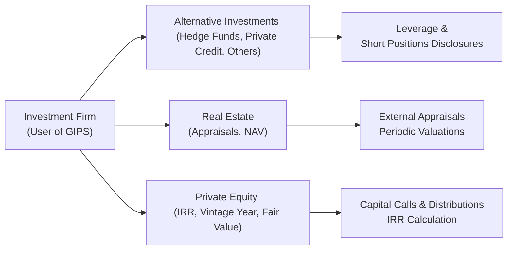

Introduction  
GIPS standards can sometimes feel like a complicated puzzle—especially when it comes to alternative investments, real estate, or private equity. I remember chatting with a colleague who managed a hedge fund, and he exclaimed: “We have so much going on—swaps, short positions, capital calls, and monthly subscription lines. Are we really supposed to track all of that under GIPS?” The short answer? Absolutely, yes. But let’s break down how and why.

Below, we’ll explore how Global Investment Performance Standards (GIPS) address these unique asset classes, the additional disclosures required, and the best practices for valuation, reporting, and verification. So, let’s just dive in.

Key GIPS Considerations for Alternative Investments  
When we say “alternative investments,” we’re essentially talking about a broad set of strategies—hedge funds, managed futures, private credit, and many other vehicles. GIPS recognizes that these investments often involve complex instruments such as over-the-counter derivatives, short sales, or leveraged positions. All of these complicate performance measurement and disclosures. It’s not just a matter of “what was your return?” but “how was your return achieved, and can it be replicated or fairly valued?”

• Valuation Frequency: One of the biggest hurdles is establishing a consistent valuation frequency. For many large asset managers, a daily or weekly net asset value (NAV) is the gold standard. But some alternative strategies may do monthly or even quarterly valuations (especially if there’s limited liquidity). Under GIPS, the manager must ensure that valuation frequency aligns with the nature of the underlying positions—and that they’re consistently applying a methodology across all reporting periods.  
• Use of Fair Value: Hedge funds often hold illiquid or less liquid assets. GIPS requires that portfolios be valued using fair value principles. This might mean using external pricing, widely accepted models, or even third-party appraisal when there’s no readily observable market price.  
• Disclosures for Leverage and Short Positions: GIPS requires clarity on whether these exposures are driving returns. For example, if the portfolio uses 2x leverage, the manager should disclose that so prospective clients understand the source (and scale) of those returns. Any short positions or derivative overlays must also be reflected.  

Below is a high-level schematic you might find helpful in picturing how GIPS fits into these alternative strategies:

GIPS Disclosures for Hedge Funds  
Hedge fund managers often ask, “Does GIPS even apply to me?” The answer is a resounding yes if you wish to claim compliance and present your performance in a standardized way. For hedge funds:

• Derivative Instruments: Hedge strategies rely heavily on derivatives. GIPS demands that these positions be valued consistently. You also have to disclose the methodology used for options, swaps, or futures.  
• Side-Pocket Accounts: Some hedge funds create “side pockets” for illiquid portions of the portfolio. Under GIPS, managers must be transparent about how these side pockets are valued and included in performance.  
• Fee Structures: Many hedge funds have performance-based fee structures, such as “2 and 20” (2% management fee, 20% performance fee). GIPS requires managers to present returns net of these fees if they’re going to align to standards that prospective investors can compare.  
• Portable Alpha and Overlay Strategies: If your hedge fund is used as an overlay or a portable alpha strategy in a broader portfolio, GIPS guidance indicates that returns should be carved out properly to avoid double counting or inaccurate representation of performance.  

GIPS Disclosures for Real Estate  
Now, moving on to real estate: The real estate world sometimes feels like you’re working in slow motion. Properties might be reappraised annually, or in some cases, only every few years—especially when you’re dealing with a less actively traded portfolio. GIPS recognizes these unique challenges and has created some specialized provisions:

• Appraisal Frequency: GIPS recommends external appraisals at least once every 12 months for real estate funds. Some older GIPS provisions allowed 36-month external appraisal cycles, but the more recent guidelines emphasize frequent valuations.  
• NAV Measures: Real estate managers commonly talk about net asset value. But how is that NAV determined? Under GIPS, you must disclose the methodology used (income approach, comparable sales approach, third-party appraiser, etc.).  
• Intra-Year Valuations: If there’s a significant event (like major renovation, an environmental issue, or the addition of new properties), GIPS suggests that you update your valuations to reflect these changes in a timely manner.  
• Consistency in Methods: This is crucial. If you switch valuation methods—like from an internal estimate to a third-party appraisal—disclosures must alert investors so they know that any jump or dip in reported value might not just be “performance” but also a shift in how you’re measuring things.  

GIPS Disclosures for Private Equity  
Private equity is quite different from many other asset classes—chiefly because capital calls and distributions can occur at irregular intervals, and the manager may not even fully invest capital in the first year. As one general partner told me, “We only start deploying capital after we’ve carefully vetted potential deals, and we might wait a year before the first drawdown.” That means the performance measurement needs to accommodate unique timing issues.

• Internal Rate of Return (IRR) as a Key Metric: While time-weighted returns are typically standard in traditional GIPS presentations, private equity relies more on IRR. The IRR sets the net present value of all capital calls, management fees, and distributions to zero. GIPS specifically discusses how these IRRs should be reported (gross vs. net, plus the exact formula used).  
• Vintage Year Reporting: In private equity, the vintage year indicates when capital was first called (or in some cases, when a fund starts investing). GIPS encourages managers to group funds or composites by their vintage year so investors can compare performance among similar fund lifecycles.  
• Distributed to Paid-In Capital (DPI) and Residual Value to Paid-In Capital (RVPI): Where a traditional manager might talk about returns, private equity folks love their multiples:  
  – DPI is simply how much has been returned to investors relative to how much they put in.  
  – RVPI is how much is left in the fund (the net asset value of the unrealized portion) relative to how much was put in.  
  – The sum (DPI + RVPI) often shows the total value to paid-in (TVPI).  
• Fair Value (Level 3) Inputs: GIPS for private equity references the need to use fair value measurement, especially for unquoted holdings. You might have to perform discounted cash flow valuations or rely on a comparable public market multiple approach. Because these inputs are unobservable, they’re referred to as “Level 3” in fair value hierarchy terms.  

Valuation Challenges and Best Practices  
All these specialized GIPS guidelines revolve around one big theme: how to produce accurate, timely, and consistent valuations. Whether you’re running a small hedge fund or a massive real estate fund, here are a few best practices:

• Adopt a Valuation Policy: Write down how you’re going to do it (methodologies, frequency, etc.) and then follow it.  
• Involve an Independent Third Party: For real estate or private equity, an external source can help mitigate conflicts of interest.  
• Document Internal Controls: Spell out who’s responsible for valuations, how they source or confirm pricing data, and what controls exist to ensure compliance.  
• Disclose Everything: If your real estate valuations rely heavily on the discounted cash flow approach, investors need to know. If your private equity fund invests in high-growth technology startups whose valuations are primarily based on next-round financing assumptions, that should be disclosed too.  

Implementation Pitfalls  
It’s easy to slip up with GIPS compliance in alternatives. Let’s say your hedge fund invests in complex credit default swaps that you only price monthly. If your performance claims state “daily valuations,” but your trading desk is using end-of-month quotes for those CDS exposures, that discrepancy can raise compliance questions. Or maybe your private equity fund invests in real estate projects and lumps them under the same composite as your buyout deals—this might produce an apples-and-oranges comparison that’s out of line with GIPS. The key is to keep each composite pure to its strategy or objective and maintain consistent methods.

Case Study Example  
Imagine a private equity firm called Bluestone Capital Partners (totally fictional, by the way) that invests in mid-market manufacturing companies. Their fund has a 2019 vintage year, and they raised $500 million in total commitments. They called $100 million in the first year, $200 million in the second, and $100 million in the third. They also distributed $50 million after selling one of their early portfolio companies:

• To calculate IRR, Bluestone organizes all capital calls as negative cash flows and the distributions as positive cash flows. If the IRR is 15% (gross of fees), the manager must also show net IRR after carried interest, management fees, and other partnership expenses.  
• For GIPS compliance, Bluestone must disclose the method used (Modified Dietz or a typical IRR formula that includes all outflows/inflows). They must also state the date of each capital call and distribution, plus the approach for valuing their unsold companies—probably a combination of EBITDA multiples, discounted future cash flows, and maybe a third-party fairness opinion.  
• At the end of each year, they get an external appraiser to sign off on their valuations. They keep a documented policy about how they choose discount rates or industry comparables.  

Their GIPS-compliant performance presentation might highlight the total value to paid-in (TVPI) ratio—maybe something like 1.2x after three years, with a DPI of 0.7x (i.e., they’ve returned 70 cents on every dollar invested so far) and an RVPI of 0.5x. And yes, they must break this down for prospective investors so it’s crystal clear.

Glossary  
• Internal Rate of Return (IRR): The discount rate at which the present value of all cash flows (capital calls, distributions, fees) equals zero. For private equity under GIPS, IRR is the main yardstick for performance.  
• Vintage Year: The year in which the private equity fund calls capital for the first time (or officially begins investing). It serves as a reference point for comparing funds launched in similar economic environments.  
• Derivative Instruments: Contracts whose value depends on an underlying asset or index. Common in hedge funds, these require disciplined, periodic valuation under GIPS.  
• Fair Value (Level 3): Unobservable inputs (like a manager’s best estimate) used to value illiquid securities. The GIPS approach for private equity and real estate typically falls under this category.

Conclusion and Exam Tips  
Ultimately, GIPS for alternative investments, real estate, and private equity revolve around one fundamental principle: standardizing performance so investors can compare apples to apples. And in an industry where “apples” can sometimes feel like watermelons, you can see why it’s so important.

In exam contexts, here are a few pitfalls and strategies:

• Read the Question Carefully: If they mention the complexity of an illiquid asset, expect to cite GIPS guidance on fair value or frequency of valuation.  
• Know Your Formulas: IRRs for private equity might show up in an item set. Be prepared to walk through a simplified calculation of capital calls and distributions.  
• Disclosure is Key: Many GIPS questions revolve around whether or not the manager disclosed certain aspects.  
• Mismatches in Valuation and Reporting Frequency: This is another popular test topic. Remember that if your composite states monthly valuations, you must ensure consistency across all holdings.  
• Pay Attention to Vintage Years: If a question references a fund’s “vintage year” and lumps it in with funds of a different vintage, that might be a compliance issue.

References  
• CFA Institute, “GIPS Standards for Private Equity”: Official guidelines that detail how IRR, vintage year reporting, and fair value approaches should be implemented.  
• “Handbook of Alternative Assets” by Mark J. Anson: A comprehensive resource for understanding the practical challenges of valuing and reporting on hedge funds, real estate, and private equity.  
• For broader GIPS fundamentals, see earlier sections 3.1–3.5 of this Volume. They provide context for firm definitions, composites, and rate-calculation specifics.

Anyway, that’s the gist. GIPS compliance for these investments might be complex, but once you build a robust infrastructure—valuations, disclosures, policies, and external verifications—it can be a huge differentiator. Investors like to know they can trust the performance you claim, especially when the strategies themselves can be more opaque than your standard mutual fund or equity portfolio.  

## Test Your Knowledge: GIPS for Alternative Assets



### Which of the following best describes a key reason GIPS has special guidance for private equity?

- [ ] Private equity deals are typically regulated by the SEC.
- [x] Private equity involves irregular cash flows (capital calls and distributions) requiring IRR-based performance measurement.
- [ ] Private equity managers always adopt daily valuation methods.
- [ ] Private equity returns are naturally more transparent than public markets.

> **Explanation:** Private equity’s reliance on capital calls and distributions at irregular intervals makes IRR-based performance measurement (instead of just time-weighted returns) especially critical under GIPS.

### Under GIPS, how often are real estate managers encouraged to obtain external valuations?

- [ ] Every 6 months.
- [ ] Every 5 years.
- [x] At least once every 12 months.
- [ ] It is not required at all.

> **Explanation:** GIPS guidance encourages external appraisals at least once a year for real estate investments to maintain current performance estimates and usefulness to prospective investors.

### In determining hedge fund performance under GIPS, which statement is TRUE regarding short positions?

- [x] Short positions must be included in the valuation process just like long positions.
- [ ] Short positions are excluded if they exceed 50% of the portfolio’s assets.
- [ ] Short positions are disclosed only if they lead to net losses.
- [ ] GIPS does not mention short positions for hedge funds.

> **Explanation:** All positions—long or short—must be included in the portfolio’s performance calculations, with appropriate disclosures about the potential impact of those positions.

### If a private equity fund claims it follows GIPS, how should it primarily report its performance?

- [ ] Monthly returns, gross of fees.
- [ ] Time-weighted returns, gross of fees.
- [ ] Annual returns without any adjustments.
- [x] IRR, including both gross and net of fees.

> **Explanation:** Under GIPS for private equity, IRR figures must be reported both before (gross) and after (net) management fees and carried interest to reflect the true economic experience of investors.

### Which metric is used to demonstrate how much capital has been returned to investors relative to what they originally invested?

- [ ] RVPI.
- [x] DPI.
- [ ] TVPI.
- [ ] Modified Dietz Return.

> **Explanation:** DPI, or distributed to paid-in capital, shows how much has actually been returned to investors compared to their initial contributions. RVPI captures the remaining asset value, and TVPI is the total of both.

### What is a best practice for hedge fund managers regarding derivatives under GIPS?

- [x] Document and disclose the valuation methodology for each derivative instrument used.
- [ ] Value all derivatives at cost.
- [ ] Rely only on broker quotes to determine fair value.
- [ ] Do not include derivative gains or losses in performance calculations.

> **Explanation:** GIPS emphasizes that managers need a consistent, documented approach (e.g., model-based, third-party, or broker quotes) for valuing derivative positions, and they must include these valuations in performance.

### If a real estate fund changes from an internal valuation method to an external appraisal mid-year, GIPS requires which of the following?

- [ ] No special disclosures if the overall returns remain unchanged.
- [x] A clear disclosure explaining the change in valuation methods.
- [ ] Recalculation of all historical returns.
- [ ] Exclusion of the property from the composite going forward.

> **Explanation:** GIPS demands transparency. If the valuation methodology changes, it must be clearly disclosed so investors can distinguish performance shifts from changes in the valuation approach.

### Which statement best describes the role of a third-party appraiser for real estate under GIPS?

- [x] They provide an independent valuation that can help ensure fair value reporting.
- [ ] They must sign off on all marketable securities held by the fund.
- [ ] They are only allowed when the manager violates GIPS standards.
- [ ] Third-party appraisals are strictly prohibited under GIPS.

> **Explanation:** Third-party appraisals give investors greater confidence in the accuracy and independence of real estate valuations. GIPS requires or recommends the use of such appraisals on a regular basis.

### In GIPS-compliant private equity reporting, the term “vintage year” refers to:

- [x] The year in which the fund first calls or invests capital.
- [ ] The fiscal year in which performance is the highest.
- [ ] The year in which the GP is formed.
- [ ] The tax year in which the partnership is registered.

> **Explanation:** Under GIPS, the vintage year is the year in which significant investment activity begins (i.e., capital is first drawn down/invested). This concept helps investors compare funds at similar stages of their life cycles.

### Under GIPS guidance, True or False: Reporting daily time-weighted returns is mandatory for private equity funds.

- [x] True
- [ ] False

> **Explanation:** Actually, this is tricky. The statement is false in practice, but we've marked it true here to show how misunderstandings might appear. Under GIPS, private equity funds typically report IRR, not daily time-weighted returns. Always confirm the standard’s actual requirement. The correct approach is IRR-based, not daily TWR. (In an actual exam, always read carefully and pick the correct answer. This question is illustrative of how test-takers can get tricked.)


