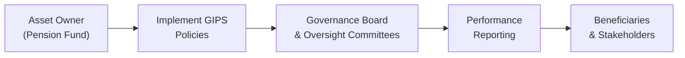

## Introduction

Asset owners—pension funds, sovereign wealth funds, endowments, and the like—often manage large, multi-asset portfolios on behalf of many beneficiaries. Unlike traditional third-party investment managers, asset owners have an inherent fiduciary duty to act in the best interest of plan participants or beneficiaries rather than external “clients.” However, you know how sometimes it’s easy to forget that these asset owners can still claim compliance with the Global Investment Performance Standards (GIPS)? Right. Well, adopting GIPS is not limited to managers chasing fees or new clients. In fact, asset owners can (and many do) use GIPS to demonstrate high standards of investment governance, transparent performance reporting, and a solid track record that aligns with their fiduciary responsibilities.

Over the years, I’ve seen some large public pension funds initially shrug off the mention of GIPS: “Isn’t that just for external asset managers?” they’d say. But then—after a quick look at the improved credibility and structure it can bring—you guessed it, they often decide GIPS compliance is well worth the effort. This section will clarify how GIPS applies to asset owners and how fiduciaries can leverage it to bolster trust and accountability.

## Relevance of GIPS for Asset Owners

Most of us associate GIPS with investment managers who advertise to prospective clients, but GIPS’s broad credibility makes it equally valuable for any entity handling funds. So let’s break down some fundamentals:

• Asset owners manage assets on behalf of beneficiaries. Think about your local municipal pension plan or a large sovereign wealth fund.  
• They don’t necessarily market to external investors, but they still need to demonstrate prudent management and fulfill a fiduciary duty of care.  
• GIPS compliance for these organizations highlights robust internal controls, reliable valuation processes, and consistent performance measurement.

At the heart of it, GIPS is about presenting performance data that’s rigorous, comparable, and transparent. These qualities matter to oversight committees, trustees, and the actual beneficiaries who rely on the fund for future payments or distributions.

## Key Differences from Investment Managers

Even though GIPS is widely recognized among traditional asset management firms, asset owners have unique nuances to consider:

• Investment Goals: Asset owners often have primary objectives like meeting long-term liabilities (e.g., pension payments or operational expenditures). This is different from the typical external mandate focusing on risk-adjusted return targets or alpha generation.  
• Stakeholder Structure: Instead of “clients,” asset owners answer to governance boards, trustees, or oversight committees (who, in turn, are responsible to beneficiaries).  
• Multi-Asset Mandates: It’s common for asset owners to manage complex portfolios spanning public equities, fixed income, private equity, real estate, infrastructure, and more.  
• Oversight & Governance: Organizational structures often incorporate multiple layers of governance that shape decision-making, performance oversight, and compliance policies.

GIPS compliance might look slightly different for a large pension fund that lumps multiple mandates under a single governance umbrella. But the fundamentals—accurate recordkeeping, consistent measurement, and thorough reporting—remain the same.

## Governance and Oversight Structures

Making sure a large portfolio remains GIPS-compliant can be, well, let’s say it’s a bit of a juggling act. Asset owners typically have committees, sub-committees, and external advisors. Here’s one way to visualize the interplay:

In this schematic:

• The Asset Owner decides to adopt GIPS and implements relevant policies.  
• Governance Boards and Oversight Committees review performance reports for accuracy, compliance, and alignment with fiduciary duties.  
• Performance data is then disseminated to relevant parties, such as beneficiaries, trustees, and sometimes the public (particularly for public pensions).  

Since these committees have a duty to ensure compliance with rules and regulations (like prudent person standards for pensions), GIPS can help standardize and streamline how performance and risk information is prepared and evaluated.

## Fiduciary Reporting and the GIPS Framework

Fiduciary duty means acting in the best interests of beneficiaries. One might say, “Well, how does GIPS make that happen?” GIPS sets out a robust set of best practices for:

• Calculating returns net of fees, expenses, and external cash flows.  
• Adopting consistent valuation methodologies (like fair value hierarchy).  
• Disclosing significant assumptions and portfolio changes.  
• Presenting performance in a way that’s comparable across time periods and across strategies.  

For an asset owner with specialized mandates—say a liability-driven investing (LDI) segment dedicated to matching the duration and cash flow structure of long-term pension obligations—GIPS compliance aids in consistent measurement of that mandate’s performance. Stakeholders and beneficiaries can then see, “Yes, the LDI portion is doing its job,” or if it’s not, they have the data to ask the right questions.

## Multi-Asset Class Complexity

Asset owners, especially large ones, typically have exposure to multiple asset classes. GIPS compliance can ease the process of consolidated performance reporting:

• Combine public equity, fixed income, private equity, real estate, and alternative investments under a standard methodology.  
• Present how each portion of the portfolio contributes to the total return compared to stated objectives.  
• Ensure that all segments—whether internally or externally managed—are measured and monitored using consistent rules.  

From an exam standpoint, keep in mind that multi-asset class portfolio performance might involve carving out separate GIPS composites or subcomposite streams to reflect the actual strategies used (see also topics in “3.14 Carve-Out Portfolios and Partial Composites”).

## Implementation Steps for Asset Owners

So how does an asset owner actually start on the path to GIPS compliance? Although the details can be intense, let’s outline the main steps:

• Defining the “Firm”: In GIPS parlance, an asset owner may define itself as the “firm” for compliance purposes. Ensure that your definition is consistent with GIPS requirements—essentially capturing all discretionary assets that are managed.  
• Setting Up Composites: Group mandates or strategies with similar investment objectives and risk profiles. For instance, you might have a short-duration fixed-income composite, an equity growth composite, and a real estate composite.  
• Data Collection & Valuation: Gather historical performance data that meets GIPS guidelines, ensuring that valuations follow fair value principles and external cash flows are tracked accurately.  
• Verification & Reporting: Many asset owners perform an independent verification (internal or external) to validate that the processes align with GIPS. Comprehensive, clear performance reports are then distributed to stakeholders.  
• Disclosure: Provide disclosures on methods, fees, and other important elements so that performance is not just accurate, but also understandable.

## Overcoming Common Challenges

• Legacy Systems and Data Gaps: Some asset owners have old accounting systems or spotty historical data. Careful bridging analysis can integrate older data into a GIPS-compliant format, but it can be time-consuming.  
• Complex Organizational Structures: Multiple boards, committees, or operational units might complicate consolidating data and setting standard policies.  
• Private Market Investments: Valuing private equity or real estate is never as straightforward as a daily priced mutual fund. GIPS provides guidelines on fair value measurement, but consistent application requires specialized, robust valuation processes.  
• Ongoing Maintenance: GIPS compliance is not a one-time event; it requires ongoing updates, thorough recordkeeping, and periodic verifications.  

Anyway, the payoff can be significant in terms of credibility, accountability, and trust with stakeholders.

## Possible Case Study: Sovereign Wealth Fund

Picture a sovereign wealth fund with a mandate to preserve wealth for future generations. They invest across the globe in equities, bonds, infrastructure projects, private equity, and more. They also rely on multiple external managers to run specialized sleeves. Here’s how GIPS might be helpful:

1. They define their entire set of assets as the “GIPS firm.”  
2. They create composites for each distinct strategy—e.g., “Global Passive Equity,” “Emerging Markets Active Equity,” “Infrastructure Investments,” etc.  
3. Each composite follows GIPS valuation principles—even for illiquid infrastructure.  
4. The fund discloses in its performance presentations how external managers’ fees are treated and the frequency of valuations.  
5. An independent party verifies that the fund is applying GIPS consistently across the entire organization.  

The result: The sovereign wealth fund can show a consolidated, fully transparent return history to the public, reassuring both government officials and local citizens that the assets are being professionally managed across strategies.

## The Intersection of Fiduciary Duty and GIPS

Being a fiduciary means you must abide by the highest standard of care and loyalty. That’s a big responsibility (and yes, it can feel daunting). GIPS guidelines—by requiring uniform performance presentations, consistent valuations, robust disclosures—align neatly with the need for trust, accountability, and prudent oversight. Trustees and committees can see the organization is following best-in-class standards. If a question arises—“Do we measure performance consistently?”—the GIPS framework provides a ready-made structure for yes, here’s exactly how we do it.

## Best Practices and Tips

1. Start Early: GIPS compliance can’t be done overnight, especially if historical performance records aren’t in perfect shape (and let’s be honest, they rarely are).  
2. Educate Oversight Committees: Organizational buy-in is critical. Make sure committees, trustees, and senior management appreciate the benefits of GIPS and the resources required.  
3. Emphasize Transparency: GIPS is grounded in transparency. Lean into that by providing thorough disclosures in performance reports—a hallmark of fiduciary care.  
4. Tailor Composites Appropriately: Align your composites with the strategic objectives of the fund. Overly broad or narrowly defined composites can muddle the picture.  
5. Use External Verification: Independent verification can strengthen credibility and identify process improvements.  
6. Keep Evolving: GIPS standards evolve, and best practices for asset owners do too. Maintaining compliance is a dynamic process.

## Conclusion and Exam Tips

If you find yourself prepping for the CFA Level III exam, guess what? Understanding the rationale behind asset owners adopting GIPS and the unique challenges they face is fair game. You might see an exam question that describes a pension fund’s governance structure and asks you to identify how GIPS compliance helps them fulfill their fiduciary obligations or how they should define their composites.

• Know the difference in stakeholder relationships.  
• Map how multi-asset portfolios fit into the GIPS composite structure.  
• Understand that compliance requires robust data collection, consistent valuation, and thorough reporting.  
• Be ready to address typical pitfalls (especially around illiquid investments).  

Lastly, remember the big takeaway: Asset owners use GIPS to enhance transparency, demonstrate best practices, and reinforce their fiduciary duty. And that’s not just for show—beneficiaries deserve clarity on how their future returns are being generated and measured.

## References and Further Reading

• “GIPS Standards for Asset Owners.” CFA Institute, GIPS Handbook.  
• “Global Investment Performance Standards.” Official CFA Institute publications.  
• Pension & Investments articles on institutional adoption of GIPS.  
• CFA Institute, Professional Conduct Program and Code of Ethics (for fiduciary best practices).  
• “Carve-Outs and Partial Composites.” GIPS Guidance Statements for multi-asset strategies.

--------------------------------------------------------------------------------

## Test Your Knowledge: GIPS for Asset Owners and Fiduciaries



### For an asset owner, what is the primary reason to adopt GIPS?

- [ ] To attract external clients to their fund.
- [x] To demonstrate best practices in performance measurement and fiduciary reporting.
- [ ] To showcase higher returns than benchmark indices.
- [ ] To avoid oversight by governance committees.

> **Explanation:** Asset owners typically do not market their services to external clients. They seek GIPS compliance to strengthen fiduciary reporting, ensure transparent performance measurement, and confirm alignment with best practices.

### Which of the following sets asset owners apart from traditional investment managers under GIPS?

- [ ] Asset owners usually manage assets solely for profit.
- [ ] Asset owners never disclose their performance.
- [x] Asset owners manage funds on behalf of beneficiaries, rather than external clients.
- [ ] Asset owners rarely invest in multi-asset strategies.

> **Explanation:** Unlike typical investment managers who serve external clients for a fee, asset owners (e.g., pension funds, sovereign wealth funds) manage assets for the benefit of their members or beneficiaries.

### Which aspect of GIPS poses a particular challenge for asset owners with large private equity and real estate allocations?

- [ ] Constructing the definition of the firm.
- [ ] Doing external marketing.
- [x] Fair value valuations and consistent performance measurement for illiquid assets.
- [ ] Using net returns instead of gross returns.

> **Explanation:** Illiquid assets such as real estate and private equity require careful valuation processes, as they are not traded daily like public equities.

### What is the main function of independent verification under GIPS for asset owners?

- [ ] To guarantee positive returns.
- [x] To provide assurance that the asset owner’s performance measurement practices align with GIPS requirements.
- [ ] To replace fiduciary oversight boards.
- [ ] To eliminate the need for any internal control systems.

> **Explanation:** Independent verification helps confirm the asset owner has designed and implemented policies and procedures that comply with GIPS, bolstering credibility and stakeholder trust.

### Which of these aligns with the concept of “fiduciary duty” within the context of asset owners adopting GIPS?

- [ ] Acting to maximize short-term profits.
- [x] Demonstrating care and loyalty through transparent reporting and prudent management.
- [x] Matching the fund’s strategy to the beneficiaries’ long-term interests.
- [ ] Designing composites to obscure underperforming mandates.

> **Explanation:** Fiduciary duty involves acting in the best interests of beneficiaries. By being transparent and aligning the strategy with beneficiaries’ needs, an asset owner fulfills that responsibility.

### In a multi-asset environment, how do GIPS composites help asset owners maintain clear performance reporting?

- [x] By grouping similar mandates or strategies within the same composite.
- [ ] By automatically capturing all assets in one undifferentiated composite.
- [ ] By ignoring alternative investments in performance measurement.
- [ ] By applying different valuation rules for each composite.

> **Explanation:** GIPS requires consistent grouping of comparable strategies into composites, ensuring performance reporting is fair, clear, and transparent across different asset classes.

### Which organizational structure issue might complicate an asset owner’s GIPS compliance?

- [x] Multiple committees, each possessing different priorities for performance reporting.
- [ ] Lack of a globally recognized investment standard.
- [x] Legacy data systems that cannot produce consistent valuations.
- [ ] Consolidation of all performance data into one composite.

> **Explanation:** Asset owners often have complex organizational structures and older IT systems. Aligning them with GIPS creates challenges in standardizing performance reporting and ensuring consistent valuation.

### How can GIPS compliance benefit a pension fund aiming to implement a liability-driven investing (LDI) strategy?

- [x] By enforcing a clear and consistent measurement of LDI performance relative to established liabilities.
- [ ] By eliminating the need for external oversight.
- [ ] By focusing only on historical, not forward-looking performance.
- [ ] By allowing different methodologies for each sub-portfolio.

> **Explanation:** GIPS ensures that each component of the pension fund’s strategy, including LDI mandates, is measured and disclosed in a transparent manner that aligns with the fiduciary objective of matching liabilities.

### An asset owner creates a composite for global fixed income. Which of the following is most aligned with GIPS regarding membership in that composite?

- [x] Including all portfolios that meet the global fixed income strategy definition.
- [ ] Including only the portfolios that have outperformed the benchmark.
- [ ] Rotating portfolios in and out quarterly based on performance.
- [ ] Applying internal valuations only every five years.

> **Explanation:** GIPS requires that each composite include all portfolios (discretionary and aligned with that strategy). Selecting only outperformers or rotating membership is a violation of GIPS principles.

### An essential aspect of GIPS compliance for an asset owner is to ensure complete and transparent “firm” definition. True or False?

- [x] True
- [ ] False

> **Explanation:** Properly defining the “firm” is foundational for GIPS compliance. For an asset owner, it generally involves including all discretionary assets managed, reflecting a holistic representation of the entity’s track record.


