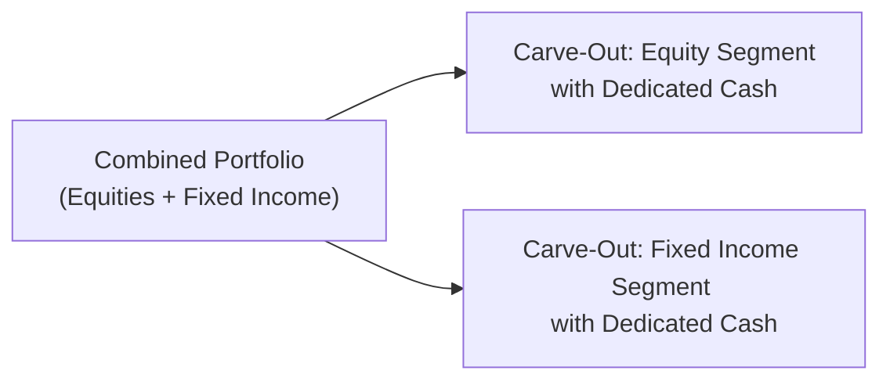

## Introduction

So, you’re looking at a balanced portfolio that’s composed of equities, fixed income, maybe a sprinkling of alternatives, and you want to measure the performance of just that equity segment. Or perhaps your firm specializes in implementing a particular strategy within a blended mandate, and you’d love to show verifiable performance for that specialized segment. “Carve-Out” is the concept you’ve been looking for. But wait—there’s a whole set of detailed rules under the Global Investment Performance Standards (GIPS) that govern carve-outs and partial composites. If you get them wrong, you risk inflating your numbers or, at the very least, facing a compliance headache.

This section explains what carve-outs are, how partial composites come about, and how GIPS addresses these situations. Along the way, we’ll explore best practices, highlight the main pitfalls, and even share some personal experiences that might make you chuckle (or cringe).

## Understanding Carve-Out Portfolios

A carve-out is essentially a separately managed piece of a larger portfolio. Imagine a balanced account with equities and fixed income. The investment manager might choose to treat just the equities as a “mini-portfolio,” tracking its performance independently from the entire balanced mandate. If you’re focusing on the equity portion for performance measurement, that equity “mini-portfolio” is your carve-out.

In past industry practices (you might recall stories from seasoned performance professionals), it was common to retroactively carve out equity performance from balanced portfolios, even if the equity segment didn’t truly operate as a separate entity at the time. This approach could inflate returns or misrepresent actual performance. Smart folks recognized the potential for abuse, and GIPS introduced specific carve-out requirements to ensure the performance you represent is real.

## GIPS Guidelines for Carve-Outs

The hallmark principle is that carve-outs must be managed with their own dedicated cash balance if they are included in a composite. This is a big deal. Sometimes, you’ll hear peers say, “Oh, we’ll just take whatever proportion of cash we think belongs to the equity piece and allocate it pro rata.” But that’s not enough under GIPS. The guidelines now insist that each carve-out have its own actual cash to support that subset of assets.

Why so strict? Without a specific allocation of cash, you can inadvertently (or intentionally) distort returns. Equity trades might be funded by the overall portfolio’s large cash pool or might share a portion of transaction costs in ways that aren’t transparent. By requiring a dedicated cash balance, GIPS ensures that the carve-out’s reported returns reflect the actual standalone strategy.

### The Role of Cash Allocation

When we say “its own cash balance,” this typically means real, in-practice segregation of cash. In other words, the equity segment is treated as its own mini-account. Cash inflows and outflows related to equity trades are recorded at the carve-out level, so there’s no guesswork on how to apportion interest income or transaction costs.

It may feel a bit more complex from an operational standpoint. You might have to open sub-accounts or track additional statements. But trust me, it’s worth it in terms of compliance. By properly segregating the carve-out, the performance starts to look and feel like a standalone portfolio. Investors can gain confidence that the results they see are the same results they’d expect if that carve-out strategy had always been managed on its own.

## Managing Partial Composites

Partial composites are closely related to carve-outs but speak to a broader concept. Instead of focusing on the entire account, you include only a segment of the account in a composite—maybe that segment best aligns with your style or product. The GIPS standards require robust disclosures here as well. You have to be explicit about:

• How you designated that partial piece as part of the composite.  
• How assets, expenses, and returns are allocated if the larger portfolio still shares some resources.

A partial composite might happen if you manage multiple strategies within one account. For instance, you’ve got a value equity strategy and a growth equity strategy allocated within the same overall portfolio. If you only want to show the growth portion in your GIPS composite, you can do so—provided you’re consistent, and you follow the guidelines, including establishing dedicated cash and ensuring your methodology is transparent.

## Practical Example of a Carve-Out

Let’s suppose you manage a balanced portfolio (60% equities, 40% bonds) for Client A. The client’s total portfolio is $10 million in market value. Let’s imagine you want to show your equity portion in your “Large Cap Equity Composite” for GIPS marketing. Under the newest guidelines, you need to set up that equity portion with its own cash, dedicated to equity purchases and sales. If the equity portion is $6 million, you might have $5.85 million in actual equities and $150,000 in dedicated equity cash.

When you measure performance, you only calculate returns using that $6 million segment (and the associated transactions and fees). You can’t rely on using leftover or “communal” cash from the $4 million fixed income portion to plug any shortfalls or pay for transactions.

### A Quick Performance Calculation

A simplified formula for the Carve-Out’s monthly return might look like:


R_{\text{Carve-Out}} = \frac{\text{Ending Value}_{\text{Carve-Out}} - \text{Beginning Value}_{\text{Carve-Out}} + \text{Net Cash Flow}_{\text{Carve-Out}}}{\text{Beginning Value}_{\text{Carve-Out}}}.


Here, Net Cash Flow includes transactions such as dividends, interest earned on the carve-out’s cash, or additional contributions specifically made to the carve-out strategy. Notice that this formula ensures you capture all components of performance (capital appreciation, dividends, flows) for the carve-out alone. GIPS wants the data to reflect the same parameters you’d use if the Carve-Out were independently managed.

## Comparing Carve-Outs vs. Partial Composites

In some conversations, you’ll hear the terms “carve-outs” and “partial composites” used almost interchangeably, but there’s a subtle difference. A carve-out is a piece of a broader portfolio that can stand on its own—like the equity slice we’ve been discussing. A partial composite is typically the bigger picture of multiple accounts where only a portion is being aggregated. You might have many accounts or carve-outs that each represent just a segment of a larger portfolio structure, which you then group together to form a partial composite. Think of carve-outs as the building blocks; partial composites as the final structure you assemble from those blocks.

## Potential Pitfalls and Risks

Carve-outs can be a useful marketing tool, but oh boy, can they be mishandled. One risk is that the carve-out’s performance might differ from a dedicated full-portfolio approach. Let’s say your equity strategy is normally a 100% equity-based product. But in the carve-out, the equity’s portion is overshadowed or influenced by the overarching balanced portfolio’s strategic asset allocation decisions. If the bigger balanced strategy shifts between equity and fixed-income over time, you could see performance that deviates from what a “pure” equity approach might do.

Another real pitfall is insufficient documentation. Firms might decide to carve out historical segments retroactively, with no record that a separate cash balance existed or that trades were allocated properly at the time. This can lead to compliance nightmares and potential restatements. As you might imagine, prospective clients get very irritated if they discover the performance wasn’t as bulletproof as advertised after they buy into your strategy.

## Best Practices

First, set up separate sub-accounts or sub-portfolios at inception if you anticipate using carve-outs for GIPS. Track all transactions meticulously, ensuring each carve-out has dedicated and documented cash. Once established, maintain consistent internal policies for how you measure and disclose the carve-out performance.

You also want to be crystal clear in your communications with potential investors. Provide disclaimers about the nature of the carve-out. Indicate that the segment is part of a broader mandate, and it may not reflect all the constraints a strictly standalone account might face.

## Case Study: Implementing Carve-Outs for a Multi-Asset Manager

Suppose you’re at a multi-asset management firm with a flagship balanced product, and the marketing team is suddenly keen to show off the “outstanding equity performance.” A portfolio manager (PM) story might go like this: “Ah, we had such a good year on equities in 2022, let’s highlight that!” The performance team steps in: “Sure, but we need to check if we had a dedicated equity carve-out structure with separate cash in place for 2022.” If the PM never arranged it, carving out that equity portion starting retroactively might not pass muster under GIPS. The moral? Plan ahead. If you might want to show that equity performance as a composite, track it properly from the get-go.

## Diagram: Visualizing a Carve-Out

Below is a Mermaid diagram illustrating a balanced portfolio where the equity and fixed-income segments each have dedicated cash, making them eligible as carve-outs if the firm wants to present either segment’s performance separately.

Each arrow reflects the relationship from the full portfolio to its sub-portfolios. As you can see, if you wanted to measure only the equity portion (or only the fixed-income portion), you could do so, provided the carve-out is truly handled as if it’s a full-fledged strategy in its own right.

## Synergies with Other GIPS Provisions

In practice, carve-outs interact with numerous other GIPS elements. For instance, GIPS (Section 3.9 on Performance Presentation and Reporting) requires consistent measurement of returns. Carve-outs must employ the same calculation methodologies as your other accounts to avoid confusion. You’ll also want to check how carve-outs factor into your composite definitions, as well as how they might influence verification efforts (see Section 3.11 on GIPS Verification).

There’s also the question of how to handle any derivative overlay or hedging strategy within the carve-out. For instance, if a portion of the portfolio’s derivatives are meant to hedge equity positions, it’s essential that those derivatives “live” in the carve-out if you’re going to count the performance fully. GIPS again wants you to treat the carve-out as though it is entirely discrete—so keep an eye on that.

## Impact on Performance Appraisal

Carve-outs can have a big impact on how you or your prospective investors appraise your skill. For instance, in Chapter 1 we introduced performance attribution. If you show only the carved-out segment but actually rely on cross-asset interactions in the bigger mandate, the raw returns might seem deceptively higher (or lower) than a stand-alone “pure” strategy. Understanding that carve-out performance isn’t always apples-to-apples with a dedicated product is vital. Prospective clients need to be made aware of any differences in the portfolio constraints, risk exposures, and cash management policies that might create performance divergence.

## Personal Thoughts and Anecdotes

I remember an instance where a prospective client asked me if we could cherry-pick the best performing segment from a balanced portfolio—just to give their investment committee a “taste” of the manager’s brilliance. I paused and said, “Well, we could show that, but we have to do it according to GIPS or else we risk misrepresenting ourselves.” The conversation went on for weeks, with the marketing folks pushing for a quick carve-out, and the compliance team waving the GIPS manual and hollering, “Dedicated cash! We need dedicated cash!” We eventually decided to properly set up carve-outs going forward, but we couldn’t claim historical carve-out performance. A bit frustrating at the time, but definitely the right call.

## Conclusion and Final Exam Tips

Carve-outs and partial composites can deliver more precise information about segments of a multi-strategy portfolio. They let you highlight your skill in a particular asset class or investment style, especially if that segment forms a key pillar of your approach. However, you must handle this carefully and comply with GIPS guidelines regarding dedicated cash, transparent disclosures, and consistent methodology. 

For the CFA exam, watch out for item-set or constructed-response questions that test your understanding of carve-out requirements—particularly regarding dedicated cash allocations, the possible inflation of returns, and the differences between partial composites and stand-alone accounts. Examiners might give you a scenario of a balanced portfolio and ask whether the equity-only performance qualifies under GIPS. Another possibility is a question about the impact of incorrectly retrofitting historical carve-outs and how that might distort performance numbers.

Remain consistent in each question’s approach, read carefully for disclaimers, and practice articulating why carve-outs must have dedicated cash. Time management is key: if you see a carve-out question in a multi-part item set, tackle the standard definitions and GIPS references first, then apply the rules to the specifics of the scenario. This thoughtful approach often helps avoid the dreaded “partial credit” meltdown.

## References

• CFA Institute, Global Investment Performance Standards (GIPS®), 2020 edition and subsequent guidance statements.  
• GIPS Guidance Statement on Carve-Outs, CFA Institute.  
• Spaulding, David. “Performance Measurement for Multi-Asset Portfolios.”  
• Official CFA Program Curriculum, Level III (Performance Evaluation and GIPS).  

## Test Your Knowledge: Carve-Outs and Partial Composites



### Which of the following is a key GIPS requirement for including a carve-out in a composite?

- [ ] The carve-out must contain at least 20% of the total assets of the portfolio.
- [ ] The carve-out must not exceed 70% of the total portfolio's assets.
- [x] The carve-out must have its own dedicated cash balance.
- [ ] The carve-out must be verified by a third party each quarter.

> **Explanation:** GIPS specifies that each carve-out included in a composite must have its own cash balance. This requirement prevents performance inflation or distortion that might arise if the carve-out were to draw from an overall pool of cash.

### A firm wishing to present carve-out returns for a fixed-income segment of a balanced portfolio should:

- [ ] Allocate cash flows proportionally between fixed income and equity.
- [x] Ensure that the fixed-income segment has its own dedicated cash account.
- [ ] Combine the segment with equity to form a partial composite.
- [ ] Use the portfolio’s overall return as a proxy for the fixed-income segment.

> **Explanation:** Under GIPS, the fixed-income carve-out must have its own dedicated cash in order to be considered a valid, standalone strategy.

### In GIPS terminology, a partial composite refers to:

- [ ] A sub-portfolio that has been separated retroactively.
- [ ] A multi-asset portfolio that includes both equities and fixed income.
- [x] A composite composed of segments from various accounts rather than entire portfolios.
- [ ] An account that includes less than the required minimum assets to form a composite.

> **Explanation:** Partial composites typically arise when only a portion of accounts (e.g., an equity segment in each portfolio) is grouped to form a composite.

### In a scenario where the equity portion of a balanced portfolio was not managed with its own cash balance, which GIPS-compliant action can be taken?

- [x] Exclude that equity portion from the composite and refrain from presenting it as a carve-out.
- [ ] Present it as a carve-out by retrospectively allocating cash flows.
- [ ] Present it in the composite, but note it as unverified performance.
- [ ] Aggregate the returns with another track record.

> **Explanation:** If the required dedicated cash balance was not maintained, the equity portion does not meet the carve-out requirement and cannot be included in the composite under GIPS.

### Which statement best describes the difference between carve-outs and partial composites?

- [x] Carve-outs are individual segments of a portfolio, while partial composites aggregate segments from multiple portfolios.
- [ ] They are synonymous in GIPS terminology.
- [ ] Carve-outs are restricted to fixed income, while partial composites are for equity.
- [ ] Carve-outs must exceed 50% of the total account, while partial composites do not.

> **Explanation:** A carve-out is a portion of an individual portfolio with dedicated cash, whereas a partial composite is formed by aggregating such carve-outs across multiple portfolios.

### One of the main risks of presenting carve-outs is:

- [x] Potentially misrepresenting overall risk and return compared to a stand-alone account.
- [ ] A requirement that the carve-out must trade entirely in derivatives.
- [ ] A lack of regulatory oversight.
- [ ] Lower tracking error compared to standalone mandates.

> **Explanation:** Because carve-outs are shaped by the broader context of the original multi-asset portfolio, their risk-return profile can deviate from an independently managed strategy, posing a risk of misrepresentation.

### To remain compliant with GIPS, which element is crucial for a carve-out’s performance calculation?

- [x] Tracking actual transactions and cash flows specific to the carve-out sub-account.
- [ ] Using a standardized industry average expense ratio.
- [ ] Combining leftover cash from other strategies.
- [ ] Allocating monthly returns evenly among segments.

> **Explanation:** Carve-out performance must include all actual transactions and dedicated cash flow events specific to that sub-account to ensure accurate returns.

### If a firm decides to include both equity and bond carve-outs from the same portfolio in different composites, it must:

- [ ] Only present them if each carve-out has identical client mandates.
- [ ] Exclude them from GIPS marketing materials.
- [x] Manage each carve-out with a distinct and verifiable cash balance.
- [ ] Obtain client consent in writing.

> **Explanation:** GIPS requires each carve-out in a composite to function like an independent portfolio with its own cash. The presence of multiple carve-outs from the same portfolio doesn’t remove this requirement.

### Which scenario illustrates a correct use of partial composites?

- [x] A firm that groups the equity carve-outs from multiple balanced portfolios into one composite, with each carve-out holding its own cash.
- [ ] A firm that subtracts bond returns from the total balanced return as a proxy for equity performance.
- [ ] A firm that merges entire balanced accounts under a single composite labeled “Equity.”
- [ ] A firm that retroactively creates consolidated returns for marketing purposes.

> **Explanation:** Partial composites typically combine carve-outs from many accounts, each of which is properly managed as a discrete segment with dedicated cash balances.

### Under GIPS, is it acceptable to create a carve-out from historical data after the fact?

- [x] True
- [ ] False

> **Explanation:** It can be acceptable, but only if the carve-out was actually managed with its own cash balance historically and all records are properly documented. If these conditions aren’t met, the carve-out cannot be reported in a GIPS-compliant composite.


