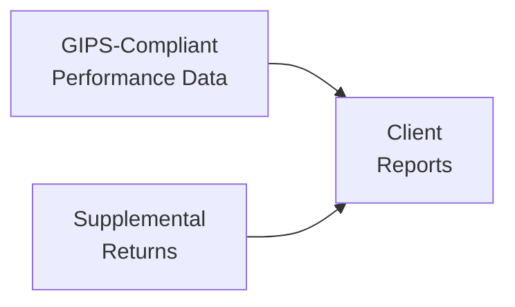

A lot of folks preparing for the CFA® Level III exam ask me: “Hey, how do we handle performance data that goes beyond what GIPS strictly requires?” Maybe you’re curious about adding risk measures or specialized returns for certain sub-portfolios. This is where “Supplemental Information” and “Supplemental Returns” come into play. It’s a world where you can present extra data that clients might find useful… as long as you follow certain guidelines (and trust me, you don’t want to trip up here right before exam day).

Below, we’ll explore how GIPS allows (and restricts) the presentation of these add-ons. We’ll discuss best practices, potential pitfalls, and real-world examples—because, honestly, many investment managers like to show off additional analytics that tell a fuller story. Still, GIPS wants to ensure we’re labeling the data appropriately and not overshadowing the required composite returns.

## Distinguishing GIPS-Compliant vs. Supplemental Data

The GIPS standards, as outlined in other sections (see “3.9 GIPS Requirements for Performance Presentation and Reporting”), are quite precise about what must be included in a compliant presentation. But often, you’ll have interesting or dynamic data points—like style analysis or custom factor exposures—that help your clients or prospects better understand your approach. These data points fall under what GIPS calls “Supplemental Information.”

Use disclaimers or headings that clearly separate these extras from the must-have information. In other words, you can provide further color, but you should never leave the impression that the extra stuff replaces or competes with your standard, GIPS-verified performance. The idea is to be transparent: “This info is optional, so read it with that in mind.”

Similarly, “Supplemental Returns” are typically for sub-strategies, carve-outs (discussed in “3.14 Carve-Out Portfolios and Partial Composites”), or side-pocket investments. Maybe your large global equity composite includes a real estate sleeve. If you want to show how that property portion performed, you can create a supplemental return chart. Just don’t let that overshadow the main composite’s GIPS-compliant returns. After all, the standard wants you to show uniform, comparable data.

## Supplemental Information Under GIPS

Supplemental information might include additional risk metrics such as standard deviation of monthly returns, Sharpe ratios for sub-periods, or style analytics (like a Morningstar® style box or factor loadings from a factor model). Let’s say you’re a portfolio manager who’s proud of your strategy’s downside protection; you might want to show a sort of worst-drawdown chart to highlight that strength.

The GIPS guidance requires you to label these metrics so it’s crystal clear to any prospective client: “Hey, these details aren’t part of the official, verified composite returns. They’re here for extra context.” In practice, you might put them in a separate section of your fact sheet or presentation deck. Or you might show them side by side with official returns—but with a heading that says “Additional Risk and Style Measures (Supplemental).”

Transparency is huge. You never want to mislead or confuse the client about what’s official, verified data versus interesting analytics that are not required to meet GIPS compliance. Don’t bury disclaimers in the footnotes. GIPS cares a lot about upholding trust in the data.

## Supplemental Returns: Key Considerations

Supplemental returns often refer to performance that is not (or cannot) be included in the main composite. For instance:

• Sub-Strategy Returns: If you manage a balanced portfolio with 70% equities and 30% fixed income, but you want to highlight how your equity picking specifically performs, you might calculate and present the equity sub-strategy’s annualized return as supplemental.  
• Side-Pocket Investments: In some hedge funds, certain distressed or illiquid assets live in a “side pocket.” You might show a specialized track record for those investments so that sophisticated clients or consultants can see how those pockets performed.  
• Carve-Out Returns: Imagine you have a broader multi-asset portfolio, but you carve out the real estate portion. You want to present its performance separately. If there wasn’t a dedicated pool of cash supporting it, you have to follow certain rules (see “3.14 Carve-Out Portfolios and Partial Composites”) before labeling it as GIPS-compliant. If you can’t meet those rules, the returns must be deemed supplemental.  

All these returns can be super valuable to folks trying to gauge your skill in specific segments, but you have to ensure the presentation doesn’t overshadow your official composites. GIPS is basically telling you: “Sure, show your specialized data, but keep it separate and properly labeled.”

A common pitfall is implying that the supplemental performance is “the real deal,” meaning it might overshadow the primary composite. Another issue is failing to define how you allocate costs and fees among various sub-strategies—if you’re not consistent, your supplemental data might look artificially strong compared to the actual composite returns. Also, never hide poor-performing sleeves by calling them “supplemental.” We all occasionally want to shove a losing strategy into the corner, but GIPS wants full transparency.

## Transparency and Accuracy Requirements

I had a negotiation with a client once—true story—who was absolutely fixated on the drawdown numbers of a sub-portfolio that was doing quite well, but in no way did that sub-portfolio reflect our entire strategy or main composite. They wanted it featured in the main presentation and basically put in bold font. We ended up labeling it as “Supplemental Distressed Debt Returns, not GIPS-verified.” That way, it was absolutely clear that we were not mixing it into our official composite performance.

GIPS guidelines tell us to take special care that the supplemental returns do not contradict or distract from the actual GIPS-compliant performance. If, for example, your official composite shows a 10% annualized return, you shouldn’t highlight a sub-strategy with a 15% return to overshadow that official figure (without clarifying that it’s a narrower slice of the pie).

## Illustrative Example: Handling Side-Pocket Returns

Let’s walk through a simplified scenario:

• You run an alternative strategy. A fraction of your assets is allocated to distressed credits that remain locked up in a side pocket.  
• Over the last two years, that side-pocket sub-portfolio generated returns that differ significantly from your main composite performance.  
• You’d like to highlight those results for potential clients who specifically care about distressed opportunities.  

Under GIPS, you must first see if you can create a separate composite that meets all guidelines for these side-pocket investments (covering their entire history, meeting the minimum portfolio count, etc.). If it doesn’t meet the GIPS requirements—maybe it’s too small or doesn’t represent a standalone, discretionary strategy—then you can’t market it as a GIPS-compliant composite. Instead, you can show it as “Supplemental Returns,” labeling it clearly and explaining how it’s calculated, including how costs/fees are allocated.

## Diagram: GIPS-Compliant Data vs. Supplemental Returns

Below is a Mermaid diagram depicting how GIPS-compliant performance data and supplemental returns flow into a final client report while remaining distinct:

In this chart, your official performance data (A) is the foundation. You may add specialized or additional returns (B), but they both go into the client’s final materials (C) as distinct segments.

## Labeling Guidelines

You will also want to incorporate footnotes or subtitles in your marketing decks, disclaimers in your PDF fact sheets, or separate headings in your web-based presentation. Clear labeling reduces confusion, legal risk, and the chance of non-compliance findings under a GIPS verification.

Keep these best practices in mind:  
• Use headings like “Supplemental Information (Not GIPS-Compliant).”  
• Provide context: “Performance for side-pocket accounts, net of fees, but excluding any impact on the broader composite.”  
• Explain data sources: If you blend benchmarks or use internal risk analytics, mention you did so purely for illustrative or educational purposes.

## Potential Pitfalls & Common Misunderstandings

One pitfall is inadvertently making supplemental returns look official. Another is forgetting to highlight differences in fee structures. Suppose you have a sub-strategy that benefits from lower fees or uses notional leverage. Its reported performance might be higher. If you fail to disclose these differences, you’re edging into “misleading” territory—definitely not the place you want to be, especially if you’re a prospective CFA charterholder abiding by the Code and Standards.

A lesser-known mistake is mixing partial-year and full-year data incorrectly; you might have performance for only six months in the sub-portfolio but are inadvertently presenting it as an annual figure. Even if you label it “supplemental,” mislabeling or failing to annualize properly can be considered non-compliant. In “3.8 Requirements for Including, Excluding, or Switching Portfolios Among Composites,” we talk about how to handle changing membership in composites. The same caution applies here: keep data consistent, or at least clarify differences plainly.

## Exam Insights

On the exam, you might see scenario-based questions where a portfolio manager includes sub-strategy data in a presentation. The question might ask you how to advise them to label it or identify where they are violating GIPS. Alternatively, you might run into an item set requiring you to separate official composite performance from carve-out returns. If you see that, remember the cardinal rule: separate the required data from any optional data, label them distinctly, and never overshadow the official compliance presentation.

## Final Thoughts and Practical Tips

• Always try to present official, GIPS-compliant performance first.  
• Then, if you think extra data will help the client decide on your product’s suitability, present that data in a separate “Supplemental” section.  
• Keep your disclaimers, headings, and footnotes clear and unambiguous.  
• Don’t cherry-pick your best sub-strategies and bury the worst ones—transparency is the name of the game.  

In my opinion, providing supplemental data is a great way to tell a more nuanced story about your processes. It also fosters better client engagement, as some investors love geeking out on those extra risk measures or style analytics. Just be sure to place it in the right location in your presentation materials, separate from the main GIPS numbers.

Remember, GIPS is about global comparability and trust. Let your official composites stand untainted. Then, by all means, talk about your side pockets, your carve-outs, or your super awesome drawdown metrics in the right section.

## References & Further Reading

• “Supplemental Information: Ensuring Transparency Under GIPS,” CFA Institute resources  
• “Measuring Investment Performance” by Timothy P. Ryan  
• See also “3.14 Carve-Out Portfolios and Partial Composites” and “3.9 GIPS Requirements for Performance Presentation and Reporting” in this volume  

## Exam Tips

• Expect to identify labeling violations.  
• Be prepared to show how to separate “Full Composite Performance” from “Supplemental” sub-strategy data.  
• Don’t forget about disclaimers and consistent fee treatment.

## Test Your Knowledge: Supplemental Information and Returns



### In presenting performance under GIPS, which statement best describes “Supplemental Information”? 
- [ ] Data that must be included in all compliant presentations. 
- [x] Information that is optional but can be shown alongside required data, with proper labeling. 
- [ ] Information used to replace the main GIPS performance. 
- [ ] Data limited to risk measures only.

> **Explanation:** Supplemental Information is optional data—like extra risk measures or style analysis—often included to provide additional insights. GIPS requires clear labeling so it’s not confused with the officially required composite performance.

### Which of the following could be an example of a Supplemental Return under GIPS? 
- [x] A sub-strategy return for a carve-out real estate allocation. 
- [ ] The strategy’s total firm assets over time. 
- [x] Performance of a side-pocket investment in illiquid securities. 
- [ ] Audited financial statements of the firm.

> **Explanation:** Supplemental Returns can include sub-strategy carve-outs or side-pocket performance. Firm assets or audited financial statements are not considered “Supplemental Returns”; they may be disclosed, but they’re not returns data per se.

### Why do GIPS standards require firms to keep Supplemental Returns separate from the composite presentation? 
- [x] To avoid overshadowing the official, GIPS-compliant performance. 
- [ ] To meet IFRS standards on side pockets. 
- [ ] To limit the use of customized investment strategies. 
- [ ] To reduce compliance costs.

> **Explanation:** GIPS aims for transparency and comparability. Supplemental data must not overshadow or be confused with the main composite, which is GIPS-verified.

### Which of the following is a best practice for labeling Supplemental Returns in a client pitch deck? 
- [x] Adding a clear heading that states “Supplemental—Not GIPS-Compliant.” 
- [ ] Presenting them in the same table with no explanatory footnotes. 
- [ ] Presenting them as official returns if they are audited. 
- [ ] Making them mandatory for all prospective clients.

> **Explanation:** Proper labeling with a specific distinction (e.g., “Supplemental—Not GIPS-Compliant”) is crucial to prevent confusion and remain compliant.

### When dealing with side-pocket investments, which statement is correct regarding GIPS reporting? 
- [x] If the side-pocket does not meet composite requirements, its performance must be labeled supplemental. 
- [ ] Side-pocket returns automatically replace the composite returns if they are higher. 
- [x] GIPS states that side-pockets usually require distinct reporting. 
- [ ] Side-pocket investments can only be reported if they exceed 25% of the total portfolio.

> **Explanation:** Side-pocket performance often cannot be included in the main composite unless it meets all composite construction rules. Hence, it frequently must be reported separately as supplemental.

### What is a key risk if supplemental information is not clearly labeled or disclosed? 
- [x] Investors may be misled about actual composite performance. 
- [ ] The manager might understate compliance fees. 
- [ ] The GIPS standards do not apply to supplemental information. 
- [ ] The returns become automatically verified by GIPS.

> **Explanation:** Without clear labeling, investors might mistakenly treat supplemental returns as official. That runs afoul of transparency requirements and can lead to compliance and reputational issues.

### Which action should be taken when adding risk measures as supplemental information?
- [x] Clearly identify risk measures as separate from required performance data. 
- [ ] Embed them within the main table without disclaimers. 
- [x] Provide footnotes explaining how the risk measures were calculated. 
- [ ] Remove the official composite performance from the presentation.

> **Explanation:** GIPS encourages transparency. Labeling these measures as supplemental and explaining them prevents confusion with official data.

### A firm wants to highlight the performance of a specific sub-strategy within a broad composite. Which GIPS-compliant step could be taken?
- [x] Present sub-strategy returns in a separate, labeled section. 
- [ ] Add sub-strategy returns to the official composite track record. 
- [ ] Incorporate sub-strategy returns without explanation. 
- [ ] Omit the official composite from presentations entirely.

> **Explanation:** If the sub-strategy doesn’t qualify as a separate composite, the firm can share its returns as supplemental, distinctly labeled from the main composite.

### If a carve-out portfolio has dedicated cash, under which condition could it be included in a GIPS composite?
- [x] It meets all composite and discretionary requirements, including dedicated cash. 
- [ ] It is audited quarterly. 
- [ ] It is a sub-strategy that outperforms the main fund in each period. 
- [ ] The firm chooses arbitrarily to include any carve-out in a composite.

> **Explanation:** GIPS requires that carve-outs must hold dedicated cash and meet all other requirements to be part of a GIPS-compliant composite. Otherwise, it’s supplemental information.

### Under GIPS, is it acceptable to list a “hypothetical return” as supplemental data?
- [x] True
- [ ] False

> **Explanation:** GIPS does not strictly prohibit presenting hypothetical or illustrative returns, but they must be clearly marked as such, separated from the actual composite performance, and labeled “Supplemental” or “Illustrative.” This prevents misleading presentations.


