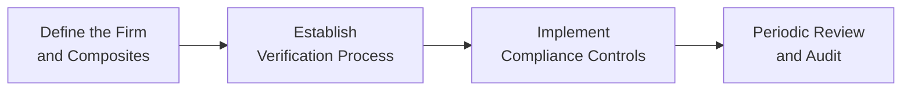

Introduction  
Sometimes, the whole notion of GIPS compliance feels like trying to juggle a dozen fragile glass balls in the air: you miss one, you’re left with a big mess. Over the years, I’ve encountered firms that desperately wanted to align with the Global Investment Performance Standards (GIPS) but didn’t quite realize all the behind-the-scenes discipline required. You get complexities around composite definitions, valuation frequencies, verification processes, appropriate disclosures—the list goes on. So, in this section, we’ll dig into some typical situations where GIPS compliance either gets tested or drastically improved. We’ll also check out how newly formed firms, merged organizations, and alternative-focused managers can all navigate that path.

The Implementation Roadmap in Action  
Though it might feel daunting, becoming GIPS-compliant generally follows a roadmap that includes setting up policies, documenting them in detail, training staff, and then verifying that compliance is being followed properly (and consistently) over time. GIPS (3.11) covers verification—why it matters, how it works, etc. But I’ve seen that real challenge is operational: you need reliable processes, consistent valuations, and thorough recordkeeping.  

Here is a simple diagram illustrating key stages of a GIPS implementation roadmap. Each node in the diagram breaks down a major task:

• Define the Firm and Composites: Decide how to define your "firm" (as required by GIPS 3.2) and set up composites that make sense based on investment strategies.  
• Establish Verification Process: Engage an independent verifier to ensure that the firm’s approach aligns with GIPS requirements.  
• Implement Compliance Controls: Adopt robust protocols for data collection, performance calculation, fee tracking, etc.  
• Periodic Review and Audit: Reassess composite definitions and processes regularly to keep them up-to-date and consistent with changes in the business.

Real-World Case Studies

Newly Formed Asset Management Firm  
Picture a boutique startup with just a handful of employees and grand ambitions. Let’s say they’re focusing on growth equity strategies for institutional clients. They want to show off a GIPS-compliant track record to attract new investors, but they’re quickly overwhelmed by the documentation demands. Basic steps we usually see:

• Documentation: A newly formed firm often lacks an extensive historical track record, so it’s easier to adopt GIPS-compliant processes right from the start. The important part is ensuring consistent and timely valuations.  
• Policies and Procedures: They create a policies manual that covers how often valuations will be done (daily, monthly, etc.), how external cash flows are handled, and how fees are charged and reflected.  
• Data Infrastructure: They choose a portfolio accounting system that automatically captures transactions, calculates returns, and keeps a log of every pricing source used.  
• Verification Considerations: Even though the firm has minimal history, they engage a verifier early. Being proactive helps to establish good habits and highlight potential shortfalls (like asset-level pricing errors or sloppy recordkeeping).

Nothing can derail those efforts faster than staff turnover or poor training—if the whole “why GIPS matters” idea hasn’t been sold internally, staff might skip steps, eventually forcing the compliance officer to backtrack and fix data. The key lesson: it’s easier to design GIPS compliance in from Day 1 than it is to retrofit your processes two years down the road.

Merging Two GIPS-Compliant Firms  
Now imagine two well-established firms, each GIPS-compliant, signing a merger agreement. On paper, this might look straightforward—both parties are already used to GIPS requirements. But in practice, sometimes the approach each firm took to define composites doesn’t match.  

• Overlapping Composites: If both had a Mid-Cap Growth composite, how do you handle it when the merged firm has the same strategy but with nuanced differences in the portfolio selection process? Are they effectively the same strategy, or do they remain separate composites within a single “firm?”  
• Historical Performance Portability: GIPS standards allow for performance portability under certain conditions. So the new firm may want to “carry over” each legacy track record. According to GIPS, you need full supporting documentation for that historical data (3.10).  
• Organizational Change: If roles and responsibilities shift around, ensure that new processes are aligned. This might mean rewriting the policies manual or even running an internal training session on how to classify new client accounts into the correct composites.  
• Communication with Verifiers: Mergers typically spark new verification reviews. The merged entity might need to demonstrate that both sets of policies were consistent with GIPS or update them so that the new group remains in compliance going forward.

Key takeaway: you can’t just treat post-merger compliance as an afterthought. If you do, you might wind up with incomplete track records or incorrectly combined composites—both can damage the new firm’s credibility and trigger compliance failure.  

Including Alternative Investments  
Another scenario is integrating alternative strategies into a GIPS-compliant framework. Private equity and real estate typically have unique timing for capital calls, illiquid holdings, and longer valuation horizons. Also, performance-based fees might be structured differently (like carried interest).  

• Valuation Timelines: Real estate portfolios might only get appraised annually or quarterly, meaning certain valuations come in at staggered times. If the overarching GIPS policy says “monthly valuations,” a real estate fund’s official property appraisals might not sync up very well. This discrepancy has to be handled carefully, with gap solutions (like interim estimates) documented.  
• Complex Fee Structures: For private equity carry (i.e., a portion of the profits after meeting a performance hurdle), ensure that all aspects of the fees are accounted for in your net returns. GIPS places a premium on accurate fee disclosure—especially for net-of-fee performance.  
• Composite Construction: Not every alternative strategy fits into a typical composite structure. For instance, some closed-end investments might exist in a single standalone composite or “carve-out” that’s presented with allocated cash (3.14). The key is consistent application of the rules laid out for composite creation.  
• Enhanced Disclosures: Investors may not fully grasp how real estate or private equity is valued. Hence GIPS typically requires additional disclosures that clarify a manager’s valuation approach, frequency of external appraisals, and so on (3.12).

Teams that are new to private equity or real estate often skip robust documentation in the hustle to close deals and manage capital calls. Over time, that can hamper compliance efforts if you can’t produce consistent asset-level valuations or you’ve introduced arbitrary valuations to help marketing materials.

Common Pitfalls and How to Avoid Them  
The biggest pitfalls in GIPS implementation revolve around these areas:

• Fuzzy Composite Definitions: If you define your composites too broadly, you might throw dissimilar portfolios into the same bucket. Or define them too narrowly, and you have 50 composites that no one can keep track of.  
• Inconsistent Valuation Policies: You can’t say “We value daily” but then slip to monthly whenever it’s inconvenient. The rules must be adhered to at all times, absent a well-documented exception.  
• Poor Recordkeeping: A lack of thorough documentation for historical performance, especially after staff turnover, can ruin your ability to claim compliance.  
• Inadequate Staff Training: Sometimes compliance “sits” with one person; if they leave, everything collapses. GIPS compliance culture has to be team-wide.  
• Missing or Conflicting Fee Handling: If you quote net-of-fee returns for clients but the fees get deducted incorrectly, you’ve introduced errors that can lead to re-statements of performance data.

Anyway, the universal fix is to formalize each policy and adhere to it meticulously. Keep your internal controls robust. Double-check that any organizational changes (like new strategies, new data systems, or new staff) feed seamlessly into the compliance structure.

Key Takeaways from the Case Studies  
• Documented Systems Prevent Chaos: Just like your desk at home, if you keep your GIPS workflows clean, you can find everything when you need it. But if you let it get messy—well, good luck staying on top of compliance.  
• Organizational Coordination Is Critical: Whether you’re a new firm or merging, talk to all the relevant stakeholders (portfolio managers, operations, compliance folks, etc.) to ensure alignment. GIPS compliance can’t be the lonely domain of a single person.  
• Alternative Investments Require Extra Attention: Real estate, private equity, and other alternatives demand special policies for valuations and disclosures.  
• Verification Adds Value: Independent verification isn’t just a “check” item. It’s also a big confidence booster for prospective clients.  

Best Practices to Maintain Compliance amid Organizational Change  
• Conduct Periodic Policy Reviews: Especially if the firm merges or introduces new product lines.  
• Maintain a Central Repository of Data: Some type of performance data warehouse that’s accessible and secure.  
• Methodical Onboarding for New Staff: Train them from day one on GIPS. Don’t assume they’ll pick it up “on the fly.”  
• Keep Your Verifier in the Loop: They can spot potential compliance trouble before it escalates.  

Practical Exam Tips  
In an exam context, you might see scenario-based questions where a firm faces a GIPS compliance issue mid-merger, or trying to incorporate private equity, or dealing with conflicting track records. The typical steps to answer those questions:

• Identify the GIPS principle or standard at stake (composite definition, recordkeeping, performance calculation, etc.).  
• Determine what the firm did right or wrong (like failing to define new composites for a newly introduced strategy).  
• Propose a workable solution for alignment (e.g., adopt a standard valuation policy, rectify fee calculations, etc.).  

References  
• Global Investment Performance Standards (GIPS) Case Studies, CFA Institute.  
• “Performance Measurement in Practice: A Case Study Approach” by Justin S. Pettit.  
• CFA Institute (2020). Global Investment Performance Standards (GIPS) Handbook.  
• Chapter 3, “Overview of the Global Investment Performance Standards (GIPS),” sections 3.1–3.17.

GIPS Implementation Case Studies: Test Your Knowledge  


### Which of the following is most critical for newly formed asset management firms seeking GIPS compliance?

- [x] Establishing clear policies for performance measurement and documentation at the outset
- [ ] Hiring a large operations team from the start
- [ ] Focusing exclusively on marketing materials over actual performance calculations
- [ ] Avoiding any engagement with external verifiers until the firm matures

> **Explanation:** Newly formed firms can benefit immensely by embedding GIPS-compliant practices right away—clear policies, consistent performance measurement, and proper documentation are foundational.

### In the context of merging two GIPS-compliant firms, which factor often complicates composite definitions?

- [x] Overlapping investment strategies with slightly different portfolio criteria
- [ ] A complete mismatch in both firms’ investment philosophies
- [ ] Lack of interest from clients
- [ ] Having too many performance verification options

> **Explanation:** While each firm might have a Mid-Cap Growth composite, for example, they could handle portfolio selection differently. Aligning or merging composites needs careful evaluation of definitions and historical track records.

### An investment firm that includes real estate portfolios under GIPS must pay special attention to:

- [ ] Monthly appraisals by multiple independent valuers
- [ ] Using only publicly traded property data
- [x] Valuation frequency and the potential need for interim estimates
- [ ] Not disclosing their property management fees to clients

> **Explanation:** Real estate valuations aren’t always monthly. Firms might need to rely on interim estimates, with more robust appraisals quarterly or annually, and must disclose the valuation process.

### In a private equity composite, which element is typically challenging to incorporate in net-of-fee return calculations?

- [ ] Brokerage commissions
- [ ] Custodial fees
- [x] Carried interest or performance-based fees
- [ ] Consulting fees

> **Explanation:** Private equity’s carried interest structure can be complicated. Ensuring it’s properly reflected in net-of-fee returns can be tricky but is required for accuracy.

### What best describes why organizational change can disrupt GIPS compliance?

- [x] Shifts in processes and personnel can lead to inconsistent application of established policies
- [ ] It automatically disqualifies the firm from GIPS compliance
- [ ] Regulators will not allow new composites after organizational changes
- [ ] Organizational change eliminates the need for verifying performance data

> **Explanation:** Whenever there’s a merger, acquisition, or other reorganization, new staff or new processes might inadvertently break existing GIPS policies unless carefully managed.

### Which of the following is a recommended practice when integrating alternative investments into GIPS-compliant composites?

- [ ] Valuing all private equity holdings daily
- [ ] Presenting performance gross-of-fee exclusively
- [ ] Eliminating all references to illiquidity in disclosures
- [x] Documenting and adhering to a consistent valuation policy for illiquid holdings

> **Explanation:** Alternative assets like private equity or real estate require well-documented valuation approaches, acknowledging their unique liquidity and pricing challenges.

### If a real estate fund invests in multiple properties with different appraisal schedules, GIPS compliance requires:

- [ ] Only an annual composite presentation
- [ ] Ignoring any valuations that don’t align with the standard monthly approach
- [x] A carefully documented approach to interim property values and disclosures
- [ ] Moving all property investments out of GIPS-compliant composites

> **Explanation:** GIPS doesn’t forbid different appraisal schedules, but you must maintain consistency, use interim valuations appropriately, and document everything clearly.

### Why is a central data repository critical for GIPS compliance?

- [ ] It prevents third-party verifiers from seeking direct contact with portfolio managers.
- [x] It ensures performance data is consistently available, securely stored, and easily verifiable.
- [ ] It replaces the need for internal controls or staff training.
- [ ] It allows for indefinite deferral of official performance reports.

> **Explanation:** Storing and organizing performance data in one place helps streamline verification, updates, and ensures that historical performance details remain accessible even if employees leave.

### Which statement is most accurate regarding verification in a newly launched boutique asset management firm?

- [ ] Verification is typically illegal without at least three years of track record.
- [x] Early engagement with a verifier can help shape proper compliance habits.
- [ ] Verifiers are only necessary after a firm has 10 or more clients.
- [ ] Verification replaces all other GIPS-compliance requirements.

> **Explanation:** Engaging a verifier early can help a new firm establish a solid compliance foundation. It’s not mandatory to wait years; it’s often helpful to involve them from the start.

### GIPS emphasizes consistent application of policies and procedures because:

- [x] It helps ensure performance data remains reliable through organizational changes or staff turnover
- [ ] It keeps the marketing department from revising performance numbers
- [ ] It reduces the need for record retention
- [ ] It promotes flexible interpretation of composite results

> **Explanation:** Consistency is key to reliable performance track records. Even if staff leave or the firm merges, consistent policies prevent major disruptions to compliance.


