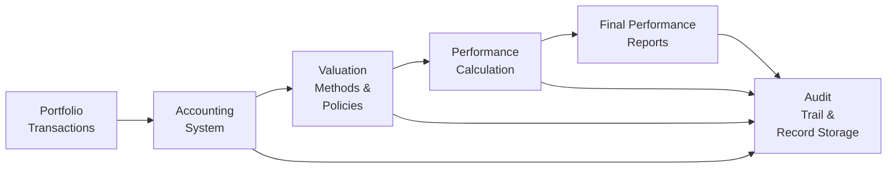

## Introduction

Well, you know that moment when you’re rummaging through a filing cabinet (digital or physical) trying to recall which folder holds that elusive statement or transaction record that just might save the day? If you’ve been there—frustrated, maybe a tad anxious—then you already have a taste of why GIPS recordkeeping matters. In the grand mosaic of GIPS compliance, record retention is kind of like the mortar that keeps all the mosaic tiles in place. It’s not the flashiest aspect of the puzzle, but it’s fundamental to ensuring your performance reporting stands up to scrutiny.

Recordkeeping often gets overlooked in favor of more dazzling topics like risk attribution or composite construction. But if the underlying data isn’t maintained correctly, well, your GIPS story basically falls apart. In this section, we’ll explore the key requirements, recommended practices, potential pitfalls, and real-world strategies for effectively preserving that crucial data trail.

## Why Recordkeeping Is Crucial for GIPS Compliance

On a personal note, I once worked with a small investment advisory firm that proudly claimed full GIPS compliance—until an external auditor asked for supporting transactional data from three years earlier. The problem was that the data existed on an old server that had since been retired, and no one had regularly backed it up. The firm had partial backups scattered over multiple devices, but reconstructing the entire history turned into a massive headache. It was a real-life (and expensive!) demonstration that having a robust record retention policy and following it faithfully is, frankly, a lifesaver.

Under the Global Investment Performance Standards (GIPS), staying compliant isn’t just about generating glossy performance reports. You must also ensure that every figure, chart, and table can be traced back to original accounting data, trade confirmations, and pricing sources.

## Essential Records to Retain

Think about recordkeeping as building a sturdy foundation for a house: if you don’t lay the right materials, the house won’t hold. Specifically, GIPS requires that firms maintain certain types of records that show exactly how performance results were calculated. Let’s highlight some key categories:

• Portfolio Transactional Data  
  - Trades executed (buys, sells, short sales, etc.)  
  - Fees (management fees, performance-based fees, transaction costs)  
  - Changes in holdings (custodial statements, date and volume of each transaction)  

• Composite Definitions and Policies  
  - Documentation that clarifies which strategies qualify for a particular composite  
  - Written guidelines on how new portfolios get classified  
  - Historical record of any composite redefinitions  

• Valuation Policies  
  - Pricing sources for each security type (particularly for illiquid or alternative assets)  
  - Methodologies used for fair valuation  
  - Changes to valuation approaches over time  

Storing these items is akin to preserving the layered foundation for your performance calculations—no single piece of data tells the entire story, but collectively, they provide an overwhelmingly robust audit trail.

## Retention Timelines

The question of “How long should I keep these records?” is something that can cause confusion, especially among newer or smaller firms.

Under typical GIPS guidance, firms must retain records long enough to support all reported performance. The industry’s best-practice standard is usually at least ten years of detailed data, or since the firm’s inception if it was formed more recently. So, if you’ve been presenting returns for a strategy going back seven years, you better have at least those seven years documented. If your composite track record goes back further than ten years, the records supporting it are equally necessary.

It might sound daunting, but storing data is usually simpler than you might expect. Modern data warehousing and cloud solutions can help keep costs manageable. That being said, it’s crucial to maintain the data in a format that can be feasibly retrieved and read. There’s little point in storing data on a medium that can’t be accessed by current technology—like those old zip drives that you can’t find a reader for anymore.

## Defining a Record Retention Policy

One might think that maintaining records is just about hitting “save” a bunch of times, right? Actually, it’s more formalized than that. In GIPS-lingo, your record retention policy is:

• A written document that outlines which records must be preserved  
• Specifies the form (digital, physical, or both)  
• Includes the schedule for how long they should be stored  
• Outlines the secure disposal process after the retention period ends  

This policy ensures consistency and equips you with a game plan for dealing with data from your earliest inception date to the present. Think about it like an insurance policy: the day you really need those records (hello, external verification or auditor request), you’ll be patting yourself on the back for having a well-defined policy.

## The Audit Trail

Sometimes we throw the term “audit trail” around so casually that it loses meaning. In a GIPS context, an audit trail is the documentation evidence that clearly shows how each performance figure was calculated. Imagine you’re trying to track the calculation for a portfolio’s monthly return. An effective audit trail demonstrates:

• Which accounting system or trade ledger the initial transaction postings came from  
• How fees were applied (e.g., if performance-based fees are subtracted in daily or monthly increments)  
• How the valuations (especially for illiquid securities) were sourced or estimated  
• Where adjustments (like foreign exchange translations) occurred  

A robust audit trail means you can stand in front of an external verifier—or even your own compliance officer—and confidently say, “Let me show you the precise path from initial trades to reported performance.” This is not a trivial matter. It’s the difference between providing credible performance results and unloading a string of disclaimers like “Trust us, we did it right.” GIPS, obviously, wants the former, not the latter.

## Real-World Example: Transaction Data Reconciliation

Let’s step into a quick scenario from an imaginary firm, Horizon Asset Management:

Horizon Asset Management manages several equity and fixed-income portfolios. For each trading day, the firm downloads transaction confirmations from its broker, which detail the trade price, volume, and associated fees. Each evening, the firm’s back office team imports these confirmations into its portfolio accounting system.  

Next, the accounting system automatically calculates daily holdings changes, adjusting positions to reflect new buys or sells. Monthly, the firm then runs reconciliation checks against custodian statements to confirm that everything matches (or at least aligns with allowable differences, like partial settlement timing).  

Here’s the kicker: The firm doesn’t just rely on daily backups. It also stores monthly data snapshots in a dedicated compliance data warehouse for 10 years. This means if external verifiers come asking three years from now—“Hey, how did you compute that monthly return for Portfolio X in June 2025?”—Horizon can trace that specific return right back to the original trade confirmations, custodian statements, and daily portfolio snapshots from the relevant dates.  

That’s the essence of a well-executed recordkeeping and reconciliation policy under GIPS.

## Common Pitfalls

Sure, it sounds so cut-and-dried in theory, but in practice, the following issues frequently arise:

• Storing Data in Obsolete Formats  
  - Technology evolves quickly, and I recall discovering an old cycle of backups stored on tape cassettes that nobody had the equipment to read. Consider rotating your storage media every few years.  

• Lack of Documentation for Security Valuation  
  - Particularly an issue with alternative investments or private equity, where market prices aren’t always readily available and management must rely on multiple guesswork inputs. If you don’t document your approach thoroughly, you could face major compliance challenges.  

• Inconsistent Recordkeeping Across Regions or Subsidiaries  
  - Global firms sometimes rely on local offices to manage their own data. Variation in policy can create large compliance gaps if certain markets aren’t retaining data properly.  

• Underestimating the Time and Resources Needed  
  - “Let’s just store everything in the cloud,” might sound simple—but do you have the staff to audit and verify that the data is properly categorized and retrievable?  

## Tools for Successful Recordkeeping

There’s a good chance you’ll lean on technology to store records across multiple years. Some popular solutions and approaches:

• Cloud-Based Systems  
  - Amazon Web Services (AWS) or Microsoft Azure-based solutions can handle huge data volumes, with retrieval speed that’s feasible for compliance checks.  

• Portfolio Management Software  
  - Many providers (think Advent, eFront, or BlackRock’s Aladdin) now include robust data archiving modules, making it easier to maintain compliance in a single environment.  

• Hybrid Cloud/On-Premise Solutions  
  - This approach can help with data privacy concerns in certain jurisdictions while still offering the scalability of the cloud.  

• Document Management Systems (DMS)  
  - Tools for scanning, labeling, and storing physical documents (like trade confirmations) in a digital form—making them easily searchable later.  

No matter which tool you pick, it’s wise to have a version control or time-stamped approach so you can demonstrate exactly which version of a record was used to create a performance figure.  

## Visual Overview of the Recordkeeping Process

Below is a simple Mermaid diagram illustrating the flow of data and records for a GIPS-compliant process:

In this diagram, each step’s data (transactions, valuations, performance, etc.) flows consistently to engage with the record storage process. At the end, you have an audit trail to verify everything.

## Best Practices for Long-Term Storage

1. Maintain Redundancy: A single system can fail or get corrupted. Keep at least one off-site backup (preferably in a different region).  
2. Validate and Reconcile Regularly: A monthly or quarterly check ensures your records are accurate and consistent.  
3. Plan for Technology Obsolescence: Upgrade or convert archival storage media at scheduled intervals—don’t wait 20 years.  
4. Build Clear Documentation: Summarize your record retention policy in a user-friendly manual. That way, new hires or external contractors can follow it.  

## Connecting Recordkeeping to Other GIPS Sections

• 3.2 Fundamentals of Compliance: Defining the Firm and Discretion  
  - Without a well-maintained archive, you can’t prove which accounts genuinely belong to your defined “firm.”  

• 3.9 GIPS Requirements for Performance Presentation and Reporting  
  - Strong recordkeeping ensures consistent disclosures so you can justify your claims in marketing materials or client presentations.  

• 3.11 GIPS Verification  
  - Verification relies heavily on your ability to produce records supporting your track record. Missing or incomplete files often lead to disclaimers or negative verification results.  

## A Tiny Peek at the Math

Occasionally, you’ll have performance calculations that incorporate multiple layers of fees. For example, net-of-fees return (Rₙ) could be something like:


R_n = \left(\frac{\text{Ending Value} - \text{Beginning Value} - \text{Management Fees} - \text{Transaction Costs}}{\text{Beginning Value}}\right) \times 100\%


Recordkeeping ensures you can confirm each fee figure matches real transactions. If you can’t show the source of the “Management Fees” or “Transaction Costs,” the credibility of the entire month’s performance is called into question.

## Practical Exam Tips

At the CFA Level III exam, you might see a question that presents a scenario where a firm claims GIPS compliance but is missing certain records (like old valuation files). You could be asked to discuss the compliance implications, highlight the specific Standard they’re violating, or outline next steps (like re-verifying the data or disclaiming certain historical periods). Be ready to explain how record retention (or lack thereof) can affect the reliability of reported returns. Also, keep in mind the interplay with verification and carve-out portfolios—both rely heavily on robust documentation.

## Final Thoughts

Whew—recordkeeping may not be the glitziest topic, but it’s arguably one of the most important. If you can’t support your performance claims under GIPS, your entire track record is basically on shaky ground. By creating a thorough record retention policy, leveraging technology, and showing a methodical approach for preserving data, you’ll keep yourself (and your firm) on the right side of GIPS compliance.

I’d encourage you to approach this topic proactively. Don’t wait for your external verifier to request documents you’re not ready to produce. It’s a bit like cleaning your room regularly rather than waiting for the day you move houses. It might feel tedious, but it avoids chaos down the line.

## Additional References

• “Recordkeeping for GIPS Compliance,” CFA Institute  
• “Verification and Recordkeeping for Asset Managers” by Bruce J. Feibel  
• GIPS Handbook, CFA Institute  

And, obviously, check out the entire Chapter 3 of your CFA® 2025 Level III Volume 3: Performance Measurement for a more holistic understanding of GIPS, including sections 3.9 on reporting and 3.11 on verification.  

Now—practical examples aside—let’s practice with some exam-style questions.

## GIPS Recordkeeping Knowledge Check



### Which of the following types of records does GIPS explicitly require firms to retain?

- [x] Portfolio transactional data that supports returns
- [ ] Only financial statements prepared for marketing purposes
- [ ] Senior management’s personal trading records
- [ ] Client meeting notes and internal memos

> **Explanation:** GIPS requires that portfolio transactions and valuation records be maintained to verify performance. Personal trading records, memos, or marketing-only financial statements are outside the scope of what GIPS explicitly demands.

### A firm claims ten years of GIPS-compliant performance. According to GIPS, how long should they maintain the underlying records?

- [ ] Only the last five years
- [x] For the entire GIPS-compliant performance period
- [ ] One year, with the remainder accessible only upon request
- [ ] Indefinitely, regardless of the compliance status

> **Explanation:** Firms must generally keep all data supporting claimed performance. If they show 10 years of results, they need 10 years of performance-supporting documents.

### Which best describes an audit trail in the context of GIPS?

- [ ] A list of marketing materials for prospective clients
- [x] Documentation linking reported returns back to original transaction data
- [ ] A record of risk models used for stress testing only
- [ ] A public record of the firm’s compliance officer’s annual certifications

> **Explanation:** The audit trail shows exactly how each performance figure was calculated, from trade data to final reported return. Marketing materials, risk modeling history, or compliance certifications alone do not satisfy this GIPS-specific need.

### What is a common pitfall if a firm relies solely on antiquated storage media for record retention?

- [x] It may become impossible to access data due to obsolete technology
- [ ] The data may automatically convert to the new version of GIPS
- [ ] There is no issue as long as the data was once readable
- [ ] It improves the security of older data

> **Explanation:** Over time, storage media (think zip disks or magnetic tapes) may become unreadable when the hardware to access it is no longer available. GIPS requires retrievable data.

### Which policy aspect should a firm’s record retention document generally include?

- [ ] Names of all staff members responsible for data entry
- [x] The length of time records must be stored
- [ ] The firm’s marketing strategy for new clients
- [ ] The salary structure of the portfolio management team

> **Explanation:** The main components of a record retention policy detail which records to save, in what format, and for how long. Staffing details, marketing, or compensation info aren’t primary components of such a policy.

### If a manager is unable to produce historical records for a period during which a composite claims GIPS compliance, the manager should:

- [x] Consider disclaiming GIPS compliance for that specific historical period
- [ ] Create estimates from memory to fill in the gaps
- [ ] Ask existing clients to verify the performance
- [ ] Ignore the missing data if less than 5% of the total time

> **Explanation:** Missing data compromises the track record’s credibility. Under GIPS, if a firm cannot substantiate its historical returns, it may need to adjust that period from its compliant performance history.

### One reason GIPS requires records to support the firm’s valuation policies is:

- [ ] To ensure daily interactions with the marketing team
- [x] So each security’s price point or valuation method can be verified
- [ ] To reduce all portfolio reports to one standardized format
- [ ] To simplify each firm’s internal code of ethics

> **Explanation:** Maintaining documented valuation policies (and how each security’s price was determined) is crucial for transparent and verifiable performance reporting.

### How should a global firm with multiple offices handle its GIPS record retention?

- [ ] Each office can create ad hoc policies
- [ ] Ensure only the head office keeps complete records
- [x] Establish a centralized, consistent policy and ensure local compliance
- [ ] Delete older records when an office relocates

> **Explanation:** GIPS compliance depends on consistent global application and the same standard of recordkeeping across all regions.

### A firm uses specialized risk premiums for performance analytics. Under GIPS, the firm must:

- [x] Document how these premiums are applied and stored so that performance can be tied to original sources
- [ ] Keep them secret for competitive advantage
- [ ] Include them only in the marketing presentations
- [ ] Avoid factoring them into overall returns

> **Explanation:** Any specialized factors or assumptions must be recorded and clearly documented so that external verifiers can trace how they influenced performance calculations.

### True or False: GIPS requires that firms maintain records indefinitely regardless of whether they continue to present those specific historical returns.

- [x] True
- [ ] False

> **Explanation:** As soon as a firm presents performance for a certain period, the underlying records must be accessible and verifiable. If they are still presenting those returns, the related records must remain retained, effectively for as long as the performance is shown.


