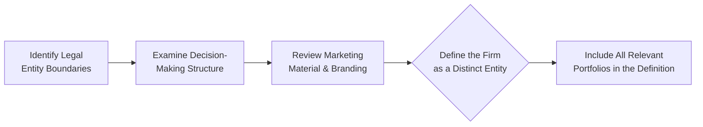

## Introduction

Understanding the definition of the firm and determining portfolio discretion are critical aspects of Global Investment Performance Standards (GIPS) compliance. These two cornerstones ensure consistency, transparency, and comparability in investment performance reporting. Put simply, GIPS requires that asset managers clearly delineate which entity is claiming compliance (i.e., “the firm”) and which portfolios are included in composites because they fall under the manager’s authority to make investment decisions (“discretionary” portfolios).

I still remember, years ago, working on a GIPS project for a mid-sized asset manager. The biggest eye-opener was realizing that simply calling ourselves “ABC Asset Management” wasn’t enough. We really had to figure out which parts of the organization actually shaped the investment decisions—and which company or sub-entity was presented to clients as the performance generator. That was the first step: define the firm precisely. Then, we had to figure out which portfolios were truly under our control and thus deemed discretionary.

In this section, we’ll discuss how to properly define the firm in line with GIPS, how to classify portfolios as discretionary, the practical implications for compliance, and real-life illustrations. We’ll also point out pitfalls, such as “cherry-picking,” and ways to avoid them.

## Defining the Firm: The Foundation of GIPS Compliance

Defining the “firm” might sound straightforward—after all, you’d think it’s just the legal name on your letterhead, right? Well, GIPS requires a bit more nuance. According to GIPS, the firm is often considered the distinct business entity that is “held out” to clients or prospective clients as a provider of investment management services. It must also reflect the entity that actually makes the investment decisions:

• The entity must have its own set of investment personnel responsible for formulating investment strategies.  
• The entity typically has autonomy over the way portfolios are managed.  
• The entity markets itself to clients as an investment manager that offers a particular style, strategy, or mandate.

### Why an Accurate Firm Definition Matters

1. Comparable, Apples-to-Apples Performance:  
   GIPS stands for transparency. If the entity that creates the strategy and executes trades is parted out into multiple legal sub-entities, you might obscure performance or inadvertently misrepresent the results to clients. You want to present performance from the entity that truly is “in control.”

2. Avoiding “Double Counting” or Omissions:  
   If you define your firm too narrowly, you risk excluding portfolios that should be included. If you define it too broadly—maybe including affiliates that don’t actually manage money in the same style or under the same brand—your performance might no longer be relevant or accurate.

3. Marketing and Client Expectations:  
   The GIPS approach ensures consistency between your performance marketing claims and the portfolios that produce your track record. Clients trust that the performance they see reflects the actual practice of the group they’re hiring.

### Legal Entity vs. Operational Entity

Sometimes the official “LLC” or corporate structure you see on a business card doesn’t truly capture how decisions get made. For GIPS compliance, often the operational structure is more relevant:

• If you have multiple subsidiaries but all portfolio strategies and decisions come from a centralized investment committee, you might define that collective group (not each subsidiary) as the firm.  
• Conversely, if you have separate business lines with distinct teams, strategies, and client bases, you may define each line as a separate firm.

### Example: Defining the Firm at a Large Global Asset Manager

Let’s consider an example. Suppose “ABC Global Investments” has a fixed-income division in New York and an equity division in London, each with distinct teams, marketing materials, and client relationships. If each division operates under unique brand identities and separate portfolio management processes, they might each qualify as separate GIPS-defined firms. But if the two divisions frequently blend strategies, share final investment decisions, and present themselves as a single global solution to clients, then ABC Global Investments might define itself as one firm worldwide.

### A Quick Visual Summary

Below is a simple Mermaid diagram illustrating key considerations in defining the firm:

The sequence highlights how you start with the legal structure, consider how decisions are actually made, verify branding, and then finalize your GIPS firm definition.

## Defining Discretion: Authority to Act

Once the firm is set, next is deciding which portfolios are discretionary. In GIPS nomenclature, a discretionary portfolio means the manager (the firm) has the authority—within the client’s constraints, if any—to execute the investment strategy. If a client imposes such restrictive limitations that the manager can’t implement its strategy, that portfolio is “non-discretionary.”

### Key Features of Discretion

1. Mandate or Strategy Alignment:  
   Does the manager have enough freedom to invest according to the specified style? If you’re managing a global equity strategy but the client says, “Never buy technology stocks,” that might hamper your strategy enough to call it non-discretionary. But smaller, typical constraints—like “No tobacco holdings”—might still be within your normal approach, so you’d keep that portfolio in the discretionary bucket.

2. Authority to Execute Trades:  
   Even if the manager can pick the securities, if the client must approve every transaction manually, you might not have real discretion. Usually, with truly discretionary portfolios, the manager can implement trades directly (though they may still consult the client on large changes or unusual investments).

3. Timeliness of Investment Decisions:  
   If you’re forced to wait weeks for a client sign-off on every trade, your ability to execute your normal process evaporates. GIPS wants to see your real skill and style in action.

### Classification Guidance

Under GIPS, each discretionary portfolio must be included in at least one composite. This classification is crucial because it ensures that you’re not selectively excluding underperforming accounts (aka “cherry-picking”). At the same time, it allows clients and consultants to see a consistent track record of how the manager’s skill is applied across the board.

### Example: When Discretion Might Be Questionable

Consider a scenario where you manage an “Income Growth” strategy, focusing primarily on dividend-paying stocks across sectors. One particular client has a personal restriction: “I don’t want to invest in any financial sector stocks.” If your strategy invests significantly in financial sector names—say 20% or more—this huge restriction changes the risk/return profile drastically. You might declare that portfolio as non-discretionary because it deviates substantially from the normal approach. On the other hand, if the restriction is minor, it’s likely still considered discretionary.

## Compliance Implications

### Composite Construction

Building composites requires consistent grouping of portfolios with the same strategy, objective, or mandate. So if your firm is “XYZ Asset Management” focusing on domestic equity growth, all domestic equity growth portfolios that are discretionary must go in that composite. This ensures performance data is representative of your actual management style.

### Cherry-Picking and the “One Composite” Rule

A fundamental GIPS principle is that every discretionary portfolio must be included in at least one composite, from the date it becomes discretionary until the date discretion is lost (or it leaves your management). The goal is to prevent you from omitting poor-performing portfolios to make your track record look better.

### Marketing and Client Reporting

Clients rely on composites to evaluate your strategies. If you define your firm vaguely or incorrectly, you might inadvertently mislead them. Likewise, including only the “cream-of-the-crop” portfolios undermines the spirit of GIPS, which calls for full and fair disclosure.

## Practical Case Study: Midsized Wealth Advisor

Let’s walk through a hypothetical scenario of a midsized wealth advisory firm:

• Three Partners, One Brand: “Sunrise Advisors,” a single brand marketing to a niche set of high-net-worth individuals.  
• Two Distinct Investment Approaches: One partner focuses on a value equity approach, while the other invests in growth equities. The third partner provides “holistic financial planning” but delegates investment decisions.  

### Step 1: Defining Sunrise Advisors as the “Firm”

Sunrise Advisors is a single firm if they’re holding themselves out to prospective clients under one common brand. Even if they have two distinct equity approaches, they still represent themselves as a single entity that manages money. All portfolios under the brand belong to Sunrise Advisors at the GIPS-firm level.

### Step 2: Identifying Discretion

• Value Equity Portfolios: The manager has near-complete authority. These are discretionary.  
• Growth Equity Portfolios: Same situation—discretion.  
• Holistic Financial Planning Portfolios: This might be tricky because if the third partner is not actually the investment decision-maker (maybe they outsource investment management to a sub-advisor), Sunrise Advisors might not be presenting performance for those portfolios as if they were the direct manager. They would either exclude them from compliance or define them as non-discretionary if Sunrise has no real authority over security selection.

### Step 3: Composite Construction

Because they have distinct strategies, you’d typically see at least two composites: one for all discretionary value equity portfolios and another for all discretionary growth equity portfolios.

### Step 4: Ongoing Compliance

Sunrise Advisors must keep consistent records, ensure that new or departing portfolios are added or removed in a timely manner, and maintain thorough documentation of all policies and procedures. Each quarter, performance must be aggregated according to the GIPS standards for each composite.

## Common Pitfalls and Best Practices

### Pitfall 1: Defining the Firm Too Narrowly

Some managers try to limit their “firm” definition to only one team or strategy that boasts stronger performance. GIPS prohibits that. At the exam level, you’ll want to remember that the entire business entity marketing investment services typically belongs under one GIPS-compliant umbrella, unless there’s a very strong operational or branding reason to separate them.

### Pitfall 2: Vague Discretion Policies

Not clearly documenting which constraints are or aren’t consistent with the strategy can cause confusion down the road—and might even risk GIPS non-compliance. Best practice is to document, in detail, the parameters that define or restrict your ability to carry out the strategy. This clarifies for clients, regulators, and your own staff which portfolios must be included in a composite.

### Pitfall 3: Inconsistent Composite Membership

We frequently see inconsistencies, such as a portfolio being included in a composite for a while, then randomly removed and placed in a different composite, or not included at all during certain periods. This is precisely what GIPS wants to avoid since it can distort performance results. Always track each portfolio’s membership from start to finish.

### Pitfall 4: Administrator Oversight

Sometimes, an external administrator or updated performance system might incorrectly code a portfolio’s strategy or discretion status. Ensure that you maintain robust internal controls, cross-check your composite memberships, and regularly verify your GIPS compliance data.

## Strategies to Overcome Challenges

• Maintain a Detailed Policy Manual: Keep a precise, up-to-date compliance manual describing who your firm is, how you define “discretion,” how you assign portfolios to composites, and how you handle transitions.  
• Involve Legal and Compliance from the Outset: Especially in large organizations that might reorganize, spin off divisions, or acquire other entities, you want to ensure that changes are considered in relation to your GIPS firm definition.  
• Periodic Reviews: A best practice is a quarterly or annual audit of your composite membership, verifying that every portfolio weaves seamlessly (or consistently) under your definition of discretion.  
• Communication with Clients: If new guidelines or restrictions surface, confirm whether the portfolio remains discretionary or not. Document each step thoroughly.

## Linking to Broader GIPS Topics

In Section 3.1, we discuss the overarching objectives of GIPS standards and how they enhance trust in the investment community. Understanding firm definition and portfolio discretion links directly to that mission. As you move through the rest of the GIPS chapters (e.g., Return Calculation Methodologies in 3.3, or Composite Return Calculations in 3.5), keep in mind that your foundation—defining which entity you are and which accounts are truly representative—affects all subsequent steps in performance measurement and presentation.

Likewise, from a practical standpoint, as you review any new accounts or acquisitions, remember that “Grandfathering” past performance under GIPS (discussed in 3.10) might hinge on whether the acquired entity can be integrated into your existing firm definition or stands as a separate entity.

## Exam Tips and Common Tricky Areas

• Be ready for scenario-based questions: The exam may introduce you to a multi-faceted corporate structure and ask you how you’d define the firm or whether certain accounts are discretionary.  
• Watch for partial constraints: Not all constraints disqualify a portfolio from being included. It’s only constraints that are so strict that the manager can’t follow the intended strategy.  
• Time horizon: The exam might ask about how quickly you must include a new discretionary portfolio in a composite (typically promptly after it meets the strategy definition).  
• Overlapping composites: Some strategies overlap, but a portfolio can only be in one composite if it’s a single strategy. If you manage partial segments, see GIPS guidelines on carve-outs (Section 3.14).  
• Keep track of transitions: If a portfolio changes from discretionary to non-discretionary due to new client restrictions, you must remove it from the composite in a timely manner.

## Conclusion

Though the process of defining the firm and discretion can feel nerve-racking—especially if you’re dealing with a complex organizational structure—this is the bedrock of GIPS compliance. A well-defined firm sets clear boundaries for which portfolios fall under your watch, and consistently identifying discretionary accounts ensures that investors see the true picture of how your investment strategies perform. It’s kind of like building the foundation for a house: if you cut corners at this stage, everything else stands on shaky ground.

Ultimately, by pinning down these fundamentals, you promote transparency and trust. It also keeps you from making mistakes that might come back to haunt you during external verification or an exam scenario. A thorough approach—documenting the who, what, where, and why of your firm’s structure and authority—prepares you to present performance with unwavering confidence.

## References and Further Reading

• CFA Institute. GIPS Standards Handbook, sections on Firm Definition and Discretion.  
• CFA Institute, “Global Investment Performance Standards (GIPS).” (https://www.cfainstitute.org/en/ethics-standards/gips-standards)  
• Institutional Investor Journals – Various articles on evolving practices in defining asset management structures.  
• Official CFA Program Curriculum, Level III readings on GIPS for further clarifications.  

------

## Test Your Knowledge: GIPS Firm Definition and Discretion



### Which of the following best describes the purpose of defining the firm under GIPS?  

- [ ] To ensure marketing materials follow a single branding strategy  
- [x] To delineate the distinct business entity responsible for investment decisions and performance  
- [ ] To separate legal ownership from performance claims  
- [ ] To increase the number of composites available for client reporting  

> **Explanation:** Under GIPS, a firm must be defined as the distinct business entity that provides investment management services and is responsible for the investment decisions presented in its performance.

### Suppose a firm has two separate divisions under one legal umbrella, each using a unique brand and investment process. According to GIPS:  

- [ ] Both divisions must always be defined as one single firm  
- [ ] Each portfolio can be included in both divisions for performance reporting  
- [ ] Both divisions should be wrapped into a single composite  
- [x] The firm can define separate GIPS firms if each division truly operates as a distinct entity  

> **Explanation:** GIPS allows separate firms if there are genuinely distinct investment processes, branding, and client-facing structures that effectively differentiate each division.

### When classifying discretionary portfolios, which factor is most relevant to GIPS compliance?  

- [ ] The geographic location of the client  
- [ ] The size of the portfolio’s assets under management  
- [ ] The fee structure chosen by the client  
- [x] The manager’s authority to execute the investment strategy without undue client restrictions  

> **Explanation:** Discretion is about the firm’s ability to implement its investment approach. GIPS focuses on whether the manager can fully exercise the agreed-upon strategy.

### A portfolio’s manager must obtain client approval for each trade, which typically takes weeks. How does this factor affect discretion under GIPS?  

- [ ] It is still discretionary, since the client eventually approves the trades  
- [x] It might be non-discretionary, as the manager cannot act promptly to implement the intended strategy  
- [ ] It disqualifies the firm from GIPS compliance entirely  
- [ ] It has no impact on GIPS compliance classification  

> **Explanation:** If the manager must wait an inordinate amount of time for client approvals, the actual control over investment decisions is hindered, likely rendering the portfolio non-discretionary.

### Which statement regarding inclusion in a composite is accurate?  

- [x] Every discretionary portfolio must be included in at least one composite  
- [ ] Portfolios can be selectively excluded for underperformance  
- [x] Portfolios can be included in more than one composite simultaneously, if they have multiple mandates  
- [ ] Non-discretionary portfolios must be assigned a composite before manager discretion is removed  

> **Explanation:** GIPS generally requires every discretionary portfolio to be included in at least one composite so that performance is fully representative. Sometimes, a portfolio might be included in more than one composite if it truly spans multiple strategies (though commonly it’s just one primary composite).

### If a client specifically forbids the purchase of any energy stocks, and the manager’s strategy relies substantially on energy sector allocations, how would GIPS likely categorize this portfolio?  

- [ ] Discretionary, because the manager can simply underweight the sector  
- [ ] Discretionary only if the client specifies a minimal percentage in energy  
- [x] Non-discretionary if the restriction materially alters the manager’s normal strategy  
- [ ] Always part of the manager’s main composite  

> **Explanation:** If the restriction is so significant that it undermines the normal approach, GIPS would consider the portfolio non-discretionary.

### A firm reorganizes into three specialized boutiques. To maintain GIPS compliance, what is the first step in addressing the new structure?  

- [ ] Redo all performance calculations from inception  
- [x] Formally redefine the GIPS firm(s) to match the new boundaries  
- [ ] Discontinue marketing previous performance  
- [ ] Create a combined composite for all new boutiques  

> **Explanation:** Whenever a firm reorganizes, it must update its definition of the firm to reflect the new structure and make sure composites and performance history are reassessed accordingly.

### Which scenario best represents “cherry-picking” under GIPS?  

- [ ] A manager reclassifies a strategy because of new investment constraints  
- [ ] A client invests in an alternative product that does not fit any existing composite  
- [x] A manager excludes a poorly performing discretionary portfolio from its relevant composite  
- [ ] A manager merges two composites with similar investment strategies  

> **Explanation:** Cherry-picking occurs when a manager selectively excludes (or includes) certain discretionary portfolios to manipulate aggregate performance results.

### Under GIPS, can a portfolio move from one composite to another?  

- [x] Yes, but only if the portfolio’s investment mandate or strategy changes  
- [ ] Yes, but only for short periods to demonstrate better performance  
- [ ] No, a portfolio is locked in one composite permanently  
- [ ] Yes, at the manager’s discretion at any time  

> **Explanation:** Portfolios typically follow their strategy or mandate. If the strategy or mandate changes, then the portfolio can be moved to a more appropriate composite under GIPS rules.

### GIPS primarily aims to:  

- [x] Provide investors with a consistent method to evaluate the performance of investment managers  
- [ ] Impose nation-specific regulatory laws on asset management firms  
- [ ] Guarantee that all firms have identical performance results  
- [ ] Replace risk management procedures and compliance protocols  

> **Explanation:** GIPS fosters transparency and comparability in performance reporting, helping investors make informed decisions.


