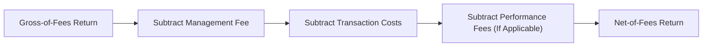

## Introduction to Standardized Return Calculation in GIPS

Well, here we are talking about one of those “can’t-ignore” aspects of performance measurement: how you actually calculate the returns. Sure, most of us think, “I just take the ending portfolio value minus the beginning value, divide by the beginning value, and that’s that.” But as soon as we add contributions, withdrawals, management fees, performance-based fees, and other real-world complexities, the story gets a bit trickier. The Global Investment Performance Standards (GIPS) require adopting consistent and standardized methods for calculating and presenting returns, all to make sure we’re telling the truth—the whole truth—about a portfolio’s performance. In other words, GIPS is a bit like a referee, ensuring we keep the game fair and consistent across all industry players.

It’s possible you’ve encountered a few frustrations along the way: large clients dropping huge inflows at unexpected times, changes in fee structures mid-quarter, or the dreaded multi-day lag in booking transactions or fees. If any of that resonates with you, you’re certainly not alone. The main objective is to handle these real-world intricacies in a manner that remains fair, transparent, and standardized so investors can compare apples to apples.

Below, we’ll jump right into external cash flows, time-weighted returns, fees and expenses, and the recommended GIPS treatment of these things. The journey will show how thoughtful calculations keep our performance numbers—and reputations—intact.

## External Cash Flows and Their Impact

External cash flows come in two broad flavors: contributions (money flowing into the portfolio) and withdrawals (money leaving the portfolio). When we call them “external” flows, we specifically mean money from outside the investment manager’s control—either from the client depositing more funds or taking some away. These external flows can seriously distort performance results if we just blindly plug them into a simple (End – Beginning) / Beginning calculation. Why? Because if an investor dumped an enormous sum into the portfolio just prior to a big market upswing, it might overstate the manager’s true skill. Conversely, if a large withdrawal happens right before a decline, it might make the manager’s performance look artificially better (or possibly worse, depending on the timing).

### Time-Weighted Rate of Return

To address these fluctuations caused by external cash flows, GIPS strongly advocates for time-weighted rates of return (TWRR). A TWRR effectively neutralizes the effect of these external flows by breaking the measurement period into subperiods each time a significant flow occurs. Let’s talk about how that is done.

In a simplified sense, you start with:

1. Segmenting the entire performance period into subperiods. Each subperiod starts right after an external cash flow occurs and ends right before the next flow.  
2. Calculating the rate of return (rᵢ) for each subperiod i using the portfolio value at the start and end of that subperiod (not counting the external flow itself).  
3. “Chain linking” these subperiod returns to create a compound growth figure for the overall period.  

Mathematically, if you have subperiod returns r₁, r₂, r₃, …, rₙ, then:

r_total = (1 + r₁) × (1 + r₂) × (1 + r₃) × … × (1 + rₙ) – 1

This approach eliminates the distortion from external cash flows by giving each subperiod a consistent weighting, no matter how big or small the inflows or outflows might have been. From a GIPS standpoint, TWRR is the gold standard for performance presentations.  

And in case you want a quick conceptual overview, consider the following diagram:

Original anecdote: I remember once handling a client portfolio that received a surprisingly large cash inflow partway through a quarter. If we’d just used a simple rate of return formula, the portfolio looked like it grew by leaps and bounds. But TWRR told a more modest story: the new capital arrived right before a modest market pullback, so that big deposit didn’t inflate performance in any misleading way.

### Modified Dietz Method

Of course, you might encounter situations where it’s not practical to perform daily valuations for subperiods (for instance, legacy systems might not support it, or the level of data might be excessive to handle each day). That’s where the Modified Dietz method can step in.

The Modified Dietz approach is considered an approximation to the exact TWRR because it attempts to weight each external cash flow by the fraction of the period that it remains invested. So if a big deposit arrived exactly halfway through the period, that deposit effectively only “participated” in half the period’s returns.

The formula for Modified Dietz might look a little intimidating at first, but it’s straightforward:

r_ModDietz = (Vₑ − Vᵢ − ΣCᵢ) / [Vᵢ + Σ(wᵢ × Cᵢ)],

where:  
• Vₑ = ending portfolio value,  
• Vᵢ = beginning portfolio value,  
• Cᵢ = each external cash flow (positive for contributions, negative for withdrawals),  
• wᵢ = the weight representing the fraction of the period remaining after flow i.  

Remember, the aim is to approximate how your portfolio actually performs, neutralizing the daily timing of those external flows. You get a time-weighted-like result without having to do full-blown daily valuations.

### Large or Irregular External Cash Flows

The GIPS standards encourage caution if a portfolio experiences a large (or unusual) external flow. Sometimes, you might even treat it as a separate “temporary new portfolio” if the flow is so big that it effectively changes the portfolio’s composition altogether. For instance, if half the portfolio’s assets arrive halfway through the month, you might create a separate subaccount or “carve out” to properly handle that brand-new set of assets. GIPS provides flexibility here, but the overarching principle is clear: try not to let weird or big external flows misrepresent the real performance.

## Fees and Expenses

All right, so external cash flows are important, but now let’s turn to a subject that’s even more near and dear to clients’ hearts: fees and expenses. After all, it’s one thing to say, “Here’s how well I can grow your investments.” It’s another to show how fees or transaction costs might eat away at that growth. One of GIPS’s pillars is transparency, which means you cannot just skim over the fees or hide them in a footnote that no one reads. You have to be upfront and consistent.

### Gross-of-Fees vs. Net-of-Fees Returns

In GIPS presentations, it’s typical—though not mandatory—to present Net-of-Fees Returns. Net-of-fees means you take your gross investment performance and subtract all the management fees, carried interest, performance fees, and other costs that a client actually pays. Why does that matter? Because from a client’s perspective, it’s the only performance number that reflects how much their investment truly grew after paying the person who manages the money.

Yet some managers prefer to present Gross-of-Fees Returns, especially if they charge different fee schedules to different clients or if they manage multiple strategies. Both are acceptable under GIPS, as long as it’s spelled out exactly how you calculated them. But (and it’s a pretty big “but”) you must also show or make available net-of-fees performance under GIPS 2020 if your clients pay fees in real life. The rationale is that prospective clients want to know what they might actually get in hand, not just some hypothetical “before fees” figure.

### Transaction Costs

Transaction costs are sometimes overlooked, but the reality is that they can be a substantial drag on performance, especially for portfolios with high turnover. GIPS says you should be including all actual trading costs (like brokerage commissions) that are directly associated with the trades themselves. Soft-dollar arrangements or other forms of indirect brokerage costs might require more intricate disclosure, so you want to be conscientious. The overarching standard is: if clients pay it, it’s part of the cost basis in measuring net-of-fees returns.

### Performance-Based Fees, Carried Interest, and Allocation

Performance-based fees or carried interest can complicate the fee picture further, because they depend on the level of returns the portfolio actually generates. Again, GIPS is all about disclosure and accuracy. First, you need to ensure that any performance fees are accounted for in the net returns, because these are expenses that a client ultimately bears. You also want to properly track and allocate them to the correct performance period. If the fees are only crystallized on a certain date, it can create a big chunk of cost recognized all at once, which might artificially lower the net return for that particular measurement period. GIPS’s position is consistent: if that’s how the client experiences it, that’s how you have to report it—while disclosing the method used for allocating those performance-based fees across the relevant time frames.

### Practical Example on Fees

Imagine you manage a private equity fund with a 2% management fee and a 20% carried interest after returning the capital. Suppose the fund invests $1 million at the start of the year. The fund’s gross performer: a 30% return on the principal. But that’s not what the client takes home:

• First, the management fee typically applies on the committed capital or net asset value, so you deduct $20,000 in management fees (assuming 2% × $1 million).  
• Then comes the carried interest. Because the gain was $300,000 in total, 20% of that ($60,000) ends up being carried interest to the manager.  
• The net-of-fees return for the client is thus smaller than the 30%. Specifically, $1 million turned into $1,300,000 in gross terms, but you subtract $20k + $60k, leaving $1,220,000. That’s a net-of-fees gain of $220,000 or 22% for the year.  

From a GIPS compliance standpoint, you’d have to present that net-of-fees performance if you want to show the actual return that the investor experiences.  

## Daily Valuation Methods

The GIPS standards in their more recent versions (particularly post-2020) encourage daily valuation or a method that approximates daily valuation. If that makes you feel overwhelmed, consider that many modern portfolio systems can automatically re-price each portfolio daily. Sometimes, you’ll see reference to “fair value” or a concept known as “marked-to-market,” where you hold each security at its fair market value as of the close of each trading day. The big advantage is that daily or more frequent valuation gives you a straightforward approach to TWRR: each day’s external cash flows can be measured precisely, and each day can effectively be treated as a subperiod, if needed.

If your firm uses daily valuation, the TWRR effectively becomes the chain-linked product of daily returns:

(1 + r₁) × (1 + r₂) × … × (1 + rₙ) – 1,

where each rᵢ is the return from day i to day i+1. Although the data workload can be heavy, it’s often architected into the portfolio accounting system.  

## Balancing Transparency and Practicality

There’s a tension between providing an extremely accurate representation of returns and the operational complexity that might introduce. In a perfect world, everyone would do daily valuations, with all transaction costs itemized in real-time, and with fees deducted precisely on the day they’re incurred. GIPS doesn’t require complete daily valuations in every scenario, but it encourages you to use the most accurate approach feasible within your operational constraints.  

If you’re a small private wealth manager with set quarterly valuations, you might use the Modified Dietz method or a monthly TWRR. If you handle large institutional accounts with real-time portfolio systems, you might do daily TWRR. So GIPS leaves a bit of wiggle room in your methodology—just be consistent, transparent, and aim for the highest possible precision in measuring actual results.  

## Common Pitfalls

1. Overlooking Intra-Period Flows:  
   Some managers do a single measure for the entire quarter, ignoring the fact that a big deposit came in partway through the period. That can lead to serious misrepresentation of your skill. A manager might pat themselves on the back for “great returns,” when in truth it was inflows that boosted the asset base at the right time.  

2. Underreporting Fees:  
   Occasionally, firms present gross-of-fees returns without highlighting that fees are quite hefty. That might lead to an inflated sense of performance. Or they might forget to net out certain performance fees that are accrued, even if not physically paid until year-end.  

3. Inconsistent Fee Provisions Across Composites:  
   If you manage multiple composites—say, one for institutional clients paying a low base fee and one for high-net-worth clients paying a higher base fee plus performance fees—you need to ensure each composite’s net-of-fees returns reflect the actual fees for those investors.  

4. Missing Carried Interest Timing:  
   Firms sometimes fail to properly allocate carried interest to the period in which it is actually earned. That can lead to artificially high net-of-fees performance in some periods and artificially low in others.  

5. Failing to Disclose Calculation Method:  
   Presenting TWRR without clarifying how subperiods are determined, or lumping all external flows into a single multiplier, can make your performance presentation less credible. GIPS demands clarity around how those returns are actually calculated.  

## Real-World Case Studies

Picture a hedge fund that has monthly subscriptions and redemptions. The fund’s system calculates a daily net asset value (NAV), and each client’s ownership percentage is updated at month-end. In that scenario, daily valuations help compute TWRR quite accurately, and all fees (including performance fees) are accounted for in the daily NAV. Now imagine a smaller private client manager who receives or disburses funds irregularly. If that manager only values portfolios monthly, they might calculate returns using the Modified Dietz method or a TWRR approach that segments the month whenever a large external flow occurs.  

Both practitioners can comply with GIPS, but they adopt methods that match their operational scale. What’s common is their dedication to methodical, consistent processes for handling external cash flows and fees.

## Diagram: Simplified Overview of Fee Deductions

Below is a quick visual representation of how fees might reduce a portfolio’s returns over time:

In practice, each portfolio might have idiosyncratic fees (like custody fees, fund administration, or legal expenses), so net-of-fees must reflect reality.  

## Best Practices for Implementation

• Make sure you track and record all external cash flows precisely. If an investor wires funds midday, mark that day and its exact amount.  
• Adopt TWRR unless there’s a compelling reason not to. TWRR is the standard for GIPS compliance, as it neutralizes client-driven inflows or outflows.  
• For large or irregular flows, consider sub-period linking or revaluations to ensure accuracy.  
• When presenting net-of-fees returns, capture all actual costs— including performance-based fees or carried interest.  
• If you choose to present gross-of-fees returns, disclose how fees are accounted for (or not accounted for). Provide net-of-fees figures or at least make such figures accessible.  
• Document your approach thoroughly. GIPS requires consistent and detailed performance policies and procedures.  

## Exam Tips and Context

On the CFA exam, external cash flows and fee calculations often appear in scenario-based questions. You could see an item set where a portfolio experiences multiple deposits and withdrawals, and you’ll be asked to compute the time-weighted return, or identify an error in how management fees were accounted for. Or you might see an essay-style question about best practices for performance calculations under GIPS. The crucial points to emphasize include:  

• Understanding and applying TWRR.  
• Knowing when and how to use the Modified Dietz method (and its limitations).  
• Correctly subtracting fees to derive net-of-fees returns.  
• Properly disclosing your methodology in line with GIPS.  

Remember that exam graders look for your ability to apply principles in a real context, not just memorize formulas. If you see a big external cash flow in the middle of the quarter, you should know that performance must be “time-weighted” or subperiod-linked around that flow. If a question references a manager only using a single period for the entire quarter, you should spot the GIPS violation or the inaccuracy.  

## References and Further Reading

• “Performance Measurement: Evaluating and Presenting Results,” by Philip Lawton, CIPM (comprehensive coverage of performance calculation and presentation).  
• CFA Institute’s “GIPS Standards Handbook,” especially the sections on external cash flows, time-weighted return requirements, and fee disclosures.  
• CFA Institute’s official reading on GIPS compliance and verification in the CFA Program Curriculum.  

Feel free to explore more advanced texts or articles once you have a solid grasp of TWRR and standard fee treatments. The deeper you go, the more you’ll see how pivotal these calculation nuances are, not just for passing the exam but for upholding professional integrity.

---

## Test Your Knowledge: Return Calculation and GIPS Methods



### Which rate of return approach does GIPS generally recommend to neutralize the effects of external cash flows?  
- [ ] Money-weighted rate of return (MWRR)  
- [x] Time-weighted rate of return (TWRR)  
- [ ] Internal rate of return (IRR)  
- [ ] Discounted cash flow (DCF)  

> **Explanation:** GIPS emphasizes the time-weighted rate of return as it reflects the manager’s skill, independent of external cash flows.

### When should a portfolio be revalued to handle large external cash flows under GIPS?  
- [x] When such flows materially distort performance  
- [ ] Only once a quarter  
- [ ] At the end of each fiscal year  
- [ ] Never, as GIPS automatically accounts for large flows  

> **Explanation:** GIPS allows or even recommends additional revaluations for large external flows to ensure more accurate time-weighting.

### In Modified Dietz, which of the following is considered?  
- [ ] Valuing the portfolio daily  
- [x] Weighting each external flow by the fraction of the period invested  
- [ ] Ignoring external cash flows altogether  
- [ ] Doubling the return when no flows occur  

> **Explanation:** The Modified Dietz method approximates TWRR by assigning time weights to each cash flow based on how long it’s invested in the portfolio.

### Which fee structure is deducted in net-of-fees returns?  
- [ ] Only management fees  
- [ ] Only brokerage commissions  
- [x] All actual fees and expenses, including performance-based fees  
- [ ] No fees unless they exceed 2%  

> **Explanation:** Net-of-fees returns reflect what a client truly experiences, so all actual management and performance fees, as well as relevant expenses, must be deducted.

### How do soft-dollar arrangements typically affect net-of-fees returns for GIPS compliance?  
- [x] They must be accounted for if they affect actual trading costs  
- [ ] They can be excluded because they don’t use real money  
- [x] They often appear in disclosures if they reduce trading commissions  
- [ ] They have no impact on performance  

> **Explanation:** Soft-dollar credits can affect the actual transaction costs that clients bear. Where applicable, GIPS requires full disclosure about how these arrangements may or may not affect net-of-fees returns.

### What is the main advantage of daily portfolio valuation for performance measurement?  
- [x] It provides more accurate calculation of TWRR  
- [ ] It reduces administrative costs significantly  
- [ ] It is required by GIPS in all circumstances  
- [ ] It eliminates the need for disclosures  

> **Explanation:** Valuing portfolios daily increases the precision of TWRR because external flows can be accounted for exactly when they occur, resulting in more accurate performance measurement.

### A portfolio experiences a withdrawal of $1 million halfway through the month. Which statement best applies under GIPS?  
- [x] The portfolio should be revalued, and a separate subperiod return should be calculated for accuracy  
- [ ] The withdrawal can be ignored for performance calculations  
- [x] One can approximate by using the Modified Dietz weighting  
- [ ] The manager must treat the portfolio as if the withdrawal never happened  

> **Explanation:** When a large external flow happens mid-period, GIPS recommends revaluation or at least an approximation method (Modified Dietz) to accurately capture the effect of that withdrawal on performance calculation.

### Under GIPS, which return measure is often displayed alongside gross-of-fees returns?  
- [ ] Gross-of-taxes returns  
- [x] Net-of-fees returns  
- [ ] Risk-adjusted returns  
- [ ] None, GIPS disallows multiple return measures  

> **Explanation:** GIPS generally requires that if you present gross-of-fees returns, you also must show or make available net-of-fees returns so that prospective clients can see what the actual take-home result is after fees.

### Performance-based fees in private equity funds must be:  
- [x] Disclosed and included in net-of-fees returns  
- [ ] Treated as separate from management fees and not disclosed  
- [ ] Ignored for GIPS compliance  
- [ ] Fully reimbursed to the investor if performance declines  

> **Explanation:** GIPS requires that performance-based fees and carried interest (typical in private equity) be properly reflected in net-of-fees returns and disclosed.  

### Under GIPS, it is permissible to keep a single return figure for an entire quarter, ignoring intra-quarter external flows, as long as:  
- [x] The flows are immaterial  
- [ ] The manager obtains permission from the client  
- [ ] The manager only invests in equity securities  
- [ ] The manager is operating in an emerging market  

> **Explanation:** If the external flows are truly immaterial, GIPS may not require special revaluations. The practice is still governed by the portfolio’s stated policies and the principle of not misleading performance presentation.


