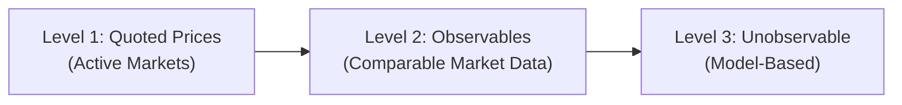
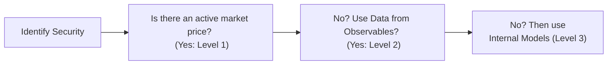

Introduction  
So, let's talk about the GIPS Valuation Hierarchy. I have to admit, when I first heard about all these Levels—Level 1, Level 2, and Level 3—I was a little baffled. It sounded like some top-secret classification system. But then I realized it’s basically a fair value measurement framework designed to—well—make sure everyone’s comparing apples to apples when reporting performance results. Yes, we want objectivity, consistency, and a standard approach so that performance data across different asset managers and different portfolios actually means something. That’s where GIPS (Global Investment Performance Standards) come in.

GIPS has a big focus on fair value. And by fair value, it generally means the price you’d get if you sold the asset in an orderly transaction in the principal (or most advantageous) market at the measurement date. Availability of market data and objectivity of pricing inputs are at the heart of the framework. GIPS basically says, “Guys, if we’re going to compare performance and say who’s doing better, we need to know that the values being used are consistent and realistic.”

Valuation and Fair Value Under GIPS  
In the GIPS context, fair value denotes the price at which an asset could be exchanged between willing and knowledgeable parties in an arm’s-length transaction. That means you can’t artificially inflate or deflate a value because you’ve got some special side arrangement or market distortion. Under GIPS, performance calculations must rest on these fair value numbers, and firms must be able to show that their valuations are consistent over time and—oh boy—properly documented.  

• GIPS encourages daily or monthly valuations where possible, especially around large external cash flows (i.e., big deposits or big withdrawals).  
• Firms should regularly review inputs and assumptions, particularly for more esoteric or illiquid stuff.  

It’s especially relevant for alternative assets or private investments—because how do you truly value that privately held start-up anyway? You need some method that’s generally accepted, tested, and replicable.  

The Three-Level Approach to Valuation  
To bring structure and consistency, we have this oh-so-famous “hierarchy” of sources for valuation inputs. Firms must classify each investment’s valuation method into one of three levels:

• Level 1 Inputs: Quoted prices in active markets for identical assets.  
• Level 2 Inputs: Observable inputs other than quoted prices.  
• Level 3 Inputs: Unobservable inputs based on the best information available in the circumstances, often manager estimates or models.  

Let’s discuss them in more detail.

Level 1 Inputs: Quoted Prices in Active Markets  
Think of a big exchange-traded stock like Apple on NASDAQ or a widely traded government bond. If you have an equity listed on the NYSE, that’s about as direct and observable as you can get—there’s a transparent, arm’s-length transaction price that is accessible in the general market.  

For example, if you hold 1,000 shares of a company actively trading at $100 per share, the fair value is straight up $100,000. This is the “Holy Grail” of fair value, giving you the highest confidence. GIPS, of course, loves it if you can do this for all your holdings, because it’s objective and easy to verify.  

Level 2 Inputs: Other Observable Inputs  
Now, we move one step down. This is where we don’t have direct quoted prices for the exact asset, but we can glean some pricing input from other observable market data. Maybe you hold a bond that’s not super liquid, but there’s a comparable bond that trades frequently, so you can approximate yields or credit spreads.  

Or maybe you're looking at “matrix pricing” for municipal bonds, referencing yields of a similar bond from the same issuer with a slightly different maturity. You can’t just pluck a direct price from the screen, but you can form a fair value estimate from relevant market-based data.  

A classic example is an Over-The-Counter (OTC) swap. You can’t just log onto an exchange to find the last trade, but you can gather the relevant yield curves or forward rates from widely published sources. So, you see that these inputs are not from your imagination; they’re from the market—just not a direct price for that exact instrument.

Level 3 Inputs: Unobservable Inputs (Model-Based)  
Then there are those instruments for which no active market exists and no significant relevant market data points are readily available. Here, you rely on your own internal assumptions to come up with a price, maybe referencing your own forecasted cash flows, industry multiples, or other managerial estimates.  

It might be a private equity stake, an exotic derivative, or a specialized real estate property. These valuations are typically done with—how do I put it—“prudent guesswork,” hopefully supported by recognized valuation approaches. For instance, if you have an early-stage startup, perhaps you have to use discounted cash flow or some comparable transaction approach. But GIPS is big on requiring a robust, well-documented methodology.  

Anyway, these Level 3 valuations are less reliable by nature, so GIPS emphasizes the need for robust internal controls, third-party appraisals, or an internal valuation committee. It’s basically “Trust, but verify.” You should have policies that describe how you collect data, select the discount rate, do the DCF modeling, etc. If you deviate from your stated approach, that can undermine the consistency of your performance reporting.

A Quick Mermaid Diagram of the Hierarchy  
Let’s visualize the hierarchy using a simple flowchart:

Notice how each subsequent level is a step away from purely transparent market data. That basically encapsulates the concept behind the GIPS Valuation Hierarchy.

Implications for GIPS Compliance  
Under GIPS, you must:

• Document your valuation policies in writing.  
• Disclose how you treat special situations (thinly traded stocks, distressed assets, etc.).  
• Apply the policies consistently across periods.  
• Review them at least annually (and more frequently if market conditions change).  

The GIPS Executive Committee’s stance is that fair value is the “most relevant measure” for performance. That’s because historical or cost-based accounting might understate (or overstate) the actual economic value of a security. And if you’re showing performance for hypothetical valuations, that can mislead prospective clients.  

Now, could you imagine if you and your friend each put the same obscure private equity fund in your portfolio, but you each valued it differently? If you valued it at cost and your friend used a fancy discounted cash flow approach that gave a higher number, your returns would look better or worse, even if you both hold the same stuff. That’s what we want to avoid with standardized fair value rules.

Policies and Procedures for Each Level  
In your GIPS Policies & Procedures (P&P) manual, you’ll typically outline something like this:

• “Level 1 Securities: Use the last trade price on the principal market as of close of business on the measurement date. If no trades occurred that day, use the last available price.”  
• “Level 2 Securities: Gather quotes from recognized pricing services or rely on reported yields from established data providers such as Bloomberg or ICE Data Services. Cross-check with broker quotes. Document your approach for matrix pricing, spread adjustments, etc.”  
• “Level 3 Securities: Use an internally developed model or an external independent valuation. Outline the standard approach—like discounted cash flows—and detail assumptions for discount rates, growth rates, and so forth. Evaluate reasonableness of these inputs periodically, and update the model assumptions if market conditions shift.”  

It’s important that you not treat your valuation approach as some big secret sauce. GIPS wants transparency, so if someone audits your process or wants to see your GIPS compliance, they should see the systematic approach.  

Example of Valuing a Thinly Traded Bond (Between Levels 2 and 3)  
Let’s consider a municipal bond that trades occasionally, but not daily. Suppose the last trade was a couple of weeks ago, at a price of $950 for a $1,000 face value bond. You might then look up yields for actively traded muni bonds with a similar credit quality and maturity. Let’s say yield on these comparable bonds is about 4.5%. If the municipality that issued your bond recently updated its credit rating to reflect a slight improvement, maybe your bond’s fair yield is a bit lower. So you adjust the yield to 4.4% to reflect that improvement, and conjure a price of around $955.  

Now, is that an exact science? No. But it’s a well-founded approach using observable data—like credit spreads for similar bonds. So that’s Level 2. If, for some reason, you couldn’t get any relevant “comparables,” you might rely on a model with your own assumptions about default probabilities, discount rates, and so on. Then it might shift into more of a Level 3 classification.  

Reviewing Hard-to-Value Securities  
Illiquid or “hard-to-value” investments can be troublesome, particularly if there’s no market. GIPS basically says to reevaluate these assets more often, at least quarterly or annually, but definitely at or near the time you measure performance. In real estate, you might have an external property appraisal done each year and rely on internal appraisals in the interim. And if there’s a major event—like a tenant default in a commercial real estate holding—your policy should say how you measure that effect on your property’s fair value.  

It might be tempting to anchor to a prior year’s value if you don’t see big changes, but GIPS emphasizes that performance results need to reflect realistic valuations, so ignoring new market info or changes in assumptions would be a compliance no-no.  

Putting It All Together with a Policy Flow  
Here’s a simplified flow diagram of how a valuation policy might progress when deciding the appropriate level:

This hierarchy ensures that if direct market prices (Level 1) are not available, you don’t just jump to your own “gut feeling.” You use relevant market-based data first (Level 2). If that’s also insufficient, only then do you rely on models (Level 3).  

Exam Tips and Pitfalls  
• Consistency is vital. Flip-flopping between different input levels for the same type of security from one quarter to the next can raise red flags (unless there’s a good reason—like a security becoming actively traded).  
• Keep thorough documentation. The examiner might ask how you would handle a newly purchased private equity investment—explain you’d classify it as Level 3, but with a well-defined approach referencing the cost of recent financing round, etc.  
• Understand that GIPS demands a fair value approach. Don’t assume cost or book value is acceptable without adjusting.  
• For multi-asset or multi-currency contexts, you still follow the same hierarchy. However, be mindful of exchange rates: you typically convert local currency valuations at the spot rate on the measurement date.  
• Always watch out for “stale prices.” If the last Level 1 price is from a month ago with no trades since, you might be forced to consider whether that price is truly “active.” If not, you may need to treat it as a Level 2 scenario, using quotes or other reference data from the broader market.  
• GIPS also asks for composite construction (discussed in other parts of the GIPS chapter). Just note that consistent valuation across all accounts in the composite is critical, so you’re not artificially boosting or dragging performance.

Personal Anecdote  
I once worked at a boutique asset manager that specialized in mortgage-backed securities. We used broker quotes for some securities—we had quotes from at least two or three dealers. But occasionally, especially during 2008-ish turmoil, quotes vanished or were so wide they weren’t meaningful. We had to intensify our internal models, re-check the credit assumptions, prepayment speeds, etc. Let’s just say it was not fun—and had we not carefully documented our process, we might have run into GIPS compliance issues. So trust me, it’s easier to do it right from the start.

References and Further Reading  
• Financial Accounting Standards Board (FASB) ASC Topic 820, “Fair Value Measurement.” This is a big authoritative guide in the U.S. that outlines how to measure fair value.  
• CFA Institute “GIPS 2020: Valuation Principles” guidance statements. Good primary source explaining the official stance on valuations in a GIPS-compliant world.  
• International Financial Reporting Standards (IFRS) 13, “Fair Value Measurement,” which parallels ASC 820 if you’re outside the U.S.  
• Other sections of this Volume 3: Performance Measurement, especially 3.2 Fundamentals of Compliance, which covers some of the basics of defining the firm, and 3.3 Return Calculation Methodologies for further interplay between how you measure returns and how you measure values.

Final Exam Tips  
1. For essay questions, be prepared to explain your approach to classifying securities into levels. They might present a scenario with partial market data, or they might mention that the security trades infrequently. You’d better explain whether it’s Level 2 or Level 3 and why.  
2. For item sets, watch for questions that test your knowledge of GIPS disclosures—like if a firm states it used “cost” for private placements. That’s not strictly GIPS-compliant unless cost actually approximates fair value.  
3. Document, document, document: If a question asks about the most common reason for a GIPS compliance violation in the valuation area, your best guess is “lack of consistent application of documented valuation policies.”  
4. Don’t forget that periodic external or independent checks on valuations are strongly encouraged, especially for illiquid securities. GIPS doesn’t necessarily require third-party valuations for all illiquid assets, but they do prefer it or want an equivalent robust approach.  

Below you’ll find some sample questions to get you ready for exam day.

## Test Your Knowledge of the GIPS Valuation Hierarchy



### Under GIPS, which valuation method would be most appropriate for a widely traded equity security?  
- [ ] A manager-derived discounted cash flow model (Level 3)  
- [x] Using last trade price on an active exchange (Level 1)  
- [ ] The carrying cost from the previous month (Level 2)  
- [ ] A direct broker quote provided only once a quarter (Level 2)  

> **Explanation:** GIPS prioritizes Level 1 for actively traded securities with accessible quoted prices on active exchanges.

### In the fair value hierarchy, when should Level 2 inputs be used?  
- [ ] Whenever a security has any active quote, even if sporadic  
- [x] When quoted prices for identical items are unavailable, but observable comparable data exists  
- [ ] When only cost-based data is available  
- [ ] Only after attempting a manager-based model and failing  

> **Explanation:** Level 2 inputs are used when direct Level 1 quotes are not available, but you can still glean observable market inputs (e.g., similar assets or market yield/spreads).

### Which of the following is a characteristic of Level 3 inputs?  
- [ ] They rely exclusively on active market trading data  
- [ ] They sometimes represent quotes from multiple brokers  
- [ ] They are fully verified by real-time market data from an exchange  
- [x] They are based on unobservable inputs, often involving internal models or manager assumptions  

> **Explanation:** Level 3 inputs rely on unobservable data, typically manager-derived models or assumptions, and are thus less objective than Level 1 or Level 2 inputs.

### How does GIPS address the valuation of illiquid assets such as private equity stakes?  
- [ ] Firms may report them at cost indefinitely  
- [ ] Firms are discouraged from including illiquid holdings in composites  
- [x] Firms must use a fair value approach and document the methods consistently  
- [ ] Firms must write off illiquid assets after twelve months of no trades  

> **Explanation:** GIPS stresses a fair value–based approach for all investments, including illiquid ones. Cost-basis may be used only if it reasonably approximates fair value, but the policy must be documented.

### A bond’s last trade was at $98, but it hasn’t traded in two weeks and the market volume is very low. Which of the following approaches best aligns with GIPS to determine fair value?  
- [x] Use matrix pricing with observable yield spreads on comparable bonds (Level 2)  
- [ ] Assume the price is $100 par because it is a bond  
- [ ] Record it at $98 and disregard other data  
- [x] Develop a manager-based discounted cash flow model if insufficient comparables exist  

> **Explanation:** If a passive market exists or a relevant comparable bond can be found, you can do matrix pricing (Level 2). If not, you may need to rely on Level 3 (DCF). The key is fair value measurement using the best available data.

### Why is consistent application of the valuation policy crucial for GIPS compliance?  
- [x] It ensures that performance results are comparable and not manipulated by switching methods  
- [ ] It only matters for real estate investments  
- [ ] It has no bearing on the firm’s reported performance under GIPS  
- [ ] It is only required when an external auditor reviews the firm  

> **Explanation:** GIPS demands consistency so that performance results aren’t distorted by ad hoc valuation methods from period to period.

### Suppose a firm invests in a new private company with no comparable public firms or industry data. According to GIPS, which hierarchy level is most likely used?  
- [x] Level 3  
- [ ] Level 2  
- [ ] Level 1  
- [ ] None of the above  

> **Explanation:** If no observable inputs exist, the firm relies on unobservable inputs or internal models, putting the valuation in Level 3.

### How would GIPS classify a valuation using broker quotes for a moderately traded corporate bond?  
- [x] Typically Level 2, if the quotes are based on observable supply and demand inputs  
- [ ] Strictly Level 1  
- [ ] Strictly Level 3  
- [ ] Not permissible  

> **Explanation:** Broker quotes can qualify as observable market inputs if the brokers are basing quotes on active market conditions, typically placing them in Level 2 unless there’s a complete lack of liquidity or relevant data.

### A firm frequently changes its valuation approach for certain private equity positions. Which best describes a potential GIPS concern?  
- [ ] The firm is being proactive and thus strictly compliant  
- [x] It could raise suspicion of performance manipulation through inconsistent policies  
- [ ] GIPS demands monthly changes to the valuation approach  
- [ ] GIPS has no concerns about changing approaches frequently  

> **Explanation:** Changing valuation methodologies too often without strong justification can signal manipulation or inconsistency, violating GIPS’s requirement for consistent valuation policies.

### True or False: Under GIPS, cost-based valuation can be used permanently for private equity if the firm disclosed it in marketing materials.  
- [x] True  
- [ ] False  

> **Explanation:** Cost-based valuation can only be used if it approximates fair value. However, some might interpret that if it’s well-documented, disclosed, and still considered a fairly close proxy for fair value (e.g., right after an investment transaction), it may be permissible. But indefinite use of cost is generally discouraged if the investment’s fair value has likely changed. The question is tricky; if the cost truly remains a good approximation of fair value and the firm discloses that in marketing, that can meet the GIPS standard, though it’s a rare scenario for the long term.


