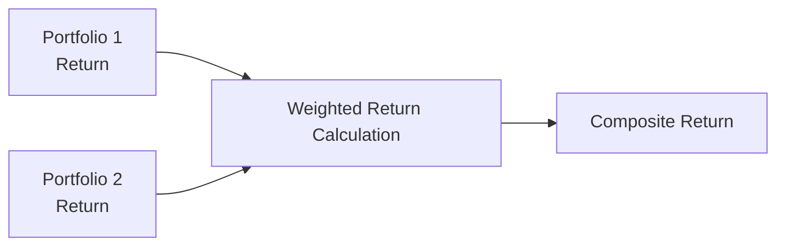
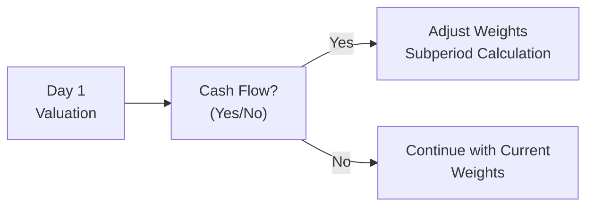
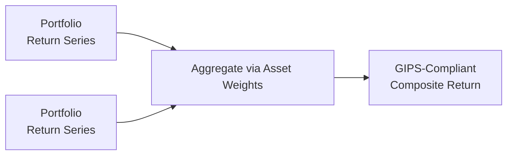

Overview

Let’s talk about one of those details that sometimes feels super small but carries huge implications for investment performance reporting: asset weighting in composite return calculations. Back when I was a junior analyst, I remember being baffled why we couldn’t just average all the portfolio returns in a composite. I mean, it seemed so easy: add them up, divide by the number of portfolios, and you’re done—right? Well, not so fast. According to the Global Investment Performance Standards (GIPS), that’s a big no-no. Under GIPS, composite returns must be asset-weighted, not equally weighted. As it turns out, this requirement is critical if you want your performance data to accurately reflect the size of each portfolio in a composite.

Why Asset Weighting Matters

You might be wondering: “So, what’s the big deal if I just use a simple average?” The big deal is that not all portfolios in your composite are the same size. If you have a few large portfolios with billions of dollars under management and a handful of smaller portfolios holding just a few million, the performance experience of those billion-dollar portfolios should logically have more influence on the composite return than the smaller portfolios.

• Accurate Representation of Scale: Asset weighting ensures that changes in market value for your large portfolios don’t get overshadowed by a bunch of tiny portfolios.  
• GIPS Compliance: GIPS specifically mandates that composite returns be asset-weighted. This upholds the core principle of “fair representation and full disclosure.”  
• Avoiding Skew: Using an equal-weighted approach artificially inflates or deflates returns if smaller portfolios happen to have extreme returns.  

I once saw a composite with about a dozen portfolios, two of which had minimal assets but were super-high-volatility strategies. Equal weighting shot their composite return through the roof and gave the illusion that the firm had soared to stardom—until we recalculated on an asset-weighted basis and realized the truth was quite different.

Basic Formula for Asset-Weighted Returns

The essential idea behind asset-weighted returns is that each portfolio’s return has a weight in proportion to its beginning-of-period assets (or in some cases adjusted for large flows). Here is a concise KaTeX formula for a simple, single-period asset-weighted composite return:


R_{\text{composite}} \;=\; \frac{\sum_{i=1}^{N} \left( MV_{i,0} \times R_{i} \right)}{\sum_{i=1}^{N} MV_{i,0}}


Where:  
• \\(MV_{i,0}\\) is the market value of portfolio \\(i\\) at the start of the period.  
• \\(R_{i}\\) is the return of portfolio \\(i\\) over that period.  

If you want to see this visually, think of each portfolio’s return as being multiplied by the size of that portfolio. In the following diagram, we illustrate how multiple portfolio returns feed into a single weighted composite return.

Methods of Asset Weighting

There are two main methods used under GIPS for asset-weighted composite return calculations: beginning-of-period weighting and daily (or subperiod) weighting. Both approaches aim to ensure the timing of cash flows is handled correctly.

Beginning-of-Period Asset Weighting  
This is the simplest approach to asset weighting, often referred to as the “beginning-of-period weighting.” All you do is observe each portfolio’s market value at the start of the measurement period, multiply it by the portfolio’s return over that period, and then divide by the total beginning assets. This method works nicely if you don’t have large external flows. It’s also a bit easier to implement from a data-management perspective.

Daily or Subperiod Weighting for Large Cash Flows  
So, what happens if a portfolio experiences a massive external inflow or outflow in the middle of a quarter? If you ignore that major event until the next reporting period, you’re going to distort your composite results. Enter daily (or subperiod) weighting. Whenever you have a material cash flow, you effectively slice the measurement period into subperiods. The portfolio’s market value is adjusted at each subperiod so that the return portion prior to the flow is measured with the old assets, and the portion after the flow is measured with the new assets.  

In practice, daily or subperiod weighting can be more complex and data-intensive. But if your firm deals with frequent or large cash flows (for example, you manage a fund where investors jump in and out on a regular basis), daily weighting can produce a more accurate composite return. 

Here’s a simple flow diagram illustrating the logic of daily or subperiod weighting:

Most GIPS-compliant presentations lean toward summing the daily or subperiod returns in some manner, ensuring that performance reflects the actual asset base in place for each part of the measurement window.

When to Switch Methods  
• If your firm rarely sees large external flows, beginning-of-period weighting might suffice.  
• If your firm frequently experiences big inflows or outflows (like subscription/redemption-based funds), daily or subperiod weighting is a must.  
• GIPS guidance suggests that you define your firm’s irregular cash flow policy thoroughly and apply it consistently across composites.

Equal-Weighted Returns: A Glossary Reminder

It’s worth reemphasizing that “equal-weighted return” means you merely take the simple arithmetic average of your composite portfolios’ returns over the period. Under GIPS, this is not acceptable for official composite reporting because it fails to recognize differences in portfolio sizes. However, you might still see an equal-weighted average in supplemental performance metrics or internal analyses—just never let it slip into your official compliance statements.

Best Practices in Asset Weighting

• Consistency in Policies: Have a well-documented policy that clearly states how asset weighting is handled, especially around large cash flows.  
• Timely Valuations: The more frequently (and accurately) you can value your portfolios, the better your weighting will reflect reality.  
• Automation & Technology: Tools that automatically adjust for flows on a daily or subperiod basis take a huge burden off performance analysts.  
• Monitor Outliers: Even though asset weighting reduces the impact of smaller, high-volatility portfolios, keep an eye on any unusual patterns or anomalies that might tip you off to data errors or outlier portfolios.

Common Pitfalls and Challenges

• Underestimating Data Requirements: Daily weighting can be data-intensive, and inaccurate valuations can hamper your composite accuracy.  
• Ignoring Materiality: Some firms set thresholds (e.g., 10% of portfolio size) to determine when a cash flow is “significant.” Overly small thresholds can lead to operational chaos; overly large ones can lead to inaccurate results.  
• Switching Methods Arbitrarily: Once you pick a method, GIPS expects consistency and thorough documentation. You can’t just hop around between methods quarter to quarter.  

Practical Example

Imagine you have two portfolios—Portfolio A with \\( \$100 \\) million and Portfolio B with \\( \$10 \\) million at the beginning of the quarter. Portfolio A returns +5%, while Portfolio B returns +10%. If we simply average those two returns, you get (5% + 10%) / 2 = 7.5%. That might look good. But if you weight them by their starting assets, you get:


R_{\text{composite}} = 
\frac{( \$100\text{M} \times 0.05 ) + ( \$10\text{M} \times 0.10 )}
     { \$100\text{M} + \$10\text{M} }
= \frac{( \$5\text{M} ) + ( \$1\text{M} )}
     { \$110\text{M} }
= \frac{\$6\text{M}}{\$110\text{M}}
= 5.45\%


That’s a pretty big difference. GIPS wants the 5.45% figure because it accurately reflects that Portfolio A, which is much larger, earned 5% (thus exerting more impact on the overall composite).

Performance Must Reflect All Composite Assets

GIPS requires that you include all discretionary portfolios that follow a particular strategy in the relevant composite. If your goal is to show a “Large-Cap Growth Equity Composite,” you better include every large-cap growth equity portfolio that meets your definition of discretionary. That way, your composite performance truly reflects the entire assets in that strategy and not just a cherry-picked subset with the best returns.

Tips for the CFA Exam

• Know Your Definitions: The exam may test your understanding of asset-weighted vs. equal-weighted and how each method impacts composite return.  
• Attention to Detail: GIPS is all about consistent, ethical presentation. A question about calculating GIPS-compliant composite returns might focus on daily weighting vs. beginning-of-period weighting.  
• Show Your Work: On an essay question, be sure you precisely label each portfolio’s market value, return, weighting approach, and final calculation steps.  
• Watch Out for Traps: Exam questions may present a scenario where a single small account has a huge return. Always remember you’re obligated to weigh it according to its actual size.

Further Resources

• Quantitative Investment Analysis, CFA Institute Investment Series, for a deeper look at return calculation methods.  
• The Journal of Performance Measurement, which often publishes cutting-edge research on weighting methodologies.  
• GIPS Standards Handbook, for the official word on compliance.  

Below is a concise diagram that stitches these concepts together, from portfolio-level returns to composite-level returns:

I think that about covers it—GIPS is big on fairness, and an asset-weighted composite return is more equitable than any naive average. Just keep in mind: if large flows show up, you might have to do more frequent weighting. But hey, that’s the name of the game in performance reporting. Should you ever run into a scenario where you can’t figure out why your composite numbers don’t match your gut feeling—maybe double-check your weighting method and ensure you’re fully adhering to GIPS. It’s saved me more than a few headaches in the past!

References

• CFA Institute. (Latest Edition). Global Investment Performance Standards (GIPS) Handbook.  
• CFA Institute. Quantitative Investment Analysis (CFA Institute Investment Series).  
• Journal of Performance Measurement.  

## Test Your Knowledge: Asset-Weighted Composite Return Calculations



### According to GIPS, why must composite returns be asset-weighted instead of equally weighted?

- [x] To ensure larger portfolios have a proportionate impact on composite returns.  
- [ ] To simplify compliance reporting and reduce data requirements.  
- [ ] Because equal-weighted returns are mathematically less accurate to calculate.  
- [ ] Because asset-weighted returns always produce higher composite returns.  

> **Explanation:** Larger portfolios should influence the composite more than smaller ones. GIPS requires that composite returns reflect each portfolio’s relative size.

### Which of the following best describes a possible disadvantage of beginning-of-period asset weighting?

- [ ] It creates excessively large data requirements compared to daily weighting.  
- [x] It may not adequately account for large cash flows occurring mid-period.  
- [ ] It completely ignores fee structures within each portfolio.  
- [ ] It automatically inflates return calculations for smaller portfolios.  

> **Explanation:** Beginning-of-period weighting is straightforward but may fail to capture the impact of large cash transactions that occur during the period.

### If a composite consists of three portfolios with vastly different market values, how does an equal-weighted approach affect the reported return?

- [ ] It accurately represents the collective performance of the composite.  
- [ ] It favors the portfolio with the lowest fees.  
- [x] It risks overstating the impact of smaller portfolios.  
- [ ] It heavily weights the largest portfolio’s returns.  

> **Explanation:** An equal-weighted average fails to capture the dominating effect of large portfolios, thus giving undue influence to smaller portfolios.

### A firm experiences a substantial external inflow in one of its composite portfolios halfway through the performance measurement period. Under GIPS, which approach is more appropriate?

- [ ] Equal-weighted averaging at quarter end.  
- [ ] Begin-of-period weighting without adjustments.  
- [x] Daily or subperiod weighting to reflect the significant inflow.  
- [ ] No weighting is necessary if only one portfolio is affected.  

> **Explanation:** Daily or subperiod weighting addresses large external flows and more accurately represents the portfolio’s return for the portion of the period after the inflow.

### For a portfolio with frequent large external cash flows, which method is most in line with GIPS best practices?

- [ ] Averaging across all flows at period end.  
- [ ] Equal weighting with end-of-period assets.  
- [x] Daily weighting for each flow.  
- [ ] Using the largest single inflow as the main weighting factor.  

> **Explanation:** Daily or subperiod weighting captures each flow’s effect in real time, which is recommended when large flows are frequent.

### When applying beginning-of-period asset weighting, what initial information is needed for each portfolio?

- [x] The prior-period market value and the return for that period.  
- [ ] The normal distribution of its returns.  
- [ ] Only the fees paid by investors.  
- [ ] A record of any potential style drift.  

> **Explanation:** Beginning-of-period weighting uses each portfolio’s market value at the start of the period, plus the return during the period.

### If a small portfolio in a composite posts a 90% return but represents only 1% of total composite assets, which of the following statements is correct?

- [ ] It will significantly increase the composite’s overall return.  
- [x] Its large gain is diluted due to its small asset base.  
- [ ] GIPS recommends removing such outliers.  
- [ ] It invalidates the entire composite for the reporting period.  

> **Explanation:** Even though 90% is huge, under an asset-weighted approach, that small portfolio’s effect is limited by its small proportion of total assets.

### An asset manager wants to ensure she is GIPS compliant. She notices that one portfolio represents 40% of the composite’s total assets. What should she do in her composite return calculations?

- [ ] Remove the large portfolio for fear it may skew results.  
- [ ] Weigh all portfolios equally for simplicity.  
- [x] Assign a proportionate weight of 40% to that portfolio in the composite return.  
- [ ] Consider merging the large portfolio with a smaller one.  

> **Explanation:** Each portfolio’s weight must reflect its share of total assets, so a 40% weighting is appropriate for that portfolio.

### Which two weighting methods are commonly used under GIPS to handle portfolios within a composite?

- [ ] Equal weighting and subadvisory weighting.  
- [ ] Factor weighting and synthetic weighting.  
- [x] Beginning-of-period weighting and daily (subperiod) weighting.  
- [ ] Geographic weighting and sector weighting.  

> **Explanation:** GIPS highlights beginning-of-period weighting for standard cases and daily or subperiod weighting when significant cash flows occur.

### Under GIPS, a composite's returns should always be asset-weighted. True or False?

- [x] True
- [ ] False

> **Explanation:** GIPS requires composite returns to be presented using asset-weighted methods, ensuring accurate representation based on portfolio size.


