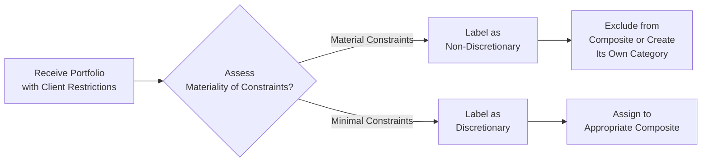

## Overview

I remember the first time I encountered the term “discretionary” in composite construction—it was my second week working at a boutique investment firm, and I got that panicked sense of “Uh, are we all speaking the same language?” Our CIO casually asked if a new client portfolio was discretionary or non-discretionary because that would determine which composite it would go into. Honestly, at that moment, I had no idea what he was talking about. And if that rings a bell, trust me, you’re not alone!

In the context of GIPS (Global Investment Performance Standards), discretionary basically means the portfolio manager has a sufficient level of freedom—or “discretion”—to implement the intended investment strategy fully. If the manager’s hands are tied by client-imposed or regulatory constraints that fundamentally alter the strategy, the portfolio may not accurately represent the manager’s skill or approach. And that is precisely where the distinction has real teeth: GIPS standards demand consistent and appropriate composite assignments, ensuring that performance reporting is fair, comparable, and unbiased.  

Understanding what is (and isn’t) discretionary is critical for:  
• Accurately grouping client portfolios into composites.  
• Complying with GIPS standards regarding presentation and reporting.  
• Ensuring that performance numbers reflect actual skill and strategy.  

## Identifying Discretion

Before we get lost in all the details, let’s talk about what “discretion” even means in day-to-day portfolio management. Discretion refers to a manager’s ability to make investment decisions without being unduly constrained by client guidelines, legal requirements, or other limitations that severely hamper the strategy.

• Client-Imposed Restrictions: Clients might say, “No companies with a market cap under $2 billion,” or “Absolutely no tobacco stocks.” Usually, small restrictions like these might reduce but not eliminate manager discretion.  
• Regulatory Constraints: Regulated funds often operate under statutory requirements—such as liquidity limits—that may or may not limit strategic freedom.  
• Guidelines vs. Absolute Prohibitions: There’s a difference between a guideline (e.g., maintain some level of diversification across certain sectors) and an outright prohibition (e.g., can’t hold more than 10% in any single security). When these constraints become near-absolute, they can transform the portfolio into something that no longer reflects the manager’s standard strategy.

### When Does a Portfolio Become “Non-Discretionary”?

The big question is where to draw the line. If a manager is so restricted that they can’t execute their strategy, then the portfolio is deemed non-discretionary under GIPS. If you’re basically forced to deviate from your normal selection process to accommodate these constraints—even to the point that the portfolio’s risk-return structure no longer mirrors your stated mandate—well, that’s a pretty good sign that the portfolio has lost the discretionary label.  

In practice, that might look like a situation where a client invests in your mid-cap growth strategy but decides, “Actually, I don’t want any stocks in technology or healthcare,” which are typically high drivers of growth. If your mid-cap growth invests heavily in those sectors, you’re effectively not able to manage this portfolio as you normally would. This portfolio would likely be non-discretionary.

## Composite Construction

Composite construction under GIPS is all about grouping portfolios that share a similar strategy or investment objective. This ensures apples-to-apples comparisons—no mixing a large-cap value portfolio with a short-term bond fund, obviously! According to GIPS, all discretionary portfolios must be included in at least one composite to provide a comprehensive and consistent performance track record.

### Composite Assignment

Think of composite assignment as categorizing your wardrobe. The best approach is consistent labeling: put each outfit (portfolio) in the correct “closet section” (composite) so that your performance “outfits” for each strategy are portrayed accurately. The GIPS standards are quite explicit that once a portfolio is deemed discretionary, it has to go into a composite that reflects its primary strategy or mandate.

Failure to include a discretionary portfolio in a relevant composite can create something known as “selection bias,” where a firm might be—intentionally or unintentionally—cherry-picking which portfolios show up in performance. This obviously leads to misleading results, since the performance that gets reported might only be from the “best-dressed outfits,” so to speak.

### Avoiding Selection Bias

Selection bias can occur if:  
• Firms exclude portfolios that underperform due to “special client constraints” that aren’t truly special or heavily restrictive.  
• Portfolio managers stretch the definition of non-discretionary to camouflage less attractive performance.  

No manager wants to get caught misrepresenting performance. The surest way to avoid selection bias is to adopt a standardized procedure for labeling portfolios as discretionary or non-discretionary and to consistently update this classification if client circumstances change.

## Practical Examples

Here are a few examples from my own (sometimes bumpy) experiences:

1) A High-Net-Worth Client with Modest Constraints: Suppose the client invests in large-cap equities but demands no more than 20% of the portfolio be in technology stocks. If your strategy typically invests across all sectors (with technology at 25–30%), you might still be able to run your usual approach with a minor tweak. That likely remains discretionary.

2) The “No Sin Stocks” Portfolio: A foundation instructs you to avoid alcohol, tobacco, and gambling. If that’s still consistent with your broad ESG-oriented equity approach, then you probably remain discretionary. But if your strategy historically invests significantly in, let’s say, the gambling industry, and you can’t do that anymore, you need to consider whether the entire strategy is fundamentally altered.

3) Regulatory Requirements for a Pension Fund: Pension funds might require you to hold a certain threshold of duration to meet liabilities. If the manager typically invests flexibly across durations, but now is forced to maintain a specific duration band, it might well be a partial constraint. Enough constraints stacked together can tip the portfolio into non-discretionary territory.

## Common Pitfalls

• Mislabeling: Accidentally labeling a portfolio as discretionary when constraints severely hamper the manager’s approach.  
• Complacency: Failing to re-evaluate whether changes in client instructions or regulatory shifts have made the portfolio non-discretionary.  
• Inconsistent Policies: Having “gray areas” in your guidelines that lead different teams to label similar constraints differently—this is a GIPS compliance nightmare.

## Best Practices for Composite Construction

• Standardize Your Definition: Document explicit criteria for what is discretionary vs. non-discretionary.  
• Review Constraints Periodically: Clients often add or remove restrictions over time, so your compliance officer (and/or portfolio manager) should confirm the portfolio’s status regularly.  
• Keep Evidence: If you classify a portfolio as non-discretionary, maintain documentation that clearly explains your rationale.  
• Communicate and Educate: Some clients may not realize how a seemingly harmless restriction might undermine your entire strategy. Having a conversation early on can mitigate issues.  

Below is a high-level depiction of how a manager might evaluate discretionary status:

## Exam Tips

• Always clarify whether constraints are material. In the context of a CFA Level III question, expect to see scenario-based prompts asking you to decide if a portfolio remains discretionary under GIPS.  
• Familiarize yourself with the definitions from the official GIPS standards, especially around how to treat partially discretionary portfolios.  
• In constructed-response questions (essay format), you might be asked to interpret an investment policy statement and determine whether constraints cross the threshold to non-discretionary. Support your conclusion with clear references to GIPS.  
• Watch out for “selection bias” in all item-set or essay scenarios. The exam might present you with a borderline constraint situation and test whether you can spot attempts to artificially boost reported performance.

## References for Further Study

• CFA Institute’s “GIPS Standards: Questions and Answers,” particularly sections addressing the classification of discretionary vs. non-discretionary portfolios.  
• Feibel, B. J. (Performance Attribution and GIPS). This book offers additional insights and practical examples of how constraints can affect a manager’s discretion and, ultimately, composite construction.  
• CFA Institute GIPS Handbook for detailed, official guidance on composite construction and the nuances of discretionary classification.

---

## Test Your Knowledge: Discretionary vs. Non-Discretionary Compliance



### A portfolio is likely considered discretionary under GIPS if:
- [x] The portfolio manager can freely implement the intended strategy with only minor client-set limitations.
- [ ] There are absolute prohibitions that fundamentally alter the manager’s investment selection.
- [ ] The portfolio has no restrictions at all.
- [ ] The portfolio invests in any type of security as long as it is large-cap.

> **Explanation:** Under GIPS, a portfolio is discretionary when the manager can implement the broad strategy without major deviation from the stated investment approach. Minor restrictions do not necessarily remove discretionary status.

### Which of the following best describes the process of assigning portfolios to composites?
- [x] A standardized practice of placing each discretionary portfolio into the prototype composite that matches its investment mandate or style.
- [ ] Randomly assigning portfolios to any composite.
- [ ] Using account size as the sole factor in the assignment.
- [ ] Assigning only non-discretionary portfolios to a composite.

> **Explanation:** GIPS requires that all discretionary portfolios be placed in composites according to the manager’s normal investment strategy, ensuring consistent and accurate representation of performance.

### You have a large-cap growth portfolio with a typical 30% weighting in technology stocks. Your new client restricts technology exposure to 20%. Under GIPS:
- [ ] The portfolio is automatically non-discretionary.
- [ ] The portfolio cannot be assigned to any composite.
- [x] This portfolio may still be discretionary if the manager can largely implement the core strategy.
- [ ] The portfolio can be discretionary only if the manager invests exactly 30% in technology.

> **Explanation:** A modest restriction in technology allocation may not materially prevent the manager from pursuing the large-cap growth strategy. It could still be classified as discretionary.

### The key risk in incorrectly labeling a portfolio as non-discretionary is:
- [ ] Failing to attract new clients.
- [x] Underreporting the firm’s true performance by excluding a valid performer.
- [ ] Having to charge higher management fees.
- [ ] Having to blend results with alternative composites.

> **Explanation:** If you exclude a portfolio that truly reflects the manager’s strategy, you risk creating selection bias and potentially misrepresenting your performance track record.

### Which of the following might cause a portfolio to be labeled non-discretionary?
- [x] Prohibitive client-imposed constraints that prevent the application of the manager’s standard investment approach.
- [ ] A manager who invests across all market caps.
- [x] Regulatory constraints that contradict the manager’s typical strategy.
- [ ] Allowing multiple investment strategies in one portfolio.

> **Explanation:** If constraints are severe (client-imposed or regulatory) such that the strategy can’t be meaningfully followed, the portfolio loses its discretionary label.

### Selection bias occurs when:
- [x] A firm selectively includes or excludes portfolios to present a more favorable performance record.
- [ ] All portfolios are assigned to a composite using consistent guidelines.
- [ ] A manager invests strictly in ESG securities.
- [ ] A firm follows GIPS standards to the letter.

> **Explanation:** Selection bias arises when managers give themselves undue flexibility to omit certain portfolios that underperform or have constraints. This distorts the performance results.

### Which is an example of a minor constraint that does not necessarily make a portfolio non-discretionary?
- [x] Limiting an industry allocation by a small percentage.
- [ ] Complete prohibition against more than one sector.
- [x] A diversified sector constraint that aligns well with the manager’s typical approach.
- [ ] Suspending all equities from the portfolio.

> **Explanation:** Very strict constraints threaten the manager’s ability to execute their typical strategy, while smaller or moderate constraints are unlikely to cause non-discretionary classification.

### To avoid ambiguity in composite construction, firms should:
- [x] Document clear guidelines for labeling a portfolio as discretionary or non-discretionary.
- [ ] Re-classify portfolios randomly every quarter.
- [ ] Negotiate away all client restrictions.
- [ ] Create one single composite for all strategies.

> **Explanation:** Having transparent, well-documented policies helps ensure consistent classification and reduces risk of compliance errors.

### Under GIPS, once a portfolio is considered discretionary:
- [x] It must be included in at least one relevant composite.
- [ ] It can only be excluded if it underperforms.
- [ ] It can be left out of performance reporting.
- [ ] It cannot be reclassified if client circumstances change.

> **Explanation:** GIPS standards require that a discretionary portfolio be placed in a composite so that performance data is inclusive and representative.

### True or False: Having a small cap on individual stock holdings necessarily makes a portfolio non-discretionary.
- [x] True
- [ ] False

> **Explanation:** If the restriction is significant enough to prevent the normal investment approach, it can render the portfolio non-discretionary. The specific threshold depends on the nature of the strategy and how material the restriction is.


