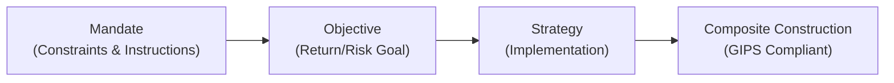

## Introduction

Let’s be honest: GIPS compliance sometimes feels like you’re navigating a maze of rules, all in the name of consistent and credible performance reporting. But there’s a method to this madness. One of the cornerstones of the Global Investment Performance Standards (GIPS) is composite construction, where portfolios with similar characteristics are grouped together to create a single, representative performance record.

Now, if you’re thinking, “Wait, how do I figure out which portfolios belong together in a composite?” you’re not alone. And that’s why we have three pillars—mandates, objectives, and strategies—to help guide the grouping. Each pillar clarifies a specific piece of the puzzle:

• Mandates tell you what constraints or instructions you must follow.  
• Objectives describe the target outcomes, like a risk/return profile or benchmark outperformance.  
• Strategies outline how you plan to deliver those outcomes—are you a value manager, a quantitative manager, or something else entirely?

In this section, we’re going to explore the role of these pillars, highlight best practices and pitfalls in composite design, and show some real-world examples (plus a few personal anecdotes where I learned from, well, less-than-perfect experiences). Ready? Let’s dive in.

## Understanding Composites Under GIPS

Before we zero in on mandates, objectives, and strategies, let’s recall the big picture: GIPS requires all discretionary portfolios—those where the firm can fully implement its strategy without outside constraints interfering—to be included in at least one composite. The idea is to ensure that performance is not cherry-picked and that disclosures are fair and consistent.  

This implies:

• Each composite should aggregate portfolios that share the same investment approach.  
• Performance derived from this grouping should accurately represent the manager’s capabilities.  

And guess what? That “same investment approach” is pretty much a function of mandates, objectives, and strategies.

## Mandates, Objectives, and Strategies: What’s the Difference?

If you’ve ever confused the terms “mandate,” “objective,” and “strategy,” don’t worry. A lot of people do, especially because they often appear together. Here’s how I like to break it down:

1. Mandate  
   This is essentially a contract or directive. Think, “Manage this portfolio to have no more than 20% in emerging markets” or “Implement a liability-driven approach for my pension obligations.” Mandates can come from clients, from internal constraints, or from regulatory bodies.  

2. Objective  
   This is the big goal. Something like, “Target an annualized return that beats the S&P 500 by 2%, with tracking error under 3%, over a 3-year horizon.” Or “Preserve capital while meeting future liabilities.” The objective states why the portfolio exists and what it aims to achieve over time.  

3. Strategy  
   This is how you plan to achieve the objective under the given constraints (the mandate). Are you a fundamental, value-based stock picker? Or do you rely on a top-down macro approach with strategic factor tilts? Perhaps you’re using a long/short equity approach or a multi-factor quant model.  

### A Quick Comparison

The table below offers a concise distinction:

```
| Aspect       | Mandate                                         | Objective                                         | Strategy                                                  |
|--------------|-------------------------------------------------|---------------------------------------------------|-----------------------------------------------------------|
| Definition   | Rules or directives shaping style/constraints   | Desired risk-return or outperformance/risk limit | Methodology for security selection and portfolio mgmt.    |
| Example      | “No more than 20% in emerging markets”          | “Beat S&P 500 by 2% with tracking error < 3%”     | “Value investing using bottom-up fundamental analysis”    |
| Role in Composite | Defines how a portfolio is managed, sets boundaries | Clarifies what success looks like | Informs the chosen approach to achieve that success       |
```

If you nail these three dimensions, it ensures each composite truly groups “like with like,” which is exactly what GIPS wants.

## An Anecdote: Learning the Hard Way

I recall once managing a set of portfolios for a client whose mandate was extremely strict about sector exposures—no more than 10% in technology stocks because of concerns about volatility. Meanwhile, the client’s objective was moderate capital appreciation. My strategy was typically growth-oriented, emphasizing tech. Given the mandate was so restrictive, I actually ended up with two composites: one for my standard growth portfolios (heavier tech weighting) and one specifically for “tech-constrained” portfolios.  

In the beginning, I tried to lump them all together in a single composite, thinking, “Eh, they share the same objective.” Big mistake. The performance record ended up being misleading because the constraints forced different exposures. I had to split the composite to accurately reflect each group’s performance. So yes, mandates matter. 

## Putting All Three Together

When constructing or reviewing composites, you essentially match a combination of mandate + objective + strategy. Here’s a super-simple visualization:



1. A manager or client sets a mandate.  
2. The portfolio’s objective is laid out (like “preserve capital” or “grow capital”).  
3. The manager employs a strategy that fits both the mandate and the objective.  
4. Related portfolios—those that share the same combination of conditions—fall into a common composite.  

When done properly, you end up with an apples-to-apples comparison within each composite.

## Why Proper Grouping Matters

### Consistent Representation

Let’s say you are evaluating a firm’s performance in small-cap value equities. You find a composite that lumps pure small-cap portfolios with small-to-mid portfolios and some unconstrained “go anywhere” strategies. The end result is a composite that might not reflect, with crystal clarity, the performance you’d expect from a pure small-cap value approach. Proper grouping corrects this by maintaining consistent representation.

### Preventing Misrepresentation

If you were to mix, say, a liability-driven investment (LDI) portfolio with a risk-seeking growth portfolio into a single composite, you’d effectively bury the differences in risk and return drivers. Investors could wrongly assume a risk-minimizing approach matched a risk-taking objective.

### Ensuring Fair Disclosure

GIPS is about fairness and consistency—no cherry-picking or selective omission. By strictly grouping by your combined mandate-objective-strategy framework, you ensure that potential investors see exactly how you handle, say, “all global equity growth portfolios with a moderate risk mandate.”

## Best Practices for Composite Design

• Document Mandates and Objectives Clearly: If you have multiple variations (e.g., “Tech-Constrained Balanced” vs. “Balanced with Up to 50% Tech”), label them precisely so you can sort portfolios accurately into composites.  
• Define Strategy in Practical Terms: If you say “quantitative approach,” ensure you specify the factor exposures or style biases. Are you tilting toward value, momentum, or quality?  
• Monitor Changes Over Time: Mandates, objectives, or strategies can shift, so keep track. If a portfolio’s objective changes from “income” to “growth,” or if it switches from “value” to “growth,” you might need to move it to another composite per GIPS guidelines (see also Section 3.8 Requirements for Including, Excluding, or Switching Portfolios Among Composites).  
• Conduct Periodic Reviews: Sit down once or twice a year to verify that each portfolio in the composite still aligns with the designated approach.  

## Common Pitfalls and Challenges

1. Overly Broad Composites  
   Some managers are tempted to minimize the total number of composites—seems simpler, right? But if you over-aggregate, you risk mixing apples and oranges. The composite stops being representative.

2. Under-Diversifying the Composite  
   On the flip side, some firms create so many narrowly tailored composites that each ends up with only one or two portfolios. This can lead to highly volatile performance results and an overwhelming complexity for prospective clients trying to interpret so many performance records.

3. Style Drift  
   Portfolios in a composite might gradually drift from one strategy to another if the manager’s process changes or the market environment shifts. If you fail to track that drift, you could inadvertently keep them in the wrong composite.

4. Inconsistent Benchmark Use  
   Each composite typically has a corresponding benchmark that aligns with its strategy. If you mismatch benchmarks, you’ll end up with performance comparisons that are either too easy or too demanding.

5. Not Addressing Multi-Currency Issues  
   If you have global clients or you manage multi-currency portfolios, ignoring currency differences can misstate results. GIPS has specific guidelines for currency conversions—even composites with a “single objective” might need more nuance if their base currency differs.

## Practical Example: Liability-Driven Investing vs. Growth Mandates

Imagine a firm that manages both pension assets (with a liability-driven approach) and equity-focused growth portfolios. The big question is how to separate composites.  

• LDI Portfolios: Mandate is “match liability duration,” objective is “minimize pension surplus volatility,” strategy is typically a combination of long-duration bonds, interest rate derivatives, and sometimes a small equity overlay for growth.  
• Growth Portfolios: Mandate is “global growth equities,” objective is “achieve capital appreciation with moderate risk,” strategy is fundamental bottom-up equity picking with active country allocations.  

Because these two sets of portfolios differ so dramatically, the GIPS standards pretty much require you to create at least two composites:

1) LDI Composite  
2) Global Growth Equity Composite  

If a portfolio’s mandate or objective changes (for example, a pension plan decides to shift from purely LDI to 70% LDI and 30% growth equities), the firm would likely have to reassign it to another (mixed) composite, or create a new one if that approach is truly distinct.

## KaTeX Formula: Time-Weighted Return

While we’re on the topic of performance measurement, it’s worth recalling the time-weighted rate of return (TWR) that GIPS strongly encourages. It often breaks down as:


\text{TWR} = \prod_{t=1}^{n} (1 + r_t) - 1


where \\( r_t \\) is the return in sub-period \\( t \\). Under GIPS, the TWR is used to neutralize the effect of external cash flows when measuring performance, ensuring that manager skill is highlighted rather than client-driven flows.

## Additional Considerations for Compliance

### Minimizing Ambiguities

When marketing performance, you should be able to articulate how your composite was formed. “Oh, well, it’s all our domestic equity growth portfolios with an agile options overlay to hedge partial market risk,” or “Yes, these are all our global macro accounts that focus on currency trades plus global bond allocations.” If you can’t state it succinctly and in a standardized manner, you risk confusion and potential compliance gaps.

### Documenting Changes

Entirely new investment strategies sometimes emerge within a firm (e.g., a new alternative investment approach that focuses on private debt). If this new approach doesn’t align with existing composites, you must create a new composite. Keep excellent records so that prospective investors can see the inception date of that new strategy.

### Marketing and Business Development Angle

Remember, composites fulfill a dual role: They’re for compliance, but they also serve as a powerful marketing tool. If someone is looking specifically for your large-cap growth strategy, presenting them the performance of your large-cap growth composite is straightforward and credible. GIPS compliance gives them an added level of trust.

## Common Exam Pitfalls and Tips

• Watch out for scenario-based questions where a portfolio’s constraints (mandate) or risk tolerance (objective) changes mid-year. Be ready to explain how GIPS dictates that portfolio’s composite membership should be updated.  
• Be prepared to discuss why it’s not acceptable to simply reclassify underperforming portfolios based on changes in style or objective unless it’s truly consistent with a documented shift.  
• Expect TWR calculations or partial period returns to appear in item sets, especially in the context of composite returns.

## Conclusion and Final Exam Tips

When it comes to composite design, mandates, objectives, and strategies act like three distinct lenses, each clarifying what belongs together and why. GIPS wants you to present a fair, transparent, and representative picture of your performance track record. Proper grouping achieves that.

In exam questions, look out for “trick” details: a subtle shift in a portfolio’s mandate or an incremental change in objective that could justify moving it to a new composite. The key is to remain consistent with your definitions and apply them rigorously. Also, watch for the interplay between this concept and Sections 3.6 through 3.8 in the GIPS standards—they offer more specifics on discretionary definitions, composite membership dates, and reclassification rules.

• Thoroughly read the question to identify if they’re testing your ability to differentiate among mandates, objectives, and strategies.  
• Provide direct, concise answers—CFA’s Level III typically wants you to articulate the principle and apply it in a scenario. 

Keep a checklist for yourself: “Does the question mention a constraint that changed? Or an objective that is no longer relevant? Did the portfolio adopt a new strategy? If yes, how does that affect composite membership?” This mental approach will help you sail through item sets and constructed-response questions.

## References

• CFA Institute, “GIPS Standards Handbook,” particularly the chapters on composite construction.  
• T. Daniel Coggin, “Investment Policy and Objectives,” which offers a deeper exploration of how to align strategies with client objectives.  
• CFA Institute Code and Standards, for a broader ethical framework surrounding disclosure and representation.  

---

## Test Your Knowledge: Mandates, Objectives, and Strategies in Composite Design



### Which of the following best describes a mandate in the context of composite construction under GIPS?

- [ ] The target benchmark an investment manager must outperform.
- [x] A set of specific constraints or instructions that guide how a portfolio should be managed.
- [ ] The marketing material presented to potential investors.
- [ ] A risk-adjusted measure of performance used for compliance.

> **Explanation:** A mandate lays out the constraints and directives (e.g., sector limits, allowable instruments) that govern portfolio management.  

### In a GIPS-compliant environment, why is separating portfolios by mandate important?

- [x] To ensure that portfolios with different constraints or instructions are not lumped into the same composite.
- [ ] To reduce the total number of composites for simpler reporting.
- [ ] To allow selective performance presentation.
- [ ] To meet the standard requirement of having only one composite for each strategy.

> **Explanation:** Mandates enforce constraints that directly influence strategy, so mixing portfolios with different mandates results in a composite that isn’t representative of a unified approach.  

### A portfolio’s objective is described as “achieve a long-term return that exceeds the S&P 500 Index by 2% annually, with a tracking error under 3%.” This statement refers to:

- [ ] A directive or constraint placed upon the manager.
- [x] A clearly defined investment goal or outcome the portfolio aims to achieve.
- [ ] A marketing slogan.
- [ ] A legal requirement for fiduciaries to follow.

> **Explanation:** Objectives articulate the risk-return goals or performance targets, in this case, 2% annual outperformance with less than 3% tracking error.  

### Which of the following is an example of a strategy?

- [ ] “Beat the Russell 2000 by 1% per year.”
- [x] “Use bottom-up fundamental analysis focusing on undervalued small-cap companies.”
- [ ] “Restrict technology exposure to 25% of portfolio assets.”
- [ ] “Maintain a non-discretionary advisory role.”

> **Explanation:** Strategy refers to the process or methodology used to implement a portfolio’s investment objectives or mandates.  

### If a client changes its portfolio mandate from “no exposure to emerging markets” to “up to 20% in emerging markets,” how should the portfolio be treated under GIPS?

- [ ] Keep it in the same composite, as the difference is minor.
- [x] Re-evaluate whether it still fits the original composite; if not, move it to a composite that allows EM exposure or create a new composite.
- [ ] Exclude it from all composites until the manager updates performance for the new constraint.
- [ ] Combine it with a non-discretionary portfolio for simpler reporting.

> **Explanation:** Significant changes in a portfolio’s constraints may require reassigning it to a different composite that accurately reflects the new investment parameters.  

### What is the primary consequence of mixing portfolios with distinctly different mandates in a single composite?

- [x] The composite performance becomes less representative and might mislead investors.
- [ ] The firm will automatically remain in compliance with GIPS.
- [ ] The composite performance typically improves by diversifying the mandates.
- [ ] There is no negative consequence, as GIPS allows this for consolidation.

> **Explanation:** Mixing portfolios with different mandates can mask true performance outcomes and reduce transparency, undermining GIPS compliance.  

### Which of the following describes a common pitfall in composite design under GIPS?

- [ ] Having an equal number of portfolios in every composite.
- [ ] Conducting annual reviews of composite membership.
- [x] Failing to monitor style drift, leading to misalignment with the stated composite strategy.
- [ ] Documenting changes in objectives and mandates meticulously.

> **Explanation:** Style drift can cause portfolios to no longer fit their composite definitions, and failing to address it leads to inaccurate or misleading composites.  

### If a portfolio’s objective shifts from “income generation” to “capital growth,” which GIPS principle likely applies?

- [x] The portfolio should be evaluated to determine if it must be moved to a more suitable composite.
- [ ] The portfolio should be grandfathered in, so no composite changes are necessary.
- [ ] The firm must present multiple benchmarks for the portfolio.
- [ ] The portfolio is excluded from performance reporting for one year.

> **Explanation:** GIPS requires that portfolios included in a composite adhere to the composite’s objective and strategy. A fundamental goal shift may warrant reclassification.  

### How should multi-currency portfolios be handled in GIPS-compliant composite reporting?

- [x] Convert returns to a base currency as per GIPS guidelines and consistently apply that standard.
- [ ] Always report each currency separately within the same composite.
- [ ] Exclude all multi-currency portfolios from composites to avoid confusion.
- [ ] Use raw local currency returns without adjustments.

> **Explanation:** GIPS provides guidelines to ensure consistent currency conversion. Assigning a base currency and converting consistently is crucial to maintain comparability.  

### GIPS typically advocates the time-weighted rate of return because it:

- [x] Removes the impact of external cash flows on performance, highlighting the manager’s skill.
- [ ] Maximizes performance results for marketing presentations.
- [ ] Eliminates the need to track daily portfolio valuations.
- [ ] Considers the present value of future liabilities.

> **Explanation:** The time-weighted rate of return (TWR) is designed to neutralize external flows, providing an objective view of the manager’s performance.


