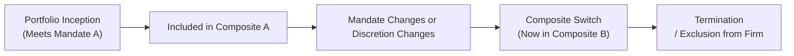

## Overview

You know, when I started my career in asset management—ah, the good old times!—one of the most surprisingly tricky areas was ensuring our performance reporting complied with all the requirements under the Global Investment Performance Standards (GIPS). At first glance, the idea of organizing portfolios into composites can seem straightforward: put similar strategies and investment styles together in a nice, neat group. But there's more nuance hiding beneath the surface, especially around when you add, remove, or switch a portfolio between two or more composites. These details can be easy to overlook—and that’s exactly where GIPS tends to stress clarity and consistency.

GIPS guidelines require that each composite represents a single, cohesive strategy, so this means you must clearly define them and adhere to some pretty specific rules on how portfolios get assigned and how performance is measured over time. The strictness aims to ensure that investors and other stakeholders can meaningfully compare strategies and see an accurate historical track record. So let's dive right in and unravel the key aspects of including, excluding, or switching portfolios among composites.

## Inclusion Requirements

### Determining When a Portfolio Enters a Composite
For a portfolio to be included in a composite, it must first be deemed “discretionary” and must align with the strategy or mandate defined by that composite. One common practical question is: “When does a new portfolio become part of the composite’s performance track record?” Basically, GIPS wants you to include it as soon as it is fully invested and clearly managed in line with the composite's strategy. That might mean the portfolio’s initial onboarding process is done, and all the assets reflect the investment approach. No foot-dragging allowed—you have to include it promptly.

In my experience, if you wait too long and exclude the new portfolio in an attempt to artificially boost composite returns (for instance, if you suspect the new portfolio might underperform in its initial weeks), that can obviously raise a big compliance red flag. GIPS is all about consistency and transparency, so you want to keep a written policy for exactly how and when to include the new portfolios (like “after two full months of being invested to its target allocation” or “on the next start-of-quarter date after 90% of the assets are in the strategy,” etc.) and then apply that policy consistently across all composites.

### “Fully Invested” and Alignment With Mandate
The question of "fully invested" might be open to interpretation, so be sure your firm’s internal guidelines are precise. For instance, some portfolios may trickle in capital over a three-month horizon. Others might shift from a legacy strategy to a new approach in phases. GIPS doesn't micro-manage these specifics, but they do require that everything is documented and that you’re consistent with each portfolio that meets the composite definition. A lapse in following your own policy may cause issues during audits or GIPS verifications.

## Exclusion Procedures

### Terminated Portfolios
Let’s say you have a portfolio that’s leaving your firm altogether—either the client withdrew from your services or the portfolio reached the end of its life cycle. GIPS rules are crystal clear that the portfolio’s performance must remain in the composite’s historical track record up until the last full measurement period before termination. This ensures your historical performance is representative of all that occurred. Think of it like a sports team’s season record: you don’t remove the games a player participated in just because they left mid-season.

Importantly, the performance of the terminated portfolio continues to be reflected in the composite for all periods during which it was under your management. You can’t retroactively rewrite history. Although the portfolio no longer appears in future performance, it must remain in prior performance figures for as long as you show composite history. From an operational standpoint, you’ll want to plan how your back-office and performance measurement systems “flag” a portfolio as terminated and lock in the final reporting date.

### Partial Periods vs. Full Periods
In many situations, the termination date may fall mid-month or mid-quarter. GIPS best practices typically require returns for that partial period up to the official termination date. If your firm’s composite policy states that performance is recognized monthly, the partial month is either included or explicitly identified—just be consistent with your chosen approach. The big oversight to avoid is removing partial performance and messing up your monthly or quarterly returns. Don’t let your system automatically “exclude” that last few days or weeks. Keep the performance data in place until the final designated measurement date.

## Switching Portfolios Among Composites

### Reasons for Switching
A “composite switch” occurs if changes in a portfolio’s strategy, mandate, or discretionary status mean that the portfolio is better aligned with a different composite. For example, a portfolio that was once a domestic equity growth strategy might shift to a global equity growth strategy. If the portfolio no longer meets the domestic strategy’s definition, you can’t just keep it in the old composite. You have to move it to the global equity growth composite.

These mandate or strategy changes can be triggered by a client request, a shift in the manager’s approach, or sometimes by changes within the firm’s organization (like merging composites or refining the definitions). The key is that the switch is justifiable, documented, and reflected consistently. GIPS requires you to record the date and reason for the change. That helps both internal compliance and external verifiers see the logic behind the switch.

### Effect on Historical Performance
One thing that GIPS is quite particular about is not rewriting history. That’s basically a cardinal rule throughout the standards. If a portfolio was part of Composite A for three years, and then you move it to Composite B, you do not restate all those first three years’ results under Composite B. The performance from the original period remains part of the old composite. The new composite track record begins at the effective date of the switch. So you can’t artificially boost the historical numbers of Composite B or lower Composite A’s historical performance by yanking out underperforming portfolios retroactively.

Put another way: the portfolio’s history belongs to the composite(s) in which it resided when that history was generated. The clock resets for the new composite from the date of the switch forward.

### Documentation and Disclosure
So how do you keep track of all these changes? GIPS mandates that you document (1) the date of the switch, (2) the reason for it, and (3) any material changes to the portfolio’s strategy or discretionary status. This is typically stored in either your performance measurement system or a compliance database. The objective is to maintain a seamless audit trail.

As you might guess, you’re also required to disclose composite definition changes or anything that might affect a user’s interpretation of the composite’s performance. If the reason for the switch is unusual—like a portfolio ended up in the wrong composite for several months because of an administrative mix-up—you’d better believe that needs to be clearly disclosed so future investigators aren’t scratching their heads.

## Illustrating Portfolio Movement

Here’s a quick visual representation of how a portfolio might move through composites from inception to termination or strategy switch:

• Each arrow represents a timeline or event that triggers a change in composite assignment.  
• Historical performance under Composite A remains with Composite A. Post-switch performance resides in Composite B.  
• Finally, once the portfolio is terminated, it’s excluded from future performance of Composite B but remains in historical results.

## Practical Examples and Case Studies

### Example 1: New Active Bond Strategy
Imagine a new client invests $10 million in a fixed-income strategy on February 1. By February 15, you have fully deployed all capital into the same short-duration active bond approach used in your “Active Bond Composite.” According to your firm’s policy, portfolios that are at least 90% invested in the composite strategy at the start of a month will be included from that month forward. Thus, you include the new portfolio in the Active Bond Composite from March 1. Straightforward. If you delayed inclusion until June 1, that might raise a compliance eyebrow because you’ve got a policy that says otherwise.

### Example 2: Portfolio Termination Mid-Month
Next scenario: a global equity portfolio is terminated on June 10. If your firm calculates daily or monthly returns, you’ll include performance data for June 1 to June 10 in the global equity composite. The portfolio’s track record remains in that composite from inception to June 10. Looking back at your historical returns, the last partial month is included as part of the June performance. After June 10, it obviously no longer appears in subsequent composite performance.

### Example 3: Shifting from Small-Cap Equity to Mid-Cap Equity
Another typical scenario might be a portfolio that was originally seeded as a small-cap equity approach—so it was in your “Small-Cap Composite.” Over time, the client or manager gradually transitions the strategy to focus on mid-cap stocks. At some point, you realize it no longer meets your official definition of small-cap equity (like if 80% of the holdings are mid-cap). If your policy states that crossing that threshold triggers a composite reclassification, you document that on, say, April 1, and move it to the “Mid-Cap Composite” from that date forward. The performance prior to April 1 stays in the small-cap composite. The mid-cap composite track record for this portfolio starts from April 1 onward.

## Common Pitfalls and Best Practices

• Delayed Inclusion: Failing to include new portfolios in a timely manner can artificially inflate returns if you systematically exclude early underperformance. GIPS specifically prohibits this.  
• Retroactive Exclusion or Switch: You cannot remove a portfolio’s historical data from a composite once it has been included. If you discover an error, you must correct it prospectively, disclose the correction, and keep prior performance if it was valid at the time the portfolio was there.  
• Inconsistent Definitions: If you have multiple composites with overlapping or vaguely defined strategies, you risk confusion about where each portfolio belongs. Clarify your composite definitions so that no portfolio is left in a gray area.  
• Poor Documentation: The compliance folks will be the first to tell you—lack of a paper trail (or digital trail) that justifies and explains composite switches can severely undermine your GIPS compliance. Keep thorough records.  
• Strategy Drifts: If a portfolio gradually shifts from one strategy to another without any formal documentation, you might inadvertently keep it in the wrong composite. Be vigilant about changes in holdings or risk profiles that trigger a composite switch.

## Exam Perspectives and Key Takeaways

From a CFA Level III exam standpoint, you should be able to:

• Explain why GIPS is strict about the prompt inclusion of portfolios and retroactive continuity of performance data.  
• Illustrate how to handle terminated portfolios while maintaining credible performance history.  
• Evaluate a scenario and decide if a portfolio’s strategy truly changed enough to warrant a switch, and confirm that prior performance is maintained in the old composite.  
• Discuss how these policies reinforce transparency: the end goal is that potential investors see a fair track record of actual results, not a cherry-picked or artificially optimized subset of portfolios.  

This might show up on the exam as a short case where you, as a manager, must decide which composite a new portfolio belongs to, or you’re asked to judge the correctness of a manager’s approach to removing a terminated portfolio’s performance data. The “what if” scenarios typically test your knowledge of GIPS rules and your ability to properly follow them.

## Additional Considerations

• **Relationship to Other GIPS Requirements**: Recall from earlier sections (like the fundamentals on composite design and discretionary definitions) that consistent application of your composite definitions is essential.  
• **Implications for Reporting and Marketing**: Composite performance is often used in marketing materials or pitch books. Accurate inclusion/exclusion under GIPS is critical to ensure you’re representing your performance track record ethically and legally.

## Conclusion: Key Takeaways and Exam Tips

In short, GIPS wants you to ensure that:

• Portfolios get included in the correct composite as soon as they meet the definition.  
• Terminated portfolios remain in the historical performance for all periods until their final valuation date.  
• Switching is allowed only when there’s a change in strategy, mandate, or discretion—and historical performance does not tag along to the new composite.  
• Documentation is everything: if it’s not documented, it didn’t happen as far as your compliance or an external verifier is concerned.  

And from an exam standpoint, it helps to memorize the timing rules and the logic behind them. If you see a question about removing poor-performing portfolios or delaying the inclusion of new ones, that’s a big no-no for GIPS compliance.  

## References

• CFA Institute, Global Investment Performance Standards (GIPS) Handbook.  
• CFA Institute, “Global Investment Performance Standards (GIPS) Q&A.”  
• CFA Institute, 2025 Level III Curriculum, Fundamentals of GIPS Compliance.  
• Various online resources at CFAInstitute.org, focusing on GIPS compliance guidance.

Remember, the aim is not to treat these official standards as a set of box-ticking rules but to see them as a broader philosophy of ensuring fair representation of performance. Investors trust that GIPS-compliant statements mean there’s no funny business going on with composite membership—and that’s a big part of building sound, lasting relationships in our industry.

## Test Your Knowledge: Composite Inclusion, Exclusion, and Switching Quiz



### Which of the following reasons would justify a portfolio’s delayed inclusion in a GIPS composite?

- [ ] The firm wants to avoid including the portfolio’s early underperformance.
- [ ] The portfolio underperforms for the first three months.
- [x] The portfolio was not fully invested according to the composite mandate until recently.
- [ ] The compliance team forgot to add the portfolio to the composite on time.

> **Explanation:** GIPS requires prompt inclusion once the portfolio meets the composite’s investable mandate. Delaying inclusion just to omit underperformance is never allowed; the only valid reason is that the portfolio was not yet aligned with the composite strategy.

### When a portfolio is terminated, which of the following statements about GIPS compliance is most accurate?

- [ ] The portfolio is immediately removed from the composite once a termination notice is received.
- [x] The portfolio’s performance remains in the composite through the last full measurement period before termination.
- [ ] The portfolio’s performance can be excluded if it had negative returns previously.
- [ ] The portfolio’s track record should be transferred to any future composite the client might re-assume.

> **Explanation:** Terminated portfolios must remain in the historical record up until the last full measurement period before termination. GIPS also disallows selective removal of underperformance.

### A portfolio transitions from a domestic equity strategy to an international equity strategy. Which statement about composite switching under GIPS is correct?

- [ ] Move the portfolio’s entire performance history to the new international composite.
- [ ] Keep the portfolio in the original composite and only use a new composite if its performance improves going forward.
- [x] Retain all historical performance in the old composite, and the portfolio only contributes to the new composite’s return after the switch date.
- [ ] Remove the portfolio from all composites as soon as the strategy changes.

> **Explanation:** GIPS prohibits retroactively altering past performance. Historical results remain in the original composite, and new performance is included in the new composite post-switch.

### Which best describes the importance of documentation in GIPS compliance for portfolio switching?

- [ ] It is optional but can help the firm remember why the switch occurred.
- [x] It is mandatory; the firm must record the date, reason for the switch, and corresponding changes in strategy or discretion.
- [ ] No documentation is needed if both composites use the same asset class.
- [ ] Documentation is required only if the portfolio switch impacts multiple GIPS-compliant entities.

> **Explanation:** GIPS guidelines mandate a robust paper trail for every portfolio switch, including the event date and the strategic justification.

### Under GIPS, a portfolio that experiences small changes in style drift must switch composites as soon as:

- [x] The portfolio no longer meets the original composite’s definition.
- [ ] The client or manager verbally agrees to the change.
- [x] The firm has documented the strategy shift and obtains internal approvals.
- [ ] The next calendar month end, regardless of how minor the shift is.

> **Explanation:** A portfolio must be reassigned if it no longer meets the strategy definition. The firm must document the process. Exact timing depends on internal policies, but the shift must be recognized promptly, not arbitrarily.

### If a firm excludes a newly added portfolio from its composite for six months to avoid early underperformance, how does that conflict with GIPS?

- [x] It violates the requirement for timely inclusion of new portfolios.
- [ ] It is acceptable if the portfolio eventually outperforms.
- [ ] It violates the standard only if the firm doesn’t disclose the reason.
- [ ] GIPS does not address such usage.

> **Explanation:** GIPS is clear: as soon as a portfolio meets the strategy definition, it must be included. Delaying inclusion just to hide early losses is non-compliant.

### A portfolio was in Composite X for 2 years until a new manager changed the approach to better match Composite Y. Which performance periods belong in Composite X?

- [x] The first 2 years remain in Composite X; after the switch date, performance is counted in Composite Y.
- [ ] The entire 2-year history plus all new performance should be moved to Composite Y.
- [x] The performance belongs in both composites, provided the manager discloses it.
- [ ] The firm can delete the old performance if it no longer fits Composite X.

> **Explanation:** GIPS requires that the historical track record remain with the original composite. Performance is only measured under the new composite starting from the switch date.

### If a portfolio's performance record for its final month is partial due to termination on the 15th, how should it be treated under GIPS?

- [x] The performance up to the termination date should be included, consistent with firm-wide measurement policies.
- [ ] The partial month is always excluded from the composite.
- [ ] Only monthly performance is relevant, so no partial data is required.
- [ ] The portfolio should remain in the composite until the end of the year to simplify performance calculations.

> **Explanation:** The portfolio contributes performance data through the termination date. Firms often measure daily or monthly returns and must be consistent with their documented policies.  

### Which of the following scenarios would violate GIPS standards concerning termination?

- [x] Removing a portfolio’s historical performance after it is terminated to improve prior returns.
- [ ] Keeping a terminated portfolio in the composite history up to the last full month of performance.
- [ ] Reporting partial-month performance if firm policy allows.
- [ ] Documenting the termination date and including returns until that date.

> **Explanation:** You cannot remove historical performance from the composite after a portfolio is terminated just to inflate the track record.

### GIPS requires that historical performance associated with a different composite should remain with that original composite. True or False?

- [x] True
- [ ] False

> **Explanation:** A portfolio’s past relates to the composite it was in at the time. You don’t retroactively reassign or remove historical performance once it resides within a specific composite.


