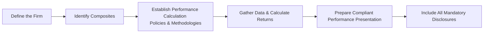

## Introduction and Core Principles

Have you ever been asked to provide performance results in a way that, well, feels 100% transparent and universally accepted? The Global Investment Performance Standards (GIPS) were created for precisely that. GIPS are globally recognized standards that define rules and methodologies for how firms should calculate and present their performance—ensuring consistency, comparability, and, most importantly, credibility.

I remember the first time I had to create a GIPS-compliant report for a small equity manager. It felt a bit like reading through a massive checklist. Actually, it was a massive checklist. But once you get the hang of it, you notice how these standardized disclosures benefit everyone—from your clients who want clear data, to your firm’s reputation in demonstrating full transparency. It’s all about trust.

Below, we’ll unpack the main GIPS requirements for performance presentation and reporting. We’ll break things down, talk about the mandatory disclosures, timelines, net vs. gross-of-fees presentations, best practices, and even a quick personal anecdote here or there to keep things real.

## Understanding Mandatory Disclosures

When you’re presenting performance under GIPS, there are certain data points and statements that must be included. Think of these as non-negotiable. They help ensure that you’re disclosing enough detail about the strategy and the methods used to calculate performance. 

• Composite Description:  
  You have to specify exactly which investment strategy or portfolio grouping is being measured. For instance, is this composite made up of all large-cap growth portfolios in the firm, with certain risk constraints? A well-defined composite helps readers understand the “universe” of portfolios.

• Firm Definition:  
  GIPS requires you to clearly outline the boundaries of what constitutes the “firm.” If you have multiple affiliates, subsidiaries, or parent companies, you have to identify the entity that claims compliance. It’s kind of like stating which legal or operational unit is standing behind the performance numbers.

• Benchmark Definition:  
  Every composite needs a suitable benchmark. And since “benchmark” is sometimes just thrown around as a ticker symbol, GIPS demands you fully describe it—like stating whether it’s a broad market index or if it’s customized. If you’re using something like a blended benchmark, specify the weighting, rebalancing frequency, and rationale.

• Number of Portfolios and Assets:  
  Within each composite, GIPS wants you to show how many actual portfolios are part of that composite and the total assets in it. This helps readers get a sense of representativeness: does this composite have five portfolios or 500? GIPS also typically requires total firm assets to provide context about the size of the firm relative to the composite.

• Fee Disclosures:  
  Let’s say your performance calculation is net-of-fees. GIPS wants to know which fees are deducted—whether it’s just the investment management fee or if there are also administrative/operational fees being taken out. If you’re presenting gross-of-fees, you still have to reveal which fees the client would typically bear outside of management fees (like performance fees or certain transaction costs).

• Currency, Valuation Basis, and Significant Events:  
  When looking at performance results, you have to clarify the base currency and the valuation methodology used. If there have been any huge events (like major acquisitions of a fund manager, or merges of accounts) that might have affected performance, those should be noted too.

Basically, the idea is: no secrets. GIPS wants you to lay everything on the table.

## Presentation Timelines

Have you ever seen a fancy pitch deck that brags about a hypothetical 30-year track record? Under GIPS, you need to present a minimum of five years of annual performance to start. Each year thereafter, you’re required to build your track record until you land at a robust 10-year record. Once you’ve got 10 years, you keep it rolling on a cumulative basis. 

But wait, do you have to wait for five years to claim compliance? If your firm is relatively new or if you’ve only got three years of data, GIPS allows you to present fewer years—provided you continue presenting performance going forward, up to that five-year threshold. Again, it’s all about establishing a credible and continuous record that prospective clients can rely on.

In practice, this timeline can be tricky if your firm has gone through expansions, acquisitions, or simply launched new composites. If you do have a “short” history, you can still say you conform to GIPS—but you must show all the history you have (like three years) and keep adding years until you reach the official minimum requirements.

## Impact of Net vs. Gross-of-Fees Returns

At first, the difference might sound obvious: net-of-fees means after fees, gross-of-fees is before those pesky costs. But in GIPS, you have to be super transparent about which fees are included in each category. Clients reading your report should understand how management fees, commissions, and other transaction costs might impact the actual return they see in their pockets.

• Gross-of-Fees:  
  These returns typically exclude management fees but can include other trading costs. You must disclose which fees and costs are excluded. The point is not to mislead investors into thinking they’ll actually receive the gross return.

• Net-of-Fees:  
  These returns subtract management fees. Some firms might also remove performance-based fees where relevant. The clarity on precisely which fees have been subtracted is crucial.

To be honest, it can be embarrassing (and even borderline noncompliant) if an investor points out that your net-of-fees disclosures left out certain performance fees. So it’s good practice to detail all relevant fees your clients might face.

## Visualizing a GIPS-Compliant Process

Sometimes a picture helps lock in how all these steps fit together. Here’s a little mermaid diagram that captures the high-level flow of establishing GIPS compliance for a firm’s composite performance:

## Best Practices for Compliant Presentations

So how do you ensure your final performance presentation stands up to the GIPS standard? Below are some often-cited best practices:

• Keep a Disclosure Checklist:  
  Many firms maintain a GIPS compliance checklist, ensuring they don’t forget details like benchmark rebalancing frequency or whether the composite started mid-year. If you like to be old-school, you can keep a big spreadsheet with all the items you need to disclose. Some folks I know actually tape a printed list right above their desk—whatever floats your boat.

• Maintain Consistency in Valuation:  
  GIPS generally requires fair value or a trade date-based valuation (unless local regulations say otherwise). The key is that you use consistent valuation methods and do so at least monthly (sometimes more frequently for funds with high turnover or large cash flows).

• Document Policies and Procedures:  
  GIPS compliance forces you to have documented policies for—well—just about everything. Seriously, everything from how you handle external cash flows to how you define portfolio discretion. Having it in writing prevents confusion, especially if your team or staff changes.

• Provide Ongoing Training:  
  GIPS compliance is never just a one-off exercise. Once you’re in, you’re in for the long haul. Make sure your staff (from portfolio managers to compliance folks) get periodic training on changes to GIPS guidelines, especially if you have a new version of GIPS quirks to consider.

## Common Pitfalls and How to Avoid Them

Even with GIPS guidance, mistakes happen. Here are a few pitfalls I’ve seen folks fall into:

• Benchmark Misalignment  
  If a composite invests primarily in emerging markets, but you’re using a global developed index as a benchmark, GIPS might question the rationale. Proper matching between the composite and benchmark is essential.

• Forgotten Significant Events  
  Did your firm have a major reorganization, or were there large changes in leadership that impacted investment strategy? Failing to disclose that can raise red flags.

• Cherry-Picking Time Periods  
  GIPS absolutely prohibits you from only showing your best streak. You must show continuous performance for all years in compliance. No hiding the down years.

• Overlooking Internal Dispersion  
  GIPS sometimes requires a measure of internal dispersion—like a standard deviation of portfolio returns within a composite. Many folks simply forget to compute or present it, which can break compliance rules.

## Practical Examples and Scenarios

Imagine a firm called “Global Equities R Us,” established in 2021. By 2023, they have just two years of performance. They can still present these years in a GIPS-compliant report, but they must:

1. Clearly state the 2-year track record.  
2. Indicate that they have not yet met the 5-year minimum.  
3. Commit to ongoing updates each year.  

Or consider a scenario where a firm presents gross-of-fees returns that exclude anything but brokerage transaction charges. They must clearly define that the only costs removed from returns are transaction costs, and that no management or performance fees are taken out. This transparency up front helps clients avoid any unpleasant “Oh, the net might look different” surprises.  

## Exam Tips and Focus Areas

When it comes to your CFA Level III exam, you might see GIPS compliance come up in essay (constructed response) or item set questions. Some key points to remember:

• Exactly which disclosures are mandatory.  
• The difference between net-of-fees and gross-of-fees returns.  
• Minimum timeline requirements (the five-year rule and building to ten).  
• Internal dispersion measures.  
• Handling partial compliance or aggregating performance from prior firms.  
• Identifying the “firm” in GIPS terms.

Watch out for scenario-based questions that test if you can identify noncompliant statements in fictional performance presentations. You might see a question describing a hypothetical firm ignoring composite definitions or using a random benchmark. Part of your job is to pinpoint the GIPS violations.

Time management tip: If you see a multi-part question on GIPS compliance, allocate your time to (1) identifying what’s missing (2) referencing the GIPS standard requirement (3) explaining how to correct it. Structured, bullet-point style answers often do well on exam grading.

## References and Further Reading

If you want to dig deeper, check out the following:

• CFA Institute’s GIPS Handbook: an authoritative source for clarifying the nuances of GIPS.  
• “GIPS Embracing Best Practices” – a CFA Institute webcast covering client reporting strategies.  
• The Investment Performance Council (IPC) for GIPS: performance standards and best practices.  
• Standard performance evaluation resources from the CFA Institute that expand on measurement nuances.

These resources not only help you master the intricacies of performance reporting but reinforce why GIPS compliance has become the gold standard around the globe.

## Test Your Knowledge: GIPS Requirements for Performance Presentation and Reporting Quiz



### GIPS requires a firm’s performance presentation to adhere to:
- [ ] The guidelines established by select local jurisdictions only
- [x] A global set of standardized requirements laid out by the CFA Institute
- [ ] Whichever method is most convenient for the firm
- [ ] Full compliance only if the firm has been in existence more than ten years

> **Explanation:** GIPS is a globally recognized standard maintained by the CFA Institute; it supersedes local jurisdiction nuances by providing a consistent framework for calculation and reporting.

### Under GIPS, a firm must disclose significant events impacting performance because:
- [ ] It is purely optional and serves solely for marketing benefits
- [x] Clients should be made aware of operational or structural changes that could affect returns
- [ ] It helps the firm avoid regulation from local financial authorities
- [ ] It ensures the firm can reduce compliance costs

> **Explanation:** Disclosing significant events such as reorganizations or leadership changes aligns with GIPS objectives of full transparency and ensures that clients understand any shifts that might have influenced performance.

### In a GIPS-compliant presentation, if no management fees are deducted:
- [x] The presentation must disclose which fees (if any) have been removed from the calculation
- [ ] The firm does not need to provide any additional explanation
- [ ] The firm must remove performance-based fees only
- [ ] The firm must also remove custodial fees

> **Explanation:** GIPS requires explicit disclosure of the types of fees that have been accounted for in performance calculations, preventing investors from being misled about actual net returns.

### The minimum number of years of performance required to initially present a track record under GIPS is:
- [ ] 10 years
- [ ] 3 years
- [x] 5 years
- [ ] 15 years

> **Explanation:** The standard rule is five years to start, building annually up to a 10-year record if the firm has been around that long. If the firm’s history is under five, it must present all available history, then add until five is reached.

### When a firm presents performance gross-of-fees:
- [x] They must disclose that management fees and possibly other fees are not deducted
- [ ] They should provide returns after all fees and expenses are deducted
- [x] They must clarify if transaction costs are included or excluded
- [ ] They cannot use fair value pricing

> **Explanation:** Gross-of-fees performance excludes certain fees, so the firm must clearly state these exclusions and ensure clients understand transaction costs that might or might not be included.

### If a composite includes five portfolios, each with a different level of risk, GIPS typically requires:
- [x] A measure of internal dispersion (e.g., standard deviation) to illustrate the variability among these portfolios
- [ ] No dispersion measure, as it’s purely optional
- [ ] The benchmark data only
- [ ] Exclusion of the highest-risk portfolio from the composite

> **Explanation:** GIPS wants to show the spread of returns within a composite. Providing standard deviation or another dispersion metric is a requirement to enhance transparency.

### A firm that has presented only three years of performance history and claims GIPS compliance:
- [x] Must continue adding years until five years are shown
- [ ] Must take steps to modify previous performance to reach five years
- [x] Must disclose why they cannot show five years
- [ ] Is prohibited from claiming GIPS compliance until five years is reached

> **Explanation:** Firms with shorter track records can present fewer than five years, provided they disclose their limited history and continue building each year.

### If a firm changes its benchmark for a composite, to remain compliant, it must:
- [x] Disclose the reason for the change and the date the change took effect
- [ ] Remove the previous benchmark from all historical reports
- [ ] Adjust historical returns to the new benchmark
- [ ] Merge the old benchmark returns into the new benchmark data

> **Explanation:** Doing a benchmark “switcheroo” can be misleading. GIPS rules require the firm to disclose why and when it changed the benchmark. Often, prior benchmark performance remains so that investors can track differences over time.

### One of the main objectives of GIPS is:
- [x] To promote global comparability of performance results
- [ ] To allow selective inclusion of positive performance
- [ ] To reduce compliance costs for large asset managers only
- [ ] To disregard local regulations wherever possible

> **Explanation:** GIPS is primarily aimed at providing a global, standardized framework for performance presentation so that investors can compare returns in a fair manner.

### Under the GIPS standards, a minimum five-year performance track record must be:
- [x] Consistently built to ten years if the firm has been around that long
- [ ] Reported with at least 20 individual disclosures
- [ ] Derived from net-of-fees performance only
- [ ] Verified by at least two external third-party auditors

> **Explanation:** Firms begin with at least five years of history and extend it to ten years once they have that amount of track record. Verification is a separate aspect but not mandated at five years specifically.


