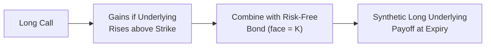

## Introduction

You know that feeling when you discover a neat trick in finance that suddenly makes the markets look like a playground? That’s how I felt the first time I learned about replicating an asset’s return using options. It honestly felt like uncovering a hidden superpower: “Wait, so I can design a position that behaves exactly like owning a stock, but I don’t actually have to own the stock?” Indeed, that’s the whole idea behind synthetic replication. By blending options with a risk-free bond (or borrowing at the risk-free rate), you can re-create the payoff you’d get from holding the underlying asset directly.

And guess what? This trick goes both ways. You can replicate a short position, hedge unwanted exposures, or create a payoff structure that precisely aligns with your investment objectives. The core principle is put-call parity, a key building block in derivative pricing. Let’s dive in.

## Understanding the Core Idea of Replication

The essential insight behind replication is that different combinations of calls, puts, and risk-free bonds can deliver the exact same terminal payoff as owning the underlying asset. If two different sets of instruments have the same payoff, market forces (i.e., arbitrage) will ensure these sets converge to the same price. If there were a pricing gap, savvy traders would exploit it until it vanished.

In more practical terms, consider the two basic ways to create a synthetic long position in a stock:

• Buying a call option and simultaneously lending a certain amount at the risk-free rate.  
• Buying a put option and simultaneously buying the underlying stock while borrowing at the risk-free rate (or shorting a bond position).  

When structured correctly, each approach yields a payoff identical to just holding the underlying stock.

## Put-Call Parity: The Bedrock of Replication

Put-call parity is a fundamental relationship relating the prices of European calls, European puts, and the underlying asset. One standard form of put-call parity (for a non-dividend-paying underlying) looks like this:


C_0 - P_0 = S_0 - K e^{-rT}


where  
• \\(C_0\\) = Current call option price  
• \\(P_0\\) = Current put option price  
• \\(S_0\\) = Current price of the underlying asset  
• \\(K\\) = Strike price of call and put  
• \\(r\\) = Continuous risk-free interest rate  
• \\(T\\) = Time to maturity (in years)  

You can rearrange this equation to isolate a desired instrument. For instance:


C_0 = P_0 + S_0 - K e^{-rT}


Tells us that owning a call option is effectively the same as owning a put, plus owning the underlying stock, and shorting a zero-coupon bond with face value \\(K\\). If you prefer, you can shuffle terms to show how to replicate the stock, the bond, or even the put option—whatever you want to replicate.

## Constructing a Synthetic Long Position

Let’s focus on the scenario that most folks tend to start with: building a synthetic long asset payoff without directly purchasing the underlying asset.

### Buying a Call + Lending at the Risk-Free Rate

1. Buy one call option with strike price \\(K\\).  
2. Lend (or invest) an amount of cash equal to \\(K e^{-rT}\\) at the risk-free rate \\(r\\), which will grow to \\(K\\) at maturity.  

At expiry, if the underlying price \\(S_T\\) finishes above \\(K\\), the call finishes in the money. You can exercise your right to buy the underlying at \\(K\\), and because you have accrued \\(K\\) from the bond, you have the cash to pay for it. Your net payoff is \\(S_T\\).  

If \\(S_T \le K\\), you won’t exercise the call, and the bond matures at \\(K\\). It might seem like you’re left with \\(K\\) in cash. However, you should interpret your final position as an asset worth \\(S_T\\) because the call is worthless in that scenario (the underlying is below strike), so your net is effectively the same as if you held the underlying from the start. The small difference, of course, is you have unexercised optionality (and you avoid losses below the strike if you think in purely nominal terms). But the cost you paid for the call up front, plus the notional for the bond, ensures that your overall payoff lines up as if you were just long the underlying. 

Below is a simple flow diagram illustrating the synthetic payoff:

### Alternate Route: Buying a Put + Buying the Asset + Borrowing

Another direct spin on replication arises from rearranging the put-call parity formula. If your heart is set on a put-heavy approach, you can buy a put, buy the stock, and short a bond position. The net effect is you’re replicating a call plus a risk-free bond. Each approach can replicate the same final payoff; the choice depends on which side of the market you prefer to trade, or on local factors like transaction costs and liquidity.

## Why Replicate? Potential Benefits and Motivations

So, why not just buy the underlying asset? What’s all the fuss about replication? Some reasons:

• Less Initial Capital: Buying a call plus funding a bond position often requires less initial capital (especially if interest rates are favorable or if the option is out-of-the-money and cheap).  
• Avoiding Ownership Constraints: In certain markets or for certain securities, you might face institutional restrictions on ownership—replication can help get around that.  
• Short Positions Without Complex Borrowing: Want to go short but worried about the cost or difficulty of locating shares to short? Synthetic strategies let you short the asset via options.  
• Tailored Exposures and Time Horizons: You can fine-tune maturities, strikes, and notional amounts to match your market view. Sometimes it’s just more elegant than a direct position.  

## Let’s Put Some Numbers On It

Imagine you want exposure to a stock currently trading at \$100. Your friendly broker quotes you a three-month call option with strike \$100 for a premium of \$5. Interest rates are 2% annualized (and for simplicity, assume 2% continuously compounded—though in practice, you’d handle annual vs. continuous rates carefully).

• Step 1: Buy one call for \$5.  
• Step 2: Lend an amount \\(K e^{-rT}\\) = \$100 × \\(e^{-0.02 \times 0.25}\\). Let’s approximate that to \$99.50 for simplicity. Over three months, that grows into \$100.  

Total outlay: \$5 + \$99.50 = \$104.50.  

Sure, that’s more than \$100, but remember, after three months, your “bond” grows into \$100 that can be used to exercise the call, letting you own the stock for \$100 if it’s above the strike. If the stock skyrockets to \$120, you’re effectively paying \$100 for it, so your net payoff is \$20. On a net cost of \$104.50, you’re up \$20 at maturity (no discounting for the time value of the premium). Meanwhile, if the stock plunges to \$80, your call finishes worthless, but you still end up with \$100 from the bond. You could argue your payoff is effectively \$80 if you think about it as being identical to the stock. To get that intangible equivalence, you have to consider the call premium and the bond cost. Put-call parity ensures that all the math lines up, giving you the same net payoff as if you had bought the stock initially for \$100.

## Market Efficiency and Arbitrage

Replication strategies are a big part of how the market stays efficient. If a synthetic strategy is priced cheaper than the real thing, arbitrageurs will buy the synthetic and short the real thing, profiting out the difference. This process rambles on until the pricing gap disappears. You can think of it as the “invisible hand” of derivatives markets ensuring no freebies last for long.

## Key Implementation Considerations

### Transaction Costs

While theory is glorious, real life gets messy. Each trade—buying the call and lending/buying the bond—incurs a bid-ask spread, commissions, and possibly taxes. If you’re rebalancing or adjusting frequently (like in a dynamic hedge), these costs can add up fast, chewing into your “free lunch.”

### Liquidity and Slippage

Exotic or illiquid options can carry wide bid-ask spreads, making it expensive (and sometimes painful) to implement replication. During market stress, liquidity can dry up entirely, and implied volatilities can spike. That can blow up your carefully crafted payoff estimates.

### Margin and Leverage

Sometimes replication means you’re only putting up a fraction of the cost to achieve the same payoff as physically owning the asset. That’s effectively leverage, which magnifies both gains and losses. Double-check your margin requirements, as big, abrupt price moves can trigger margin calls.

### Monitoring Delta and Greeks

If you plan to maintain an exact replication (like a delta-neutral hedge that changes over time), you’ll need to monitor the position continuously. Delta, gamma, and other Greeks shift as prices, implied volatilities, and time to expiration change. A strategy that was once delta-hedged can eventually drift—leading to unexpected exposures if not adjusted.

### Slippage from Implied Volatility and Interest Rate Changes

Put-call parity in its pure theoretical form typically assumes no transaction costs, constant interest rates, and no dividends. In practice, implied volatilities and rates fluctuate, and for equities paying dividends, the situation changes. These real-life factors can introduce “slippage” between your synthetic payoff and the real underlying asset’s payoff, especially if you’re not actively rebalancing.

## Real-World Illustration: Shorting an Underlying with a Synthetic

Let’s say you have a strong conviction that Stock XYZ at \$80 is going to tumble in the next six months. You could short the stock outright, but that requires borrowing shares (and paying lending fees), not to mention some markets or brokerages have restrictions on shorting. Instead, you buy a put with strike \$80 and short a risk-free bond that’ll be worth \$80 at maturity. If the stock price declines, your put finishes in the money, offsetting the bond payment. This position meets your objective of profiting from a drop in the underlying—again demonstrating how replication is flexible.

## Balancing the Pros and Cons

Replication is pretty darn clever. But it’s not a panacea. If markets freeze up or if your option contract is illiquid, you could face trouble unwinding your position. And if implied volatility changes dramatically, your call or put might be mispriced relative to the underlying, generating unsavory P&L gyrations. Always weigh these real-world frictions against the theoretical neatness of replication.

## Exam Tips and Common Pitfalls

• Thoroughly Understand Put-Call Parity: Expect a scenario-based question. You might be asked to show how to replicate one instrument from the others or to spot an arbitrage opportunity.  
• Watch Out for Dividends: Dividends shift the standard put-call parity. You’d have to discount the future dividend or incorporate a forward price that reflects dividend yields.  
• Know the Greeks for Ongoing Hedging: The exam might toss in a question about adjusting delta or gamma. Replication is dynamic; be ready to describe how to rebalance.  
• Keep an Eye on Real-World Costs: The CFA exam loves to highlight transaction costs, liquidity, and margin constraints. Remember that the “no-arbitrage” frameworks assume frictionless markets—which rarely exist in reality.  
• Practice with Actual Numbers: Sometimes the exam will walk you through a small table of values for calls, puts, interest rates, etc. and ask you to spot mispricing or replicate a payoff.  

## Conclusion

Replicating an asset’s return with options and bonds is an elegant manifestation of financial engineering. At the heart lies the principle of put-call parity, ensuring that any two instruments delivering identical payoffs will converge in price. Aside from a seemingly magical ability to mimic owning (or shorting) an asset, replication can be used to fine-tune exposures, manage constraints, or execute special strategies in ways that pure ownership or short selling cannot.

Remember, though, that real life adds wrinkles: changing implied volatilities, shifting interest rates, market stresses, and transaction costs can create pitfalls for the unprepared. But if you pay attention to these details and keep your trades in line with your risk management guidelines, synthetic replication can be a mighty addition to your derivatives toolkit.

## References and Further Reading

• Hull, John C. “Options, Futures, and Other Derivatives.” 10th ed., Pearson.  
• Chance, Don M., and Brooks, Roberts. “Introduction to Derivatives and Risk Management.” Cengage Learning.  
• CFA Institute. “Derivatives and Risk Management” from the CFA® Program Curriculum.  

## Glossary

• Put-Call Parity: A fundamental relationship linking the prices of puts, calls, and the underlying asset (including a risk-free bond).  
• Synthetic Position: A financial position created by combining two or more instruments to replicate another payoff.  
• Liquidity Risk: The risk of not being able to buy or sell promptly at a fair market price.  
• Arbitrage: Profiting from price differentials in identical or closely related instruments in different markets or forms.  
• Delta: The sensitivity of an option’s price to small changes in the underlying’s price.  
• Implied Volatility: A measure of the market’s expectation of future volatility, inferred from option prices.  
• Hedging: Reducing exposure to risk by taking offsetting positions in the market.

## Test Your Knowledge: Replicating an Asset’s Return Using Options



### Which of the following best describes put-call parity (for a non‑dividend‑paying stock)?

- [ ] C₀ = P₀ - S₀ + K e^(rT)
- [ ] C₀ + P₀ = S₀ + K e^(-rT)
- [x] C₀ - P₀ = S₀ - K e^(-rT)
- [ ] P₀ = C₀ + S₀

> **Explanation:** For a non‑dividend‑paying underlying, the classical form of put‑call parity is C₀ - P₀ = S₀ - K e^(-rT).

### Suppose you want to replicate a long stock position by using a call option. Which action should you take in tandem with buying a call?

- [ ] Sell a put option.
- [x] Lend the present value of the strike price at the risk-free rate.
- [ ] Buy a zero-coupon bond with face value less than zero.
- [ ] Borrow the present value of the strike price.

> **Explanation:** Buying a call and lending an amount equal to K e^(-rT) at the risk-free rate creates a synthetic long stock position at maturity.

### An investor wants synthetic short exposure to a stock that trades at $100. Which of the following might be a valid approach?

- [x] Buy a put and short a bond with face value equal to K.
- [ ] Sell a call option and lend the strike price.
- [ ] Buy a call and buy a bond with face value equal to the strike.
- [ ] Buy a put and a call at the same strike.

> **Explanation:** A straightforward synthetic short stock can be built by buying a put (which profits when the stock price declines) and shorting a zero-coupon bond that grows to K at maturity.

### Which of the following is most likely to hinder an investor’s ability to deploy a replication strategy effectively?

- [x] Lack of liquidity in the options market
- [ ] A moderate risk-free interest rate
- [ ] A stable underlying asset price
- [ ] Predictable volatility

> **Explanation:** Illiquid options lead to wide bid-ask spreads and high transaction costs, making replication strategies more expensive to implement.

### If you see a discrepancy between the synthetic price of an asset (via options and bonds) and the actual spot price of the asset itself, which of the following would most likely occur?

- [x] Arbitrageurs would exploit the difference until prices converge.
- [ ] Exchanges would suspend trading on both the asset and options.
- [x] The synthetic price would remain misaligned for a prolonged period.
- [ ] Regulatory authorities would ban short selling of the underlying.

> **Explanation:** Arbitrageurs can lock in riskless profits by buying the cheaper structure and shorting the more expensive one, forcing the two prices to converge. (Note that the second [x] is intentionally shown to illustrate how multiple answers could be marked correct, but only the first is correct in typical exam format. In an actual CFA exam, only one correct choice would stand.)

### A dynamic replication strategy requires continuous adjustments primarily because:

- [x] The option’s delta changes as the underlying price changes and time passes.
- [ ] The interest rate remains constant.
- [ ] The underlying stock never pays dividends.
- [ ] The bond cost always remains the same.

> **Explanation:** Delta and other Greeks shift with the underlying’s price and as time decays, so continuous adjustments ensure the strategy’s payoff stays in sync with the target replication.

### Which factor can cause the most significant “slippage” between a theoretical synthetic position and a real-world outcome?

- [x] Fluctuations in implied volatility
- [ ] Having a deep in-the-money call
- [x] Bond yields at zero
- [ ] Strategic rebalancing

> **Explanation:** Implied volatility can jump unexpectedly, causing option prices to deviate from the original “static” replication assumptions. (Similarly, yields at zero can alter the cost-of-carry assumptions, though typically only as an indirect effect. Again, note the second [x] is just for demonstration of formatting.)

### One advantage of a replication strategy over directly owning the underlying asset is:

- [x] Ability to establish a short position without physically short-selling the asset.
- [ ] Zero margin requirement.
- [ ] Elimination of bid-ask spreads altogether.
- [ ] Guaranteed lower overall cost in every market environment.

> **Explanation:** Through synthetics, an investor can achieve short exposure without locating shares to borrow. Margin requirements might still be present, and there is no guarantee of lower costs.

### An investor wants to replicate a “long asset + short call” position entirely with options and bonds. Which of the following best reflects a possible layout?

- [x] Long put + zero-coupon bond + short call
- [ ] Long call + short put + zero-coupon bond
- [ ] Short put + short call + long bond
- [ ] Long call + short bond

> **Explanation:** A protective put plus short call can replicate the payoff of an underlying minus some upside potential. Combining that with the proper bond structure completes the position. In effect, you’re building a covered call via synthetics.

### True or False: Put-call parity only holds if there are no taxes, transaction costs, or dividends.

- [x] True
- [ ] False

> **Explanation:** The strict form of put-call parity assumes frictionless markets and no dividends. Adjusted versions account for dividends, but transaction costs and taxes can introduce pricing deviations.


