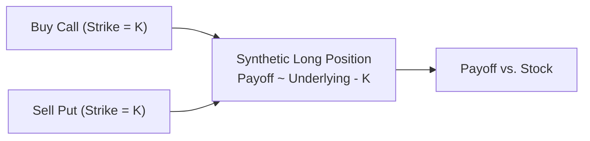

## Overview of Targeted Equity Exposures with Options

Perhaps you remember the first time you tried to fine-tune your equity portfolio’s risk. You might have thought, “Hey, if I just buy (or short) some shares, I can adjust my exposure.” But eventually, you discover that options allow a far more elegant, and sometimes more cost-effective, method to align your risk profile with your specific goals. Options can create a “targeted” equity exposure—meaning you can achieve precisely the beta, upside, or downside risk profile you want—without fully committing capital or without actually holding the underlying shares.

In this section of the curriculum, we examine some of the most common ways to use options to tailor equity exposure. We’ll talk about creating synthetic equity positions, partial hedging tactics, and strategies to enhance yields. We’ll also explore how margin and transaction costs factor in. Then we’ll look at customizing delta, gamma, and vega exposures for your portfolio and how such approaches can mitigate or amplify very specific risk factors. Finally, we’ll cover best practices, common pitfalls, references, and some exam tips that might help you do well on your Level III exam.

## Creating Synthetic Long Positions

Sometimes you might want the payoff profile of a long equity position—but for some reason, you’d prefer not to lay out the entire capital amount required to buy those shares. That’s where synthetic positions step in.

### Mechanisms for Synthetic Longs

A synthetic long is typically constructed by combining a call option purchase with a put option sale on the same underlying security (same strike, same expiration) or by combining calls with zero-coupon bonds. Here’s a quick conceptual breakdown:

• Buy a call (gives upside exposure).  
• Simultaneously sell a put (offsets part of your outlay by the option premium received).  
• The result: a payoff profile that closely mimics a share of the underlying.  

This approach is often referred to as a “synthetic long stock” because the combined call–put payoff ends up looking remarkably like that of a plain old share. Of course, margin requirements and capital outlay will differ compared to simply buying the stock outright. The synergy can be visualized in a payoff diagram.

Below is a simple Mermaid diagram illustrating the relationship of a synthetic long position at expiration:

In a standard scenario, if you choose at-the-money options, both the call premium and put premium can be roughly similar. The net cost might be small or large depending on interest rates, dividends, and implied volatilities. If the underlying trades above the strike at expiration, your “synthetic long” benefits just like the stock would. If the price falls below the strike, you face similar losses to a direct share owner, up to the strike price (and beyond, because of assignment risk on the short put).

### Funding Synthetic Longs with Bonds

Another technique is to buy a call option while simultaneously investing in a zero-coupon bond that will mature to the strike price at expiration. By purchasing the call and setting aside the strike cost in a zero-coupon bond, you effectively replicate a fully funded exposure. This is also called a “fiduciary call” strategy. It can be helpful because you can manage default risk on the bond side and also precisely target the maturity to match the option’s.

### Example: Synthetic Long on a Tech Stock

Imagine you strongly believe in the potential rebound of a certain tech stock currently priced at $100. Instead of paying $100 per share, you buy at-the-money call options at a $100 strike for $5 per share. Meanwhile, you receive $4.80 by shorting a similar maturity $100 strike put. The net premium is $0.20 per share (a net payment of $0.20). Ignoring transaction costs, you’ve synthetically replicated a long stock, needing much less capital than directly purchasing shares. However, do keep in mind margin requirements from your broker for the short put side, which might be sizeable.

## Partial Hedging Strategies

We all know how nerve-racking it can be to hold a large equity portfolio during market downturns. Partial hedging with options can be a cost-effective compromise between full exposure and a fully hedged position.

### Buying Puts on a Portion of the Portfolio

Suppose you have a large, diversified equity portfolio but you’re worried about tail risk or a sudden drawdown. One straightforward approach is to buy put options on either the exact stocks in the portfolio or, more typically, on an index that correlates well with your holdings.

• If the market falls significantly, the put payoff offsets some losses.  
• If the market rises, you still keep most of the upside gains (minus the put premium).  

This approach is akin to a partial (or sometimes called “fractional”) protective put if you hedge only a certain portion of your shares, not all of them.

### Collars for Concentrated Positions

Now, let’s say you’ve got a huge position in a single stock—maybe it’s your employer’s stock or something you’ve held for decades. You want to keep some upside, but you can’t bear the idea of a major downside. Enter the collar:

1. You buy a put option to have downside protection.  
2. You sell a call option to finance that put.  

In the best-case scenario, the call you sell is out-of-the-money, providing some upside potential. And the put you buy might be out-of-the-money to reduce premiums. The net cost can sometimes be close to zero, especially if the two options are carefully chosen. This strategy is popular among executives or large shareholders who need to manage single-stock risk while wanting to retain ownership (and associated voting rights, dividends, etc.).

As a small personal note, I remember a friend from grad school who used a collar strategy when he was awarded 10,000 shares of his company’s stock. He definitely wanted to keep those shares for sentimental reasons, but couldn’t sleep at night with so much wealth tied to a single ticker. Collaring it gave him peace of mind—it’s amazing how our finances and sanity can be so closely intertwined.

## Enhancing Return by Selling OTM Calls

Your portfolio might not just be about defense. You can also put your equities to good use generating extra income by selling out-of-the-money (OTM) calls. This is sometimes known as a covered call strategy if you already own the underlying shares. The idea is simple:

• You hold the underlying stock.  
• You write a call option with a strike above the current price.  
• You collect premium.  

If the stock finishes below the strike at expiration, you keep the premium and the shares. If it goes above the strike, you get called away, effectively selling at the strike (plus keeping the premium). The trade-off is that your upside beyond the strike is capped.

OK, so how does this tie into targeted equity exposure? Well, you can basically shift your risk–reward profile by choosing how far out-of-the-money your call option is. Further OTM strikes mean less premium but more upside potential. Closer to (or even in-the-money) strikes mean more premium but reduced upside.

You can also implement “buy-writes” to enhance return (buy the stock, simultaneously write a call). In either case, you’re systematically monetizing your equity holdings’ volatility. Be mindful: if implied volatility is low, you might not get much premium from writing calls. Also, watch out for early assignment risk with American-style options or the ex-dividend effect if you hold dividend-paying stocks.

## Leveraging Index or Sector Options

Many investors want exposure to broad market moves (e.g., the S&P 500, Euro Stoxx 50, FTSE 100, or MSCI EAFE indexes) but may balk at having to buy a giant basket of securities. Alternatively, they might only want a particular sector—like technology, healthcare, or financials—without picking individual stocks. Index or sector ETF options can fill that gap nicely.

### Benefits of Index Options

• Reduced transaction costs: Instead of trading in dozens (or hundreds) of stocks, you trade fewer contracts.  
• Systematic exposure: You gain or hedge exposure to an entire market or segment in a single trade.  
• Lower operational complexity: Rebalancing can be simpler, compared to holding a large portfolio of individual securities.  

Of course, the mapping of beta exposures is typically less precise if you have specialized or unusual stocks in your portfolio that don’t correlate perfectly with the index. That’s a risk you have to accept.

## Considering Margin and Transaction Costs

It’s not all sunshine and roses, though. Options strategies will have margin requirements—especially strategies involving short options. If you’re short a put in a synthetic long, for example, your broker will likely require a margin deposit reflecting the underlying risk. This can sometimes erode the “capital efficiency” of the synthetic. On the flip side, margin can also provide leverage if used carefully.

Transaction costs might be higher for multi-leg strategies. Each leg you trade can involve bid–ask spreads and commissions. For sophisticated positions, you might also consider the “slippage” from wide spreads or low liquidity, especially in less heavily traded options series, or for less standard expirations. It’s good to shop around for brokers who offer cost savings for multi-leg strategies.

## Customizing Delta, Gamma, and Vega

Part of the magic of using options lies in your ability to shape your portfolio’s sensitivities:

• Delta (δ): The exposure to changes in the underlying’s price.  
• Gamma (Γ): The rate of change of delta with respect to the underlying’s price.  
• Vega (ν): The sensitivity to changes in implied volatility.  

### Delta Tuning

If you want a “lighter” equity exposure—maybe you only want half the typical upside or downside—delta tuning with options can help you precisely dial in that partial exposure. For example, you might buy calls that collectively have a total delta of 0.5 times your notional. That yields half the exposure of a fully long stock position.

### Gamma Control

Gamma matters for large price moves. If you’re worried about sudden jumps, you might want a positive gamma position (e.g., buying options) so that your exposure grows as the underlying price moves in your favor. But a large positive gamma can be expensive if the market remains quiet. Conversely, a negative gamma stance (selling options) may earn you time decay but is risky if the market suddenly takes a big leap. Balancing gamma with your view of volatility and your ability to handle big moves is key.

### Vega Exposure

Sometimes you might have a divergence between your view on the direction of the market and your view on volatility. Let’s say you expect a company’s shares to trade sideways but become extremely volatile around an upcoming earnings announcement. You can position yourself with a net positive vega by buying options (straddles or strangles, for instance) if you think implied volatility will rise. Or if you think implied volatility is overstated, you could be a net seller. Bringing your volatility forecast into your strategy can provide an extra layer of sophistication—and potential alpha.

## Mitigating Currency or Event Risks

Equity options can also help target or avoid certain event risks. Imagine you have a large allocation in an international stock that’s about to announce a major regulatory decision. Perhaps you’re equally worried about currency swings. By using currency options to hedge your FX exposure, and equity options to protect the stock price, you can craft a more stable payoff for a specific event window.

Sometimes, specialized exchange-traded products—like options on ADRs or cross-listings—can be used. Be aware of liquidity issues and local regulatory constraints.

## Strike Selection and Maturity

Choosing the right strike:

• Lower strikes (for calls) or higher strikes (for puts) cost more but provide more in-the-money protection or coverage.  
• Conversely, OTM strikes are cheaper but may not meaningfully hedge smaller price moves.  

Choosing the right maturity:

• Short-dated options might be less expensive in absolute terms but carry more rapid time decay.  
• Longer-dated options (LEAPS) can protect or position you for extended periods, but the premiums can be quite high—and you’ll be more sensitive to changes in implied volatility over time.  

Both strike and maturity selection should tie back to your investment horizon, risk appetite, and your forecast for how quickly the underlying price might move.

## Practical Examples and Case Studies

### Case Study 1: Hedging a Technology Growth Portfolio

Suppose you manage a portfolio of growth-oriented technology stocks. Historically, these stocks have shown a beta greater than 1 to the broad market, meaning they can be more volatile. You suspect a short-term market correction but remain confident in long-term prospects.

1. You purchase puts on the Nasdaq-100 index, covering half the portfolio’s notional value.  
2. The puts have a strike about 5% out of the money, with a three-month maturity.  
3. This partial hedge reduces the impetus for you to sell your growth stocks during a dip, while still letting you keep significant upside if the sector climbs.  

### Case Study 2: Collaring a Founder’s Stock

An executive at a midsize pharmaceutical company holds a massive stake in the stock. She’s concerned about an upcoming clinical-trial result that could swing the share price dramatically. Instead of selling, she wants to retain potential ownership gains and voting control.

1. She buys a put at a strike about 10% below the current price.  
2. She finances it nearly fully by selling a call 10% above the current price.  
3. If the stock tanks on bad trial data, she is protected at the put strike. If the stock soars, she sells her shares at the call strike (plus keeps the call premium).  

### Case Study 3: Generating Extra Income on a Dividend Stock

An income-focused investor holds a utility stock that pays a steady dividend. The investor is moderately bullish but does not expect spectacular growth. Selling OTM calls can “enhance” the dividend yield:

1. By writing monthly calls 2% out of the money, the investor collects premium.  
2. If the stock stays range-bound or slowly rises, the calls expire worthless, delivering extra return.  
3. If the stock jumps above the call strike, the shares can be called away. The investor pockets the strike price plus the premium.

## Common Pitfalls and Challenges

1. Underestimating Assignment Risk: With American options, especially on dividend-paying stocks, assignment can happen before expiration, most likely just before ex-dividend dates if the calls are in-the-money.  
2. Ignoring Correlation Gaps: If you hedge your portfolio with index puts but your holdings deviate significantly from the index, your hedge might be imperfect.  
3. Overleveraging: The excitement of lower upfront cost with synthetic positions can lead to overexposure if you’re not mindful of margin requirements.  
4. Time Decay Surprise: Long options can lose value quickly if the market doesn’t move as expected.  
5. Liquidity Constraints: Some options on small companies or niche ETFs have wide bid–ask spreads, which can be costly to enter or exit.  

## Best Practices

• Align your option maturities with your investment horizon or the time window of risk you want to mitigate.  
• Consider implied volatility levels before structuring a major option trade; buying options is more attractive when implied vol is relatively low, selling is more enticing when implied vol is relatively high.  
• Understand your margin requirements in detail. Make sure you have enough liquidity if your trade goes against you.  
• Monitor your “Greeks,” especially if you have large positions in multiple expirations. You don’t want an unexpected gamma or vega spike messing with your portfolio.  
• Be clear about your objectives: Are you hedging? Trying to capture alpha from volatility? Seeking to reduce concentration risk? Each objective might warrant a different set of strikes and expirations.

## Exam Tips and Final Thoughts

• CFA Level III exam questions often focus on explaining when and why you would choose one option strategy over another. Be prepared to outline the pros and cons of synthetic longs, protective puts, collars, and covered calls.  
• In essay (constructed response) questions, clearly identify the objective. For example, is the investor primarily risk-averse, or do they want incremental income? Match your recommended option strategy to that stated objective.  
• Watch out for subtle details in the item sets—like dividend yields, cost of carry, margin constraints, or expected volatility changes—that might alter the payoff.  
• Practice your time management on multi-part questions. Option strategies can get complex fast, so outline your approach before diving into calculations.  
• Don’t forget to consider how currency aspects can complicate a seemingly straightforward equity option strategy if the underlying is foreign.  

At the end of the day, using options to achieve targeted equity risk exposures is about precision, efficiency, and flexibility. But, as we’ve discussed, it comes with its own complexities. Balancing these trade-offs is what sets an advanced portfolio manager apart.

## References and Further Reading

• CFA Institute. “Options for Equity Portfolio Management” in the Level III Curriculum.  
• Hull, John C. “Options, Futures, and Other Derivatives.” 10th ed., Pearson.  
• Chapter 1.2 and 1.3 in this volume (Covered Calls and Protective Puts) for deeper dives into single-stock option strategies.  
• Chapter 1.11 (Option Greeks and Their Role in Risk Management) for deeper coverage on how Greeks guide derivative positioning.  

## Targeted Equity Options Strategies: Quiz to Test Your Knowledge



### Which of the following best describes a synthetic long stock position?

- [ ] Buying a put and shorting a call at different strikes
- [x] Buying a call and shorting a put at the same strike
- [ ] Buying both a call and a put at the same strike
- [ ] Shorting a call and shorting a put at the same strike

> **Explanation:** A classic synthetic long stock is created by buying a call and shorting a put at the same strike and expiration, replicating the payoff of owning the underlying.

---

### The main purpose of a collar strategy on a concentrated stock position is to:

- [ ] Maximize leverage in a bullish environment
- [x] Limit downside risk while giving up some upside potential
- [ ] Eliminate both upside and downside risk entirely
- [ ] Increase delta exposure to large price moves

> **Explanation:** A collar strategy uses a long put and a short call to protect against downside risk but forgoes some upside profit. It’s commonly used for concentrated positions when an investor wants to maintain ownership but hedge downside.

---

### Which of the following is NOT a potential challenge when using index options to hedge a stock portfolio?

- [ ] Basis risk due to correlation mismatches
- [x] Guaranteed perfect correlation with individual securities
- [ ] Transaction costs and bid-ask spreads
- [ ] Appropriate strike and maturity selection

> **Explanation:** Index options do not guarantee perfect correlation with individual stocks, so that’s a risk, not an advantage. Perfect correlation is unrealistic, leading to basis risk.

---

### In a protective put strategy, the primary Greek exposure you are adding is:

- [ ] Negative delta
- [x] Positive vega
- [ ] Negative vega
- [ ] Positive gamma

> **Explanation:** Buying a long put generally increases your portfolio’s vega exposure because long options gain value when implied volatility rises. You also get positive gamma, but among the listed choices, positive vega is most directly impacted.

---

### An investor wants to earn extra income on a stock she owns, but does not wish to lose the stock unless it rises above a certain price. Which strategy is most suitable?

- [x] Covered call with an out-of-the-money strike
- [ ] Long call at-the-money
- [ ] Short put at-the-money
- [ ] Long strangle

> **Explanation:** A covered call with an OTM strike allows the owner to earn premium income while still holding the stock. If the price rises above the strike, the shares may be called away, but only after capturing some upside gains plus the premium.

---

### Which of these is a valid reason for using a long call and zero-coupon bond to replicate a synthetic position?

- [ ] To reduce margin requirements for a short gamma position
- [ ] To create a synthetic short stock position
- [ ] To increase the overall portfolio delta beyond 1
- [x] To replicate a fully funded long stock for a specified future date

> **Explanation:** Buying a call combined with a zero-coupon bond that matures at the strike price creates a fiduciary call, effectively replicating a fully funded long position on the underlying stock at maturity.

---

### What is the main risk of a short put position that forms part of a synthetic long?

- [ ] The option could expire worthless
- [ ] You could lose access to your shares’ dividends
- [x] The underlying could drop substantially below the strike price
- [ ] A covered call cannot be established simultaneously

> **Explanation:** In a synthetic long, the short put carries the obligation to buy the stock at the strike if assigned when the underlying falls. The largest risk is a significant price decline, which would lead to potentially large losses.

---

### In selecting an appropriate strike price for a protective put, one considers:

- [ ] Location-based taxes
- [ ] The call you wrote in a different strategy
- [ ] The historical earnings per share of the company
- [x] The acceptable downside threshold or “floor” you want to establish

> **Explanation:** The put strike choice should align with how much downside protection you want or can tolerate. This effectively establishes a floor on your stock’s value.

---

### A negative gamma position is generally associated with:

- [ ] Long option strategies
- [x] Short option strategies
- [ ] Protective puts
- [ ] Positive vega exposure

> **Explanation:** Selling options (short calls or short puts) typically involves negative gamma. Your delta will move against you when the underlying price moves in either direction substantially.

---

### The payoff of a long call plus a short put at the same strike is always identical to being long the underlying stock.  
- [x] True
- [ ] False

> **Explanation:** In theory, if both the strike and expiration are the same, a long call combined with a short put has the same payoff as being long the stock—assuming no frictional costs, no dividend differences, and perfect markets.


