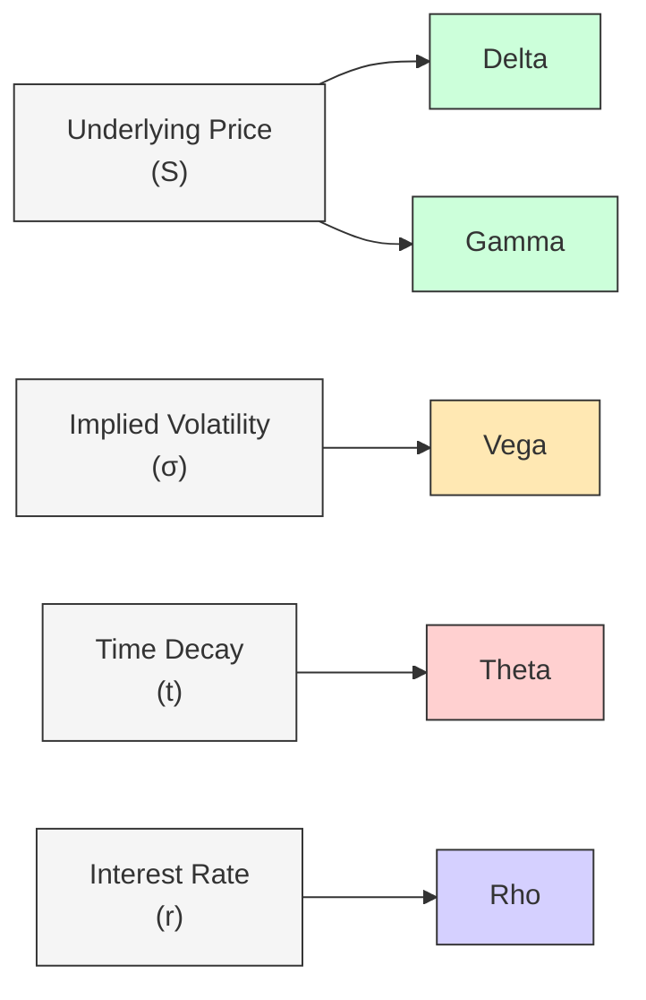

## Introduction

Options may look like magical contracts at first glance—offering upside potential and limited downside risk—but, as you’ve probably already discovered, there’s a whole web of market forces that shape their prices. Underlying asset price moves, changes in implied volatility, time decay, and even shifts in interest rates can cause an option’s value to fluctuate. If you’ve ever watched an option’s price react in ways you didn’t anticipate, trust me, you’re not alone.

“Option Greeks” is the umbrella term for a series of risk measures that help quantify each of these forces. Way back when I started tinkering with options (and yes, it feels like ancient history now), I remember feeling overwhelmed by how many moving parts were baked into these tiny contracts. But once I latched on to the Greeks—Delta, Gamma, Vega, Theta, and Rho—it was like someone handed me a blueprint. Suddenly, I could see exactly which factors were driving my P&L swerves and figure out how to adjust hedges accordingly.

We’ll explore how each of these Greeks operate, how you can use them (individually and in tandem) to neutralize or dial up specific exposures, and how professional risk managers monitor “Greek exposures” across entire portfolios. This discussion builds on earlier sections of the text that addressed basic option payoffs and strategies. By the end, you should be well-equipped to calibrate your option positions so that they serve your precise objectives, whether that’s generating income, hedging a portfolio, or capitalizing on volatility swings.

## The Value of Greeks in Risk Management

In practice, investment managers don’t simply buy a call option and hope for the best. Often, they’ll examine a package of trades, each with overlapping exposures, in a dynamic environment. This complexity drives the need for a risk management framework that can isolate each primary risk factor. The Greeks enable just that. They give you a quick snapshot of how your option’s value would react if any relevant variable—underlying price, volatility, time, or interest rates—changes a little bit.

Once managers have an overview of these sensitivities, they can decide whether to partially or fully hedge (or possibly seek out) different types of risk. For example, if you have a delta-neutral book (no net exposure to minor price changes in the underlying), you might still remain exposed to volatility changes (vega). Knowing that your P&L might hinge on implied volatility might be exactly what you want—or a scenario you need to fix.

In the later portion of this section, we’ll also discuss some practical strategies like gamma scalping and vega targeting, which can get fairly fancy but are pivotal for advanced derivative usage.

## Delta: Sensitivity to the Underlying Price

Delta is typically the first Greek you learn, and for good reason: it’s the bedrock measure of how an option’s value changes when the underlying asset’s price moves infinitesimally. It’s the partial derivative of the option’s price with respect to the price of the underlying asset. In simpler terms, it’s the slope of the option’s price curve.

• Long calls have a positive delta (between 0 and +1).  
• Long puts have a negative delta (between 0 and −1).  

If you have a call with a delta of 0.60, that means if the underlying goes up by $1, the option’s price is expected to rise by roughly $0.60. Of course, it doesn’t remain 0.60 forever—when the underlying price changes, so does delta, which is exactly where gamma (covered next) comes into play.

### Directional Hedging and Net Delta

Delta is crucial for understanding how to hedge directional exposure. A delta of +0.60 on a call might be offset by short-selling 0.60 shares of the underlying (in a perfect frictionless world). If you did that, the position would be “delta neutral.”

Now, in reality, your portfolio may contain dozens of options, each with its own delta. Summing them all up yields the total portfolio delta. Traders typically manage to a target net delta, which may be zero (fully hedged against small changes in the underlying), or slightly positive or negative if they want to lean bullish or bearish.

### Example: Delta Hedging a Covered Call

Suppose you own 100 shares of ABC Inc. stock (worth $50 per share) and you decided to write (sell) one at-the-money call option on ABC Inc. with a delta of 0.50. Since one standard equity option contract typically controls 100 shares, your net delta is now:

• +100 from the long shares (1 share typically has a delta of +1).  
• −50 from the short call (0.50 delta × 100 shares).  

Net total delta = 100 − 50 = +50.

Your overall position is still net-long 50 deltas, meaning you’re partially exposed to upside moves in ABC Inc. but are less exposed than if you simply owned the shares outright. As the underlying price shifts, the delta of the short call changes, so your net delta changes day by day.

## Gamma: The Rate of Change in Delta

If delta is a measure of an option’s sensitivity to small underlying price changes, gamma is the sensitivity of delta itself. Mathematically, gamma is the second partial derivative of the option’s price relative to the underlying. Intuitively, it answers: “By how much will my delta shift if the underlying price changes incrementally?”

• Gamma is highest when options are near at-the-money and close to expiration.  
• Gamma is typically positive for long options and negative for short options.  

When the underlying moves, delta for at-the-money options can dart around quite a bit, causing the position’s total delta exposure to shift quickly. For out-of-the-money or deep-in-the-money options, gamma tends to be lower, so that bowtie effect on delta is milder.

### Implications for Hedging

Gamma can be both your friend and your nemesis. If you’re long options, you can benefit from sudden price movements, because your delta is constantly “catching up” to the direction of the underlying (the option’s value accelerates in your favor). But if you’re short options, you’ve got negative gamma, which can cause painful whipsaws if the underlying moves unexpectedly. You’ll end up rebalancing delta frequently to maintain a hedge, potentially increasing transaction costs.

### Gamma Scalping (Anecdote)

I remember a colleague bragging about “daily gamma scalping” with a big chunk of near-expiration index options. The underlying was gyrating, and each time the underlying moved, he systematically re-hedged delta. If done right, this can rake in profits from the frequent rebalancing. However, you need enough volume and tight bid-ask spreads, or else all that re-hedging can eat your gains. It’s like a professional gambler: you have to manage your costs pretty precisely.

## Vega: Sensitivity to Implied Volatility

Vega—which is not an actual Greek letter, but we’ll let that slide—measures how the option’s value changes with implied volatility (IV). If vega is high, your option is sensitive to changes in the volatility input used to price options. Typically, an at-the-money option with a long time horizon has a high vega, because the potential for large swings in the underlying is more pronounced and valued by the market.

• Long options have positive vega.  
• Short options have negative vega.  

When implied volatility spikes (e.g., ahead of a big earnings call or a macroeconomic announcement), option premiums generally rise. For those with a net-long vega position, that’s good news. But if you’re short vega (like a seller of options), your position might suffer. 

### Managing Volatility Exposure

Investors who anticipate rising volatility might intentionally build a net vega-positive position by buying out-of-the-money options or straddles. Conversely, those who see volatility decreasing might sell options to earn time premium. Vega can be offset (hedged) by taking opposite volatility positions—like combining a short call with a long put spread, or using volatility derivatives (discussed more extensively in subsequent sections of this book).

### Example: Vega and Earnings Surprises

Imagine you bought a call on XYZ Corp. two weeks before its big earnings announcement. You notice that implied volatility creeps higher as the announcement date approaches. Regardless of whether the stock has moved, the rising implied volatility alone can lift your option’s value if you had a positive vega position. Once the announcement is over, volatility often collapses and the option might decline in value if you remain long post-event. Recognizing that dynamic is crucial if your trading strategy revolves around volatility events.

## Theta: Time Decay

Theta is the daily rate at which an option loses or gains value solely due to the passage of time, assuming all other variables remain unchanged. If you’re long an option, theta is typically negative—time is working against you. If you’re short an option, you usually have a positive theta—time is your ally, as you earn the decay from day to day (other things being equal).

### Practical View of Theta

You might say, “Wait, but all else rarely remains constant.” True, but analyzing theta helps identify how sensitive your strategy is to time decay. For instance, if you’ve sold an at-the-money call option on an index that’s fairly stable, you might earn a nice daily time premium. On the flip side, if you’re holding a long position in an option that’s not moving into the money quickly, you’ll often see your option’s value slip away day after day.

### Balancing Theta and Vega

A classic tension in option strategies is between theta and vega. Often, positions that benefit from time decay (short options) are subject to negative vega (a loss if implied volatility spikes). Meanwhile, long option positions that stand to gain from volatility expansions suffer time erosion if volatility doesn’t materialize. Balancing these two can feel like a dance—one that many traders constantly juggle.

## Rho: Sensitivity to Interest Rates

Rho measures how sensitive an option’s price is to changes in interest rates. While it doesn’t usually garner as much attention in short-dated strategies (for instance, weekly options), it can be highly relevant for longer-dated options or in environments where interest rates are shifting rapidly.

• Calls tend to have positive rho (benefit from higher interest rates).  
• Puts tend to have negative rho.  

With interest rates playing a more visible role in markets post-Global Financial Crisis (and during periods of inflationary concern), ignoring rho altogether is unwise. A small shift in the risk-free rate can have a noticeable effect on the cost-of-carry for the underlying. For portfolio managers dealing in leaps or structured notes with embedded options, rho might be a big part of the conversation.

## Common Greek-Driven Strategies

### Delta-Neutral Portfolios

One straightforward approach to risk management is building a delta-neutral portfolio. You might combine underlying shares with short calls or short shares with long calls to effectively eliminate or reduce directional exposure. Then you can highlight your exposure in other areas (like volatility). This is a hallmark of market makers or arbitrageurs who want to focus on capturing the bid-ask spread or relative mispricings rather than directional moves.

### Gamma Scalping

Gamma scalping takes advantage of high gamma by rebalancing a delta hedge frequently, capturing gains if the underlying’s price bounces around. The strategy can be seen as “buy low and sell high” in the underlying, repeatedly, while you’re long gamma. It’s not without risk—the underlying might not move enough to offset the time decay you’re paying, or transaction costs can eat your profits. But done well, gamma scalping can add to your returns in volatile markets, especially near expiration.

### Volatility (Vega) Positioning

If you foresee that implied volatility is too low, you might buy options (positive vega). Conversely, if you believe volatility is overpriced, you might engage in net option selling (negative vega). This can be done through strategies like straddles (buy calls and puts at-the-money if you expect a surge in volatility) or iron condors (sell both calls and puts if you anticipate stable markets). Managing net vega allows you to either embrace or mitigate volatility swings. Some managers even treat volatility as its own asset class, layering it into a broader asset allocation framework.

## Dynamic Hedging and Transaction Costs

One of the biggest practical concerns for risk managers is rebalancing frequency. If you want to maintain a fairly stable Greek exposure—say, remain delta neutral or vega neutral—you might have to buy or sell the underlying and other options quite often. This can lead to a lot of transaction fees, which can be especially problematic in fast-moving or illiquid markets.

Risk managers often weigh the cost-benefit of rebalancing: if the underlying is extremely volatile, re-hedging an at-the-money option can become expensive because of the high gamma. On the other hand, letting the position run unhedged can result in large directional exposures that might go against your original plan.

## Seeing the Big Picture: Greeks Book

In a professional setting—like a prop trading desk or an asset management firm—traders maintain a “Greeks Book.” This is a summary statement that aggregates all the Greek exposures across myriad option positions, so you can see your total portfolio’s delta, gamma, vega, theta, and rho in one place. A well-organized Greeks Book lets you easily identify if you’re:

• Overexposed to a particular underlying’s price changes (delta).  
• Vulnerable to volatility spikes or drops (vega).  
• Eroding from time (theta) or benefiting from time decay.  
• Suddenly impacted by a shift in interest rates (rho).  
• Facing large rebalancing needs if the underlying shifts even slightly (gamma).

With these consolidated exposures, the risk manager can calibrate hedges or decide to lean into or away from certain market factors. This approach exemplifies how the Greeks facilitate a systematic, rather than haphazard, approach to portfolio-level risk.

## Diagram: Interplay of Greeks

Below is a simplified diagram showing how each Greek connects to the option value, focusing on the main variables: underlying price, implied volatility, time, and interest rates.

This visual is, of course, a big simplification. In reality, each factor—like the underlying price—influences multiple Greeks to some degree. But for conceptual clarity, we see the main lines of influence.

## Pitfalls and Challenges

• Overhedging: Constantly trying to preserve a perfectly Greek-neutral stance can lead to excessive trading costs.  
• Liquidity Constraints: Not all underlyings or option series are liquid enough to allow frequent rebalancing at low cost.  
• Model Risk: Implied volatility might not behave as your model projects. If you rely on a certain volatility surface that changes unexpectedly, your vega hedge can backfire.  
• Skew and Smile Effects: Real markets often exhibit implied volatility skew or smile patterns, meaning out-of-the-money puts might carry different implied vol levels compared to calls. This can complicate your vega analysis.  
• Correlation with Other Factors: Sometimes changes in implied volatility coincide with changes in the underlying price—these are cross-greeks or second-order effects not captured by simple metrics like delta or vega individually.

## Real-World Anecdote: Managing Greeks Under Stress

Imagine a portfolio manager overseeing a large equity derivatives desk during a major market event—say, an unexpected central bank announcement. In a single day, the equity index might drop 3%, while implied volatility surges. The manager’s net delta, initially near zero, suddenly becomes more negative (because gamma is forcing delta to shift as the underlying falls). Meanwhile, the jump in implied volatility might bolster the desk’s net vega if they carry a net-long options position. However, if they’re net-short puts, they can be hammered by the combined effect of a falling underlying and rising implied volatility.

In that scenario, a thorough Greeks Book offers a lifeline, showing exactly how much net delta, gamma, and vega has changed. The manager can then decide whether to buy or sell shares or options to rebalance or let part of the exposure run profitably. They may also weigh the cost of trades during periods of high volatility (when bid-ask spreads widen). It’s a juggling act, but it’s more manageable with a robust handle on the Greeks.

## Best Practices for CFA Level III Candidates

• Know Your Goal: Be crystal clear about what you’re hedging (direction, volatility, or time). Use the Greeks to shape that hedge effectively.  
• Rebalance Intelligently: Don’t let your delta or vega drift too far from the target, but also be mindful of transaction costs.  
• Use Realistic Models: Keep an eye on actual volatility patterns and interest rate changes, not just the assumptions.  
• Evaluate Early Exercise Risk: For American-style options, if you’re near ex-dividend dates or significant interest rate shifts, the relevance of early exercise can creep in. Monitor how that might alter your Greek exposures.  
• Stay Alert to Correlation Shifts: Sometimes, as the underlying market dips, implied volatility rises—a phenomenon known as the “volatility smile.” This synergy can amplify your effective risk.

## Exam Relevance and Closing Thoughts

On the CFA Level III exam, option Greeks can appear in item sets or constructed-response questions that require you to assess how changes in market variables impact your hedged position. You might encounter a scenario requiring you to recast a portfolio to remain delta neutral or a question about how implied volatility changes affect a straddle. You could also face a question series that asks you to interpret or adjust a hypothetical Greeks Book, ensuring you grasp the interplay of these metrics at a portfolio level.

Beyond the exam, proficiency with Greeks is essential for real-world risk management. Whether you’re working at a hedge fund, an asset management firm, or a corporate treasury, the ability to parse out your exposures to price, volatility, time, and rates can transform guesswork into strategy. Options are powerful tools—just remember to keep your eye on those toggles called Delta, Gamma, Vega, Theta, and Rho.

## References and Further Reading

• Natenberg, Sheldon. “Option Volatility & Pricing.” 2nd ed., McGraw-Hill.  
• Hull, John C. “Options, Futures, and Other Derivatives.” 10th ed., Pearson.  

• For deeper dives into dynamic hedging strategies and advanced beta/gamma interactions, you may also explore the later chapters of this volume, especially in the sections on volatility derivatives and risk management overlays.

## Test Your Knowledge: Option Greeks in Practice



### A portfolio with a net delta of zero is considered:

- [x] Delta-neutral
- [ ] Gamma-neutral
- [ ] Vega-neutral
- [ ] Rho-neutral

> **Explanation:** A delta-neutral portfolio has no net sensitivity to small changes in the underlying asset’s price.

### The practice of continually rebalancing the underlying to maintain a desired delta exposure is known as:

- [ ] Theta management
- [x] Dynamic hedging
- [ ] Vega timing
- [ ] Early exercise simulation

> **Explanation:** Dynamic hedging is the process of frequently adjusting the quantities of underlying assets or other derivatives to manage the overall delta exposure of the portfolio.

### If implied volatility suddenly increases, a trader with a net vega-positive position will typically:

- [x] Gain in value
- [ ] Lose in value
- [ ] See no change
- [ ] Experience only a change in theta

> **Explanation:** Positive vega means your option positions increase in value when implied volatility rises.

### Which of the following tends to be the primary Greek for hedging small day-to-day changes in the underlying price?

- [x] Delta
- [ ] Gamma
- [ ] Vega
- [ ] Theta

> **Explanation:** Delta measures the immediate sensitivity of an option’s price to small changes in the underlying asset’s price.

### Which term describes a strategy aiming to profit from frequent delta rebalancing in a high-gamma position?

- [x] Gamma scalping
- [ ] Vega smoothing
- [ ] Straddle rolling
- [ ] Theta locking

> **Explanation:** Gamma scalping involves exploiting a position’s high gamma by frequently adjusting the hedge and profiting from the underlying’s movement.

### The Greek that measures how much an option’s delta changes with a $1 change in the underlying price is:

- [ ] Vega
- [ ] Theta
- [ ] Rho
- [x] Gamma

> **Explanation:** Gamma is the rate of change of delta, indicating how much delta shifts as the underlying moves.

### A long at-the-money Straddle (long call and long put on the same strike) will typically have:

- [x] Positive vega exposure
- [ ] Negative vega exposure
- [x] Positive gamma exposure
- [ ] Negative gamma exposure

> **Explanation:** Buying calls and puts simultaneously generally creates a position with both positive gamma and positive vega, benefiting from underlying price moves and volatility increases.

### In a rising interest-rate environment, an investor holding a long call option is more likely to experience:

- [ ] Theta acceleration
- [ ] Negative gamma drift
- [x] Positive rho effect
- [ ] Vega compression

> **Explanation:** Long calls have positive rho, meaning they tend to gain if interest rates rise (all other factors being equal).

### Which Greek captures the sensitivity of an option’s price to changes in implied volatility?

- [ ] Delta
- [ ] Gamma
- [ ] Theta
- [x] Vega

> **Explanation:** Vega indicates how much the option’s value changes if implied volatility shifts one percentage point.

### Gamma scalping strategies become more profitable when:

- [x] The underlying price experiences frequent or significant swings
- [ ] The option premium is negligible
- [ ] Rho is the dominant exposure
- [ ] The underlying trades at exactly the strike price at expiration

> **Explanation:** Gamma scalping works best in volatile environments with frequent price fluctuations, allowing the trader to capture gains by rebalancing the hedge repeatedly.


