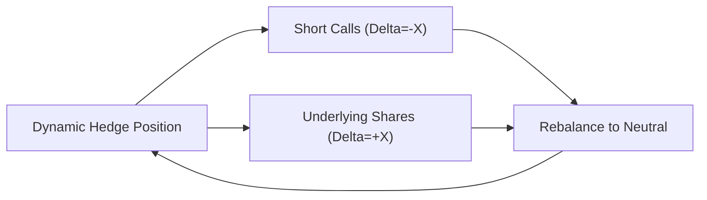

## Introduction

Have you ever watched someone expertly juggle while trying not to drop a single ball? Dynamic hedging with options sometimes feels just like that—it's a constant balancing act where you adjust (or "re-hedge") as the market moves, striving to minimize risk exposures and keep the portfolio in line with your intended payoff. It can be exhilarating. But, um, let's be honest, it can also be nerve-wracking if you’re new to the concept.

In this section, we’ll pull back the curtain on dynamic hedging techniques. We'll explore the fundamental mechanics, from simple delta-hedging all the way to gamma risk management. We’ll also look at the practical implications—like transaction costs, market liquidity, and rebalancing thresholds—to show how real-world portfolio managers juggle these exposures without dropping any major positions on the floor.

## The Essence of Dynamic Hedging

Dynamic hedging involves making continuous or periodic adjustments to a hedge position in response to changes in the underlying asset’s price, volatility, or other market variables. Whether you’re short a call option that’s losing money as the underlying surges, or you have a protective (long) put whose delta is increasingly sensitive, dynamic hedging helps keep your net exposure near zero—or near whatever designated risk level you want. 

In a nutshell, the key drivers of dynamic hedging are:  
• Changes in the underlying price, which alter option deltas and gammas.  
• Evolving volatility conditions, which can inflate or deflate option premiums.  
• Shifts in interest rates or dividends (though these usually matter more to longer-dated hedges).  

Yes, it's a balancing act, because while you try to hedge your exposure, your option’s delta and gamma keep changing, forcing you to decide how quickly and how often to rebalance the hedge. There's a bit of an art to it, no kidding.

## Delta Hedging Basics

Perhaps the single most popular dynamic hedging technique is delta hedging. Delta (Δ) measures the sensitivity of an option’s price to small changes in the underlying. For a call option, delta typically ranges from 0.0 to +1.0. For a put, it ranges from 0.0 to –1.0. If you’re long a call with Δ = +0.5, that means for every $1 increase in the underlying, the call’s price should rise by about $0.50 (ignoring higher-order greeks and changes in implied volatility).

When you delta-hedge:  
• You sell the underlying in proportion to the option’s delta if you’re long the option, or  
• You buy the underlying if you’re short the option,  
so that your overall net position produces minimal sensitivity to small price changes in the underlying.

### Example of a Simple Delta Hedge

Let’s say you’re short 10 call options, each with a delta of 0.4. The total delta of your short call position is −4.0 (10 × 0.4, with a minus sign because you’re short the calls). To offset this, you buy shares of the underlying asset to create a near-zero delta exposure. Specifically, you buy 400 shares (because 4.0×100 shares = 400 if each option contract corresponds to 100 shares). That way, if the underlying ticks up by $1, your short calls lose around $400, but your 400-share long position gains about $400, leaving you pretty neutral. 

Of course, if the stock blasts higher by $5, your short call deltas themselves might change drastically (hello gamma!). This is where dynamic hedging truly comes into play.

## Gamma and the Need for Rebalancing

Delta is not static. As the underlying price changes, an option’s delta also changes. That rate of change in delta is known as gamma (Γ). When gamma is significant, you may need to rebalance frequently—especially if market prices are choppy.

• High gamma means that even small underlying price moves will cause big shifts in delta.  
• Consequently, you might have to adjust your hedge (long or short underlying) often to keep your exposure neutral.  

This can be quite the headache. But it’s also the crux of dynamic hedging. When markets move fast, your “delta” can become “wrong” from one moment to the next. The good news is that adjusting your hedge can lock in incremental gains if you’re systematically short gamma—although you have to watch out for major adverse moves.

### Gamma-Scalping Concept

Gammas can provide an opportunity for “gamma scalping.” If you’re long an option (long gamma) and you recalibrate your delta hedge frequently, you can potentially profit from the market’s zigzags. Each time the underlying goes up, you sell more of it to rebalance. Each time it goes down, you buy some back. Over time, these small trades can add up to decent incremental returns if volatility is high enough.

But if you are short gamma—like someone who sold options—this constant rebalancing can get expensive. You have to buy high and sell low to keep hedged. That’s not exactly a formula for realized P&L bliss. Hence, short-gamma positions often rely on sophisticated risk management to avoid big losses or “gap” scenarios where you can’t adjust the hedge in time.

## Common Approaches to Dynamic Hedging

### Continuous vs. Discrete Rebalancing

In theory, you would check your hedge ratio continuously and rebalance instantly whenever a small change happens in the underlying. In practice, that’s not feasible—transaction costs would crush your returns, not to mention the slippage in a fast-moving market.

Thus, portfolio managers usually implement discrete rebalancing: they define intervals (time-based, such as daily or weekly) or thresholds (delta-based or volatility-based) for when they’ll adjust. The possibility of big overnight moves or price gaps, though, is still a reality. Continuous re-hedging is a nice concept in textbooks, but it’s physically impossible in real markets.

### Threshold Rebalancing

Some managers let their deltas “drift” until they breach a certain threshold. They might say, “We’ll rebalance if the option delta moves by ±0.05 from our reference point.” This approach helps reduce excessive trading while ensuring that major changes in exposure don’t go unchecked for too long.

### Portfolio Insurance Methods

Dynamic hedging is closely related to portfolio insurance strategies, which try to replicate a protective put by shifting capital between risk-free assets and the underlying. The notion is you’re effectively synthetically creating an options payoff by adjusting your allocation as the market moves. If the market drops, you move more capital into safe assets (like T-bills); if it rises, you move some back into the equity portion. This is reminiscent of the classic “CPPI” (constant proportion portfolio insurance) approach.

A key challenge with portfolio insurance is that sharp market drops can happen so suddenly that you can’t adjust in time. We saw this in previous market crises. In these cases, dynamic hedging assumptions can break down.

## Portfolio Insurance Through Dynamic Hedging

Portfolio insurance rose to fame (and infamy) in the 1980s, particularly around the 1987 market crash. The idea was that by holding a certain mix of stocks and risk-free bonds—and continuously adjusting that mix to mirror the payoff of a long put—one could maintain downside protection “on the cheap.” 

At least, that was the theory. When markets gapped sharply, it turned out many managers struggled to reposition quickly enough. Everyone trying to rebalance simultaneously can actually accelerate market declines, which is exactly what happened in ‘87.

Despite the cautionary tales, dynamic hedging for portfolio insurance remains a valid technique, especially for institutional managers who want to systematically limit downside risk. The trick is to set rules for re-hedging that reflect real-life liquidity conditions, and to maintain disciplined execution even in panicky markets.

## Practical Challenges and Best Practices

### Transaction Costs
Every time you adjust your hedge, you rack up commissions, fees, and potentially run into bid–ask spreads and slippage. If your strategy calls for frequent rebalancing, transaction costs can eat into your returns. Let’s be candid: it’s a drag, especially if you’re trying to lock in modest incremental profits. 

### Slippage and Execution Risk
Let me share a quick personal story: I once tried to delta-hedge a modest short straddle position in a pretty illiquid aftermarket session. The bid–ask spreads were wide enough to drive a truck through, and it cost me more than I expected. A small move in the underlying ironically led to a big “slippage” cost in trying to buy shares. Good times.

The moral? If you’re operating in illiquid markets or times of day with low volume, you need to factor slippage or delayed fills into your dynamic hedge plan.

### Gap Risk
Markets can gap on overnight news or major events like interest rate decisions. During these large price jumps, you can’t dynamically hedge in real time. By the time markets open, your delta exposure may have shifted dramatically, and your hedge position is behind the curve. That’s just part of the game.

### Trigger and Threshold Adjustments
To mitigate transaction costs, many managers wait until their delta has strayed a certain distance from neutral or until a set time (e.g., the end of each trading day). Another approach is volatility-based triggers—like updating the hedge only if implied or realized volatility changes by more than a certain threshold.

### Model Risk
When you rely on dynamic hedging, you also rely on certain assumptions (like continuous price movements, stable volatility, or normal distribution of returns). If reality diverges from your model—say volatility spikes or the underlying's returns get fat-tailed—your hedges might underperform. That’s model risk in a nutshell.

## Real-World Example: A Simple Delta-Hedging Scenario

Consider a manager who is short 100 equity call options with a delta of 0.3 each. The total delta is -30 (0.3 × 100). Each option contract covers 100 shares, so that short position is effectively short -3,000 deltas (i.e., -30 × 100 shares = -3,000). To delta-hedge, the manager buys 3,000 shares.

Now suppose the underlying price goes up $2 overnight. On the open, the call option’s delta rises to 0.45. The total delta is now -45 per contract, or -4,500 for the 100 contracts. The manager’s prior hedge (3,000 shares) is insufficient—she is still short 1,500 deltas (4,500 minus 3,000). So she buys another 1,500 shares to hedge.

• If the price keeps rising, she’ll have to buy more.  
• If it reverses direction, she may end up selling shares at a lower price than where she bought them.  

Hence, the dynamic part of the hedge. Depending on how vigorously the stock moves, her gamma risk could be quite large. That’s the essence of short gamma—each re-hedge can lock in a potential loss if the moves are big and persistent, especially in one direction.

In the diagram, you can see the interplay: the short calls have negative delta, and you offset that by going long the underlying. The manager stands ready to rebalance (“Rebalance to Neutral”) when gamma (and changes in delta) push the position away from neutrality.

## A Quick Look at Model Risk

Dynamic hedging typically relies on option pricing models (e.g., Black–Scholes–Merton) to figure out how deltas, gammas, and volatilities evolve. Whenever actual markets behave in ways the model didn’t anticipate—like volatility clustering or huge price gaps—your hedge might fail to perform as you expected.  

For exam purposes, it’s good to highlight that model risk is particularly acute for exotic options, path-dependent payoffs, or illiquid underlying assets. The more stable and liquid the underlying, the less likely you’ll suffer from extreme model mismatch. 

## Conclusion and Exam Tips

• Thoroughly understand the interplay between delta, gamma, and dynamic rebalancing. These concepts are fundamental to both short and long option positions.  
• Keep in mind the practical realities: transaction costs, liquidity constraints, and threshold triggers. Textbook continuous hedging is rarely feasible in real markets.  
• For the exam, practice scenario-based questions where you’re asked to adjust a delta hedge given new information about the underlying price, implied volatility, or time. Be prepared to comment on the pros, cons, and limitations (like gap risk) of these strategies.  
• Show awareness of how portfolio insurance strategies use dynamic hedging, and be ready to discuss historical challenges—especially large market moves that break the rebalancing assumptions.  
• Remember to incorporate the notion of model risk, where real markets might deviate sharply from theoretical assumptions.  

Finally, the main question you want to be able to answer on the exam: “Given a particular option position or portfolio, how and when should I adjust my hedge to meet the stated objective?” If you can articulate the steps—factoring in transaction costs, triggers, slippage, and potential extreme moves—you’ll be in great shape.

## References

• Leland, Hayne E., and M. Rubinstein. “The Evolution of Portfolio Insurance.” In “Portfolio Insurance: A Guide to Dynamic Hedging,” edited by D. Luskin.  
• CFA Institute. “Risk Management Applications of Options,” Level III Curriculum.  
• Additional recommended reading:  
  – Hull, John. Options, Futures, and Other Derivatives.  
  – Taleb, Nassim Nicholas. Dynamic Hedging: Managing Vanilla and Exotic Options.  

## Practice Questions: Dynamic Hedging Strategies



### A portfolio manager is short call options on a stock and wants to maintain a near-zero delta position. Which of the following actions will best achieve this goal as the stock price increases?

- [ ] Buying more calls.
- [ ] Selling futures on the stock.
- [x] Purchasing shares of the underlying stock.
- [ ] Buying put options on the stock.

> **Explanation:** A short call position has a negative delta. The easiest way to offset this negative delta is to purchase shares of the underlying (which has a positive delta of +1 per share).  

### Which of the following best describes threshold rebalancing in a dynamic hedging context?

- [ ] Continuously adjusting the hedge after every price move. 
- [ ] Only rebalancing at the end of each day.
- [x] Rebalancing only when the delta shifts beyond a specified band.
- [ ] Rebalancing solely based on option gamma levels.

> **Explanation:** Threshold rebalancing involves re-hedging when the hedge ratio—or delta—deviates past a certain tolerance level, removing the need to trade on every small market move.  

### Consider a manager who has a long call option on a stock with a delta of +0.4. How might the manager neutralize the entire delta exposure?

- [x] Shorting 0.4 shares of the stock per long call unit.
- [ ] Buying 0.4 shares of the stock per long call unit.
- [ ] Buying 0.4 shares of a put option on the stock.
- [ ] Purchasing a correlation swap on the underlying.

> **Explanation:** A long call with delta +0.4 can be hedged to zero net delta by shorting 0.4 shares of the underlying for each long call.  

### A trader is long 1,000 put options on a stock. Each put has a delta of –0.3. Which position will most likely compensate for the total negative delta?

- [ ] Short 300 shares of the stock.
- [ ] Buy 300 shares of the stock.
- [ ] Short 30,000 shares of the stock.
- [x] Buy 30,000 shares of the stock.

> **Explanation:** The total negative delta is (1,000 × –0.3) × 100 shares per contract = –30,000. Buying 30,000 shares offsets this –30,000 delta, bringing the net to zero.  

### What is the most significant risk of a dynamic hedging strategy that relies on the assumption of continuous market trading?

- [ ] High transaction costs.
- [ ] Complexity of options modeling.
- [ ] Regulatory constraints on frequent trading.
- [x] Market gaps preventing timely rebalancing.

> **Explanation:** While transaction costs and modeling complexities are indeed issues, the biggest single threat is a sudden market gap or fast move that occurs outside of the manager’s ability to continuously hedge.  

### In a relatively stable market with low volatility and moderate transaction costs, frequent rebalancing might:

- [x] Reduce overall hedge slippage by keeping the portfolio’s delta near zero.
- [ ] Increase gamma risk drastically.
- [ ] Stop the portfolio from ever profiting in an upwards market.
- [ ] Eliminate all risk entirely.

> **Explanation:** In a stable, low-volatility market, frequent rebalancing helps keep the portfolio’s net delta near the target. It does not eliminate all risk but helps mitigate large swings in P&L from delta exposures.  

### A portfolio manager uses dynamic hedging for "portfolio insurance." Which statement best describes such a strategy?

- [x] Replicating a put payoff by adjusting the allocation between a risky asset and a risk-free asset.
- [ ] Shorting an out-of-the-money call and investing the proceeds in T-bills.
- [x] Buying protective puts on market dips and selling them on market rallies.
- [ ] Holding a constant proportion of equities, regardless of price moves.

> **Explanation:** Classic portfolio insurance uses dynamic rebalancing to mimic a protective put, shifting between risky (e.g., equities) and risk-free assets (e.g., T-bills).  

### Which of the following is a common pitfall of discrete rebalancing compared to continuous rebalancing?

- [ ] Discrete rebalancing significantly increases transaction costs.
- [x] Discrete rebalancing risks larger deviations from the target delta due to infrequent adjustments.
- [ ] Discrete rebalancing requires advanced algorithms and high-speed execution platforms.
- [ ] Discrete rebalancing is not an accepted practice in standard portfolio strategies.

> **Explanation:** Because discrete rebalancing is less frequent, the actual delta exposure can drift more substantially from target levels between rebalancing intervals.  

### An investor writing covered calls is effectively:

- [x] Long the underlying stock with a short call position.
- [ ] Short the underlying stock with a short put position.
- [ ] Long a straddle.
- [ ] Engaging in a bull call spread.

> **Explanation:** Writing covered calls involves owning the underlying asset (long) and writing call options (short) on the same asset.  

### Dynamic hedging may fail if the underlying asset moves significantly overnight. True or False?

- [x] True
- [ ] False

> **Explanation:** Dynamic hedging strategies typically assume the ability to adjust continuously or at least during trading hours. A large overnight gap can render your positions unhedged until the market reopens.  


