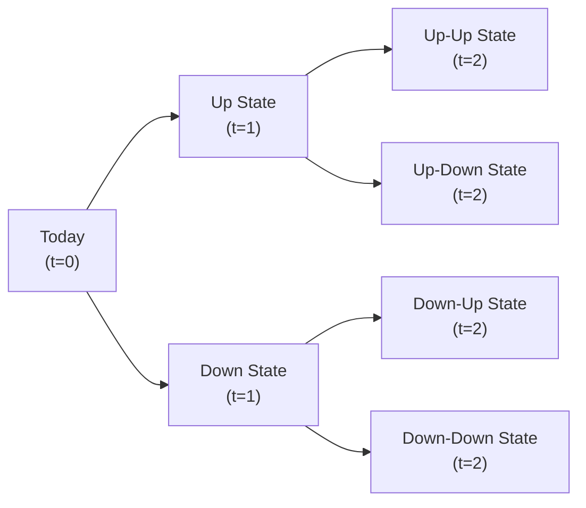

## Understanding the Nature of American vs. European Options

Let’s start by laying a strong foundation. An American option, unlike its European cousin, can be exercised anytime up to and including its expiration date. Um, let me just say, the flexibility here can be both exciting and a bit worrying. I remember years ago, chatting with a friend who had just started trading and stayed awake each night wondering if they should exercise right now or wait. This sense of possibility is part of the allure of American options, but it also introduces complexity for both the option buyer and seller.

European options only allow exercise at maturity—nice and tidy, but less flexible. So, with American-style options, there’s always that nagging question: should you exercise early or not? Let’s unravel this in more detail.

## Why Early Exercise Might (or Might Not) Make Sense

Early exercise is all about determining whether the immediate gains from exercising the option exceed any additional time value or extrinsic value you could gain by holding the option longer. Time value basically reflects the possibility that the underlying’s price could move even more in your favor before expiration. Whenever we have an American option with substantial time value left, an early exercise generally isn’t beneficial—why throw away that extra potential profit?

But hey, there are exceptions. And these exceptions can be driven by dividends (for calls) or interest rates and cost of funds (for puts). Whether you’re dealing with a call or a put, you have to weigh up the “opportunity cost” of holding the option versus locking in immediate profits or capturing other benefits.

## Calls on Non-Dividend-Paying Stocks: Typically Suboptimal to Exercise Early

If an underlying stock isn’t paying dividends, there’s usually little reason to exercise a call option early. Let’s keep it simple:

• When you exercise a call, you pay the strike price now and buy the stock outright.  
• Holding the stock might not yield any special benefit (like a dividend) if the company doesn’t pay dividends.  
• Meanwhile, you forfeit the remaining time value of the call, which can be valuable if the underlying’s price continues to rise or if volatility remains high.

In other words, for calls on a non-dividend-paying stock, the time value is typically more beneficial than any advantage you’d get from early exercise. So, if you’re itching to exercise early on a non-dividend-paying stock, maybe slow down or think again—time value is often a big deal.

## Calls on Dividend-Paying Stocks: Evaluating Dividend Capture

Now, this is where things get interesting. If the underlying stock pays a dividend before expiration, you want to ask yourself: “Is grabbing that dividend worth losing the remaining time value?” Because early exercise—on the day right before the ex-dividend date—could mean you become a shareholder in time to collect that dividend.

The key factors that might make early exercise appealing for a call on a dividend-paying stock are:

• The size of the upcoming dividend.  
• The call’s intrinsic value (i.e., how far in the money it is).  
• The option’s remaining time value.

If the dividend is sizable and the call is deeply in the money, the dividend you’d gain by owning the stock might outweigh any lost time value. On the other hand, if the dividend is small or the option still has plenty of time value, you might be better off holding onto your option instead of exercising it. 

I recall a colleague who once exercised the call option a day before ex-dividend only to find that the next day, the stock soared even more. Sure, they got the dividend, but they forfeited more potential profit than the dividend was worth. These stories remind us that it’s always a balancing act—dividend vs. time value.

## Early Exercise for Puts: Opportunity Cost of Capital

Deeply in-the-money puts can become candidates for early exercise, particularly if you could otherwise use the strike price proceeds for alternative investments or risk-free interest. Here’s how it boils down for an American-style put:

• Exercising early means immediately selling (or “putting”) the underlying at the strike price and receiving cash today.  
• If interest rates are high or you have a more profitable use for that cash, it might be beneficial to exercise early rather than wait.  
• However, you’ll be throwing away any residual time value.  

For instance, if you hold a long put on a stock that has plummeted and is trading well below the strike price, you might prefer exercising the option, receiving the strike price in cash, and then redeploying that cash in some other venture. This can be especially appealing if the put is close to expiration, has limited time value left, or interest rates are relatively high.

That said, if there’s still considerable time to maturity and the stock could fall even further, you might want to hold onto that put. It’s all about that time value once again.

## The Early Exercise Premium

The concept of an early exercise premium basically captures how much additional value an American option might have, over and above a European option, given the potential for early exercise. This premium might be small, large, or even negligible, depending on:

• The underlying’s volatility  
• Time to expiration  
• Dividends (for calls)  
• Opportunity cost of capital (for puts)  
• Intrinsic vs. extrinsic value

When the intrinsic value is high and extrinsic value is low, American options can start to attract an early exercise premium. For example, if you have a deeply in-the-money call right before ex-dividend, the probability of capturing that dividend might inflate the option’s premium slightly compared to a European call.

## Risks for the Option Seller: Assignment Without Warning

From the option seller’s perspective (often known as the “writer”), the big worry is assignment risk. With American options, the seller can be assigned at any time. And trust me, that can catch you off guard. If you’ve sold a call option on a dividend-paying stock that’s gone deep in the money, you might be assigned right before the ex-dividend date, forcing you to deliver the shares. This can trigger all sorts of portfolio rebalancing headaches.

• Call writers on dividend-paying stocks face risk of early assignment just before ex-dividend.  
• Put writers might get assigned if the stock collapses below the strike price and it’s optimal for the holder to exercise early.  
• This assignment can force you to mark-to-market your entire position, potentially generating a loss you didn’t anticipate.  

To manage this risk, many option sellers keep a close eye on impending ex-dividend dates or big market events that might motivate early exercise.

## Valuing American Options Using the Binomial Model

One of the most common ways to incorporate early exercise possibilities in pricing is the Binomial Model. The basic premise is: we break up the life of the option into discrete time steps. Each step has an “up” or “down” movement in the underlying stock price. At each step, you check whether immediate exercise yields a better payoff than waiting until a future step.

Below is a simplified binomial tree depiction for a two-step period, just to visualize the branching. (Note that in practice, we might use many steps to achieve more accuracy.)

At each node, we can compare:

• The value of exercising at that node (i.e., intrinsic value).  
• The value of continuing—i.e., the time value plus any possibility of future gains.

If exercising produces a superior outcome, the model indicates that early exercise might be the rational choice. This approach, while somewhat more involved computationally than, say, a closed-form (Black–Scholes) for European options, helps you factor in the real possibility that early exercise could be optimal at different points in time.

## Portfolio Management Considerations

Let’s imagine you’re a portfolio manager who has sold covered calls against your equity holdings (see Section 1.2 for details on Covered Calls, if you’d like a refresh). If the calls are American style and the stock is dividend-paying, you might face early assignment risk right before each dividend ex-date. To avoid losing your shares at an inopportune time, or to evaluate whether you’re comfortable with potential assignment, you’ll need to:

• Monitor your stock’s ex-dividend dates.  
• Track the option’s time value vs. the dividend payout.  
• Maintain enough cash or alternative coverage in case assignment occurs.

You might also hold American puts for hedging (like a protective put strategy in Section 1.3). For instance, if the stock price plummets, an early-exercise scenario could provide you immediate liquidity. But deciding exactly when to pull the trigger requires careful analysis of the time value you might be giving up by exercising too soon.

### Dividend Ex-Dates and Exercise Evaluation

A practical tip: many portfolio managers set up a schedule or an algorithmic routine that flags their American call options when an ex-dividend date is approaching. They check if the option’s time value is less than the dividend that would be captured. If the dividend is larger, early exercise on the call side becomes likely—meaning the manager can plan or manage that scenario. 

Same for put holders who might need the cash: if the stock is tanking, the manager might weigh whether the immediate strike price inflow is more beneficial than holding onto a put that might still collect more time value.

## Real-World Scenarios and Anecdotes

I once knew a trader who specialized in picking up calls on dividend stocks a few days before the ex-dividend date. Their entire strategy revolved around anticipating that other market participants might exercise early, while ivy-league quant pros tried to guess if the dividend was big enough. Some of these calls had miniscule time value but decent intrinsic value. If no one bothered to exercise early, the trader sometimes picked up a quick win by capturing the dividend. But if the crowd was on top of it, those calls were often exercised by the rightful owners, and the trade fizzled.

These stories highlight that it’s not always black and white. Market dynamics, differences in cost of capital, forecasts of volatility, and overall portfolio strategy each play a part in the early exercise decision.

## Best Practices and Pitfalls

• Keep an Eye on Time Value: A big pitfall is ignoring how much time value remains. Early exercise might appear tempting, but giving up significant time value is often unwarranted.  
• Factor in Interest Rates and Opportunity Costs for Puts: If interest rates are low, the benefit from getting the strike price immediately might be negligible. Conversely, if interest rates are high, that’s a stronger incentive to exercise early.  
• Beware Assignment Risk: If you’re the writer of an American option, you can be assigned any time. Keep margin requirements and portfolio liquidity in mind.  
• Use a Binomial Pricing Tool: Particularly if you’re dealing with large or complex positions. Manual or simplified approximations might miss the subtle situations where early exercise is beneficial.

## Exam Tips and Strategy

On the CFA Level III exam, you might see a vignette describing a scenario with an American option on a dividend-paying stock. They could ask you to evaluate whether early exercise is justified. Or they might test your understanding of how a put’s early exercise could be optimal in a high-interest-rate environment. Keep these points in mind:

• Graphically or logically compare the immediate gain from exercising (intrinsic value) vs. the economic benefit of waiting (time value).  
• Watch for dividends, interest rates, or unique payoffs that might influence the decision.  
• Remember that the exam may also ask about the seller’s perspective—especially around unexpected assignment risk.

## References

- Cox, J.C., S.A. Ross, and M. Rubinstein. “Option Pricing: A Simplified Approach.” Journal of Financial Economics.  
- Natenberg, Sheldon. “Option Volatility & Pricing.” 2nd ed., McGraw-Hill.  

---

## Test Your Knowledge: Early Exercise Considerations for American Options



### A deeply in-the-money American call on a non-dividend-paying stock is generally not exercised early because:

- [x] The call retains valuable time value.
- [ ] The call’s intrinsic value is zero.
- [ ] Early exercise results in no additional cost.
- [ ] Regulatory restrictions forbid early exercise.

> **Explanation:** For non-dividend-paying stocks, exercising a call early forfeits remaining time value without any compensating benefit, so waiting is usually optimal.

### A primary reason to exercise an American call option prior to expiration is to:

- [ ] Reduce the underlying’s price volatility.
- [x] Capture a dividend that exceeds the option’s remaining time value.
- [ ] Increase the call’s extrinsic value.
- [ ] Lower the strike price of the call.

> **Explanation:** For a dividend-paying stock, if the dividend amount surpasses the lost time value, early exercise could be beneficial.   

### The opportunity cost of capital is most relevant for deciding early exercise of:

- [ ] American calls on dividend-paying stocks.
- [ ] American calls on non-dividend-paying stocks.
- [x] American puts when interest rates are high.
- [ ] American puts on stocks with no volatility.

> **Explanation:** High interest rates increase the benefit of receiving cash flows sooner, making early exercise of in-the-money puts potentially optimal.

### An American put option holder decides to exercise early when:

- [ ] The stock is trading above its strike price.
- [x] The present value of the strike price exceeds the put’s time value plus the value of waiting.
- [ ] The dividend yield of the underlying is zero.
- [ ] The option has no intrinsic value.

> **Explanation:** The key trade-off is the interest or opportunity gain from receiving the strike price now versus the option’s remaining time value.

### Assignment risk for the writer of a covered call is highest just before which event?

- [ ] Company earnings announcements.
- [ ] The contract enters the last week before expiration.
- [x] The stock’s ex-dividend date.
- [ ] The Federal Reserve meeting.

> **Explanation:** Holders often exercise calls early just before an ex-dividend date to capture the dividend.

### The “early exercise premium” refers to:

- [x] The extra value American options may command due to the possibility of exercising before expiration.
- [ ] The interest you earn on the strike price if you exercise early.
- [ ] The difference between time value and intrinsic value.
- [ ] The additional fee brokers charge for early exercises.

> **Explanation:** American options can be priced higher than European options because of early exercise flexibility.

### In a binomial option pricing model, at each node, we typically evaluate:

- [ ] Only the time value of the option.
- [ ] The difference between strike and spot prices as a fixed ratio.
- [x] The immediate exercise value versus the present value of continuing to hold the option.
- [ ] Dividends as if they do not affect the underlying price.

> **Explanation:** The binomial model compares immediate exercise payoff (intrinsic value) to the discounted expected value if holding the option further.

### For a portfolio manager with a long put:

- [x] Early exercise may be attractive if the put is deeply in the money and interest rates are high.  
- [ ] Early exercise is irrelevant because puts have no time value.  
- [ ] Early exercise is always inferior to selling the put in the market.  
- [ ] Early exercise yields no immediate liquidity benefits.

> **Explanation:** Receiving the strike price sooner can be advantageous if interest rates or opportunity costs are high, especially when the put is deeply in the money.

### A potential pitfall of early exercise for a call holder is:

- [x] Losing any remaining time value that could exceed the dividend.
- [ ] Realizing too large a profit.
- [ ] Reducing volatility risk.
- [ ] Increasing payoff during market downturns.

> **Explanation:** Often, the time value given up exceeds whatever benefits come from early exercise, so this can be a significant pitfall.

### True or False: In many scenarios, an American call option on a non-dividend-paying stock is safely assumed to have the same value as a European call because early exercise is unlikely.

- [x] True
- [ ] False

> **Explanation:** Without dividends, there’s typically no incentive to exercise early. Hence, the American call often behaves similarly to a European call in pricing and exercise strategy.


