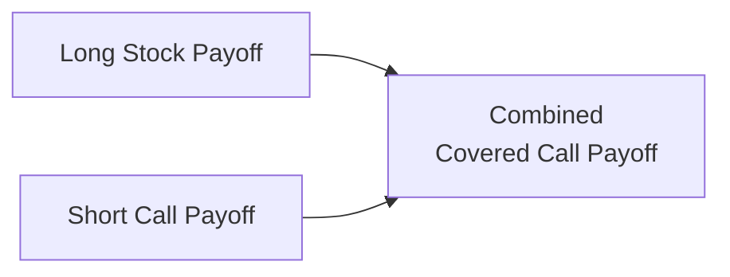

## Overview

If you’ve ever held a stock position and thought, “Well, it’s not going anywhere too fast, so why not earn some extra income on it?”—then the covered call strategy might be for you. A covered call means owning the underlying asset (often an equity) and simultaneously writing (that is, selling) a call option on that asset. The side benefit? You get to keep the premium received from selling the call. The trade-off? You cap the stock’s upside beyond the strike price of the option.

This article dives into the core mechanics, objectives, potential risks, and valuation approaches for covered calls. Our goal is to ensure you fully grasp how to use covered calls effectively in your portfolio management strategy, how to measure the trade-offs between income and forgone upside, and how to evaluate the risk-return profile.

## Understanding the Covered Call Strategy

A covered call strategy, at its foundation, combines:
• A long position in an underlying asset (often an equity).  
• A short position in a call option with a specific strike price and expiration date.  

Because the position is “covered” by your ownership of the underlying, you can deliver the shares if the call you sold is exercised (or “assigned”) at or before expiration. This differs from a “naked call,” where you sell a call option without owning the underlying. Naked calls can be extremely risky in a rising market because you’d have to buy the underlying at a higher market price to deliver, but for covered calls, you already hold the underlying. 

I remember when I first tried a covered call on a technology stock—Alexa says it increased my long position’s effective yield by a few percentage points (yay for that!). Of course, I gave up some upside, but I was okay with that trade-off at the time because I didn’t expect the stock to shoot beyond the strike.

## Primary Investment Objectives

A covered call strategy typically meets distinct investor goals:

• Income Enhancement: By writing (selling) a call option, you collect option premium income immediately. Think of this as a way to “rent out” your stock position.  

• Mild Downside Protection: Although the underlying stock can still decline significantly, the option premium can cushion your losses a bit.  

• Neutral-to-Moderately Bullish Outlook: Investors who use covered calls often believe the underlying stock has limited upside potential in the near term. They are content to earn extra yield if the stock price stays below or right around the strike price.  

• Potential to Increase Risk-Adjusted Returns: The premium you receive can improve overall return, especially in a flat or slightly rising market.

### Trade-Off: Forgoing Some Upside

One big caveat is, well, if your stock doubles suddenly, you’re “stuck” selling it at the call’s strike price. This can be frustrating if you wrote the call expecting the stock to remain stable, but then it soared. But hey, you got premium up front, so there’s always that silver lining.

## Payoff Structure

The covered call’s net payoff at expiration can be generalized as follows:

1. If the stock ends up below the strike price K:  
   – You keep the stock.  
   – The short call expires worthless.  
   – You keep the option premium.  
   – Your effective gain or loss on the stock position is (Sᵀ − S₀), but partially offset (or enhanced) by the premium.  

2. If the stock ends up above the strike price K:  
   – The call is likely to be exercised (assigned).  
   – You deliver (sell) your stock at the strike price K.  
   – You keep the option premium but no longer benefit from price appreciation above K.  

This can be summarized using a piecewise function for total payoff at option expiration, ignoring dividends and transaction costs:

$$
\text{Covered Call Payoff} = 
\begin{cases}
S_T - S_0 + \text{Premium}, & \text{if } S_T \le K, \\
(K - S_0) + \text{Premium}, & \text{if } S_T > K
\end{cases}
$$

Where:  
• \\( S_0 \\) is the initial stock price at strategy inception.  
• \\( S_T \\) is the stock price at option expiration.  
• \\( K \\) is the strike price for the call option.  
• “Premium” refers to the net option premium received.

### Visualizing the Payoff

Visually, the covered call payoff looks like the curve for a long stock position that flattens out (plateaus) once the underlying price moves above the call’s strike price. Here’s a simple Mermaid diagram to illustrate the combined payoff at expiration:

Where:
• The long stock payoff increases linearly with stock price.  
• The short call payoff reduces gains once the stock price surpasses the strike, effectively creating a “ceiling.”

## Risks and Opportunity Costs

Despite its partial downside cushion from the premium, a covered call still carries substantial equity risk. If the underlying stock plummets to zero (ouch), your losses can be severe. Yes, you have the call premium to offset a small portion, but that might be a drop in the bucket compared to a major decline. 

### Key Risks

• Equity Market Risk: The position remains vulnerable to a fall in stock price.  
• Opportunity Cost: Should the underlying price rally far beyond the strike, you miss out on those extra gains.  
• Expected vs. Realized Volatility: If implied volatility was low when you sold the call, but the market grows more volatile, the call price can spike, affecting your mark-to-market P&L if you wanted to close the position early.

I learned that the hard way once when the volatility soared right after I wrote a call—my option premium looked relatively small in hindsight. But that’s part of the game.

### Managing Early Exercise (American-Style Options)

For American-style options, there’s the possibility the call buyer will exercise early, especially around ex-dividend dates if the dividend is high enough to offset the time value remaining in the option. You’d need to deliver the shares sooner than maturity. This usually results in a modest inconvenience if the stock is assigned earlier than expected.

## Valuation of a Covered Call Position

Valuing a covered call includes:
• The value of the underlying asset (i.e., the current stock price).  
• Minus the value of the short call (which is the premium the investor receives at trade inception).  

At inception, the net cost (or net investment) for a covered call is:

$$
\text{Net Cost} = S_0 - \text{Premium Received}.
$$

And the marked-to-market value at any point in time is:

$$
\text{Value of Covered Call} = \text{Value of Long Stock} - \text{Current Value of Short Call}.
$$

### Factors Influencing Option Premium

1. Time to Expiration: Longer-dated options typically carry higher premiums.  
2. Implied Volatility: A higher implied volatility means options are more expensive (higher premium).  
3. Underlying Price Relative to Strike: At-the-money calls generally have the highest time value; in-the-money or out-of-the-money calls might have less time value.  
4. Interest Rates and Dividends: Higher dividends can reduce call prices because the underlying’s expected ex-dividend price often declines.

## Selecting the Strike Price

Choosing which strike price to sell is a balancing act between premium income and upside potential:

• Lower Strike (In-the-Money or Near-the-Money): Receives a higher premium, but you cap your upside earlier.  
• Higher Strike (Out-of-the-Money): Receives a smaller premium, but allows for more potential stock price appreciation before being assigned.  

Traders often choose a slightly out-of-the-money strike if they’re neutral to mildly bullish but want a certain premium. If you’re very confident in minimal upside potential, you might select an in-the-money strike to grab that bigger premium, albeit with a greater chance of early exercise.

## Market Outlook and Covered Calls

Covered calls work well if you believe your stock will have limited upside in the near term but you don’t expect a catastrophic downside. Essentially, you’re trading away some upside in return for immediate premium. If you’re extremely bullish, this strategy might frustrate you if the stock blasts off. If you're bearish, a covered call might not protect you that much (a protective put is more relevant there, see the next section “Protective Puts: Investment Objectives, Payoff Structures, Risks, and Valuation”).

## Practical Example

Let’s imagine you own 100 shares of XYZ Corp. at \$105 per share. You write one call option (covering 100 shares) with a strike price of \$110 and receive a \$3 premium. Expiration is two months away.

1. If, at expiration, XYZ trades at \$108:  
   – The call expires worthless (since \$108 < \$110).  
   – You keep the \$3 in premium.  
   – You book an unrealized gain on the stock (from \$105 to \$108 = \$3 per share), plus the \$3 from the option premium, bringing your total profit to \$6 per share on a \$105 initial investment.  

2. If, at expiration, XYZ trades at \$115:  
   – The call is likely exercised, so you must sell the shares at \$110.  
   – You keep the \$3 premium, so effectively you sold your shares at \$113 (\$110 strike + \$3 premium).  
   – You might feel bummed that you missed out on the final \$2 of upside (the difference between \$115 and \$113). But you achieved a decent profit overall.  

3. If, at expiration, XYZ has fallen to \$95:  
   – The option expires worthless.  
   – You keep the \$3 premium.  
   – But your stock dropped from \$105 to \$95, so you have a \$10 per share loss.  
   – The real net loss is \$7 per share if we consider the \$3 premium offset.  

## Implementation Best Practices and Pitfalls

• Always define a clear objective: Are you seeking incremental yield, partial hedge, or simply lowering cost basis?  
• Monitor changes in implied volatility: A major shift in volatility can make it advantageous to close or roll your position.  
• Watch for ex-dividend dates (American options can be assigned earlier).  
• Set exit points: Some folks like to exit the short option if it significantly declines in value, locking in profits on the option itself.  
• Avoid overusing covered calls in strongly bullish markets unless you’re truly content missing out on potential large price surges.  

## Exam-Level Connections and Key Takeaways

On the CFA Level III exam, covered calls can appear in portfolio management questions where you might be asked to improve the risk-return profile of an equity portfolio or to manage specific exposures. You might see a scenario-based question where an investor wants moderate upside potential, or they prefer stable income, or they’re comfortable capping gains.

To nail these questions, remember:

• The link between your market outlook and whether a covered call is the right tool.  
• The formula for net payoff, including the strike, premium, and underlying price.  
• How implied volatility influences option pricing.  
• The trade-off between generating premium income and forsaking additional upside returns.

## References

• McMillan, Lawrence G. “Options as a Strategic Investment.” 5th ed., Penguin.  
• Natenberg, Sheldon. “Option Volatility & Pricing: Advanced Trading Strategies and Techniques.” 2nd ed., McGraw-Hill.  

For a deeper dive, you may also want to review the next section in this volume, “Protective Puts: Investment Objectives, Payoff Structures, Risks, and Valuation,” and compare it with covered calls to see how the two can be combined or contrasted in a collar strategy.

## Final Exam Tips

• Practice with scenarios: If the underlying stock is at various price points at expiration, how does your total payoff change?  
• Check your “opportunity cost risk tolerance”: If the stock soared, would you be okay capping your gain?  
• Know your break-even points: That’s initial stock cost minus premium, for downside break-even. For upside, it’s essentially the strike plus the premium you collected.  
• Always consider the scope of your portfolio’s risk. Covered calls can reduce risk a notch but won’t save you from a major market meltdown.

Anyway, I hope this clarifies covered calls enough to help you implement them confidently or at least ace the CFA exam questions that come your way.

---

## Earn Extra Premium with Covered Calls: 10 Fundamental Quiz Questions



### Which of the following best describes a covered call strategy?

- [x] Owning the underlying equity and selling a call on the same underlying
- [ ] Selling both a call and a put on the same underlying
- [ ] Owning a put option while shorting the underlying
- [ ] Owning the underlying equity and buying a call option

> **Explanation:** A covered call strategy is formed by owning the underlying asset and writing (selling) a call against it.

### What is the primary motivation to write a covered call?

- [ ] To maximize gains in a strong bull market
- [x] To earn premium income while modestly reducing downside risk
- [ ] To hedge completely against market crashes
- [ ] To maintain unlimited upside potential

> **Explanation:** Covered calls are generally written to earn option premium income and provide a small offset to downside risk, though upside is capped.

### In a covered call, which outcome is the main risk?

- [ ] The underlying asset being called away at a price higher than the strike
- [x] Suffering a significant loss if the underlying price plummets
- [ ] Having to pay large dividends to the buyer of the call
- [ ] Unlimited upside risk if the stock price surges

> **Explanation:** The investor still holds the stock, so if the stock collapses, the premium provides only a small cushion. The significant downside risk remains.

### Which of the following best represents the payoff at expiration for a covered call when the underlying ends above the strike price?

- [x] (Strike Price − Initial Stock Price) + Premium
- [ ] (Underlying Price − Initial Stock Price) + Premium
- [ ] (Strike Price × Premium)
- [ ] (Underlying Price × Premium)

> **Explanation:** If the stock finishes above the strike, the investor sells at the strike. The total payoff is (K − S₀) + premium.

### Why might an investor choose a lower strike price when selling a covered call?

- [ ] To increase upside potential
- [ ] To align with a bearish market outlook
- [x] To receive a higher call premium
- [ ] To reduce the chance of assignment

> **Explanation:** A lower strike call is typically more in-the-money, commanding a higher premium. However, if the market rises, you cap gains sooner.

### If the underlying stock price is expected to be highly volatile, how does that impact the call premium for a covered call?

- [x] The call premium will generally be higher due to increased implied volatility.
- [ ] The call premium will be lower because of time decay.
- [ ] Implied volatility has no impact on call premiums.
- [ ] Risk-free rates primarily determine call premiums, not volatility.

> **Explanation:** Higher implied volatility generally inflates option prices, leading to a larger premium received.

### What is the net cost to initiate a covered call strategy?

- [x] (Stock Purchase Price − Option Premium Received)
- [ ] (Option Premium + Strike Price)
- [ ] (Option Premium − Strike Price)
- [ ] (Stock Purchase Price + Option Premium)

> **Explanation:** The investor pays for the stock, then receives a premium credit for selling the call, so the net is S₀ − Premium.

### A covered call is most suitable for which of the following market outlooks?

- [ ] Highly bearish
- [ ] Highly bullish
- [x] Neutral to moderately bullish
- [ ] Highly volatile with no directional bias

> **Explanation:** A covered call is most beneficial when the investor expects limited upside. In strong bull markets, the call caps gains.

### Which of the following might prompt early assignment of an American-style covered call?

- [ ] Rising interest rates
- [ ] Downward revisions to earnings
- [ ] Expected increase in implied volatility
- [x] An upcoming ex-dividend date making early exercise profitable

> **Explanation:** Call buyers may exercise early if the dividend to be received outstrips the time value remaining in the option.

### A potential disadvantage of a covered call is:

- [x] The investor loses out on gains above the strike price.
- [ ] The premium received is not guaranteed.
- [ ] There is reduced liquidity in covered call options.
- [ ] The investor holds no ownership in the underlying asset.

> **Explanation:** The main drawback is capping the upside beyond the strike price; you still own the shares but are obligated to sell them at the strike if assigned.




