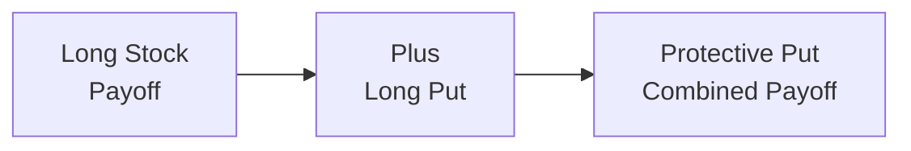

## Introduction

Imagine you're holding a few blue-chip stocks, which you happen to love because they’ve performed so well over the years. But, ah, you also remember the times when markets took a sharp dive—and you kind of wish you’d been more prepared. That’s exactly where a protective put strategy enters the scene. In the simplest sense, a protective put involves buying the underlying asset (like a stock) and pairing it with a long put option on that very same stock. This structure can help you weather significant losses if an unexpected market downturn occurs. 

This article delves deeply into how protective puts work, their payoff structures, the various risks to be mindful of, and yes, how you could go about valuing them in a practical, real-world sense. While it might sometimes feel like “buying insurance that you hope you’ll never use,” a protective put can be a valuable staple in the investor’s toolbox—particularly for those with a bullish or neutral outlook but who still want to sleep well at night. 

## Protective Put Setup

A protective put position can be visualized as owning an asset—say, an equity—and then purchasing a put option on that same equity. Doing so ensures that if the market price of that equity falls below the put’s strike price (K), the put option increases in value, offsetting your losses on the underlying. In a way, it’s like wearing a seatbelt: You drive forward expecting not to crash, but you’re prepared if the unexpected happens.

Let’s break down the core components:

• Long Underlying Asset (e.g., 100 shares of a common stock)  
• Long Put Option (purchased put with a strike K and a certain maturity)

Just like an insurance policy, buying this put option costs a premium. Sometimes, it’s not cheap—especially if the market’s in a period of high volatility. But for many investors, the peace of mind can be worth every penny.

## Investment Objectives

Investors who adopt a protective put generally have a bullish or neutral outlook on the underlying. They might think: “I see upside potential here, but I’m not willing to risk a catastrophic downside event.” The main objectives are:

• Capital Preservation: If the stock price plunges, the put’s profit offsets most losses beyond the strike price.  
• Upside Participation: Unlike a covered call (see Section 1.2) that caps upside gains, a protective put leaves the top side open—your stock can rise without a short call diminishing that potential.  
• Reducing Emotional Stress: Over the years, I've personally seen how a protective put can reduce the emotional roller-coaster effect. In times of market volatility, having that guaranteed floor keeps folks from making panic-driven decisions.

For these reasons, protective puts are quite popular with longer-term equity holders, especially when market conditions are uncertain. It’s a reliable way to buffer a portfolio.

## Payoff Structure: Long Asset + Long Put

You can think of the payoff of a protective put strategy as a combination of two building blocks:  
1. The payoff of owning the underlying asset.  
2. The payoff of a long put option.  

Let’s look at the total payoff at expiration, ignoring the time value or extrinsic value for a moment (this is just the at-expiration payoff, not the daily mark-to-market). 

The underlying stock payoff at maturity is simply S(T), its value when the option expires.  
The long put payoff at maturity is max(K – S(T), 0).  

Hence, the combined payoff at expiration is:
  
PayoffProtectivePut = S(T) + max(K – S(T), 0) – (Premium Paid)

Notice we subtract the put premium to get the net. If the stock’s price ends up way above the strike price, you gain from the underlying but will have “lost” the put premium since the put expires worthless. If the stock’s price drops below the strike, the put’s intrinsic value kicks in to offset those losses. 

Below is a simple payoff diagram that can help visualize how this works:

At the strike price K, the protective put’s payoff line flattens out, effectively creating a downside floor. Above K, your capital gains are unbounded (less the premium).

## Maximum Loss, Break-Even, and Potential Gains

It might help to quantify the protective put’s outcomes more precisely:

• Maximum Loss:  
  The worst-case scenario is when, at expiration, the underlying price plummets to zero. In that case, your put option finishes deep in the money, but your overall loss is still the net of the purchase price of the stock, minus the strike price you recover from the put, minus the premium you paid for that put. Symbolically:  

  MaxLoss = (Purchase Price of Underlying – Strike) + Put Premium  

  If the underlying was bought at S₀ and the strike is K, then you effectively lose (S₀ – K) + Premium if S(T) = 0.  
   
• Break-Even Point:  
  At expiration, you break even when:  

  S(T) – (S₀ + Premium) + max(K – S(T), 0) = 0  

  That might look a bit messy, but typically, you can think of your initial outlay (S₀ + Premium) as a reference. If the underlying’s price moves up just enough to compensate for that premium, you’ll break even.  
   
• Potential Gains:  
  Gains are theoretically unbounded as the underlying’s price can keep rising. You do pay the put premium, so that expense slightly reduces your net gains compared to holding the stock alone.

This combination offers peace of mind (downside cushion) and preserves upside potential. That’s why it’s sometimes referred to as a “pay-later” strategy: you pay the premium upfront for insurance, in the hope, ironically, that it expires worthless (because it means your stock performed well).

## Risks and Costs

Of course, it’s not exactly a free lunch. The main risk is the potential mismatch in cost and reward:

• Premium Costs. If the market goes sideways or up only slightly, you might “underperform” a simple holding of the stock because you’ve shelled out money for the put premium. Some folks get frustrated, feeling that they paid for something that ended up worthless. But, it’s worth remembering the role of insurance: you don’t buy a home insurance policy hoping you get to use it, right?

• Opportunity Cost at Times of Low Volatility. During low-volatility environments, put premiums might be cheaper, which is good in theory. But it can also be a time when you might not see a high urgent need for puts—at least until volatility spikes again.

• Early Exercise Features (American Puts). If you’re dealing with an American-style put, you have to monitor the possibility of early exercise. Usually, this matters when the underlying pays dividends or when interest-rate differentials make early exercise beneficial. More details on early exercise can be found in Section 1.14 of this volume.

• Skew and Smile Impact. In volatile markets, implied volatility for out-of-the-money puts can skyrocket, making them increasingly expensive. This “volatility skew” phenomenon means investors who want deep out-of-the-money put protection might pay a hefty premium. If you want to brush up on volatility skew, see Section 1.8.

All these points highlight that while a protective put can be a solid risk management tool, it’s not always cost-effective. And you’ve got to keep a vigilant eye on the factors—volatility, interest rates, dividends—that shape option pricing.

## Valuation of a Protective Put

Valuing a protective put is essentially about summing the value of the underlying asset and the put option. If you are just buying them at the same time (as opposed to owning the stock from a previous date), your net cost is:

Total Initial Cost = S₀ + P₀  

where:  
• S₀ = Current Price of the Underlying  
• P₀ = Market Price (premium) of the Put  

The put’s price (premium) is influenced by a range of factors, including:

• Time to expiration  
• Strike price (K) relative to the current underlying price  
• Implied volatility (σ)  
• Risk-free interest rate (r)  
• Any expected dividends or carrying costs (especially relevant in equity or commodity markets)

From a theoretical viewpoint, you might see references to put-call parity, which states:

C – P = S – K × e^(-rT),

where C is the call option premium, P is the put option premium, S is the spot price, and K × e^(-rT) is the present value of the strike price discounted back to the present. This can help if you want to find relative mispricings or arbitrage opportunities. But for everyday practical usage, you’ll probably just pay the quoted market price for the put. 

## Choosing the Strike Price

You may wonder, “So which strike price is best for me?” The short answer: it depends on how much downside protection you desire and how much premium you’re willing (or able) to pay. Here are a few guidelines:

• At-the-Money Put (K around S₀). Provides robust protection if the price falls, but the premium can be quite expensive.  
• Out-of-the-Money Put (K below S₀). Protection kicks in only after you’ve already absorbed some losses. The premium is cheaper but you endure a “deductible.”  
• In-the-Money Put (K above S₀). This approach might cheaply replicate a lower volatility payoff because part of the put is intrinsically valuable at purchase. However, it can behave similarly to just shorting calls or other more advanced positions.  

It’s not unusual for investors to pick a slightly out-of-the-money put that balances cost and needed protection. Indeed, many managers prefer a put that’s 5–10% out of the money. They accept a moderate floor while still not overpaying for something that might be rarely used if they truly believe the stock’s going nowhere but up. 

## Practical Example

Let’s say you purchased 100 shares of ABC Corporation at $100 each, believing ABC is set to grow. But you’re worried about a possible downturn over the next six months. You can buy a single six-month put contract (covering 100 shares) with a strike price at $95. You pay a premium of, say, $3 per share.

• Your initial investment is $100 + $3 = $103 per share in total outlay.  
• If ABC falls to $80 at expiration, your stock loses $20 per share in market value. However, your put is worth at least $15 at expiration (strike $95 – underlying $80 = $15). So your net loss is $20 loss on the stock minus $15 gain on the put, or $5, plus the $3 premium spent. Hence, you effectively lost $8 per share, not $20.  
• If ABC rockets to $120, your stock increases by $20 per share, though your put expires worthless. After subtracting the $3 premium, you’re still up $17 per share.  

Yes, you gave up $3 of your total profit in that scenario, but you’re presumably more relaxed during that six-month window.

## Rolling Strategies

Rolling is common in protective put strategies. Since you have a time-limited contract, you might consider rolling your put option as expiration nears. Rolling typically involves:

• Closing the near-expiration put (possibly for some remaining time value if the market hasn’t dropped).  
• Opening a new, longer-dated put with a fresh strike and expiration.  

This can extend your downside protection indefinitely, though each roll involves transaction costs and new premiums. Sometimes you might want to roll down the strike, especially if the underlying price has fallen and you’d like to lock in a new protective floor.

## When to Use It

As an investor, you might choose a protective put if you are:

• Moderately bullish or neutral but uneasy.  
• Looking for a direct hedge with a known worst-case scenario for your equity exposure.  
• Holding an asset in a taxable account where selling the current holdings triggers a big capital gain. Buying puts instead might help avoid immediate tax liabilities while still offering downside protection. (Always consult local tax rules or a professional—this is a quick mention, not official advice.)

Compared to a forward or an outright short position on the underlying, a protective put offers a graceful approach to limiting your losses without completely neutralizing your upside exposure.

## Monitoring and Early Exercise

For American-style puts, you’ve got the added complexity of early exercise risk. Typically, early exercise might become optimal if the underlying pays high dividends (though that’s more relevant for calls), interest rates shift, or if the put is deep in the money. You generally want to keep a close eye on the time value remaining in the option—exercising too early can leave money on the table unless certain conditions make it beneficial.

In real life, many traders will sell their long put in the open market instead of exercising it, if that put is in the money and has good liquidity. This way, you can potentially capture both the intrinsic value and whatever remains of the time value.

## Connection to Other Option Strategies

If you’re comparing a protective put to other equity risk management strategies, you might find parallels to:

• Covered Calls (Section 1.2): Sells the upside for premium income, but does not provide the same level of downside insurance.  
• Collars (Section 1.6): Combines a protective put with a covered call, effectively capping your upside and partially or fully funding the put premium.  
• Overlays using Forwards and Futures (see Chapter 2): You can synthetically hedge by shorting futures or using forward contracts, but that often eliminates your upside gains entirely if you fully hedge.  

In your future reading—especially in Sections 1.4 and 1.11—you’ll also see how we can measure “delta.” Keep in mind that the protective put has a delta profile between that of simple stock ownership (delta of +1) and some fraction thereof (because the put partially offsets downside moves). 

## Best Practices and Common Pitfalls

• Overpaying for Protection: During times of high market turbulence, implied volatility can be huge, driving up put premiums. It might drain your returns if the correction never materializes.  
• Neglecting Time Decay: Options lose extrinsic value over time, so be sure you’re monitoring that. Rolling too soon or too late can be costly.  
• Failing to Reassess Strikes: As the underlying stock price moves, the originally chosen strike might no longer serve your evolving risk tolerance.  
• Ignoring Liquidity: Thinly traded puts can have large bid-ask spreads, making it expensive to enter or exit positions.

## Key Terms

Protective Put: A long position in an underlying asset combined with a purchased put option for downside protection.

Downside Protection: A strategy or financial instrument (like a put option) that helps limit losses if the asset’s price falls.

Intrinsic Value (Option): The portion of an option’s value that comes from the option being in the money. For a put, that’s max(K – S, 0).

Rolling (Options): The process of closing an existing option position and opening a new position, usually to maintain or adjust exposure as time passes.

## Exam Tips and Final Thoughts

For the CFA Level III exam, it’s useful to know how protective puts compare to other risk management techniques—especially collars, forwards, and synthetic puts (i.e., using put-call parity). Make sure you understand:

1. How to calculate the maximum loss, profit potential, and break-even.  
2. The cost implications of implied volatility on option premium.  
3. The role of time decay in deciding when or whether to roll.  
4. How protective puts fit into an overall asset allocation plan (potentially found in Chapter 2 for swaps and futures overlays).  

Don’t forget that exam questions often ask you to justify why a certain strategy might be used given an investor’s circumstances (risk tolerance, taxation, etc.). Also, they may provide scenarios with either no dividend, a known dividend, or a specific volatility environment and require you to evaluate the net payoff of a protective put. 

Finally, practice constructing payoff diagrams. In the constructed-response portion of the exam, you might need to illustrate or discuss the payoff at various underlying prices and highlight the difference between a protective put, a covered call, or other combos. 

## References and Further Reading

• Hull, John C. “Options, Futures, and Other Derivatives.” 10th ed., Pearson.  
• CFA Institute. “Option Strategies” readings in the CFA® Program Curriculum.  

• For a deeper dive into systematic protection strategies, see academic papers on option-based risk management at the Journal of Portfolio Management or the Journal of Derivatives.  
• Further chapters in this volume:  
  – Section 1.8: Volatility Skew and Smile  
  – Section 1.14: Early Exercise Features for American Options  
  – Chapter 2: Swaps, Forwards, and Futures Strategies  

--------------------------------------------------------------------------------

## Protective Puts Knowledge Check



### 1. Which best describes the main purpose of a protective put?

- [x] Limiting downside risk while retaining upside potential.
- [ ] Generating income by selling call options.
- [ ] Hedging foreign exchange exposure in a currency portfolio.
- [ ] Eliminating both upside and downside volatility through a zero-cost collar.

> **Explanation:** A protective put involves owning the underlying while buying a put. Its main objective is providing downside protection without capping upside gains.

### 2. What is the maximum loss on a protective put strategy if the investor buys the stock at $50, buys a put with a strike price of $45 for $2, and the stock price goes to zero?

- [ ] $50
- [ ] $5
- [x] $7
- [ ] $2
> **Explanation:** The maximum loss is the difference between purchase price ($50) and strike ($45) plus the premium paid ($2), i.e. ($50 – $45) + $2 = $7.

### 3. In a protective put, how does implied volatility typically affect the cost of the put?

- [x] Higher implied volatility increases put premiums, making the hedge more expensive.
- [ ] Higher implied volatility decreases put premiums, making the hedge cheaper.
- [ ] Implied volatility doesn’t affect option pricing.
- [ ] Implied volatility affects call options only.

> **Explanation:** Implied volatility is a key factor in option pricing formulas (like Black–Scholes) and directly influences the premium. When volatility is high, put premiums become more expensive.

### 4. If you have a protective put and the underlying price moves above the strike price as expiration nears, what happens to the put’s value?

- [ ] It becomes more valuable as the underlying’s price rises.
- [ ] It’s unaffected by the underlying price above the strike.
- [x] It tends toward zero if the option is out of the money at expiration.
- [ ] It triggers early exercise automatically.

> **Explanation:** If the underlying’s price is well above the strike at expiration, the put is out of the money and will likely expire worthless.

### 5. An investor purchased a put at-the-money. The underlying price significantly drops immediately after purchase. Which of the following is most likely true?

- [x] The protective put’s value increases, offsetting losses on the underlying.
- [ ] The at-the-money put becomes worthless.
- [x] The investor is protected from further downside beyond the strike.
- [ ] The put is automatically exercised when the underlying first crosses the strike.

> **Explanation:** A drop in the underlying raises the put’s intrinsic value. Even though additional market factors might influence early exercise, a deep in-the-money put can be sold at a higher premium if desired.

### 6. Which of the following factors might encourage early exercise of an American-style protective put?

- [x] Deep in-the-money circumstances and minimal remaining time value.
- [ ] High open interest in the options market for that strike.
- [ ] Anticipation of increased volatility.
- [ ] A desire to write covered calls on the same underlying.

> **Explanation:** Early exercise of a put can make sense if the time value is very small and the investor benefits from the immediate exercise, for instance to gain liquidity.

### 7. Compare a protective put to a covered call in terms of risk management:

- [x] A protective put sets a downside floor while leaving upside open, whereas a covered call earns premium income but caps upside gains.
- [ ] Both strategies cap upside.
- [x] A protective put can ensure no loss at all; a covered call ensures no loss at all.
- [ ] A covered call does not require ownership of the underlying asset, whereas a protective put does.

> **Explanation:** The protective put uses a long put to protect the downside, while covered calls involve selling calls against a long stock and thus limit potential upside. Both strategies require owning the underlying, but they serve different objectives.

### 8. What is one reason an investor might choose to purchase an out-of-the-money put rather than an at-the-money put?

- [x] Lower premium cost.
- [ ] Guaranteed profit if the underlying drops.
- [ ] Complete downside elimination.
- [ ] Larger benefit in a rising market than owning the underlying alone.

> **Explanation:** Out-of-the-money puts are cheaper than at-the-money or in-the-money puts. They provide a “higher deductible,” so the investor absorbs some initial losses before protection kicks in.

### 9. In put-call parity, C – P = S – K × e^(-rT), which variable’s increase generally raises the value of P (holding all else constant)?

- [ ] S
- [ ] r
- [x] C
- [ ] Dividends

> **Explanation:** According to put-call parity, if the call option’s value (C) goes up and everything else remains the same, the put option’s value (P) increases to keep the equation balanced.

### 10. Protective puts are designed primarily to:

- [x] Provide downside protection for a bullish or neutral asset exposure.
- [ ] Provide guaranteed dividends through option securities.
- [ ] Completely remove exposure to the underlying.
- [ ] Lower the capital gains tax on any realized gains.

> **Explanation:** The fundamental purpose of a protective put is to secure a floor on downside losses and allow continued participation if the underlying asset appreciates.


