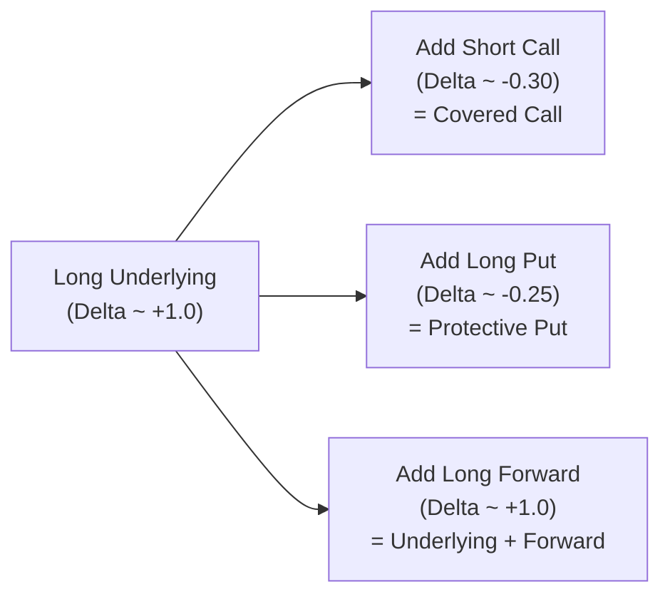

## Introduction and Motivation

So, let’s talk about delta—yep, that Greek letter that so many of us associate with the sensitivity of an option’s price to changes in the underlying asset. It’s like a speedometer for your option position, telling you how much the option’s value will change as the underlying price takes small steps up or down. If you’ve advanced this far in your CFA studies, you already know that delta can shift rather dramatically under different option overlay strategies. And those shifts matter a lot, practically speaking, because delta helps you gauge risk exposure, plan hedging strategies, estimate P&L changes, and optimize your portfolio.

At first, I remember thinking, “Well, how complicated can a covered call be? You just sell a call against your stock, right?” But after trading a few times, watching the stock gyrate near the strike, and anxiously checking the deltas every day, I realized there’s more nuance than meets the eye. Similarly, protective puts might feel straightforward—buy a put to protect your downside—but the interplay between how your option’s delta evolves and how you manage that exposure (especially as the market moves close to your strike) can be eye-opening. Then, of course, there’s the possibility of combining your underlying with a forward. You might say, “Isn’t that just doubling up on my exposure?” More or less, yes—and that means your effective delta can approach +2.0, supercharging both your gains and your losses.

The fun part of all this—if you find derivatives fun, and I guess most CFA Level III folks do!—is that these strategies reveal how derivatives can alter payoff slopes, not just replicate the underlying precisely. So, let’s jump in and examine these strategies in turn, shedding light on why a covered call or a protective put has a different delta profile compared to a simple underlying-plus-forward combination. And we’ll see how that difference becomes crucial when you factor in time decay, implied volatility changes, gamma, and the cost of carry.

## Quick Refresher: What Delta Really Means

Before diving into the comparison, let’s make sure we have the “speedometer” concept pinned down. Delta is the rate of change of an option’s price with respect to changes in the underlying asset’s price.

• For a long call, delta ranges from 0 to +1.  
• For a short call, delta ranges from 0 to –1 (though typically we say the short call’s delta is negative, so effectively around –(0 to +1)).  
• For a long put, delta ranges from –1 to 0.  
• For a short put, delta ranges from +1 to 0.  

In plain terms, if an option has a delta of +0.60, an upward move of $1 in the underlying implies an approximate $0.60 increase in the option’s price (all else being equal). If delta is –0.40 (like for a long put that is moderately in-the-money), then a $1 increase in the stock price might cause the put’s value to drop by about $0.40.

When you combine a position in the underlying with an option, your overall delta is basically the sum of the underlying’s delta (+1 per share) and the option’s delta. That’s a big part of why the covered call delta is (1 – call delta), or the protective put delta is (1 + put delta), to keep it simple. And if you add a forward to your underlying, you’re layering on even more exposure, because being long a forward is somewhat like being long the underlying with certain cost-of-carry nuances.

## Covered Call: The Delta Impact

### Defining the Strategy
A covered call is when you hold a long position in the underlying asset (e.g., 100 shares) and simultaneously write (i.e., short) a call option on that same underlying. The call typically has a certain strike price above the underlying’s current price, so you earn premium income but also cap your upside if the underlying price rises above the strike.

### How Delta Shifts
By owning the stock, you start with a delta of +1.0 (for each share held). Writing a call has a negative delta—because a short call effectively has the opposite position of a long call. Let’s say your short call has a delta of +0.30 (long call perspective); since you’re short that call, your portion of the call’s delta is –0.30. That means your net delta is:

• Net delta = Stock delta (≈ +1.0) + Short call delta (≈ –0.30) = +0.70.  

So, the covered call’s net delta is typically less than +1.0, meaning you have partially reduced your upside participation. Conceptually, you sold a piece of your future gains for an immediate option premium. If the underlying rallies strongly, your stock does great, but the call you wrote goes against you (since it’s short), limiting your net upside beyond the strike plus premium collected. On the downside, you still have the stock’s risk, but that option premium you received at least softens some losses by the amount of premium (though once that premium is exhausted, you’re back to participating in the underlying’s decline).

### Example
Imagine you have 100 shares of a stock trading at $50. You sell a call with a strike at $55, receiving a premium of $2. Suppose that short call’s delta is +0.25 at inception. Since you’re short, you effectively have –0.25 delta from the option. So your total delta is around +0.75 (i.e., 1 – 0.25). If the stock goes up $1, you’d expect a net gain, but only around $0.75 per share, ignoring extrinsic changes or gamma. That’s still a net positive exposure, but dialed down from +1.0.

### Delta Is Dynamic
Now, the tricky part: as the underlying price approaches the strike price, that call’s delta tends to rise (for a call). If the underlying jumps to $55, your short call’s delta might become +0.60 or +0.70. Since you’re short, that portion of your position becomes –0.60 or –0.70. So your overall position might drop to +0.40 net delta or even lower. And if the underlying surges beyond $55, you’re basically stuck with a capped gain because the short call exerts heavy negative delta. Meanwhile, if the underlying price plummets, the short call’s delta might drop closer to zero, and your position’s net delta reverts closer to +1.0, but you’ve already incurred losses on the underlying position.

## Protective Put: The Delta Impact

### Defining the Strategy
A protective put is when you own the underlying asset (long stock) and buy a put option on that same underlying. This is a standard insurance strategy for limiting downside: if the stock price falls below some strike (say $48), you’ve locked in a lower bound on how far your net value can drop (minus the premium paid).

### How Delta Shifts
Owning a put means you have negative put delta (somewhere between –1 and 0). Because you’re long the put, your total position’s delta is:

• Net delta = Stock delta (≈ +1.0) + Put delta (which is negative, say –0.25).  

Hence, net delta might be +0.75. But the advantage is that if the underlying price falls, the put’s delta becomes more negative (the put moves further in-the-money if the stock plunges). That negative delta helps offset your stock losses. So effectively, your net delta is tempered on the downside.

### Example
Let’s assume the same stock trades at $50, and you buy a put with a $48 strike for $1. If that put’s initial delta is –0.20, your net overall position has a delta of +0.80. If the stock falls $1, your stock is down by $1, but your put is up by about $0.20, offsetting a portion of the drop. If the underlying collapses to $40, the put will likely have a much bigger negative delta (it might approach –1.0 if it’s deep in-the-money), meaning it more effectively hedges your downside.

### Delta Is Dynamic
Similar to the covered call scenario, the protective put’s delta is also dynamic. As the underlying price drops closer to the strike, your put’s delta moves more negative, helping cushion further losses. Conversely, if the underlying rallies well above the strike, the put’s delta shrinks toward zero, and you effectively participate almost fully in the upside (minus the premium you spent). This interplay is sometimes referred to as a “positive gamma on the downside,” because as the underlying price declines, the put’s hedging effect grows stronger.

## Underlying + Forward: Doubling (Or More) the Exposure

### Defining the Strategy
Imagine you hold the underlying (with delta = +1.0) and, in addition, you take a long forward position on the same underlying. Ignoring contract multipliers, that forward gives you an additional +1.0 delta (in broad strokes). Thus, your total net delta may hover around +2.0.

### Why a Forward Adds Delta
A standard forward contract commits you to purchase the asset at a specific point in the future at a predetermined price (the forward price). That effectively replicates the payoff of a fully funded long position in the underlying, adjusted by the cost of carry (interest rates, storage, and any yield or dividends). For many practical risk calculations, we approximate the forward’s delta as +1.0, though in more nuanced modeling you might incorporate the time value or interest rates more explicitly. 

### Example
If you have $100 worth of stock (at $1 per share, so 100 shares) plus a forward contract on 100 shares (for the same maturity as your analysis horizon), your net delta is about +2.0. If the stock goes up by $1, you anticipate double the gains: your existing stock goes up $100 in total value, and your forward position is also in-the-money by roughly $100 more. On the flip side, a $1 drop is a double loss. The effect is more straightforward than with an embedded option because there is no optionality to complicate the payoff slope. (Of course, financing costs or cost-of-carry details matter in real life, but from a pure “delta in a vacuum” perspective, it’s quite direct.)

## Comparing Deltas: Covered Calls, Protective Puts, and Underlying + Forward

### Conceptual Overview
When we line up the three strategies, we see how they differ in alpha-numeric terms:

• Covered Call:  
  – Start with +1.0 from stock.  
  – Subtract the call’s delta (which is ~+0.2 to +0.4, or more, depending on how close to the money and how long until expiration).  
  – Net delta < +1.0.  

• Protective Put:  
  – Start with +1.0 from stock.  
  – Add the put’s delta (negative, say –0.2 to –0.5, depending on moneyness).  
  – Net delta < +1.0 as well, albeit for a different reason (downside protection).  

• Underlying + Forward:  
  – Stock delta +1.0.  
  – Forward delta +1.0.  
  – Net delta is around +2.0, effectively doubling the unhedged exposure.  

Covered calls and protective puts are ways to reduce or reshape your delta exposure around a single underlying. The first sells away some upside for premium income, the second insures against downside but costs premium. Meanwhile, the underlying-plus-forward combination does the opposite—it amplifies the underlying position’s sensitivity, effectively doubling the delta.

### Dynamism and Gamma Effects
Keep in mind that the deltas for covered calls and protective puts are not static. They change as the underlying approaches the strike, as time to expiration nears, or as implied volatility morphs. Gamma, the rate of change of delta, becomes a big factor if you plan to “actively hedge” or adjust the position continuously. 

For the underlying-plus-forward scenario, delta is mostly constant near +2.0 (assuming no partial unwinds or changes in the forward contract). You won’t have the same curvature in your payoff that an option brings—nor the protective or capping features a put or call might impose.

### Real-World Interpretation
In real markets, you’d also factor in:

• Time decay (theta): The option premium you collected in a covered call decays over time, which can be beneficial if the underlying stays below the strike. Conversely, with a protective put, you pay that time decay.  
• Implied volatility changes: If IV rises, your short call in a covered call might lose because the short call becomes more expensive to buy back. In a protective put, a volatility spike can help the put’s value.  
• Cost-of-carry: With a forward, you effectively reflect the net financing costs (interest minus dividends) over the contract term.  

Together, these variables further distinguish a covered call or protective put from simply doubling your underlying position.

## Practical Examples and Visuals

Below is a conceptual flow chart showing how each strategy might be set up in broad strokes:

• Branch B (Covered Call): Net delta typically under 1.0  
• Branch C (Protective Put): Net delta also under 1.0, plus protective structure  
• Branch D (Underlying + Forward): Net delta near 2.0, doubling exposure  

### A Hypothetical Market Scenario
Imagine a stock trading at $100.

1. Covered Call:  
   – You buy 100 shares at $100 (delta ≈ +1 per share → total +100).  
   – You sell a call with a $105 strike for $3, with a call delta of +0.30. Shorting that call yields –30 in total delta.  
   – Net delta = +70.  

2. Protective Put:  
   – You buy 100 shares at $100 (delta ≈ +100).  
   – You buy a put with a $95 strike for $2, with a put delta of –0.20. That yields –20.  
   – Net delta = +80.  

3. Underlying + Forward:  
   – You buy 100 shares at $100 (delta ≈ +100).  
   – You also go long a forward contract on 100 shares with delta ≈ +100.  
   – Net delta = +200.  

If the stock moves up from $100 to $101, the covered call might net a $70 move (in simplistic delta terms), the protective put might net $80, while the underlying+forward might net $200. Now, real-life P&L will differ because the short call or long put might see changes in extrinsic value, and your forward changes in value more directly. But the broad delta-based sensitivity stands.

## Why These Differences Matter

### Risk Management and Hedging
Let’s say you’re a portfolio manager who wants slight downside protection but doesn’t want to pay for a full-blown hedge. You might do a covered call: you earn some premium and effectively reduce your overall exposure slightly. Or you might do a protective put if your main fear is a tail event or major correction. But if you’re bullish—really bullish—and want to amplify potential gains (while also, let’s be real, amplifying potential losses), you can go with the underlying+forward approach.

### Payoff Profiles and Investor Objectives
• Covered calls can generate extra income if you believe the stock is likely to remain neutral or moderately bullish.  
• Protective puts allow you to sleep better at night if you’re worried about big drawdowns but still want upside.  
• Underlying+Forward is typically for those with strong convictions about upside, or for those required to hold a big position for other reasons (like corporate treasury usage or a hedging approach where the forward might offset other exposures).  

### Cost-of-Carry and Funding Requirements
A forward position might require minimal initial cash (depending on margin requirements), whereas owning the underlying or paying the premium for options might tie up more capital. The cost-of-carry can differ significantly. Also, if the underlying pays a dividend, the forward might reflect that dividend yield in its pricing.

## Common Pitfalls and Best Practices

• Overlooking Dynamic Delta: Many novice traders forget that the short call delta or long put delta can shift substantially as the underlying moves. A covered call can “catch you off guard” if the underlying surges and your short call becomes deep in-the-money.  
• Ignoring Volatility Shifts: In a protective put, rising implied volatility can help put prices, but the calls can become more expensive to buy back in a covered call. Keep an eye on vega exposures.  
• Neglecting Time Decay: Time can be your friend in a covered call strategy, but it’s your enemy in a protective put if you never end up “using” the put. Carefully consider how theta might help or hurt your net P&L.  
• Failing to Realize Concentrated Risk: If you do an underlying+forward strategy, check that you aren’t inadvertently creating too concentrated a position. Double the delta means double the risk.  
• Not Reviewing Hedging Costs: In a protective put, you pay premium as a form of insurance. Make sure the cost is worth the peace of mind.  

## Exam Tips and Strategy Application

In a CFA Level III context, remember that exam questions often test your ability to:

• Calculate net delta for a combined position.  
• Recognize how a covered call, protective put, or forward might align with an investor’s goals (income, hedging, speculation, etc.).  
• Evaluate how changes in the underlying price, volatility, or time to expiration will affect each position’s risk/return profile.  
• Demonstrate knowledge of how cost-of-carry modifies the forward price, and how that influences your net exposure.  

When addressing essay questions, be sure to outline the payoff characteristics clearly, referencing the relevant Greeks. For item sets, watch for short vignettes that describe an investor’s objective—maybe they want to “enhance yield but limit upside” (covered call) or “protect from tail risk while still remaining invested” (protective put).

## References and Further Exploration

• Natenberg, Sheldon. “Option Volatility & Pricing.” 2nd ed., McGraw-Hill.  
• Sinclair, Euan. “Volatility Trading.” 2nd ed., Wiley Finance.  
• Hull, John. “Options, Futures, and Other Derivatives.” 10th ed., Pearson.  
• CFA Institute. 2025 Level III Curriculum — Derivatives and Risk Management.  

These resources provide deeper dives into the complexities of delta, gamma, and vega exposures, as well as case studies of real-world trading and hedging strategies.

## Final Words of Encouragement

Yes, delta might seem a bit academic at first—but trust me, once you start actively managing option overlays in a real portfolio (or if you have already), you’ll see just how crucial it is to understand precisely what your net exposure is. Whether you end up leaning toward covered calls for extra income, protective puts for downside safety, or doubling down with an underlying+forward strategy, you’ll want to track your delta (and gamma, too) to ensure you’re still driving in the lane you intended. Markets can change quickly, and so can your option deltas. Stay curious, keep refining your approach, and never hesitate to recast your position when new market information arrives.

Anyway, that’s the gist of it—hope it helps clarify why the delta of a covered call or protective put is so different from that of simply holding the underlying plus a forward. Time to do some practice questions!

--------------------------------------------------------------------------------

## Test Your Knowledge: Delta Comparisons in Options Strategies



### 1. Which position is most likely to have a net delta approaching +2.0?

- [ ] A covered call (long stock + short call) where the call is OTM.
- [ ] A protective put (long stock + long put) with an ATM strike. 
- [x] Long stock plus a long forward on the same stock. 
- [ ] A long call plus a short put on the same underlying.

> **Explanation:** Owning the underlying (+1.0 delta) and a forward contract (approximately +1.0 delta) on the same underlying often results in a net delta close to +2.0. Covered calls and protective puts both have net deltas below +1.0.

### 2. An investor buys a stock at $100 and sells a call option with a strike of $105. The call’s delta is initially +0.35. What is the approximate net delta?

- [ ] +0.35
- [ ] +0.65
- [x] +0.65
- [ ] +1.35

> **Explanation:** Net delta = Delta of the stock (roughly +1.0) plus the delta of the short call (which is negative to the position, –0.35). So net delta = +1.00 – 0.35 = +0.65.

### 3. In a protective put strategy, how does the put’s delta change as the underlying price declines and moves closer to the put’s strike?

- [ ] The put’s delta becomes less negative.
- [x] The put’s delta becomes more negative.
- [ ] The put’s delta stays constant at –0.50.
- [ ] The put’s delta becomes positive above the strike price.

> **Explanation:** As the underlying price decreases, the put moves closer to or further into the money, and its delta becomes more negative, thus providing greater downside protection.

### 4. If an investor’s objective is to generate extra income from their long equity position but is willing to forgo some upside, which of the following is generally most appropriate?

- [ ] A protective put.
- [ ] A long forward.
- [ ] A short forward.
- [x] A covered call.

> **Explanation:** A covered call generates premium income from selling the call against the underlying position, accepting a cap on upside potential.

### 5. Which statement most accurately describes the effect of implied volatility rising on a covered call strategy?

- [x] It increases the cost to buy back the short call, creating a potential loss on the short option.
- [ ] It decreases the cost of the short call, increasing net profit automatically.
- [ ] It effectively reduces the stock’s delta.
- [ ] It has no effect because the underlying’s price remains the same.

> **Explanation:** A rise in implied volatility makes the short call more expensive to repurchase (holding other factors constant). This can result in a mark-to-market loss on the short call portion of a covered call.

### 6. If you hold an underlying stock plus a long forward position on that same stock, what is your approximate net position’s delta?

- [ ] +0.75
- [ ] +1.00
- [x] +2.00
- [ ] –1.00

> **Explanation:** Owning the stock is +1.0 delta, and a long forward is also roughly +1.0, so together you have about +2.0 in delta.

### 7. In a protective put strategy, which of the following best characterizes the investor’s motive?

- [x] They seek downside protection at the cost of an option premium.
- [ ] They want to earn immediate premium income and reduce downside risk.
- [x] They seek partial hedging while retaining most upside potential.
- [ ] They aim to double their equity exposure.

> **Explanation:** Protective puts are primarily used for downside protection. The investor pays the put premium and, if the underlying stays above the strike, the put might expire worthless. At the same time, the investor keeps upside exposure in the stock.

### 8. A short call in a covered call strategy generally has which effect on overall portfolio delta?

- [x] It reduces the portfolio’s net delta below +1.0.
- [ ] It has no net delta effect.
- [ ] It may raise the portfolio’s delta above +1.0.
- [ ] It shifts your delta from positive to negative.

> **Explanation:** Being short a call creates a negative delta relative to a long call. Hence, it lowers the total long delta from the underlying, resulting in net delta < +1.0.

### 9. When the call in a covered call strategy becomes deep-in-the-money, which statement is correct regarding the position’s net delta?

- [ ] Net delta approaches 0.
- [ ] Net delta remains near +1.0.
- [x] Net delta moves closer to 0 because the short call’s delta is near +1.0 (negative to the seller).
- [ ] Net delta becomes negative.

> **Explanation:** A deep ITM call has a delta close to +1.0 for the call buyer. If you are the call seller, that short call effectively has –1.0 to you; combined with the stock’s +1.0, net delta moves closer to 0.

### 10. True or False: Buying a protective put generally converts the stock’s risk profile into one that is similar to a call option (long call payoff profile).

- [x] True
- [ ] False

> **Explanation:** A protective put plus a share of stock creates a payoff profile similar to a long call option because losses are limited below the put’s strike, yet upside remains in the stock.


