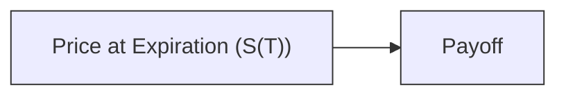

## Introduction
I remember the very first time I shorted a stock, thinking, “This thing is definitely headed lower.” Sounds confident, right? Maybe too confident. Because as soon as the share price started creeping up, I felt that twinge of panic—what if it rallied all the way back above my original entry price, or even higher? Even though I "just knew" the fundamentals were weak, I wanted some sort of insurance in case the market did something surprising (which it almost always does). This is where options come into play.

When you’re short the underlying, you’re exposed to theoretically unlimited losses if the underlying rallies. If, instead, you think it might keep plummeting—and you want a bit of extra income but are willing to take on additional risk—writing a put can be attractive. So let’s explore these two positions side by side:

• Short Underlying + Long Call (Protective Call)  
• Short Underlying + Short Put (Put Writing on a Short Position)

We’ll examine the rationale, payoffs, potential margin considerations, and overall risk-return profiles. By the end, you’ll grasp how each strategy matches different market outlooks (and personality types), and how to manage them in real-world portfolios.

## Protective Call on a Short Position
Let’s start with the simplest idea: maybe you shorted a stock expecting it to drop, but you don’t want to get hammered if it suddenly soars. In that case, you purchase a call option on the same underlying. This approach is akin to “buying insurance” on your short.

• Short Underlying Position: You profit if the underlying price goes down, but you face big losses if the price spikes up.  
• Long Call: You acquire the right (not the obligation) to buy the underlying at a specified strike price. 

When combined, the long call hedges your upside risk. If the stock moves well above your call’s strike, your short is losing, but your call’s payoff is gaining, helping offset (or cap) your total loss. It’s essentially the mirror image of a protective put for a long stock position—only it feels a bit more hair-raising if you get it wrong, because short selling is still generally considered riskier in many folks’ minds.

### Payoff Structure
Below is a simplified payoff diagram at expiration for a short underlying combined with a long call. We ignore premiums and transaction costs for clarity.

-----------------------------------------------------------------------------------------------
Payoff(Short Underlying) = –(S(T) – S₀)  (if we consider S₀ as the price at which the underlying was shorted)  
Payoff(Long Call) = max(0, S(T) – K) – Premium  
Total Payoff = –(S(T) – S₀) + [max(0, S(T) – K) – Premium]
-----------------------------------------------------------------------------------------------

Where S(T) is the stock price at option expiration, S₀ is your short-sale price, and K is the call strike.

If S(T) remains below K, the call expires worthless, and your net position is simply your short underlying profit or loss minus the premium you paid. If S(T) jumps above K, the call payoff increases, capping your total loss. Of course, it costs you some premium for that call, so your breakeven shifts slightly.

Visually, you might imagine the combined payoff line flattening out once the stock price moves above the call’s strike:

(Use your imagination: the diagram would slope downward for the short stock as S(T) rises, but then flatten out once the call kicks in at S(T) = K.)

### When to Use a Protective Call
1. You have a short position that you strongly believe in, but you want to limit the potential for runaway losses if the market moves against you.  
2. You think the security is still likely to fall, but volatility is high or there’s some potential “surprise news” that could spark a short-covering rally.  
3. You have risk constraints that prevent you from absorbing unlimited losses or large margin calls.

Risk is always there, but with a protective call, it’s no longer open-ended. The trade-off is the premium cost, so your short may be less profitable if the underlying keeps drifting lower because you’ve effectively paid for your insurance.

## Writing a Put on a Short Underlying
Now let’s check out the other approach: short the underlying and write a put option on the same underlying. Some folks might say, “Why on earth would someone do that?” Well, if you believe the price won’t drop much further, you can earn extra premium income from selling the put.

• Short Underlying: Gains if the price falls, losses if it rises.  
• Short Put: You receive premium upfront. If the underlying price stays above the put’s strike at expiration, you keep the premium. But if the underlying falls below the strike, your put buyer can exercise the option, forcing you to buy the stock at strike—which effectively closes out part or all of your short at that (possibly unfavorable) price.

### Payoff Structure
Here’s a simplified expression for the combined positions at expiration, ignoring the short-sale entry price and transaction costs:

-----------------------------------------------------------------------------------------------
Payoff(Short Underlying) = –(S(T) – S₀)  
Payoff(Short Put) = Premium + min(0, S(T) – K)  
Total Payoff = –(S(T) – S₀) + Premium + min(0, S(T) – K)
-----------------------------------------------------------------------------------------------

1. If S(T) > K, you keep the put premium, and your short stock may be losing if S(T) is rising above your short entry.  
2. If S(T) < K, you might be put the stock at strike K. Essentially, your short position might partially or fully close out at a price that could be higher or lower than the current market. Meanwhile, you still keep the premium (though it’s offset by the put’s intrinsic value if assigned).

For many traders, this is an “income enhancement” approach if they are confident that any additional downside in the stock is limited. But it can magnify overall risk because you now lose from both sides: the short underlying if the stock soars and the short put if the stock plunges. That’s a rough place to be if your timing is off.

Below is a schematic representation of the payoff structure (again, conceptually):

## Comparing the Risk Profiles
One of the best ways to decide between these strategies is to think carefully about your view of market direction, volatility, and risk tolerance.

• Short Underlying + Long Call  
  – Upside Risk: Capped beyond the strike K.  
  – Downside Gain: Good if the underlying keeps falling (though slightly reduced by the call premium).  
  – Net Outcome: Helps you manage a potential short squeeze. This is more of a risk-management approach.  

• Short Underlying + Short Put  
  – Upside Risk: Unlimited, as the stock can keep rising, so your short underlying bleeds losses.  
  – Downside Risk: Potentially offset by your short underlying’s gain if the stock falls somewhat, but the short put can add extra losses if the price plunges well below the strike.  
  – Net Outcome: Earn extra premium if you predict the underlying won’t drop much further. The put is effectively a bullish stance on the short side, which sounds paradoxical but means you’re expecting prices to remain above the put strike or not fall too much below it.  

### Volatility Matters
If implied volatility is high, call options can be quite expensive, making a protective call more costly. Conversely, a short put in a high-volatility environment pays a larger premium, but the risk is also higher because large swings become more probable. You want to be sure you’re comfortable with this trade-off before you jump in.

## Margin, Liquidity, and Practical Considerations
In practice, it’s not just about the theoretical payoff diagrams: real-world implementation involves margin requirements, liquidity constraints, and potential psychological factors.

• Margin Requirements:  
  – Buying a Call on a Short Underlying: Typically, your margin might be reduced (compared to an unhedged short) because the call caps your potential upside loss.  
  – Writing a Put on a Short Underlying: Short options often come with sizable margin requirements, given the “unlimited” or “large” potential risk. Make sure you have enough free capital.  

• Liquidity:  
  – Check option spreads. If the corresponding call or put has wide bid–ask spreads, your effective hedge or income strategy might be costly.  
  – High open interest and volume generally mean smoother trades.  

• Trading Costs and Slippage:  
  – Option trades can involve slippage, especially during volatile market conditions.  
  – Commissions and fees can eat into your advantage, especially if you’re frequently adjusting positions.  

## Real-World Example
Let’s consider a case study, loosely based on a scenario I saw:

You’re short 1,000 shares of XYZ at $100, expecting the stock to drop to $80. Now, let’s say the stock hovers around $95 but you’ve realized that a major product announcement might catapult it to $120.

1) Protective Call  
   – You buy 10 call contracts (each contract controls 100 shares) at a $100 strike, paying $2.00 per share premium.  
   – Total premium outlay: $2 * 1,000 shares = $2,000.  
   – If the stock soars to $120, your short position loses $20,000 (from $100 to $120 times 1,000 shares). But your long calls gain $20 per share in intrinsic value (strike $100 to $120), offset by the $2 premium. So you lose net $2,000 total. That’s the cost of your “insurance.”  
   – If the stock collapses to $80, you gain $20,000 on the short minus $2,000 for the call premium. Not bad.

2) Short Underlying + Short Put  
   – You write 10 put contracts at an $90 strike, collecting $1.50 per share in premium, total of $1,500.  
   – If the stock ends at $95, your short is down $- (95 – 100) * 1,000 = $5,000 in losses, but your short put expires worthless, netting $1,500. So overall, you lose $3,500.  
   – If the stock plunges to $85, your short position gains $15,000, but your short put is $5 in the money, so you lose $5,000 on that portion, net gain of $10,000, plus keep the $1,500 premium, so $11,500 total.  
   – If the stock rockets to $120, though, you lose $20,000 on the short underlying. You keep your $1,500, making your net loss $18,500. Not so great, especially if you consider you might have avoided or capped it with a protective call.

## Best Practices and Common Pitfalls
• Overconfidence in Market Direction: Don’t sell puts if your short thesis is shaky. If the stock doesn’t decline—or if it rallies beyond your comfort zone—you can face large realized losses.  
• Ignoring Volatility: Implied volatility drastically influences option pricing. Selling puts when volatility is too low can result in meager premiums for significant risk.  
• Underestimating Early Assignment Risk: With American-style options, the short put can be assigned at any time if it goes in the money. This can force you to buy shares sooner than expected. Similarly, if you hold a protective call, be mindful of potential early assignment on your short shares if the call is in the money.  
• Failure to Maintain Sufficient Margin: If the short’s losses climb, your broker may require more margin. If you’re overleveraged, you might be forced to exit at the worst possible time.

## Exam Tips
• Show your work carefully if you have to calculate final payoffs or profit/loss. Identify the underlying’s movement and systematically compute the option payoff.  
• Keep track of any premiums paid or received, as they shift your breakeven price.  
• Consider how changes in implied volatility might affect your strategy midstream, especially for dynamic hedging.  
• Many exam questions revolve around which strategy is more appropriate given an investor’s outlook (bullish, bearish, or stable).  
• Time management: In a constructed-response exam situation, draw payoff diagrams quickly to show you understand the shape of the risk profile. Then explain the “why.”  

Highlighting that if you’re:  
• Concerned about a big rally → A call hedge is probably your friend.  
• Convinced the underlying is stable and not dropping further → Maybe selling a put is your approach to earn premium.

## Conclusion
Ultimately, whether you choose to buy a call on your short underlying or sell a put against it depends entirely on your outlook and risk appetite. If, like me, you’ve been burned by unexpected rallies, protective calls can let you sleep at night. If you’re more certain the underlying will tread water or inch higher, writing a put can juice your returns. Either way, be sure to factor in margin, liquidity, volatility, and those sneaky transaction costs that can quietly erode profits.

As I always say, shorting a stock is like paddling against the river’s tide—be fully prepared for the current to shift direction at the worst possible time. Options are tools, not magic wands. Use them wisely for risk management or income enhancement but stay disciplined in your approach.

## References and Further Reading
• CBOE (Chicago Board Options Exchange) Educational Resources. “Short Selling and Hedging Strategies.”  
• Chance, Don M. “Essentials of Derivatives.” South-Western College Publishing.  

For more on margin requirements and nuanced strategies, consider consulting your broker’s guidelines and reading official CFA Institute curriculum readings on derivatives risk management and advanced options strategies.

----------

## Practice Questions on Buying a Call vs. Selling a Put While Short



### Which strategy effectively caps a short seller’s potential losses if the underlying asset rallies significantly?

- [ ] Shorting a put option alongside the short position  
- [x] Buying a call option alongside the short position  
- [ ] Writing a covered call option  
- [ ] Buying a protective put option  

> **Explanation:** Buying a call (a protective call) on a short underlying position caps the short seller’s losses if the underlying rallies above the call’s strike price.

### By selling a put option while holding a short underlying position, what market outcome would most benefit the investor?

- [ ] A substantial price rise in the underlying  
- [ ] A large drop in the underlying below the put strike  
- [x] The underlying staying above the put strike or slightly declining but not far below the strike  
- [ ] High volatility with repeated price whipsaws  

> **Explanation:** The put writer profits most if the underlying remains above the put’s strike. If it drops below the strike, the seller may face assignment and potential losses.

### A short underlying plus a short put position is generally considered:

- [ ] A strategy that strictly reduces risk compared with a naked short  
- [ ] A perfect hedge that eliminates losses if the stock rallies  
- [x] A strategy that magnifies risk to both sides, though it generates premium income  
- [ ] A long volatility position  

> **Explanation:** Adding a short put to an existing short stock position can magnify risk: large losses if the stock unexpectedly goes up (from the short stock) or if it plummets below the put strike and is assigned. Premium income is the main benefit.

### If implied volatility is extremely high, which strategy might be more expensive to implement?

- [x] Buying a call option on a short position  
- [ ] Shorting a put option on a short position  
- [ ] Shorting a call option on a short position  
- [ ] A protective put on a long position  

> **Explanation:** Higher implied volatility raises option premiums. Buying a call in a high-volatility environment can be costly. Conversely, selling a put benefits from higher premiums but involves more risk.

### Which of the following describes the payoff of a long call used with a short underlying position if the underlying price remains below the call strike?

- [x] The call expires worthless, and the investor’s profit or loss is determined by the short stock position minus the premium paid.  
- [ ] The call expires with intrinsic value, benefitting the short position.  
- [ ] The payoff is unlimited.  
- [ ] The investor receives margin credits for the worthless call.  

> **Explanation:** If the underlying remains below the strike, the long call finishes out of the money, so it expires worthless. The short position’s P/L stands, net of the premium cost for the call.

### When comparing the margin requirements: buying a call to hedge a short underlying vs. shorting a put while short an underlying, which is typically correct?

- [x] The short call hedge usually lowers margin requirements relative to shorting a put.  
- [ ] Shorting a put always requires no margin.  
- [ ] Margin requirements do not vary with hedges.  
- [ ] Margin is always higher for long calls vs. short puts.  

> **Explanation:** A long call hedge on a short underlying reduces the broker’s perceived risk of unlimited upside, often lowering overall margin requirements. Short puts generally have higher margin because of the large potential risk.

### One reason an investor might choose to sell a put while short the underlying is:

- [x] They believe the stock is unlikely to fall further and want to earn premium.  
- [ ] They desire to completely hedge any rise in the stock’s price.  
- [ ] They aim to benefit from high volatility if the stock rallies sharply.  
- [ ] They want to secure a synthetic long position.  

> **Explanation:** Selling a put while short the underlying is a strategy best suited for an investor who believes the stock will not decline much further and would like to collect additional premium.

### Buying a call to hedge a short position is often referred to as:

- [ ] A short strangle  
- [x] A protective call  
- [ ] A covered put  
- [ ] A bull spread  

> **Explanation:** A short position plus a long call is commonly termed a “protective call,” capturing the idea of insuring against adverse upward price moves.

### Which of the following risks remains unlimited for a short underlying plus short put strategy?

- [x] Upside risk if the underlying stock’s price rises significantly  
- [ ] Limited to the net of premium received  
- [ ] Capped at the put strike  
- [ ] Eliminated by the short put premium  

> **Explanation:** While writing a put might help collect premium, it does not limit losses on the short stock position if the underlying price rises sharply. That upside risk remains theoretically unlimited.

### Shorting a stock combined with a long call can be viewed as:

- [x] True  
- [ ] False  

> **Explanation:** Yes, it can be viewed as the inverse of a protective put in structure. A protective call hedges the short stock’s upside risk similarly to how a protective put hedges a long stock’s downside risk.


