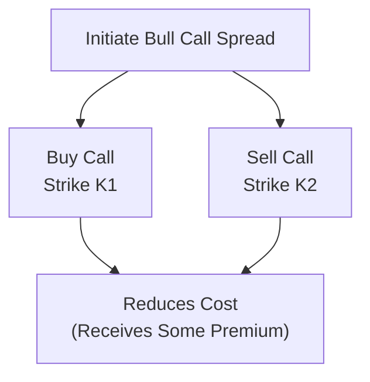
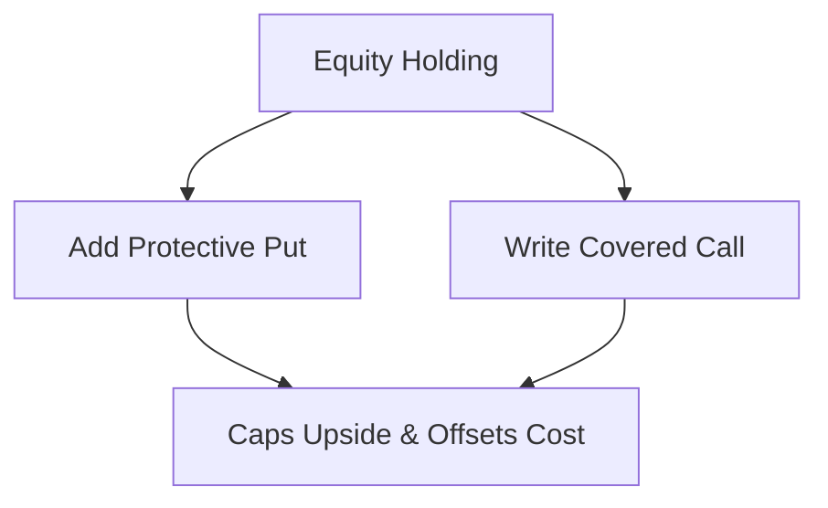

## Introduction

Options are versatile tools that can be molded into a wide range of strategies, allowing traders and portfolio managers to precisely tailor their market exposures. Sometimes, investors only have a mild bullish or bearish bias—they’re not convinced the market will surge or plummet. Other times, they’re worried about volatility. Spreads and combination strategies help address these very real-world concerns. They can limit out-of-pocket premium costs, mitigate risk in uncertain markets, or generate income in a lukewarm environment.

I remember, back when I was dabbling in equity options for the first time, someone told me, “Don't just buy calls or puts—learn to do more with less.” That was the spark that nudged me toward spreads. Turns out, pairing options can create payoff diagrams far more refined than a simple “long call” or “long put.” We'll see how.

In this section, we explore bull spreads, bear spreads, straddles, and collars, each with its own payoff structure, risk–reward trade-off, and best-use scenario. By the end, you’ll see how these strategies can slot into your risk management arsenal, especially when preparing for the CFA Level III exam—or real-world trading, of course.

## The Spread Concept

Before stepping into each strategy, let’s clarify the term “spread.” A spread is formed by entering two or more options positions—almost always with the same underlying but with different strikes and/or expirations. It’s a very deliberate approach that balances profit potential against cost and risk exposure. Compared to just buying a single call, a spread might reduce net premium outlay (by simultaneously selling another option) but also caps your maximum profit.

In the context of the CFA Level III curriculum, spreads often show up in scenario-based questions where you’re asked to compare payoffs at expiration, or you must figure out how to hedge a portfolio cheaply. Keep an eye on this concept of “net premium” because it will define whether the spread is a “debit spread” or a “credit spread.” Debit spreads cost you money upfront; credit spreads provide net cash inflow initially but come with potential obligations.

## Bull Spreads

A bull spread is designed to profit from a moderate rise in the underlying asset. You typically create a bull spread with either:

• Call options: Buy a call with a lower strike (K1) and sell a call with a higher strike (K2).  
• Put options: Buy a put with a lower strike (K1) and sell a put with a higher strike (K2) in such a way that the construction benefits from price increases (this is less common in practice but still valid).

A bull spread using calls—often called a bull call spread—results in a net debit because the lower-strike call costs more than the premium received from selling the higher-strike call. Because you’re collecting some premium from the short call, your net cost is reduced compared to buying a single lower-strike call outright. But your upside profit is capped at the higher strike.

### Construction Example: Bull Call Spread

• Buy 1 ABC Call, strike K1 = USD 100, premium = USD 6.  
• Sell 1 ABC Call, strike K2 = USD 110, premium = USD 2.  
• Net debit = 6 – 2 = USD 4.  

This net debit (USD 4) represents your maximum possible loss. Meanwhile, your maximum profit is capped at (K2 – K1) – net debit = (110 – 100) – 4 = USD 6. The breakeven point is the lower strike plus the net debit (K1 + 4 = USD 104).

As an anecdote, I once tried a bull call spread in a biotech stock I was only slightly bullish on. The premium savings compared to a simple long call made a world of difference. Of course, if the stock soared way beyond the higher strike, I missed out on those extra gains—but it did exactly what I wanted, which was to lock in a modest profit if the stock drifted upward.

### Bull Spread Payoff Diagram

Below is a simplified mermaid diagram showing the construction flow, rather than a strict XY payoff curve (though imagine the final payoff slope flattening after K2).

## Bear Spreads

Bear spreads aim to profit from a decline in the underlying asset. The logic is symmetrical to bull spreads, but flipped to the downside. You can construct a bear spread using:

• Puts: Buy a put with a higher strike (K1) and sell a put with a lower strike (K2).  
• Calls: Sell a call with a lower strike (K1) and buy a call with a higher strike (K2) (less common but still feasible).

### Construction Example: Bear Put Spread

• Buy 1 XYZ Put, strike K1 = USD 50, premium = USD 3.  
• Sell 1 XYZ Put, strike K2 = USD 40, premium = USD 1.  
• Net debit = 3 – 1 = USD 2.  

Your maximum loss is USD 2, which is the net premium you paid. The maximum gain will be (K1 – K2) – net debit = (50 – 40) – 2 = USD 8. The breakeven point is the higher strike minus the net debit (K1 – net premium = 50 – 2 = USD 48).

This approach is excellent if you believe the underlying will drop, but not necessarily crash. If the underlying plummets below K2, your profit is capped at that difference. Then again, you’ve saved premium relative to just buying the higher-strike put.

## Straddles

A straddle is the go-to strategy if you expect a big move in the underlying but aren’t sure which direction it’ll go. It involves buying (or selling) a call and a put at the same strike and expiration. When you buy a straddle, you pay two premiums, which can be expensive. That’s why you need significant volatility—both realized and implied—to make it worthwhile.

### Long Straddle

• Constructed by buying 1 call and 1 put at strike K.  
• Your initial cost is (premium_call + premium_put).  
• You profit if the underlying price makes a move big enough to offset both premiums. A large rally or steep decline can push the payoff firmly above your initial cost.

For instance, suppose an underlying is trading at USD 100, and you buy a call for USD 4 and a put for USD 3 (both with strike = 100). The total cost is USD 7. You need the stock to move above USD 107 or below USD 93 to break even at expiration (ignoring time decay complications along the way). If the market meanders sideways near 100, you face a near-total loss of premiums.

### Short Straddle

• Constructed by selling 1 call and 1 put at the same strike K.  
• This strategy collects two premiums, offering immediate income.  
• It’s best used if you anticipate low volatility and expect the underlying to stay range-bound near K.  
• The risk is theoretically unlimited if the market surges, and large if the market collapses—hence typically a high-risk strategy not to be taken lightly.

A friend of mine used to brag about all the “free money” from short straddles, until one ugly day the underlying soared on surprising news. He lost far more in the call side alone than all the short-straddle premiums he’d collected that quarter. Moral of the story? Know your volatility exposure and use these carefully, or offset them with other hedges.

## Collars

A collar combines two strategies that you might have encountered in earlier sections: a protective put (Section 1.3) and a covered call (Section 1.2). It’s effectively:

• Long the underlying stock.  
• Long a put to protect against downward moves.  
• Short a call to offset the cost of the put (and to cap your upside).

You might aim for a “costless collar” by choosing strikes so the premium received from the short call roughly matches the premium paid for the put.

### Construction Outline

• Assume you hold 100 shares of ABC, at a current price of USD 100.  
• You buy a put at strike K1 = USD 95, premium = USD 2.  
• You write a call at strike K2 = USD 105, premium = USD 2.  
• Net premium outlay is USD 2 – USD 2 = 0 (ignoring transaction costs).  

You’ll be protected if the stock plunges below 95, but your gains become capped above 105. In practice, I’ve seen many risk-averse clients (especially large institutions) use collars to smooth out their equity exposure. The “sleep at night” factor is real: yes, you give up some upside, but you also don’t worry about catastrophic downside.

### Collar Diagram

Here’s a high-level mermaid flow chart showing the collar construction:

## Volatility Considerations and Strategy Selection

Each of these structures entails different volatility exposures. Bull and bear spreads generally involve net buying (debit) or net selling (credit) of options, so they can have either positive or negative Vega (sensitivity to changes in implied volatility). Straddles are highly volatile if you’re a buyer; you need realized volatility to exceed implied volatility for a profit. Sell a straddle, and you want as little realized volatility as possible.

• Bull call spread: Typically positive Delta (directional exposure), limited upside, negative or positive Vega depending on net debit or credit.  
• Bear put spread: The symmetrical opposite, focusing on moderate downward moves.  
• Long straddle: Pays off best when the underlying rips up or down. Positive Vega exposure.  
• Short straddle: Profits in low-vol, range-bound conditions. Negative Vega exposure.  
• Collars: Enable partial hedging of underlying positions with limited cost, effectively bounding your range of outcomes.

Also remember that when implied volatility is high, buying options costs more. Strategies that involve net buying can become too expensive. Conversely, net credit strategies can be more appealing in high-vol markets, though they might involve higher risk. Always weigh the implied volatility environment against your market outlook.

## Practical Financial Examples and Case Studies

Consider an asset manager anticipating moderate growth in an equity index—say the S&P 500. Rather than buying an at-the-money call, they might implement a bull call spread to reduce premium outlay. They buy an at-the-money call and sell an out-of-the-money call. If the index only rises modestly, they keep a good portion of the net gains. If it skyrockets, well, opportunity cost is forgone upside, but that might be acceptable given cost constraints.

Meanwhile, a hedge fund, suspecting a biotech is about to release a crucial trial result with uncertain direction, might purchase a long straddle to capture the big move in either direction. However, if the trial outcome is a letdown and the underlying barely moves, the entire pricey premium might evaporate.

In another scenario, a risk CFO who’s required to hang on to the company’s stock (like an executive with restricted shares) might use a collar for downside protection without selling the shares outright. This collar locks in a minimum exit price (the put strike) while allowing for some upside potential until the call strike is reached.

## Key Risks, Pitfalls, and Best Practices

• Spreads reduce cost but also trim profit potential. Don’t forget that.  
• Short straddles, ironically, can appear profitable for long stretches but carry significant tail risk.  
• Collars can be effectively “costless” but only if you’re comfortable with the limited upside.  
• Always keep an eye on implied volatility relative to historical averages and your expectations.  
• Watch out for early exercise risk in American-style options, especially if the underlying pays dividends (see Section 1.13 and 1.14).  

Common pitfalls in the exam context include forgetting to account for net premiums or miscalculating breakeven points. Another frequent mistake is confusing bull and bear spreads (especially if constructed with calls vs. puts). Pay special attention to which option is being bought vs. sold and at which strike.

## Integration with Other Chapters

• This ties in closely with Section 1.1 on replicating asset returns using options, except here we’re structuring specific payoff profiles.  
• Section 1.2 (Covered Calls) and 1.3 (Protective Puts) come together to form a collar.  
• The Delta concept from Section 1.4 is also relevant: spreads modify your net Delta.  
• Sections 1.11 and 1.12 on Option Greeks and Dynamic Hedging are vital for measuring how these spreads perform under changing market conditions.  

## Exam Tips

• Show step-by-step logic when computing max profit, max loss, and breakeven.  
• Label each leg of your spread clearly. If a question says “buy a call at K1, sell a call at K2,” double-check that you’re interpreting the strikes and net premium correctly.  
• Be prepared to analyze payoff diagrams, especially if given multiple strategies (like bull spread vs. straddle) and asked for the “best fit.”  
• For item-set questions, watch out for trick details: an annualized option premium or partial-year premium.  
• Time management tip: Quickly identify each strategy. Then systematically evaluate the payoff structure, best-case/worst-case scenarios, and net premium or credit.  

Also, remember there’s a behavioral component: sometimes, clients prefer a collar because it “feels” safer, even if the expected return might be inferior to alternative hedging strategies. That’s something you might come across in exam case studies.  

## References

• Natenberg, Sheldon. “Option Volatility & Pricing.” 2nd ed., McGraw-Hill.  
• CFA Institute. “Option Spread Strategies” in Level III Curriculum Readings.  
• Hull, John C. “Options, Futures, and Other Derivatives.” 10th ed., Pearson.  

## Test Your Knowledge: Option Spreads and Combinations



### A bull call spread is typically initiated by:

- [ ] Buying a call at a higher strike and selling a call at a lower strike.  
- [x] Buying a call with a lower strike and selling a call with a higher strike.  
- [ ] Buying a put with a higher strike.  
- [ ] Buying a put with a lower strike and selling a put with a higher strike.  

> **Explanation:** A bull call spread usually involves buying a lower-strike call and selling a higher-strike call, creating a debit spread that profits if the underlying price rises moderately.

---

### An investor establishes a bear put spread on Stock A by buying a put at strike $50 for $3 and selling a put at strike $40 for $1. The net debit is:

- [ ] $4  
- [ ] $3  
- [x] $2  
- [ ] $1  

> **Explanation:** The net debit is $3 (cost of the higher-strike put) minus $1 (premium received from the lower-strike put) = $2.

---

### Which of the following statements correctly describes a long straddle?

- [x] Buying a call and a put at the same strike and maturity to profit from large price moves in either direction.  
- [ ] Selling a call and a put at the same strike and maturity to benefit from range-bound prices.  
- [ ] Buying a call and a put at different strikes to hedge currency exposure.  
- [ ] Buying a call at a lower strike and selling a call at a higher strike.  

> **Explanation:** In a long straddle, you buy both a call and a put at the same strike and maturity. You benefit from big moves up or down.

---

### Which spread is likely to have the highest initial cost out of pocket among these choices?

- [ ] A short straddle.  
- [ ] A short call spread.  
- [ ] A short put spread.  
- [x] A long straddle.  

> **Explanation:** A long straddle requires buying both a call and a put, typically yielding a significant premium outlay. In contrast, short strategies collect premium.

---

### When constructing a collar, an investor:

- [x] Buys the underlying, buys a put, and sells a call.  
- [ ] Buys the underlying, sells a put, and buys a call.  
- [ ] Sells the underlying, sells a call, and buys a put.  
- [x] Buys a put and sells a call on an already held underlying, effectively bounding profit and loss.  

> **Explanation:** A collar is usually an existing long stock position, combined with a long put for downside protection and a short call for premium income (often offsetting the put cost).

---

### The maximum profit for a bull call spread is:

- [ ] Unlimited.  
- [ ] Limited to the net premium.  
- [x] The difference between the strikes minus the net debit.  
- [ ] Equal to the sum of the premiums paid.  

> **Explanation:** For a bull call spread, the profit is capped at (K2 – K1) – net debit.

---

### A short straddle has:

- [ ] Unlimited profit, limited risk.  
- [x] Limited profit (the total premium received) and potentially unlimited risk.  
- [ ] Unlimited profit and risk.  
- [x] A profit that is earned only if volatility is high.  

> **Explanation:** A short straddle collects call and put premiums, so the maximum profit is limited to the premium received. If the underlying moves significantly, losses can exceed that.

---

### An investor wants partial protection against a moderate decline but does not want to pay a large premium. Which of the following strategies is most appropriate?

- [x] A collar.  
- [ ] A long straddle.  
- [ ] A bull call spread.  
- [ ] A bear call spread.  

> **Explanation:** A collar provides downside protection through a long put while offsetting costs by writing a call.

---

### In a bear put spread, maximum profit is achieved if:

- [x] The underlying price is at or below the lower strike at expiration.  
- [ ] The underlying price is above both strikes at expiration.  
- [ ] The underlying price remains at the midpoint of the strikes.  
- [ ] The underlying price rallies significantly at expiration.  

> **Explanation:** A bear put spread benefits from a downward move. At or below the lower strike, the spread is fully in-the-money, realizing maximum profit.

---

### A short straddle is a viable strategy if the investor believes:

- [x] True  
- [ ] False  

> **Explanation:** A short straddle is considered viable when the investor anticipates low volatility and expects the underlying price to remain near the strike price, allowing them to profit from time decay.


