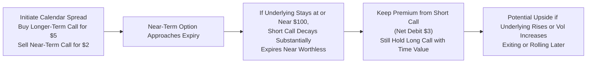

## Strategy Overview

Calendar spreads (sometimes called horizontal spreads) can be an intriguing tool for those aiming to capitalize on time decay and shifts in implied volatility. The position typically involves selling a near-term option and buying a longer-term option on the same underlying security, both at the same strike price. One of my colleagues once shared how he hopped into a calendar spread for the first time, expecting minimal price movement in the underlying, only to see that near-term option hang on to a bit more premium than he’d hoped—giving him a few jitters! That’s the kind of situation we’ll talk through here: how you might profit from time decay and implied volatility changes, but also where the pitfalls hide.

## Basic Mechanics of Calendar Spreads

A standard long calendar spread consists of:

• Selling a near-dated option (often with only a few weeks to expiration), typically a call or put, depending on your directional bias.  
• Simultaneously buying a similar option—same strike, same underlying—but with a later expiration date.  

You’re essentially “legging in” to an options strategy that benefits from the near-term option decaying faster (time decay, or theta) relative to the longer-term option. As near-term expiration approaches, that short option’s theta typically accelerates, meaning its time value can evaporate quickly—this is good for the seller. Meanwhile, your longer-term option should experience a slower rate of time decay, preserving a chunk of time value for you.

One quick side note: it’s possible to structure the spread in the opposite direction (buy near-term, sell long-term), but that’s far less common because it implies you’re paying for short-term premium that decays rapidly. Most folks are seeking that net time-decay advantage by selling the near-term leg.

## Profiling Potential Gains and Losses

Calendar spread outcomes hinge on two key factors: time decay and implied volatility.

• Time Decay (Theta): You receive short-term premium from the near-term option you sold. As expiration nears, that short option tends to lose its time value faster than the longer-dated option. Ideally, if the underlying price stays near the strike through the short expiration, you pocket the short premium, and your long option still has decent time value.  
• Implied Volatility: If implied volatility rises, the longer-dated option usually benefits more than the near-dated option because there’s a higher vega (volatility sensitivity) in longer-term options. In a perfect scenario, your short near-term option decays to near-zero, and your long option rises in price due to volatility expansion. If volatility plummets, however, you might not get the benefit you expected from the longer leg.

On the flip side, if the underlying makes a big price move in the near term, your short option might blow up in value (for instance, if you sold a near-term call and the underlying surges, that short call can become painfully expensive to buy back). You could end up in trouble if you don’t manage the position carefully.

## When to Deploy a Calendar Spread

Many traders find calendar spreads appealing in flat or range-bound markets when they don’t expect big short-term price moves. If you suspect the underlying might remain dormant until the near-dated expiration, it’s perfect. The short leg expires worthless, so you keep that premium, while the long leg still has embedded time value.

Moreover, if you predict a volatility pop sometime in the future—but not necessarily in the immediate term—calendar spreads can be a decent approach. The short-dated option’s payout (or cost to you) might be limited if implied volatility remains subdued short term. Meanwhile, your longer-dated option might surge in value if volatility aligns with your forecast later.

## Understanding the Term Structure of Volatility

The term structure of volatility can make or break your spread. If the implied volatility for longer-term options is significantly higher than for near-term options, your initial debit for buying the longer option might be large, potentially reducing your overall advantage. Conversely, if the volatility term structure is upward sloping in your favor or if you foresee a greater increase in the longer-dated implied vol, you stand a better chance at a profitable spread.

You might see an inverted term structure after events like earnings announcements, where near-term implied volatility is jacked up (because the near-term has the earnings catalyst), but subsequent months are cheaper. Navigating these volatility term structures is more advanced but can be quite rewarding.

## Example: Calendar Spread with Calls

Imagine you have a moderate bullish or neutral outlook on XYZ stock, currently trading at $100/share. You establish a calendar spread as follows:

• Sell one near-term 100-strike call expiring in two weeks for $2.00.  
• Buy one longer-term 100-strike call expiring in eight weeks for $5.00.  

Your net debit for the spread is $3.00 ($5.00 – $2.00). If, after two weeks, XYZ remains at $100 or slightly above, the short call might expire worthless or near worthless. You keep that $2.00, effectively lowering your cost basis on the long call to around $3.00. Meanwhile, your longer-term call could retain much of its time value or possibly increase if implied volatility creeps up.

If the stock spikes to $110 in that same two-week window, your short call might be worth more than $2.00 (the price you initially collected), and you could face a loss on that leg if you buy it back or if it’s assigned. That’s the essential risk: near-term unpredictability.

Below is a simplified visualization of how the calendar spread position evolves over time:

This is a very streamlined look. Real-world scenarios can get more complicated once you factor in implied volatility dynamics, early assignment risk (for American-style options), or changes in interest rates and dividends.

## Adjustments and Rolling Strategies

In practice, traders often “roll” the short option if they think the underlying might continue to stay within the desired range. Rolling means closing the near-term short leg (as it’s about to expire) and replacing it with another short option at a future date. This can effectively extend the advantage of continued time decay while still retaining that core, longer-dated long option.

• Rolling Up or Down: If the underlying moves away from your strike, you may adjust the strike of your new short leg to capture the best premium. Be aware, though, that changing the strike might alter your overall strategy from a straightforward horizontal spread to a diagonal spread.  
• Rolling Out in Time: If you want more time to collect premium, you can sell a new near-dated call (or put). This process can be repeated multiple times, as long as your long option remains beneficial.  

That said, each roll adds transaction costs, so weigh those carefully.

## Risk Management and Margin Considerations

You might want to keep an eye on margin requirements. A near-term short option can be assigned if it’s American-style—particularly calls on dividend-paying stocks. If your short option ends up in the money, assignment risk and margin calls could present nasty surprises. Also remember:

• Assignment or Exercise Risk: If assigned early, you must either deliver (for calls) or buy (for puts) the underlying at the strike. This transforms your strategy into a potentially unintended position.  
• Volatility Risk: A volatility crash can deflate the value of your long option significantly. Even if your short option is decaying, that might not offset the decrease in your long position’s premium.  
• Large Price Moves: A big move soon after you initiate the calendar spread could turn the short leg into a losing position, overshadowing the time value you hope to collect.

## Practical Use Cases and Real-World Scenarios

• Income Generation in a Range-Bound Stock: If you believe the underlying will remain stagnant over several weeks, calendar spreads help harvest option premium repeatedly.  
• Leveraged View of Volatility: Let’s say you anticipate volatility to rise over the next couple of months but not necessarily in the very short term. You might sell that short-term option to reduce cost while you wait for volatility to pick up in the longer-dated leg.  
• Adjusting Portfolio Delta: Some portfolio managers use calendar spreads to modulate the portfolio’s overall risk exposures. For instance, a neutral-to-slightly-bullish stance might be expressed through a calendar spread, limiting near-term delta while preserving longer-term upside.

I recall a friend who used a call calendar spread to ride out a potential earnings lull in a tech firm’s share price—he sold the near-term calls just after a big product launch (anticipating a quiet period), then kept that longer-dated call for the next product cycle. He ended up doing fine, although the stock did wander a bit more than he’d anticipated.

## Best Practices and Pitfalls

• Evaluate Volatility Term Structure First: If the longer-dated IV is extremely high relative to near-term IV, your spread might be too expensive.  
• Watch Dividends and Ex-Dates for Calls: Early exercise risk is especially relevant if a dividend is expected.  
• Don’t Overlook Early-Assignment Risks: American-style options can be exercised at any time; be prepared.  
• Manage Gaps or Large Price Swings: If the underlying leaps or plunges immediately, you may want to exit or roll the short position quickly to mitigate losses.

## Exam Relevance and Tips

On the CFA® Level III exam, calendar spreads could show up in item sets or constructed responses focusing on derivatives-based portfolio strategies. One might see a scenario where a portfolio manager uses a calendar spread to manage short-term volatility risk or to reduce cost while maintaining some upside exposure. Important exam angles include:

• Identifying the principal source of profit (time decay vs. volatility shift).  
• Explaining how the term structure of volatility impacts the strategy.  
• Discussing potential outcomes if the underlying moves significantly or implied volatility changes unexpectedly.  
• Illustrating how rolling or adjusting might benefit or harm the strategy.  

In any open-ended response, remember to discuss risk management considerations (especially early assignment) and to tie your strategy choice back to the portfolio’s overall objectives.

## References and Further Reading

• Hull, John C. “Options, Futures, and Other Derivatives.” 10th ed., Pearson.  
• McMillan, Lawrence G. “Options as a Strategic Investment.” 5th ed., Penguin.  
• CFA Institute Level III Curriculum, Derivatives and Risk Management Readings.  

-----------------------------------------

## Test Your Knowledge: Calendar Spreads and Their Uses



### Which statement best describes a calendar spread?

- [ ] It involves buying and selling options with different strike prices but the same expiration.  
- [x] It involves buying and selling options with the same strike price but different expiration dates.  
- [ ] It involves writing covered calls repeatedly until expiration.  
- [ ] It involves simultaneously purchasing a put and a call at the same strike and expiration.  

> **Explanation:** A calendar spread (horizontal spread) is formed by buying and selling two options on the same underlying and strike, but with different expiration dates.

---

### What is one primary motivation behind initiating a calendar spread?

- [ ] Profiting when the near-dated option experiences a strong increase in delta.  
- [x] Benefiting from faster time decay on the near-term option relative to the longer-term option.  
- [ ] Fully hedging all risk in the underlying.  
- [ ] Exploiting divergences between put and call parity conditions.  

> **Explanation:** A calendar spread attempts to capitalize on the quicker time decay (theta) of the near-term option.

---

### How does an increase in implied volatility typically affect a standard long calendar spread?

- [ ] It reduces the profitability because both options gain volatility value at the same rate.  
- [ ] It has no impact as long as the strike prices remain the same.  
- [x] It often increases the spread’s value because the longer-term option benefits more from the volatility rise.  
- [ ] It only benefits calendar spreads with in-the-money options.  

> **Explanation:** Longer-term options generally have larger vega, so a volatility increase tends to boost the long leg more significantly than the short leg.

---

### What is a key risk when using a short near-term option in a calendar spread?

- [ ] The long option might become deeply in-the-money, creating a negative payoff.  
- [x] Early assignment risk if the short option goes in-the-money, especially for American-style options.  
- [ ] The underlying’s price might not move at all.  
- [ ] Having unlimited profit potential if the underlying swings wildly.  

> **Explanation:** A near-term short option in a calendar spread is vulnerable to early assignment if conditions favor early exercise (e.g., dividends for calls).

---

### Which of the following scenarios is most suitable for establishing a calendar spread?

- [x] Expectations of a mostly flat underlying price in the short term, with a possible volatility spike later.  
- [ ] Anticipating a major price rally within days, leading to immediate large gains.  
- [x] Looking to collect near-term premium while maintaining long-term exposure.  
- [ ] Seeking to fully hedge all downside risk.  

> **Explanation:** Calendar spreads are frequently used in somewhat sideways markets, collecting short-term premium while preserving potential gains. They can also exploit future volatility spikes if timed correctly.

---

### When rolling the short leg of a calendar spread, which of the following is most accurate?

- [x] You close the existing short option and open a new short option in a further expiration cycle.  
- [ ] You exercise the near-dated long leg and sell the underlying at the same strike.  
- [ ] You only exit the longer-term position while keeping the short leg open.  
- [ ] Rolling is not permissible in a calendar spread.  

> **Explanation:** Rolling typically means buying back the near-dated short and simultaneously selling another short option in a new expiration, thus extending the strategy.

---

### Which best describes the impact of a large downward price move immediately after entering a call calendar spread?

- [ ] The short call’s loss will be offset entirely by the long call.  
- [x] The short call premium collected may shrink, but the long call can lose significant value, resulting in a net loss.  
- [x] The calendar spread may underperform due to the negative delta exposure.  
- [ ] The overall spread will remain an automatic profit because of time decay.  

> **Explanation:** If the underlying drops significantly, both legs of a call calendar spread can suffer, though the short call’s losses are offset by the credit received. The bigger concern is the loss in the long call’s time value.

---

### Why is the term structure of volatility relevant for a calendar spread?

- [ ] It sets regulatory margin requirements for out-of-the-money options.  
- [x] It tells you how implied volatility differs across expirations, affecting the relative premiums of near-term vs. long-term options.  
- [ ] It has no bearing on option pricing unless interest rates are negative.  
- [ ] It only matters for puts, not calls.  

> **Explanation:** The shape of the volatility curve (term structure) can affect the respective prices of near-term vs. long-term options and is crucial to calendar spread profitability.

---

### Which of the following statements is true regarding the risk–reward profile of a typical long calendar spread?

- [x] Maximum loss is limited to the net debit, and maximum profit occurs if the underlying is near the strike at near-term expiration.  
- [ ] Maximum loss is unlimited because the short option can rise in value indefinitely.  
- [ ] Calendar spreads effectively have zero risk beyond transaction costs.  
- [ ] The strategy has unlimited upside potential at all times.  

> **Explanation:** With a long calendar spread, your initial net debit can be lost if the spread doesn’t work out. Profit peaks if the short option expires near the strike (often worthless) while the long option retains value.

---

### Calendar spreads can serve to modulate a portfolio’s overall option “greeks.” Which of the following statements is correct?

- [x] The shorter-term option has lower vega, so the spread maintains a net positive vega.  
- [ ] The near-term leg usually has a higher vega than the longer-term leg.  
- [ ] The net delta is always zero for call calendars.  
- [ ] Calendar spreads do not impact the portfolio greeks.  

> **Explanation:** In a typical long calendar spread, the longer-dated leg has higher vega than the short leg, so the overall position has a net positive vega.


