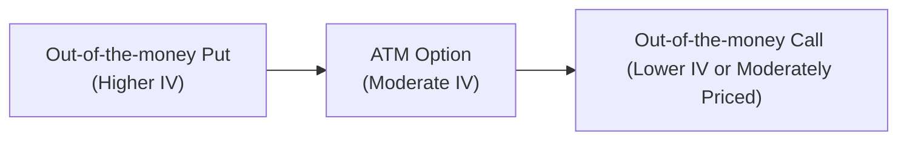
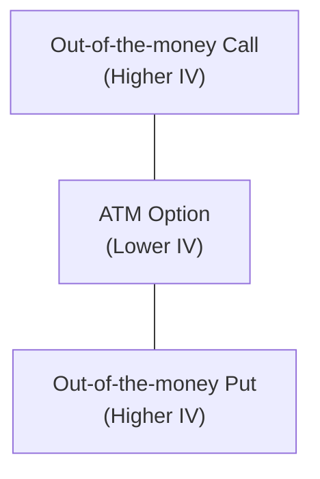

## Introduction

I remember the first time I traded equity options—when I saw all those implied volatility quotes, I just thought, “Um… so what’s with these different numbers at different strikes?” It was pretty confusing, truth be told. If you’ve ever plugged away at a standard Black–Scholes pricing model, you might recall that it assumes a single volatility for all option strikes (and maturities). But, in reality, the market rarely cooperates with that neat assumption. Instead, implied volatilities vary across strikes, creating patterns known as volatility skew and volatility smile.

This phenomenon has huge practical significance for risk management, trading strategies, and, well, your success on the CFA® Level III exam. In equity markets, out-of-the-money puts often command a higher implied volatility because investors crave downside insurance. In currency and commodity markets, on the other hand, the implied vol surfaces can form an altogether different shape: the “smile.” By the end of this discussion, you might actually look forward (just a tiny bit) to exploring these shapes on your own trading screens or mock exam questions. Let’s dive in.

## Understanding Implied Volatility and Market Pricing

Before tackling the shapes themselves, it helps to quickly revisit implied volatility (IV). IV is that single number, extracted from an option’s market price, that when plugged into an option-pricing model (like Black–Scholes), makes the theoretical price match the observed market price. This makes IV a forward-looking measure of how volatile the market expects the underlying asset to be over the option’s life. Well, that’s the theory, at least.

But real-world markets tend to disagree on a one-size-fits-all volatility measure for all strikes. Demand for protection, risk aversion, and the distribution of potential underlying price moves all feed into different implied vol levels. The result is a volatility surface—a 3D plot of implied volatility across strikes (on one axis) and maturities (on the other axis). The shapes that appear on any “slice” of this surface (for a particular maturity) may be described as either a skew or a smile.

## The Phenomenon of Volatility Skew

Volatility skew is typically observed in equity index options and many single-stock options. Picture an equity index: folks worry about major market drops, so out-of-the-money (OTM) puts get a lot of buying pressure from hedgers. That demand fosters higher implied vol on the downside. Meanwhile, out-of-the-money calls may see softer demand, and thus command relatively lower implied vol.

In a classic equity skew, implied vol increases as strike prices go lower. On a chart of implied volatility versus strike, you observe a downward sloping line—sometimes referred to as a “smirk” because it kind of looks like, well, a smirk or a tilted smile. This is the market, effectively saying, “We fear big downside moves in the underlying, so we’ll price those puts at a premium.” As a result, strategies that sell OTM puts to earn premium may appear profitable in stable markets, but come with big tail-risk. Meanwhile, call options near or above the current market price might be relatively cheaper, so if you’re planning to implement a covered-call strategy, you might find the call premium is not as juicy as you’d hope—but still quite serviceable if the underlying’s skew is modest.

## A Conceptual Skew Diagram

Below is a conceptual mermaid diagram showing how the implied vol for an OTM put can be higher while volatility for at-the-money (ATM) and OTM calls is lower. It’s more of a schematic flow than a literal chart, but it’ll hopefully help you grasp the basic shape:

In practice, you’ll see that the left side—representing OTM puts—often has an implied vol that’s noticeably higher than the middle (ATM) or the right side (OTM calls). That structural difference is your classic skew.

## The Volatility Smile

Now, what about a volatility smile? Sometimes, both puts and calls that are far from the current underlying price fetch higher implied vol compared to near-the-money options, essentially forming a U-shaped curve on a strike-vs.-implied-vol graph. In currency markets, for instance, fear of large moves in either direction can drive up the implied vol for deeply OTM puts or calls. This symmetrical demand for out-of-the-money protection manifests as a “smile.” So if you ever wonder why a 25-delta put and a 25-delta call might have higher implied vol than the 50-delta (ATM) option, there’s your answer.

For commodities, supply shocks or unexpected demand surges might generate the same effect, raising implied vol for OTM calls (the risk of a sudden price spike) and also for OTM puts (fear of a price collapse). As a result, even though the standard Black–Scholes model would forecast a constant volatility across strikes, the actual market landscape might look more like a grin—sometimes lopsided, sometimes symmetrical, seldom the mild, smooth shape that a textbook might have you imagine.

## Why Skew and Smile Appear

• Demand for Downside Protection (Skew): In equity markets, institutions want insurance against a market collapse. That heavy put-buying pressure lifts implied vol for those strikes.

• Fear of Large Moves in Both Directions (Smile): In FX or commodity markets, participants worry about big up or down swings, so both wings of the distribution can see heavier demand for out-of-the-money options.

• Leverage and Risk Constraints: Risk management mandates at large institutions often require hedging extremes in the distribution, pushing up vol in the wings.

• Market Sentiment and Behavioral Biases: Sometimes participants place too much weight on tail events. This can generate “expensive” tail options in terms of implied volatility.

• Model Misspecification: The Black–Scholes formula uses a single volatility. Real underlying price processes often have jumps or stochastic volatility, so the market prices that risk differently across strikes.

## Skew Risk in Practice

We can’t talk about skew without talking about skew risk—the risk that the shape of implied vol across strikes shifts unexpectedly, or “re-steepens” or “flattens” at inopportune times. If you’re measuring your option exposures using a single volatility input, you might completely miss the risk that OTM puts become even more expensive when the market dips. This matters a lot when structuring multi-legged strategies (e.g., spreads, collars, or condors) because the relative cost of each leg depends on the skew.

Let’s say you’re a portfolio manager who decides to sell a put spread, expecting the underlying asset to remain stable. If the market drops and fear creeps in, OTM put implied vol might skyrocket, and your once-benign short spread could suffer substantially larger mark-to-market losses than a naive constant-vol model would predict. That’s a big reason professional desks track implied vol surfaces in detail.

## Volatility Surface Modeling

In reality, advanced traders use more sophisticated models (SABR model, Heston model, local-stochastic volatility hybrids, etc.) to incorporate features like skew and smile. These “volatility surface” models calibrate to market prices at multiple strikes and expiries, so they can more accurately price exotic options, barrier options, or path-dependent products. If you only rely on a simple Black–Scholes with a single implied volatility, you’ll misprice options that are away from the money or that have path-dependent features. 

For instance, you might think an exotic knock-out option is cheap, but in an environment with a pronounced skew, the corridor around your barrier could have a higher implied vol—and that changes everything in the final premium. This is especially relevant for structured notes and advanced risk-hedging derivatives. 

## Trading and Positioning with Skew/Smile

Bringing it back to more standard trades:

• Selling an Expensive OTM Put: If the skew is steep, OTM puts are pricier. Sometimes, that’s appealing if you’re comfortable taking on downside exposure (or if you plan to buy that asset on a dip anyway). But be aware that in a crisis, implied vol (and potential losses) can spike dramatically.

• Buying OTM Calls in a Market with Steep Put Skew: Often, the calls can be relatively cheaper by comparison. Some traders might finance those calls by selling the more expensive puts, forming a risk-reversal trade. That’s typical in FX markets—buy a call, sell a put for the same premium if you think the currency might appreciate. The shape of the volatility curve can significantly impact the net premium of a risk reversal.

• Implementing a Collar: If you hold a long position in the underlying, a collar involves buying a put (to limit downside) and selling a call (to partially pay for that put). When the skew is steep, your put purchase might be expensive, but your call sale might not offset as much as you’d hope—leading to a narrower cost offset than you’d get if implied vol were flat.

• Within Commodity and FX “Smiling” Markets: You might see that both OTM calls and puts are fairly expensive. That can affect straddle or strangle strategies, where you simultaneously buy or sell a put and a call. Sometimes, if the smile is very pronounced, a short strangle might yield attractive premiums—but also outsized tail risk if the underlying moves sharply in either direction.

## A Conceptual Volatility Smile Diagram

Here is another mermaid diagram illustrating the general shape of a volatility smile when both wings trade at higher implied vol:

Visually, you could imagine the middle node (ATM) is placed in a lower region, while the left and right nodes (the OTM call and put) are located above, forming a U-like shape. That’s your volatility smile.

## Practical Case Study

Let’s consider a US-based equity portfolio manager hedging a large position in a diversified index. We’ll keep the numbers simple:

• Index level: 4,000  
• 3-month ATM implied volatility: 18%  
• 3-month OTM put (strike = 3,600, ~10% OTM) implied volatility: 26%  
• 3-month OTM call (strike = 4,400, ~10% OTM) implied volatility: 16%  

The manager wants a collar: buy the 3,600 put and sell the 4,400 call. Notice the put is more expensive, in volatility terms, while the call is cheaper. This means the net cost of the collar might be higher than a naive assumption of a flat vol at 18% would suggest. If you just plugged 18% into a standard Black–Scholes model for both legs, you might understate the cost of that put and overstate the premium for that call. This is how skew can alter your final strategy calculus and your hedge ratio.

## Monitoring Skew and Smile Changes in Stress

Another essential dimension is how the skew or smile changes as the market evolves. When everyone panics (think: a 2008-style meltdown or even just a sudden volatility shock), OTM puts can become astronomically expensive. In currency markets, geopolitical tensions often cause both sides of the smile to elevate, reflecting bigger possible moves in either direction. As a portfolio manager, ignoring these dynamic shifts would be a risky proposition. If your entire hedge or speculative play rests on certain implied vol levels, you need to keep an eye on how market psychology is morphing the shape of the curve. Checking weekly or monthly might not be enough in times of crisis—you may want to watch it daily or even intraday.

## Final Exam Tips

• Understand the Concepts Clearly: The CFA exam can test your grasp of why skew and smile emerge, and how they affect strategies like collars, spreads, or risk-reversals.

• Practice “What-If” Scenarios: You might get item set questions where implied vol for puts leaps up in a downturn. Be prepared to analyze how your net payoff or hedge ratio changes as the skew intensifies.

• Calculate or Estimate Premium Adjustments: Expect to do quick computations using different implied vol inputs for different strikes. They might show you a table of implied vols at various strikes and ask you to pick the best strategy or compute the net premium.

• Watch Out for Trick Questions: They may present a scenario assuming a constant volatility for all strikes, then show you an actual market surface that suggests otherwise. Your job: highlight the discrepancy and explain the risk.

• Address Potential Ethical and Professional Standards: In some question sets, you might see a scenario where ignoring skew leads to biased or misleading performance or risk reporting. Remember Standard V(A) of the CFA Code: Diligence and Reasonable Basis. If you’re ignoring skew, you may not have a “reasonable” approach to derivatives valuation.

## Conclusion

Volatility skew and smile patterns uproot the neat world of constant volatility implied by Black–Scholes. They exist because markets are anxious about certain outcomes—particularly downside crashes in equities or big moves (up or down) in FX and commodities. Skew can make your protective puts costly, yet it can also open doors for strategies that profit from selling expensive options, if you’re comfortable with the tail risk.

Anyway, next time you see someone punch in a single implied volatility number “just to get a ballpark,” you can gently remind them that the real market might be shaping up in a far less symmetrical way. Keep an eye on how that shape changes during times of stress, and factor it into your option strategies. Doing so will help you become a more sophisticated risk manager and might just earn you extra points on that exam day.

## References

• Sinclair, Euan. “Volatility Trading.” 2nd ed., Wiley.  
• Gatheral, Jim. “The Volatility Surface.” Wiley Finance.  
• Official CFA Institute Curriculum for Level III Derivatives and Risk Management (2025).  

## Mastering Volatility Skew and Smile: 10-Question Quiz



### Which of the following best describes “volatility skew” in the context of equity options?

- [x] Implied volatility varies such that out-of-the-money puts have higher IV than at-the-money options.
- [ ] Implied volatility is flat for all strikes and maturities.
- [ ] Implied volatility always decreases for deep out-of-the-money calls only.
- [ ] Implied volatility is higher at near-the-money strikes but lower at far out-of-the-money strikes.

> **Explanation:** In equity markets, volatility skew often takes the form of higher implied vol for OTM puts because of increased demand for downside hedges.

---

### Which market factor most commonly contributes to the volatility skew in equity options?

- [x] Investor demand for downside (put) protection.
- [ ] Central bank monetary policy targeting inflation.
- [ ] Consistent outperformance in OTM calls.
- [ ] Government price controls on the underlying asset.

> **Explanation:** Put options protecting against a sharp drop in equity prices are more in demand, pushing up their implied volatility relative to ATM or OTM calls.

---

### In a volatility smile scenario, how is implied volatility typically distributed across strikes?

- [ ] Implied vol is the lowest at the out-of-the-money calls and puts.
- [ ] Implied vol is the same across all strikes, forming a flat line.
- [x] Both the OTM puts and OTM calls have higher IV than at-the-money options.
- [ ] Implied vol is higher only for the at-the-money options.

> **Explanation:** A volatility smile arises when both tails of the strike distribution show higher implied vol than near-the-money strikes, creating a U-shaped pattern.

---

### Why might the Black–Scholes model be insufficient for pricing deep out-of-the-money puts?

- [x] It assumes a constant volatility rather than incorporating skew.
- [ ] It assumes interest rates are dynamic and uncertain.
- [ ] It does not allow for early exercise.
- [ ] It only applies to commodity markets.

> **Explanation:** The key limitation is that Black–Scholes uses a single volatility input and cannot capture the higher implied vol for deep OTM puts (or calls) that the market often exhibits.

---

### A portfolio manager notices that OTM calls are trading at slightly lower implied volatility than at-the-money options. Which market condition does this most likely reflect?

- [ ] No skew at all.
- [ ] A flat volatility surface.
- [x] A typical equity skew where puts are more expensive, and calls see lower IV in comparison.
- [ ] A symmetrical volatility smile pushing up both wings.

> **Explanation:** When the skew is driven primarily by downside risk demand, OTM calls might appear relatively cheap compared with OTM puts, often resulting in a near “smirk” pattern.

---

### If a trader wants to hedge an equity position using OTM puts during a market stress event, what immediate challenge are they likely to face?

- [x] Significantly higher implied vol for those OTM puts, making them more expensive.
- [ ] Easier access to cheap implied volatility levels due to crowd psychology.
- [ ] Flat implied volatility across all strikes.
- [ ] Inability to find counterparties to sell OTM puts.

> **Explanation:** During market stress, demand for OTM puts skyrockets, pushing up implied vol and making the hedge more expensive.

---

### Which of the following statements is TRUE regarding volatility skew risk?

- [x] Changes in skew can cause unanticipated losses for multi-legged option strategies.
- [ ] Skew risk is always constant over time and doesn’t affect spread positions much.
- [ ] Skew risk is factored in automatically by the standard Black–Scholes model.
- [ ] Skew risk is irrelevant to structured products.

> **Explanation:** Skew risk means the shape of implied volatility across strikes can shift, impacting spreads and other multi-legged positions that rely on relative pricing.

---

### In currency markets, why might a volatility smile be more common than a one-sided skew?

- [x] Market participants hedge both depreciation and appreciation risks, increasing IV on both tails.
- [ ] Market participants never worry about depreciation risk.
- [ ] Only central banks drive implied volatility in currency markets.
- [ ] Currency options generally are not used as hedging instruments.

> **Explanation:** Currency movements can be large in either direction, so out-of-the-money calls and puts both see heavier demand, forming a smile.

---

### When both OTM puts and OTM calls carry higher implied volatility, how does that shape appear on an implied volatility chart?

- [ ] It slopes downward to the right, known as a “smirk.”
- [ ] It’s completely flat.
- [x] It forms a “smile,” with higher implied vol at both tails.
- [ ] It inverts, dropping drastically for deep OTM puts and calls.

> **Explanation:** Higher IV at both the put and call wings is classically referred to as a smile.

---

### Volatility skew often expands sharply during market crises. True or False?

- [x] True
- [ ] False

> **Explanation:** In times of stress or crisis, investors flock to downside puts, driving their IV higher, and skew typically becomes more pronounced.


