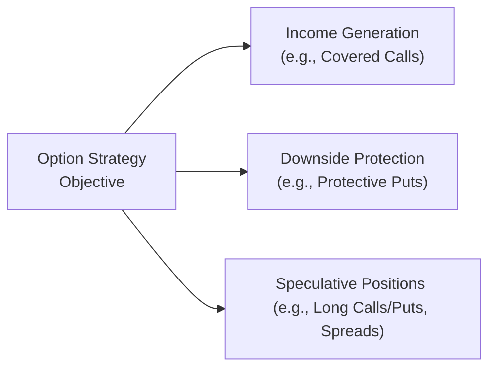

## Introduction to Option Strategy Selection

So, I remember the first time I tried to figure out if a long call or a bull call spread was the better way to benefit from a slightly bullish market on a tech stock. I spent way too many hours building payoff diagrams on scratch paper (yes, pen and paper!). Looking back, my biggest takeaway was that options can be downright confusing if you haven’t pinned down your market outlook and risk tolerance first. But once you do, options can become powerful tools to achieve different investment objectives—ranging from generating income to hedging downside risk to speculating on big price movements.

Selecting and evaluating the right option strategy is all about clarifying what you want from your investment. Are you seeking a bit of income and not minding a cap on your upside? That might point you toward a covered call (see Section 1.2). Feeling a bit jumpy about a potential drop in your long equity positions? A protective put (see Section 1.3) might soothe those nerves. This section explores the considerations you need to weigh when building an option strategy, the steps for analyzing potential outcomes, and the practicalities of implementation and monitoring.

## Key Criteria for Strategy Selection

Before diving into a specific strategy, it helps to know the broad question: Where do you think the market’s going? Of course, no one can predict with 100% certainty, but your best estimate of the future direction of the underlying asset’s price and its volatility can guide you in choosing a suitable strategy.

### Market Outlook

Often, traders and portfolio managers consider whether they are bullish, bearish, or neutral on the underlying. Some strategies, such as long calls, are obviously bullish—that’s the classic way to benefit from price increases without committing a large capital outlay. In contrast, spreads or collars can be more nuanced, protecting a portion of the downside while capping the upside. If your market view is neutral, you might go for strategies like straddles or iron condors, aiming to profit from minimal movement or, in some cases, a big spike in volatility.

• Bullish Market Outlook:  
  – Long calls, bull call spreads, or short puts.  
  – Potential for high gains if the underlying rallies above the strike price.  
  – Typically some downside risk (the premium paid, or margin if you are short puts).  

• Bearish Market Outlook:  
  – Long puts, bear put spreads, or short calls.  
  – Offers profit if the underlying price falls below the strike.  
  – Usually limited to the premium for long positions or margin requirements for short positions.  

• Neutral or Range-Bound Outlook:  
  – Iron condors, short straddles, or short strangles.  
  – Potential for steady time decay gains if the underlying remains in a specific range.  
  – Larger potential losses if the underlying breaks out significantly in either direction.  

### Volatility Expectation

Volatility can be a friend or foe, depending on your position. If you anticipate volatility to spike, you may favor strategies with long optionality (like long straddles or strangles). You might think about implementing a spread strategy (see Section 1.6) if you believe volatility is too high (or too low) and want to exploit a reversion.

• High Volatility Outlook:  
  – Long straddles or strangles to profit from large price swings.  
  – Potential double premium outlay if you are wrong, because both options could expire worthless.  

• Stable or Falling Volatility Outlook:  
  – Short straddles or strangles, or iron condors, which benefit from time decay when the underlying remains range-bound.  
  – Unlimited risk potential if there is a significant price breakout.  

### Risk Tolerance

Personally, I am a bit of a cautious bull. I love upside but break out in cold sweats thinking about massive drawdowns. Investors with a higher risk tolerance might be comfortable selling naked options (like unsecured short calls), which can generate income but expose the seller to large potential losses. For those with lower risk tolerance, a robust hedge such as a protective put or a spread position is often more appealing.

### Desired Payoff Structure

Ask yourself: Do you want unlimited upside? Are you cool sacrificing some gains to protect your downside? Would you rather have a risk profile that’s symmetrical (like a straddle) or one that leans bullish or bearish? The shape of the desired payoff is key to picking the right strategy. A protective put might cost a premium but can limit your losses. A covered call can reduce your downside slightly but may cap your potential gains above the strike price.

## Implementation Considerations

Alright, you’ve decided on a strategy: Maybe you want to do a collar (long stock, long put, short call). Great. Next, you need to think about practical aspects—like how easy is it to trade these options, the bid-ask spread, margin requirements, and even the tax or regulatory environment.

### Liquidity and Bid-Ask Spreads

Option liquidity, or lack thereof, can significantly affect your profitability. Whenever the volume is low, the bid-ask spreads might be wide, so you effectively pay a premium just to get in or out. If you’re trading a large position, it’s worth checking the open interest. If I’m considering a big position in a small-cap name, I always check to see if the options are decently traded. A wide bid-ask spread can eat away at the potential profits of even the best-designed strategy.

### Margin or Cash Requirements

Different strategies come with different margin or cash needs, especially if you’re writing options. For instance, a covered call written against a long stock position might not require large additional margin because the underlying stock serves as collateral. But a short straddle on a high-priced, volatile stock might require a big chunk of margin. Be sure to factor in these requirements, as they can tie up cash you might otherwise deploy elsewhere.

### Transaction Costs and Operational Details

Don’t forget commissions (though these days retail commissions on options can be quite low or zero for certain brokers). Still, if you plan to roll your position frequently or maintain multiple legs in a single strategy (e.g., an iron condor has four legs), transaction costs can add up quickly. Also keep track of your brokerage’s operational details, such as assignment procedures and margin calls, which can create stress if you are not prepared.

## Modeling and Evaluating Strategies

This is where things get interesting, at least for finance nerds like me. You can use software or spreadsheets to map out your potential payoffs at expiration, or even dynamically over the option’s life.

### Payoff Diagrams

A payoff diagram shows how your profit or loss changes with the underlying’s price at expiration (or another point in time). It’s extremely helpful to visualize your max gains, max losses, and break-even points.

Below is a simple Mermaid.js diagram illustrating a conceptual approach to choosing an option strategy based on the objective:

In practice, once an investor identifies the main objective, they delve into more detailed payoff diagrams to see precisely how that strategy might perform under different price outcomes.

Let’s illustrate a protective put payoff. Suppose you own 100 shares of XYZ trading at $100. You purchase a put with a strike of $95 for $2 per share.

• If, at expiration, XYZ is at $120, your stock position is worth $12,000, but your put expires worthless, leaving you at a net gain of $1,800 (since you paid $200 total for the put).  
• If XYZ collapses to $40, your stock is now worth $4,000, but your put is worth at least $5,500 at expiration ($95 strike minus $40 share price = $55 intrinsic value, times 100 shares). Net, you lose $200 for the put plus you realize $4,000 from the stock, and close out the put for about $5,500, effectively limiting your downside.  

### Scenario Analysis

Scenario analysis goes beyond a simple expiration payoff, giving you a sense of how your strategy might behave if volatility changes or time passes more quickly than expected. For example, if you’re holding a long call and implied volatility suddenly plummets, the option’s price could drop even if the underlying price doesn’t change much. That’s because an option’s value is heavily influenced by volatility (i.e., vega).

With scenario analysis, you might set up a few cases:
1. Best case: Underlying price rises 20% in three months, implied volatility stays the same.  
2. Middle case: Underlying stays flat, but implied volatility changes by ±5%.  
3. Worst case: Underlying drops 10% (or more), implied volatility rises 10%.  

Comparing the outcomes in each scenario can help you gauge if you’re comfortable with how your P/L evolves. This is especially critical for strategies with unlimited or large risk on one side, like selling naked calls.

### Using Option Greeks in Evaluation

While payoff diagrams are a static view at expiration, you might also consider the Greeks:
• Delta: The sensitivity of option price to small changes in the underlying’s price.  
• Gamma: The sensitivity of delta to changes in the underlying’s price. Large gamma means your delta can swing quickly.  
• Vega: The sensitivity of option price to changes in implied volatility.  
• Theta: The sensitivity to the passage of time (time decay).  

Say you’re selling a covered call to generate extra income on a broadly stable position that you think might see limited upside. The trade often benefits from theta (time decay in your favor) but might see negative gamma (where your position’s delta becomes less favorable if the underlying rallies sharply).

## Ongoing Monitoring and Rolling

Once you’ve implemented a strategy, it’s not a “set and forget” scenario—unless you’re comfortable with letting it ride to expiration. Many professional traders prefer to adjust or “roll” their options as conditions change. Rolling an option involves closing the existing option and opening a new one, often with a different strike price or expiration to maintain or reshape your strategy.

For example, if you’ve sold a covered call and the stock surges above the strike price, you might decide to roll the call option up (and possibly out to a longer expiration) to retain your exposure to further price increases. Rolling does introduce new transaction costs, but if done carefully and with the right timing, it can reduce your risk (or even lock in some profit) while keeping a portion of your bullish position intact.

## Performance Measurement and Benchmarking

Measuring the success of an option strategy is more nuanced than standard total return calculations on stocks. You’ll probably want to compare actual P/L to a “benchmark scenario,” such as owning the underlying outright or implementing a simpler strategy. For instance, if you sold a covered call over the last three months, how did your return compare to just holding the stock? Was that incremental premium worth the upside cap?

Some considerations for performance measurement:  
• Use scenario-based drilling: Compare final outcomes to what you projected initially.  
• Track realized vs. unrealized gains/losses on each leg of the trade.  
• Consider opportunity cost: Did the option strategy hinder you from capturing a massive upside rally?  
• Factor in transaction costs and margin usage, which can reduce net returns.  

For instance, a robust postmortem might reveal that your directional bias was correct but an overly cautious protective structure ate away any significant returns. Or it might show that your collar strategy saved you from a severe drawdown. The point is to refine your approach over time, using actual performance data, scenario analyses, and comparisons to a relevant benchmark.

## Best Practices and Common Pitfalls

It’s easy to get carried away with advanced multi-leg strategies if you see big potential time decay or gamma gains. However, too many legs can complicate your portfolio management and rack up fees. In my experience, it pays off to keep it relatively straightforward and well-monitored.

• Carefully document your rationale: Write down why you chose a particular strike, when you plan to exit or roll, and what kind of capital you’ve risked.  
• Avoid ignoring assignment or exercise risk: American-style options can be exercised early, particularly when they are deep in-the-money.  
• Beware complacency in short option positions: Short options can appear profitable in stable markets, but a sudden market jolt can lead to large losses (this is especially prominent in short naked puts or calls).  
• Incorporate “what-if” scenarios for implied volatility shifts, dividend changes, or interest rate changes, which can affect option pricing.  

## Conclusion and Exam Tips

Selecting an option strategy that fits your investment objectives isn’t just about picking a bullish or bearish strategy—it’s about vigilant assessment of the underlying’s potential price path, volatility conditions, capital constraints, and your own comfort with risk exposure. Build your initial trade thesis with both payoff diagrams and scenario analyses, then keep a close watch on macro, sector, and company-level developments that might change your assumptions.

On the CFA Level III exam, you can expect item sets or constructed-response questions that test your ability to:

• Identify which option strategy aligns with a client’s risk-return profile and market outlook.  
• Evaluate the impact of changes in implied volatility or time to expiration.  
• Explain how to hedge or adjust a position by rolling options or combining them with forward/futures exposures (see Chapter 2 for more).  
• Demonstrate skill in analyzing payoff diagrams or computing break-even prices and payoffs at expiration.

Make sure you practice scenario analyses under various market conditions. Evaluate how each leg contributes to total P/L over time and in response to changing volatility. Often, exam questions use scenario data to test if you can properly handle multi-leg payoffs.

## References and Further Reading

• CFA Institute. “Option Strategy Selection” in the Level III Curriculum.  
• McMillan, Lawrence G. “Options as a Strategic Investment.” 5th ed., Penguin.  

## Test Your Knowledge: Option Strategy Selection and Evaluation



### Which of the following best describes a covered call strategy?

- [ ] Buying a call option while selling a put on the same underlying.  
- [x] Owning an underlying asset while selling a call option on that asset.  
- [ ] Selling both a call and a put on the same underlying.  
- [ ] Buying a call and a put on the same underlying for the same strike.  

> **Explanation:** A covered call involves holding the underlying stock and writing (selling) a call option against that position, thereby generating premium income but capping the upside.

### If an investor expects volatility to spike significantly, which strategy typically aligns with this expectation?

- [ ] Short strangle.  
- [x] Long straddle or strangle.  
- [ ] Covered call.  
- [ ] Iron condor.  

> **Explanation:** Long straddles and strangles are long volatility positions, meaning they tend to benefit if underlying price movement is large (i.e., a big increase in volatility).

### In scenario analysis for a short put option, what situation generally poses the highest risk?

- [ ] Underlying rallies strongly.  
- [x] Underlying experiences a sharp drop in price.  
- [ ] Underlying remains unchanged.  
- [ ] Underlying has minor price movement around the strike.  

> **Explanation:** A short put has its greatest risk if the underlying’s price plummets well below the strike, resulting in potentially large losses.

### Which of the following metrics measures an option’s sensitivity to changes in implied volatility?

- [ ] Delta.  
- [ ] Gamma.  
- [x] Vega.  
- [ ] Theta.  

> **Explanation:** Vega measures how much the option's price is expected to change for a 1% change in implied volatility.  

### What is rolling an option?

- [ ] Exercising an in-the-money option prior to expiration.  
- [x] Closing an existing option position and opening a new one with a different strike or expiration.  
- [ ] Waiting for expired options to settle.  
- [ ] Collateralizing an option with cash.  

> **Explanation:** Rolling involves exiting your current position and simultaneously opening a new position—usually to keep the strategy going or adjust strikes and premiums.

### Which statement about covered calls is most accurate?

- [ ] They offer unlimited upside potential and no downside protection.  
- [x] They offer limited upside potential but partial downside cushion.  
- [ ] They require the sale of a put option to hedge risk.  
- [ ] They profit only if volatility declines.  

> **Explanation:** A covered call caps upside at the call’s strike price but the premium received provides a partial cushion on the downside.

### An investor wants to protect a long stock position but maintain substantial upside. Which strategy is appropriate?

- [ ] Short call.  
- [x] Protective put.  
- [ ] Short straddle.  
- [ ] Short put.  

> **Explanation:** A protective put involves owning a stock and buying a put option. It preserves upside potential for the stock (minus the premium paid) and limits downside if the stock falls below the put’s strike.

### An investor sells a straddle expecting low volatility. Which scenario would result in the largest net loss?

- [ ] Little price movement over time.  
- [ ] A small decrease in implied volatility.  
- [x] A large upward or downward move in the underlying.  
- [ ] The underlying remains exactly at the strike until expiration.  

> **Explanation:** For a short straddle, big moves in either direction can cause significant losses, as both the short call and short put can move against the trader.

### Which of the following is most likely a reason to roll a short call option?

- [x] To adjust the strike price higher if the underlying price rises.  
- [ ] To reduce transaction costs.  
- [ ] To realize capital gains on the underlying.  
- [ ] To increase the risk exposure to short puts.  

> **Explanation:** Rolling the short call might involve buying back the existing call and writing a new one at a higher strike (and possibly a different expiration), especially if the underlying has rallied above the original strike.

### True or False: Monitoring margin requirements is unnecessary once you have a short option position open.

- [ ] True  
- [x] False  

> **Explanation:** Monitoring margin requirements is crucial because short options can involve potentially large losses if the market moves against the position, and your broker may issue a margin call if the position’s risk grows.


