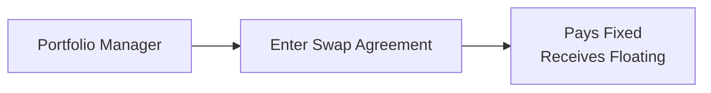

## Introduction and Motivation

Managing a portfolio’s interest rate risk can feel like riding a rollercoaster—you want to enjoy the ride but definitely avoid the steep drop when interest rates take unexpected turns. Well, interest rate swaps, forward rate agreements (FRAs), and interest rate futures can help steady that coaster ride. These instruments let you tweak the portfolio’s sensitivity to changes in interest rates without necessarily buying or selling a bunch of bonds. In other words, you can alter risk exposure—and potentially returns—without a time-consuming reallocation of your fixed-income holdings.

I remember the first time I dabbled with an interest rate swap during a trading simulation in grad school. I was super excited about it—I had only read about them in textbooks, and suddenly, I was adjusting the portfolio’s duration on the fly. It felt like a magic trick: I could transform exposure from fixed-rate to floating-rate, or vice versa, by just signing a contract. But as with all magic, it came with a catch: there were complexities like counterparty risk, margin calls, and the intricacies of marking derivatives to market. So, let’s walk through these derivative instruments and see how they help us manage and modify portfolio risk and return.

## Overview of Key Concepts

Before we dig into the nuts and bolts of swaps, forwards, and futures, let’s clarify a few essentials:

• Duration: This measures a bond (or a portfolio’s) sensitivity to interest rate changes. Higher duration typically means greater price fluctuation when rates move.  
• Notional Principal: This is the “face amount” of a derivative on which payments are calculated, but it generally doesn’t exchange hands.  
• Floating Rate: An interest rate that resets periodically, often tied to LIBOR or SOFR (though many global markets and regulators are transitioning away from LIBOR).  
• Fixed Rate: An interest rate that doesn’t change over the instrument’s life.  
• Credit Risk (Counterparty Risk): The concern that the other party might default on its contractual obligations—particularly relevant in over-the-counter (OTC) derivatives like interest rate swaps or forward agreements.  
• Mark-to-Market: The daily or periodic revaluation of a derivative contract to reflect gains or losses based on market prices.  
• Forward Rate Agreement (FRA): A contract that lets you lock in an interest rate for a future deposit or borrowing.  
• Settlement: The process by which you pay or receive gains/losses on your derivative position.  

Keep these definitions in mind as we explore how to use interest rate swaps, forwards, and futures to align your portfolio’s return and risk with your investment objectives.

## Interest Rate Swaps

### Core Structure

An interest rate swap is a private contract between two parties that typically involves exchanging one set of cash flows for another. The most common structure is a plain-vanilla swap in which one party pays a fixed rate and receives a floating rate, while the other party does the opposite. The floating rate is usually tied to a reference rate, such as 3-month LIBOR, 6-month LIBOR, or SOFR.

Imagine a portfolio manager who holds a big chunk of long-maturity, fixed-rate bonds but believes rates are soon to rise. That manager wants to reduce the portfolio’s duration (so that the portfolio won’t get hammered if rates spike). Instead of selling the physical bonds (which could incur transaction costs and disrupt an otherwise well-constructed portfolio), the manager could enter an interest rate swap to pay fixed and receive floating. This effectively reduces overall duration because, on net, the manager is receiving a floating rate that resets periodically, offsetting part of the fixed-rate instrument’s interest rate sensitivity.

Conceptually, you could picture an interest rate swap like this:

The notional principal is not exchanged (except in currency swaps, but that’s a separate story). Instead, each counterpart calculates periodic payments on the same notional. Because these contracts are OTC, you have tremendous flexibility in setting maturities, payment frequencies, and reference rates—but you also take on greater counterparty credit risk relative to exchange-traded products.

### Duration Adjustment via Swaps

One powerful reason to use swaps is to adjust your portfolio’s duration quickly. Duration is a measure of the price sensitivity to changes in interest rates:

(1) A floating-rate portfolio tends to have a low duration because the periodic resets reduce price sensitivity.  
(2) A fixed-rate portfolio generally has higher duration over the life of the instrument.  

By deciding to pay fixed (and receive floating), you effectively reduce your duration (because paying fixed is akin to holding a short position in a fixed-rate bond). Conversely, if you receive fixed and pay floating, you increase duration (akin to going long a fixed-rate bond).

A simplified formula for computing the swap’s fixed rate (the “swap rate”) might be expressed using discount factors:


r_\text{swap} = \frac{(1 - P_n)}{\sum_{k=1}^{n} P_k \times \Delta_k}


where:  
• \\( P_k \\) is the discount factor for the \\( k \\)-th period.  
• \\( \Delta_k \\) is the fractional year for period \\( k \\).  
• \\( P_n \\) is the discount factor at the swap’s final maturity.  

At the inception of the swap, the present value of the fixed leg and floating leg should be equal (i.e., it’s fair for both counterparties). As market rates move, the value of each leg fluctuates, resulting in gains for one side and losses for the other.

### Key Risks and Considerations

• Counterparty Risk: Since swaps are OTC, you rely on the financial health and reliability of your counterparty. Proper credit analysis, netting agreements, and possibly central clearing can mitigate this.  
• Liquidity: Exiting a swap early might not be as simple as trading out of a futures contract. You might have to negotiate a termination cost or enter an offsetting swap.  
• Accrual/Settlement Frequency: The frequency of floating rate resets and payments can affect your cash flow management.  

## Forward Rate Agreements (FRAs)

### Basics of FRAs

Picture needing to borrow money six months from now. You think rates might climb, so you’d like to lock in a borrowing rate today. Alternatively, maybe you’ll lend money and want to lock in the lending rate. An FRA does just that: it locks in an interest rate for a specified future date. At settlement, the “buyer” of the FRA is effectively compensated if the reference rate is higher than the agreed-upon FRA rate (because they locked in a lower rate). Conversely, if the actual reference rate is lower, the buyer pays the difference to the seller.

### Use in Portfolio Management

FRAs are especially handy for short-term interest rate hedges. If you anticipate interest rates rising in the immediate term (e.g., the next few months), you can lock in a rate to protect the cost of your short-term borrowing or to secure a yield on short-term investments. Many financial institutions use FRAs to hedge their interest rate exposure on short-term loans or deposits.

### Risks and Practical Aspects

• FRAs are typically settled in cash based on the notional amount.  
• Although the notional amount isn’t exchanged, you still face counterparty risk.  
• Pricing FRAs depends on the expected future short-term interest rate, plus any premium for credit risk, liquidity, and so on.  

## Interest Rate Futures

### What Are Interest Rate Futures?

Interest rate futures (like Treasury futures or Eurodollar futures) are standardized contracts traded on exchanges. For example, Treasury bond futures let you lock in a future price for U.S. Treasury securities with a specific maturity. Eurodollar futures let you lock in a future interest rate on U.S. dollar-denominated deposits held in a bank outside the United States.

Because these are exchange-traded, you have daily marking to market, and you have to post margin. That offers a measure of safety (exchange clearinghouse stands between buyer and seller) but also introduces the possibility of margin calls.

### Advantages and Limitations

• Liquidity: Exchange-traded futures often have deep markets, making it easier to enter and exit positions.  
• Lower Counterparty Risk: The clearinghouse backs the transactions.  
• Standardization: The contract specifications—maturity dates, contract sizes—are predetermined. While this is convenient, it can also be a limitation if you want a customized hedge.  

### Duration Management with Futures

One common approach is to use Treasury futures to adjust the dollar duration of a bond portfolio. By going short Treasury futures, you effectively reduce your portfolio’s sensitivity to rising interest rates. By going long, you increase it. For instance, let’s say you hold a portfolio of U.S. Treasuries but want to get out of your interest rate exposure quickly. You might sell Treasury futures in an amount that offsets the desired portion of your portfolio’s duration. When you want to restore your interest rate exposure, you buy back the futures.

## Comparing Forwards and Futures

People tend to throw around “futures” and “forwards” interchangeably, but there are critical differences:

• Exchange-Traded vs. OTC: Futures trade on organized exchanges with standardized terms, while forwards are private contracts customized to the needs of the parties.  
• Mark to Market: Futures are marked to market daily, with profits and losses settled each day. Forwards typically settle at the end of the contract.  
• Credit Risk: Futures substantially reduce credit risk because the clearinghouse serves as the counterparty and margin requirements protect against default. Forwards involve direct credit exposure to the other party.  
• Pricing Nuances: Minor differences can occur due to the daily settlement of futures versus the single settlement of forwards, as well as differences in financing costs and collateral requirements.  

## Implementation: Adjusting Portfolio Risk and Return

Let’s consider a scenario. A manager oversees a portfolio of high-duration bonds. Worried that interest rates will climb, the manager wants to reduce interest rate exposure but doesn’t want to sell the bonds (due to transaction costs, potential capital gains taxes, or maybe regulatory constraints). Solutions:

• Pay Fixed in a Swap: Entering a swap to pay fixed and receive floating effectively reduces overall portfolio duration.  
• Sell Interest Rate Futures: Using Treasury futures, the manager can short an equivalent notional to offset the interest rate risk.  
• Use FRAs for Short-Term Horizons: If the manager’s portfolio revolves heavily around short-term instruments, an FRA can hedge the cost of an anticipated loan or deposit.  

By matching the notional amounts and durations of these derivatives with the underlying portfolio, the manager can dial risk up or down without a massive overhaul of the portfolio’s composition.

## Considerations: Margin, Credit, and Risk Metrics

### Margin Requirements for Futures

When you trade futures, you post an initial margin, which is often a small fraction of the contract’s notional value. As the market price fluctuates, your position is marked to market daily, and you’ll need to top up your margin if price movements go against you. That can lead to liquidity stress. Keep an eye on your liquidity cushion so you’re not forced to sell at the wrong time.

### Credit Risk for OTC Derivatives

Swaps and forwards are typically OTC, so you rely on the counterparty to fulfill its obligations. Credit support annexes, collateral posting, netting agreements, and central clearing can mitigate default risk. However, each approach raises new complexities: for instance, daily collateral posting can strain your liquidity, and central clearing can introduce its own margining requirements.

### Portfolio Risk Metrics

• Duration and Convexity: Make sure you gauge how your derivative positions affect not only duration (first-order price sensitivity) but also convexity (the second-order effect).  
• Value at Risk (VaR): Incorporate changes in the portfolio’s risk profile into your VaR calculations. A swap or futures hedge might reduce risk under normal conditions but consider stress scenarios.  
• Scenario Analysis: Stress test your new positions for parallel shifts in the yield curve, flattening or steepening scenarios, and changes in spreads.  

## Practical Examples and Case Studies

### Case Study 1: Pay Fixed Swap to Hedge Rising Rates

A pension fund holds a large position in long-duration corporate bonds. They foresee interest rate hikes over the next year but do not want to sell these bonds (they’re matching long-dated liabilities, and selling might trigger large capital gains). They enter a 3-year interest rate swap with a notional equal to 40% of the bond portfolio. In the swap, the fund pays a fixed rate of 3% and receives 3-month LIBOR (reset quarterly). If rates rise, the floating payments received will also rise, offsetting some of the capital losses on the bonds.

### Case Study 2: Using Treasury Futures for Quick Duration Adjustment

An asset manager invests in a mix of government and corporate bonds. After a Fed announcement signals potential tightening, the manager decides to trim the portfolio’s duration from 8 years to 6 years. They short 10-year Treasury futures sufficient to reduce the portfolio’s overall duration by 2 years. If interest rates climb, the gains on the short futures position help offset losses in the physical bond holdings.

### Case Study 3: Locking In a Lending Rate with FRA

A bank expects to lend \$10 million in 90 days for a term of 180 days. It’s worried short-term rates might tumble (reducing the interest it’ll earn), so it buys an FRA that locks in a certain lending rate. If rates indeed plunge, the bank will get compensated via settlement on the FRA, preserving a more favorable yield.

## Common Pitfalls and Best Practices

• Over-Hedging: It’s easy to overshoot your hedge. Make sure you understand the notional equivalences and durations precisely.  
• Liquidity Crunch: Keep a watchful eye on margin calls for futures and collateral calls for swaps or forwards.  
• Counterparty Reputation: Do your due diligence—selecting a swap counterparty with robust credit is crucial.  
• Misaligned Tenors: Don’t mismatch durations (e.g., hedging a 20-year bond with a 2-year derivative) unless that’s purposefully part of a strategy.  
• Forecast Errors: These instruments hedge or alter risk based on your rate outlook, but if your forecasts are off, you can lose money on the derivatives side (though it might still offset realized or opportunity losses in the bond side).

## Accounting and Regulatory Insights

From an accounting perspective, IFRS and US GAAP generally require derivatives to be measured at fair value on the balance sheet, with changes in fair value recognized either in profit or loss or in other comprehensive income—depending on the hedge accounting treatment (e.g., cash flow hedge, fair value hedge). Hedge accounting can bring additional complexities like documentation requirements and prospective plus retrospective effectiveness testing. If you’re employing these derivatives for specific hedge objectives, it’s wise to consult an expert or thoroughly review guidance under IFRS 9 (or ASC 815 under US GAAP).

## Final Exam Tips

• Link Strategies to Motivations: On the CFA exam, you might be asked to recommend a derivative strategy for a particular outlook on rates. Make sure you tie your recommendation back to the portfolio context—mention how the chosen instrument aligns with the manager’s view (e.g., rising/falling rates), liquidity constraints, and existing holdings.  
• Remember the Mechanisms: Understand how the cash flows settle for swaps, forwards, and futures. Also be clear about margin vs. non-margin situations, and how gains/losses occur. This is a common exam point in item set questions.  
• Show Your Duration Math: In a constructed-response question, you might need to demonstrate how you compute the number of futures contracts or notional of the swap to achieve a target duration. Practice these calculations thoroughly.  
• Stress Testing and Risk Measures: Examiners often want to see that you can manage risk comprehensively. Mention VaR, scenario analysis, and consider basis risk, even if briefly.  
• Hedge Effectiveness: If an exam question touches on accounting or compliance with the CFA Institute Standards, highlight the need to ensure adequate documentation for hedge effectiveness.  

## References and Further Reading

• Hull, J. “Options, Futures, and Other Derivatives.” 10th ed.  
• Fabozzi, F. “The Handbook of Fixed Income Securities.”  
• CFA Institute Level III Curriculum, Derivatives and Risk Management.  
• Das, S. “Swaps and Financial Derivatives.”  

They’re all excellent resources if you want to double-check formula derivations, read about advanced swap structures, or get a more in-depth look at the mechanics of futures and forwards.

## Test Your Knowledge: Interest Rate Derivatives Essentials



### Which of the following statements best describes an interest rate swap?

- [ ] An agreement to lock in a foreign exchange rate for a future date.
- [ ] A fully standardized contract traded on an exchange to hedge commodity risk.
- [x] A private agreement to exchange fixed-rate payments for floating-rate payments (or vice versa).
- [ ] A guarantee that a loan will be provided at a fixed interest rate for any future date.

> **Explanation:** An interest rate swap allows two parties to exchange one set of interest payments (fixed) for another (floating) on a notional principal.

### A portfolio manager wants to reduce the duration of a long-term fixed-income portfolio in anticipation of rising interest rates. Which strategy is most directly suitable?

- [x] Paying fixed and receiving floating in an interest rate swap.
- [ ] Buying interest rate call options.
- [ ] Entering a zero-cost collar on a high-yield bond position.
- [ ] Receiving fixed on an interest rate swap.

> **Explanation:** Paying fixed (and receiving floating) reduces duration because it offsets the interest rate exposure of a long fixed-rate portfolio.

### Which of the following is NOT typically characteristic of exchange-traded interest rate futures?

- [ ] They have standardized contract specifications.
- [ ] They involve daily mark-to-market margining.
- [x] They are privately negotiated OTC contracts.
- [ ] They reduce counterparty credit risk via a clearinghouse.

> **Explanation:** Exchange-traded futures are not privately negotiated contracts; that describes forwards or swaps.

### An FRA is commonly used to:

- [ ] Secure a loan against a default event in corporate credit.
- [ ] Hedge currency risk by locking in a foreign exchange rate.
- [x] Lock in an interest rate on a future borrowing or deposit.
- [ ] Swap one currency’s interest payments for another.

> **Explanation:** Forward rate agreements (FRAs) let you lock in a future interest rate rather than a foreign exchange rate.

### What is the main reason daily marking to market creates a difference between futures and forwards pricing?

- [x] The gains and losses are settled daily, altering cash flows during the contract.
- [ ] Market participants are less experienced with futures.
- [x] The collateral and margining requirements can affect the contract’s value over time.
- [ ] There is no difference; futures and forwards are priced the same way.

> **Explanation:** Daily mark to market and margining create interim cash flows that affect discounting, so futures can differ slightly from forwards in pricing.

### When a portfolio manager uses Treasury futures to hedge interest rate risk:

- [x] They may adjust the number of contracts to match the desired change in portfolio duration.
- [ ] They primarily hedge exchange rate risk.
- [ ] They cannot close the position before the expiry date.
- [ ] They automatically reduce credit risk of the underlying bonds.

> **Explanation:** The number of Treasury futures contracts is adjusted so that the product of price sensitivity of each contract and the number of contracts offsets some or all of the bond portfolio’s duration.

### Which statement is true about notional principal in a plain-vanilla interest rate swap?

- [x] It is not exchanged between counterparties but is used for calculating interest payments.
- [ ] It is the amount physically exchanged at the start of the agreement.
- [x] It remains constant, but each counterparty pays it at maturity.
- [ ] It is always equal to the sum of both legs’ future payments.

> **Explanation:** In a plain-vanilla interest rate swap, the notional is used to determine payments but is not actually exchanged.

### A manager who expects short-term rates to rise in three months to protect the cost of future borrowing would be most likely to:

- [x] Buy an FRA.
- [ ] Sell a futures contract for a foreign currency.
- [ ] Receive fixed in a swap.
- [ ] Write a bond call option.

> **Explanation:** Buying an FRA locks in the borrowing rate, thus providing protection if short-term rates rise.

### When evaluating a swap’s effect on a fixed-income portfolio’s risk:

- [x] Both duration and convexity should be considered.
- [ ] Only maturity is relevant; convexity never changes with swaps.
- [ ] Only the floating leg matters because the fixed leg is always par.
- [ ] Notional principal and time to settlement can be ignored.

> **Explanation:** Swaps alter the portfolio’s exposure to interest rates, affecting duration and possibly convexity.

### For hedge accounting treatment under IFRS or US GAAP:

- [x] Derivatives must be recorded at fair value on the balance sheet.
- [ ] Derivatives can be entirely kept off the balance sheet.
- [ ] Changes in fair value are never recognized in earnings.
- [ ] No documentation is required if the hedge is only partially effective.

> **Explanation:** Both IFRS and US GAAP typically require that derivatives be recognized at fair value. Hedge accounting has strict documentation and effectiveness requirements.


