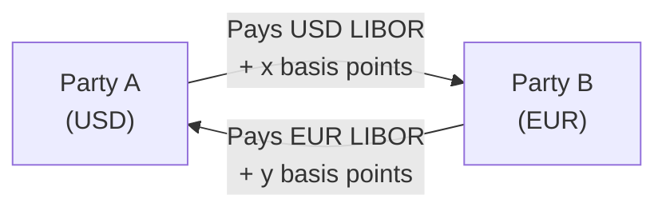
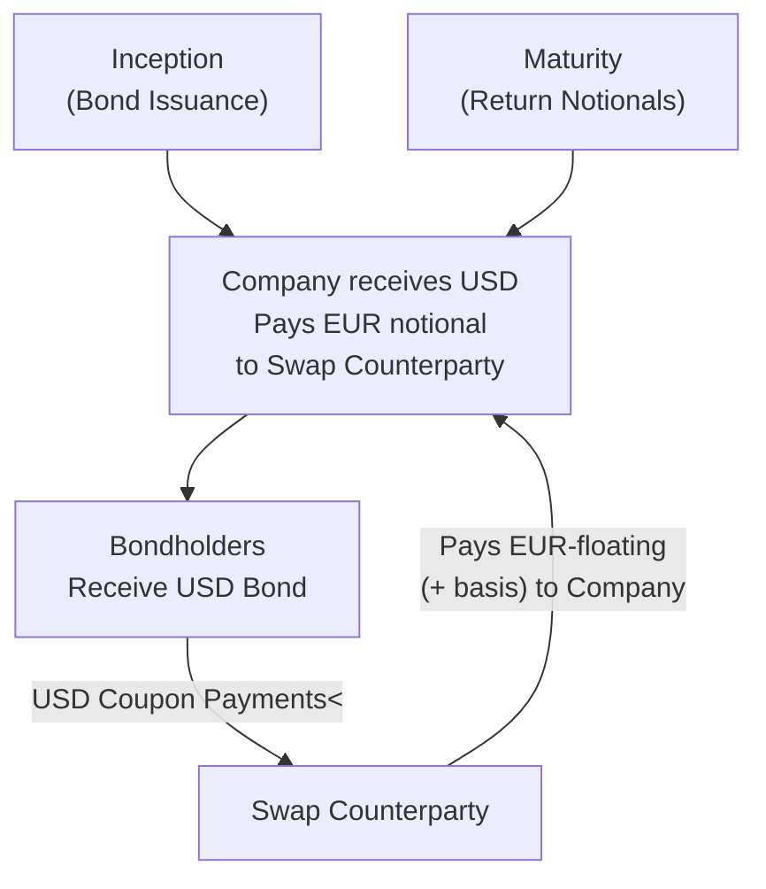

## Key Concepts in Understanding Cross-Currency Basis Swaps
Cross-currency basis swaps can feel a bit mysterious the first time you run into them—at least, that was my experience. I remember, years ago, looking at a swap confirmation and thinking, “Wait, we’re having to track floating rates in two different currencies—and we even exchange notional amounts—why all the fuss?” But once you see how they’re used in real markets, it (mostly) clicks into place.

A cross-currency basis swap is a financial agreement in which two parties exchange principal and interest payments denominated in different currencies, typically on a floating-to-floating basis. Unlike a plain-vanilla currency swap (where you might see one floating rate exchanged for a fixed rate in another currency), a cross-currency basis swap typically involves floating rates in both legs—such as USD LIBOR versus EUR LIBOR—plus an additional spread or “basis” that accounts for market supply-demand imbalances, liquidity needs, and perceived credit differentials between the two currencies.

When you hear “cross-currency basis,” think about the ongoing alignment of interest rates across two distinct money markets. If, for instance, participants urgently need to convert USD to EUR (or vice versa), that demand or scarcity will manifest in the pricing of the basis swap. In practical terms, this basis is an add-on (or discount) that gets tacked on to one side of the swap or the other to balance out the discrepancy in demand conditions.

## Structure and Mechanics
The mechanics of a cross-currency basis swap revolve around four essential components:

• Initial Notional Exchange (and Final Repayment).  
• Floating Rate Payments in Currency 1 (e.g., USD LIBOR plus some spread).  
• Floating Rate Payments in Currency 2 (e.g., EUR LIBOR plus some (possibly different) spread).  
• Maturity where principal amounts are re-exchanged at the start-specified exchange rates.

You can think of it like temporarily “swapping” your capital base from one currency to another with periodic floating interest payments that reflect each local money market. Essentially, each party pays the floating rate in the other’s currency—plus or minus a small spread—to compensate for relative demand or supply. Below is a simple flow diagram:

In practice, these floating references can be any recognized interbank rate. Historically, USD LIBOR and EURIBOR were typical benchmarks. Today, regulatory shifts mean that many markets use SONIA, SOFR, €STR, TONA, etc. But the conceptual structure remains the same.

## Applications in Portfolio Management
Cross-currency basis swaps aren’t just about showing off your derivative wizardry; they solve real problems in portfolio management. Here is why they matter:

• Hedging Foreign Currency Debt: If you issue debt in a currency you don’t ultimately need—for instance, a European pension fund issuing USD-denominated bonds—then you can quickly convert those USD obligations to EUR obligations. The swap ensures you pay EUR-floating interest while your bond pays USD coupons to investors, effectively immunizing your foreign currency exposure.

• Creating Synthetic Exposures: Sometimes you want to hold a foreign bond that seems attractive, but you prefer to finance it in your home currency. A cross-currency basis swap can “bridge” that gap, making your effective exposure a synthetic position in the foreign currency bond market without physically exchanging your entire capital.

• Exploiting Market Dislocations: When the cross-currency basis widens unusually (due to a liquidity crunch or a strong surge in demand for a particular currency), some sophisticated investors find arbitrage-like opportunities. By swapping from the currency that’s overvalued in the basis market into one that’s undervalued, you can enhance yield if you manage the risk carefully.

## Market Drivers
The cross-currency basis is, in essence, a barometer of global supply and demand for different currencies. Picture the global money markets: central bank policies shift, interest rate differentials open up, and liquidity preferences change in real-time.

• Policy Divergences: If central banks of two currency areas adopt significantly different approaches to quantitative easing, interest rate targets, or guidance, participants may rush to borrow in the cheaper currency. This demand funnels straight into the cross-currency basis, pushing it up or down.

• Liquidity Demand: Global capital markets might suddenly crave USD liquidity (often called the “flight to the dollar”) in times of turmoil. Or maybe there’s a wave of European issuers seeking to lock in cheap USD financing. If a certain currency is in hot demand, that currency leg’s interest or spread in the swap adjusts accordingly.

• Market Stress: We have all seen episodes—like the global financial crisis or the onset of the COVID-19 pandemic—when cross-currency basis swaps shifted drastically. During these high-volatility phases, cross-currency basis can invert or widen significantly, reflecting an immediate mismatch in supply and demand for currency flows.

## Risks and Considerations
Before jumping in, it’s worth noting some key pitfalls or risk factors:

• Counterparty Credit Risk: You are depending on another party’s ability to honor cash flows in a different currency. That risk is not something to ignore, especially if your swap extends out several years. With regulation pushing many swaps into central clearing, margin posting requirements can mitigate this, but it’s still a factor in your overall risk management.

• Basis Volatility Over Time: The cross-currency basis is not a static figure. Changes to monetary policy, liquidity conditions, or risk sentiment can cause a big shift in your swap’s economics. If you want to roll or terminate the arrangement, you might face unexpected gains or losses, plus transaction costs.

• Regulatory Constraints: Certain jurisdictions require central clearing or initial/variation margin postings for cross-currency swaps. Additionally, rules for netting or capital charges can vary. If you are a bank or a large institutional investor subject to these requirements, be aware of how compliance can affect the overall cost and viability of your trade.

## Example of Use
Let’s consider a hypothetical scenario (which I once saw in a real deal—minus the company names, of course!). A European manufacturing firm decides to issue USD-denominated bonds because USD interest rates are currently lower. However, the firm’s functional currency is the euro, so it doesn’t want ongoing exposure to fluctuations in EURUSD—and it sure doesn’t want to scrounge every quarter to source USD for coupon payments.

Enter the cross-currency basis swap. On issuance, the firm arranges a swap with a dealer bank:

1. The firm receives USD floating payments in alignment with what it owes to bondholders.  
2. The firm pays EUR floating + an agreed upon spread to the bank.  
3. The USD notional (bond principal) is swapped for a matching amount of EUR at the start based on the FX spot rate, and then re-exchanged back at maturity.  

The net effect is that the firm effectively transforms USD obligations into EUR obligations. It “feels” like the firm borrowed in euros at a floating rate. Meanwhile, the bond investors get what they want: USD-denominated interest and principal from a corporate issuer. The bank sits in the middle, managing the basis swap with offsetting positions in the market.

## Practical Diagram
To illustrate this with principal exchanges, see the simplified diagram below. Note how each side receives the notional in the currency it needs at inception and returns it at maturity:

Obviously, in actual deals, the flows can be more complex, with netting schedules and periodic resets. But conceptually, that’s all that’s happening: two parties exchanging notional amounts and floating interest in different currencies.

## Glossary
Cross‐Currency Basis  
: An interest rate spread that compensates one party for the relative supply and demand imbalances in the currency swap market.

Swap Curve  
: The term-structure of swap rates for a given currency, used to price derivative contracts.

Float‐to‐Float Swap  
: A swap in which both parties pay floating interest rates—each tied to a benchmark in its respective currency.

Inversion (Basis Swap)  
: A phenomenon where the cross-currency basis becomes negative or flips sign, often signaling intense demand for a given currency.

## Best Practices and Pitfalls
Striking the right cross-currency basis swap is no casual matter. At the risk of sounding parental: do your homework. Here are some tips:

• Pricing Transparency: Work with multiple dealers to get quotes, especially for longer tenors or exotic currency pairs. Basis spreads can differ widely across trading desks.  
• Hedge Accounting: If you’re subject to IFRS or US GAAP, ensure the swap structure meets hedge accounting criteria if that’s desired. Otherwise, the swap’s fair value changes might flow straight through your P&L.  
• Ongoing Management: Don’t “set it and forget it.” Monitor how the basis is moving. If the basis reverts to more normal ranges, or if your fundamental exposure changes, consider adjusting your position.

## Conclusion and Exam Tips
In Level III of the CFA program, you’ll likely see cross-currency basis swaps show up in scenario-based questions. Maybe you’ll come across a scenario about a multinational corporation issuing debt in a foreign currency, or asset managers wanting to exploit a dislocation in the cross-currency basis. Remember to focus on:

• Identifying the motivation: Hedge? Enhance yield?  
• Understanding the basis component: Why does it exist, how does it shift, and what’s the risk?  
• Evaluating risk management: Are we controlling for basis volatility, and what about potential changes in regulations, liquidity, or credit conditions?

On the exam, be prepared for item sets that ask you to analyze the net impact of such swaps on a portfolio’s currency risk, interest rate risk, or overall cost of financing. And in essay (constructed-response) questions, you might need to articulate how cross-currency basis swaps align with the broader strategy—like how they compare to simple currency forwards in terms of flexibility, cost, and credit risk management.

## References
• Shamah, S. “A Guide to the FX Markets.”  
• CFA Institute Level III Curriculum (Derivatives and Risk Management).  
• Burnside, C. “Carrying the Carry Trade.” Journal of Finance.  

Always keep in mind that local transaction costs and regulatory frameworks can profoundly impact your swap strategy. When in doubt, reach out to specialists or cross-reference the official CFA curriculum for deeper guidelines.

## Test Your Knowledge: Cross-Currency Basis Swaps



### In a cross-currency basis swap, which of the following key features differentiates it from a plain-vanilla currency swap?

- [ ] At least one leg is fixed in both types of swaps.  
- [x] Both legs typically involve floating rates in different currencies.  
- [ ] The notional amounts are not exchanged at inception and maturity.  
- [ ] It is less useful for hedging currency exposures than a plain-vanilla swap.  

> **Explanation:** A plain-vanilla currency swap often involves one fixed leg and one floating leg (or two fixed legs), while a cross-currency basis swap usually exchanges floating rates in two different currencies.

### Which of the following is NOT generally a driver of the cross-currency basis?

- [ ] Central bank policy differences.  
- [ ] Demand and supply of liquidity in each currency.  
- [ ] Market stress and risk appetite.  
- [x] Personal income tax rates in each country.  

> **Explanation:** Market, policy, and liquidity factors shape the cross-currency basis. Income tax rates for individuals are not typically a determining factor in the cross-currency basis.

### What is an example of a typical application in portfolio management for a cross-currency basis swap?

- [ ] Speculating on rising oil prices.  
- [x] Converting foreign-currency debt payments into the investor’s home currency.  
- [ ] Creating a constant navigation strategy for equity exposures.  
- [ ] Blocking volatility in equity index futures.  

> **Explanation:** Cross-currency basis swaps are often used to transform payments on foreign-currency debt into home currency obligations, isolating the portfolio from currency risk.

### Why might a negative cross-currency basis occur?

- [x] Excess demand for one currency drives up its borrowing cost relative to another.  
- [ ] A shortage of global risk sentiment in the derivative markets.  
- [ ] High equity valuations shift the supply/demand curve for foreign exchange.  
- [ ] Local tax treatment in the foreign country.  

> **Explanation:** Negative (or inverted) cross-currency basis typically arises because there is intense demand (or shortage) for a particular currency, pushing its relative cost of funds higher.

### One key risk with cross-currency basis swaps involves:

- [x] Counterparty credit risk requiring ongoing margin/collateral.  
- [ ] Lack of periodic resets on floating rates.  
- [ ] The inability to enter into a netted payment schedule.  
- [ ] No exchange of notionals at maturity.  

> **Explanation:** Counterparty credit risk can be quite significant, leading to margining and collateral requirements, especially for longer-term swaps.

### A European firm issues USD bonds but wants to pay floating EUR. Which derivative is most suitable?

- [x] Cross-currency basis swap.  
- [ ] Interest rate cap.  
- [ ] Total return swap on the S&P 500.  
- [ ] Equity option collar.  

> **Explanation:** A cross-currency basis swap allows the firm to effectively convert USD liabilities into EUR-floating liabilities.

### The exchange of principal in a cross-currency basis swap typically occurs:

- [ ] Only at inception, not at maturity.  
- [ ] Never; only notional references apply.  
- [x] At inception and reversed at maturity.  
- [ ] Continuously throughout the life of the swap.  

> **Explanation:** Notional amounts are exchanged at the start (based on a spot exchange rate) and re-exchanged at maturity in order to return each party to its original currency holding.

### During times of significant market stress, the cross-currency basis often:

- [x] Widens dramatically for certain currencies.  
- [ ] Remains unchanged due to regulatory intervention.  
- [ ] Narrowly converges to zero.  
- [ ] Always aligns with central bank target rates.  

> **Explanation:** In periods of stress, demand for some currencies can rise sharply, which widens the basis.

### Which statement is TRUE regarding how the basis behaves over time?

- [ ] Once set, the basis remains constant until maturity.  
- [ ] The basis is not sensitive to short-term rate differentials.  
- [ ] Participants typically cannot terminate or roll over the swap.  
- [x] Changes in financial conditions or currency demand can cause the basis to swing significantly.  

> **Explanation:** The cross-currency basis is sensitive to interest rate differentials, monetary policy, liquidity conditions, and demand for each currency, so it can fluctuate considerably.

### Cross-currency basis swaps can be effective in:

- [x] Mitigating currency risk in foreign-denominated debt.  
- [ ] Direct hedging of equity index levels.  
- [ ] Increasing interest rate risk.  
- [ ] Obtaining delta-hedged equity exposure.  

> **Explanation:** By transforming foreign debt outflows into home currency outflows, cross-currency basis swaps mainly help mitigate currency risk.


